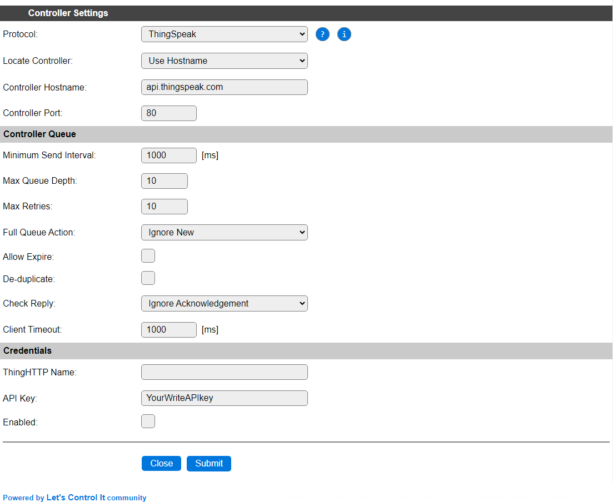

.. include:: _controller_substitutions.repl

.. _C004_page:

|C004_typename|
==================================================

|C004_shortinfo|

Controller details
------------------

Type: |C004_type|

Name: |C004_name|

Status: |C004_status|

GitHub: |C004_github|_

Maintainer: |C004_maintainer|

Description
-----------

The ThingSpeak controller allows to send data to the ThingSpeak web service so it can be presented using the tools available there.

Both free and paid accounts are supported, where a free account has some restrictions like the number of 'Channels' that can be created, and the maximum update-frequency.

Configuration
-------------

* **Protocol**: The selected Controller Protocol.

* **Locate Controller**: This should be set to ``Use Hostname``, this will be forced when data is sent via the controller, but not saved.

* **Controller Hostname**: This should be set to ``api.thingspeak.com``, the only available API entrypoint. No url suffix should be added (at the time of writing this documentation).

* **Controller Port**: The default port number ``80`` should be used.

Controller Queue
^^^^^^^^^^^^^^^^

* **Minimum Send Interval**: The minimum time to wait before the next set of data can be sent to the controller. This can be set quite high, as the update frequency is not very high, and when sending data in too quick succession, the new data will be ignored. Especially on a free account, only a limited number of updates per day can be sent, so setting this to 600000 msec. (10 minutes) is quite realistic.

* **Max Queue Depth**: Determines the number of elements that can be stored in the queue before new samples are dismissed. When the receiving server is available, the data elements will be sent, emptying the queue, and making room for new samples again. To avoid sending too many messages at once, causing them to be discarded by ThingSpeak, the queue depth should best be set to 1. At the same time, to avoid samples to be discarded by the controller, the Interval for devices using this controller should also be set rather high, in the 20 to 30 minutes range.

* **Max Retries**: Setting is not used for this controller.

* **Full Queue Action**: The controller always uses the ``Ignore New`` strategy when the queue is filled.

* **Allow Expire**: Not applicable for this controller.

* **De-duplicate**: When enabled, avoids sending duplicate data, comparing to what's currently in the send-queue.

* **Check Reply**: The controller always uses the ``Ignore Acknowledgement`` setting.

* **Client Timeout**: The timeout to allow before the connection is failing. As ThingSpeak is an external internet service, a somewhat longer than the default timeout should be used. 1000 msec. should work in most cases, but on very high latency connections, this value can be increased.

Credentials
^^^^^^^^^^^

* **ThingHTTP Name**: This setting is currently not used for this controller.

* **API Key**: Enter the Write API Key for the channel the data should be sent to. To use multiple channels, an extra ThingSpeak controller should be configured, so a different API Key can be configured.

* **Enabled**: To enable the controller this box has to be checked.

Practical use-cases
-------------------

As ThingSpeak is a low-frequency external service, only a limited number of updates per day can be sent. For a Free account that's limited to 3 million messages per year, with a minimum interval of 15 seconds, effectively ca. 8000 updates per day. For a paid account it depends on the type of the account used, details and current price information can be found via the `ThingSpeak licensing FAQ <https://thingspeak.com/pages/license_faq>`_

Multiple sensors to a single channel
^^^^^^^^^^^^^^^^^^^^^^^^^^^^^^^^^^^^

To send out data from multiple ESPEasy tasks (max. 4 values) to a single ThingSpeak Channel (max. 8 fields), the data has to be sent at least 15 seconds apart. To avoid losing data that is sent too soon, it's best to control the task 'activation' from rules. A simple round-robin system will do:

.. code-block:: none

  On Clock#Time=All,**:** Do // Once every minute
    If %v1% = 0
      TaskRun,BME_280_1  // First BME, Idx 1 (field 1..3)
    Elseif %v1% = 1
      TaskRun,BME_280_2 // Second BME, Idx 4 (field 4..6)
    Elseif %v1% = 2
      TaskRun,DallasAB // 2 Dallas temperature sensors, Idx 7 (field 7..8)
    Endif
    Let 1,%v1%+1 // Next task
    If %v1% > 2 // All done?
      Let,1,0 // Reset
    Endif
  Endon

All above tasks, ``BME_280_1``, ``BME_280_2`` and ``DallasAB`` should be set to high Interval values, like 600 (every 10 minutes) to avoid them being run unexpectedly.

For adding more than 8 values, a new ThingSpeak Channel should be created, and because each Channel is using a different Write API Key, an extra ThingSpeak Controller should be configured, and extra tasks set up similarly but for the extra controller. ESPEasy allows up to 3 controllers to be configured, that *can* all 3 be ThingSpeak controllers, if needed.

Selected values from multiple sensors
^^^^^^^^^^^^^^^^^^^^^^^^^^^^^^^^^^^^^

When sending data to a controller via the default task configuration options, all values will be sent to the controller.

If you want to send only a selection of the values to ThingSpeak, an intermediate Dummy Device should be used to store the values to be sent out, and configured to send the data to the ThingSpeak controller. Multiple sensor values can be collected in the Dummy Device, before it is triggered to send out the data.

.. code-block:: none

  On BME_280_1#All Do // Single event with all values can best be enabled for the sensor
    TaskValueSet,Dummy,1,%eventvalue1%
    TaskValueSet,Dummy,2,%eventvalue2%
  Endon

  On BME_280_2#All Do
    TaskValueSet,Dummy,3,%eventvalue1%
    TaskValueSet,Dummy,4,%eventvalue2%
  Endon

  On Clock#Time=All,**:** Do // Once every minute
    If %v1% = 0
      TaskRun,Dummy  // Dummy with BME values, Idx 1 (field 1..4)
    Elseif %v1% = 1
      TaskRun,DallasABCD // 4 Dallas temperature sensors, Idx 5 (field 5..8)
    Endif
    Let 1,%v1%+1 // Next task
    If %v1% > 1 // All done?
      Let,1,0 // Reset
    Endif
  Endon

The Interval for the BMEs can be set to 10..30 seconds, and the Interval for the Dummy task to 0, as it will be triggered from the minute timer.

Change log
----------

.. versionchanged:: 2.0
  ...

  |added| 2024-05-29 Update documentation and add implementation examples.

  |added|
  Major overhaul for 2.0 release.

.. versionadded:: 1.0
  ...

  |added|
  Initial release version.

Description
-----------
