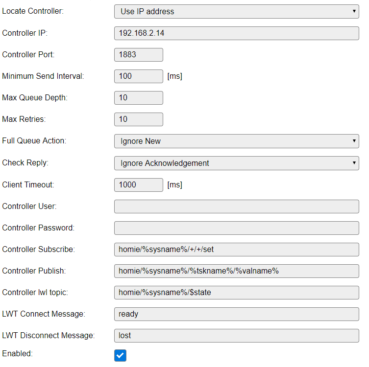

.. include:: _controller_substitutions.repl

.. _C014_page:

|C014_typename|
==================================================

|C014_shortinfo|

Controller details
------------------

Type: |C014_type|

Name: |C014_name|

Status: |C014_status|

GitHub: |C014_github|_

Maintainer: |C014_maintainer|

Change log
----------

.. versionchanged:: 2.0
  ...

  |added| 2019/04/25
  Initial alpha version of this plugin.

Description
-----------

This controller connects to a MQTT Server providing auto-discover information and a communication protocol according to the Homie convention 3.0.1 and the future development version 4.0.0.

For more information on `Homie convention <https://homieiot.github.io/>`_

The initial idea to implement this controller was to have a easy way to include ESPEasy in modern home automation systems without or with as less efford as possible. Imagine your device pops up in i.e. openHAB and you only have to pic the values you are interested in and can imidiatly see measurements or switch GPIOs without a single line of code.

When a MQTT connection is established after boot the controller sends auto-discovery information for system services like commands and basic GPIO functions and for all values send by configured devices. When all messages where sent sucessfully a homie compatible home automation server or other compatible controllers should be able to detect the unit and establish zwo way communication.

MQTT topic scheme
-----------------

A homie topic scheme always starts with the root topic homie followed by the unit (homie uses the term device), device (node in homie) and a value name.

``homie/%unitname%/%devicename%/%valname%``

updates or commands can be sent by appending /set to the topics for values which can receive data.

``homie/%unitname%/%devicename%/%valname%/set``

Prequesites
-----------

A MQTT server capable of storing messages sent with ``retain=true`` when sent with ``QoS=0``. Due to limitation (intentional not implemented due to low memory foodprint and performance considerations) of the MQTT library (pubsubclient) used in ESPEasy it is only possible to send messages with ``QoS=0`` which basicly means `fire and forget`. The current MQTT specification says that the server SHOULD store the message when it arives via ``QoS=0``. Some servers like the MQTT server currently build into openHAB 2.4 (moquette) is configured in this way. Mosquito on the other hand store messages when retain flag is set even when they are sent with ``QOS=0``.
Check with a MQTT client like MQTTspy or MQTTfx if the auto-discover messages are stored.

A home autmation server/controller capable talking Homie like openHAB since 2.4. (Be aware ther are issues in the Homie implementation 2.4 including 2.5M1 milestone release not working as expected after restat of openHAB). Recent snapshot and 2.5 builds should work.

Setup
-------------

- add the Homie **Homie MQTT (Version 4.0.0 dev)** or **Homie MQTT (Version 3.0.1 dev)** controller to your controller lists depending on your build.
- insert your broker address
- and user credentials if nessesary
- the publish scheme is fixed to meet the homie requirements to ``homie/%sysname%/%tskname%/%valname%``
- the subscription scheme can be modified. Current defaults to ``homie/%sysname%/#``. Alterantively ``homie/%sysname%/+/+/set`` could be tested to reduce unnessesary traffic. Homie only expects messages via the ``homie/%sysname%/%tskname%/%valname%/set`` topic.
- last will topic (LWT) should set to ``homie/%sysname%/$state``
- LWT Connect Message to ``ready``
- LWT Disconnect Message to ``lost``
- save and reboot, best with connected serial monitor or syslog server with debug set to 4 (debug) or greater (alterantively use a MQTT client and subscribe to ``homie/%sysname%/#`` - replase %sysname% by the unit-name shown on the top of the webpage).

- ``homie/%sysname%/$nodes`` enumerating all devices will be sent as final message of the auto-discover header.

.. code-block:: html

  5584 : EVENT: MQTT#Connected
  5754 : C014 : autodiscover information of 4 Devices and 6 Nodes sent with no errors! (26 messages)

Troubleshoot
------------

The auto-discover information is sent through a big number of messages (usual more than 20). If your controller software shows errors during the auto-discover process try the following steps:

- For testing purposes start with a basic setup with none or only one device configured and enabled.
- More devices can be added or (re-)enabled later.
- Disable already configured devices (devices without the enabled box ticked will be ignored)
- Check with a MQTT client if all messages are sent. The last message is ``$nodes`` attribute listing minimum the ``SYSTEM`` node if no devices are enabled.
- check your WIFI connection. Perhaps bring your device nearer to your access point. (only necessary during the setup process because the messages should be stored by the broker)
- check via syslog or serial console if the messages are sent successful (you can't see the log output in the web log)
- use the `mqqt-forget <https://www.npmjs.com/package/mqtt-forget>`_ tool to delete unused retained messages from your broker via wildcards

Features
--------

The controller currently supports these features

- send autodiscover nodes for all sending and enabled plugins to ``homie/%unitName%/%deviceName%/%valueName%``
- receive commands through the ``homie/%unitName%/SYSTEM/cmd/set`` topic.
- switch GPIOs through ``homie/%unitName%/SYSTEM/gpio#/set`` topic. The GPIO port must be set to **default low** or **default high** in the hardware tab to be included during autodiscover.
- send updates of GPIO ports to ``homie/%unitName%/SYSTEM/gpio#`` regardles from where the change is triggered (to be fully tested).
- receive values for dummy devices via ``homie/%unitName%/%dummyDeviceName%/%valueName%/set``. From there the values can be processed further by using rules.
- set gpio pins of pcf8574 port expanders. Use the updated pcf8574 (P019) plugin to select witch gpio pins should act as an output  (to be fully tested).
- handle ``$state`` attribute (for complete list see atrribute table above)

  - ``init`` during boot process
  - ``ready`` during normal operation and as a heartbeat every 30sec (to be tested)
  - ``alert`` currently only if auto-discover fails. (ToDo: inform about more error states)
  - ``sleeping`` sent before deep sleep
  - ``lost`` should be configured as LWT
  - ``disconnected`` sent to the old topic if the unit name changes to inform that the old topic is not valid any more. Auto-discover messages are sent automaticly to the modified topic tree.

- acknowledge received message by the ``homie/%unitName%/%deviceName%/%valueName%/set`` topic to the corresponding value ``homie/%unitName%/%deviceName%/%valueName%`` even if the value was changed by a different source like HTTP or rule to keep the state in your home automation system allays up to date. (Needs further testing)

Future / planned features
-------------------------

- Further in the field testing with different MQTT broker and home automation systems.
- Handling units via the ``$unit`` attribute. As ESPEasy is currenty "unitless" this needs a global concept within ESPEasy
- Handling ``$datatype`` attribute. Currenly all values (except cmd and gpio) are defined as ``float``.
- Handling ``$format`` attribute. Again needs a global concept within ESP_Easy.
- Handling direct inputs to plugins like dimmers (%,0:100), colors (RGB & HSV, 255,255,255), enum devices like remote controlls (Play, Pause, Vol+, Vol-, ...). Currently these can be controlled by sending the corresponding command to ``../SYSTEM/cmd/set``. Only plugis with a single representation within most controllers (i.e. switches, dimmer, lists ...) by a **single** value make sense to be handled directly. If code is nessesary inside the controller / home automation server than this should handled by the DummyValueSet / rule procedure.
- Prepare some "working examples".

Under the hood
--------------

Auto-dicover information is sent by several $attributes

currently the following attributes will be sent during boot

.. include:: C014_attributes.repl

.. include:: C014_node_attributes.repl

.. include:: C014_property_attributes.repl
