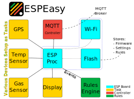

ESP Easy Function Blocks
************************

The workflow and flow of data in ESPEasy can be seen as a number of functional blocks:

* **Plugin** - A piece of code designed to interact with hardware, like sensors. See: :ref:`Plugin List`
* **Task** - An instance of a plugin. It may yield some data collected from the connected hardware and send it to a connected controller or trigger an event to be processed in rules.
* **Controller** - Receives data from a task to send to some service. (e.g. MQTT broker, flash storage, etc.)
* **Rules** - Scripting language to act on events in ESPEasy.
* **Notifications** - Extra options to notify a user, like a buzzer or sending an email.
* **Scheduler** - The internal heart beat of ESPEasy.

   ESPEasy Block Diagram

Plugin
======

A plugin is a piece of code, typically designed to interact with some hardware.
There are some exceptions like the "Dummy" plugin, which is only meant to allow a user to store data to be processed.

A plugin may also implement a few commands specific for that plugin.

For example a command to set some configuration on the connected hardware or interact with some display.

Not all plugins are included in each build, due to limits of flash size on lots of ESP devices.

See: :ref:`Plugin List`

Task
====

A Task is an instance of a Plugin.

Each task has upto 4 task values.

A task can interact with and receive data from a piece of hardware via the Plugin code.
Even though there may be multiple task instances of the same plugin, each task has its own settings, task name and task value names.
Typical use case for having multiple tasks using the same plugin code is when one needs multiple of the same sensor. (e.g. DS18B20 temperature sensor, or several switches.)

Typically a task tries to read such data at a fixed interval via the internal call ``PLUGIN_READ``.
However a user may override such an interval via commands like ``TaskRun``.

When such data is received, this can be handed over to upto 3 linked Controllers.

A task value can always be referrenced via ``[<taskname>#<taskvaluename>]``. For example to show a value on a display.

If the Rules are enabled, a task will also send out one or more events to be processed in the rules.
These events can have one or more "event values".

A user may address a specific task when calling a command implemented in the plugin code assigned to a task.

To summarize:

* A task is an instance of a plugin.
* Each task has its own settings, even when there are multiple tasks assigned to the same plugin code.
* A task has an unique name. (User assigned)
* A task can have upto 4 task values, each with their own name.
* A task can be linked to upto 3 controller to further process the task values.
* A task can send events to process the task values via rules.
* One can always refer to the latest task value via the ``[<taskname>#<taskvaluename>]`` notation.

See: :ref:`Task Config Page`

Controller
==========

A controller is responsible for forwarding data from a task to some service.

There are several controllers, each tailored to interact with a different kind of service.
Some controllers use a similar service, like a MQTT broker, but differ in formatting the data for a specific service or platform. (e.g. Domoticz vs. OpenHAB or Home Assistant)

See: :ref:`Controller Plugins`

Rules
=====

The Rules scripting language makes ESPEasy truly flexible and powerful.

Via rules, one may act on events and perform actions, process data, schedule timers, etc.

All events in ESPEasy will be offered to the rules engine to see if there is some block matching this event.

If a match is found, the code inside this rules block is executed.

One may perform calculations on data, store data in variables and call commands.

See: :ref:`Rules` for an extensive set of documentation and examples to get an idea of the true power of using rules in ESPEasy.

Notifications
=============

A user may configure some notifications to either send out an email with a pre-defined layout and recipients, or trigger a buzzer.

ESPEasy Scheduler
=================

ESPEasy uses a scheduler, which is essentially its heart beat.

It is basically a list of tuples with:

* Timestamp (in msec)
* 32-bit value describing what should be done.

This list is sorted by timestamp, with the next scheduled action at the front.

Scheduled Action Parameters
---------------------------

The 32-bit value uses a few bits to signify its timer type.
Per timer type the left over bits can be used to store some arguments.
 
Some timer types need to store more which cannot be stored in this 32-bit value.
For example system timers (e.g. ``Rules#Timer`` started from rules) need more parameters.
These will be stored in a separate map, where this 32-bit value is used as key to access these arguments.
As it is stored in a map, this 32-bit value for this timer type needs to be unique.
To make those key values unique, some of the arguments are also stored in this 32-bit value.
For example "Par1" may be used to make this more unique. 
For GPIO longpulse the rising and falling edge can already be scheduled by including the pin state in this 32-bit value.

Background Actions & System/Rules Events
----------------------------------------

Whenever timestamp of the first item in this actions list is not yet due, 
the scheduler may perform background tasks or call delay() to reduce power consumption.

N.B. These background tasks will also be executed at some minimal guaranteed interval, to make sure a fully loaded ESP will not stall as background work piles up.

Some actions do not have a specific scheduled timer, as they just have to be performed as soon as possible.
For example processing rules events are put in a separate event queue.
The Scheduler tries to find a good balance between processing such queued items 
and making sure scheduled actions will be done as close as possible to their scheduled moment.

Fixed Interval 'jitter'
-----------------------

A lot of ESPEasy's operations consists of repetitive actions.
These often have a specific interval, like calls to ``PLUGIN_TEN_PER_SECOND``.
Also each task has its own configured interval.
 
Whenever an interval based scheduled action is running behind its schedule, 
the scheduler will try to keep up with its original pace.

For example:
A call to ``PLUGIN_TEN_PER_SECOND`` is scheduled to run at time X.
Whenever it is being processed, the first thing to do is to reschedule it at time X + 100 msec.
If the ESP is running behind schedule, this new timestamp could already be in the past.
The scheduler will then try to get in sync again, unless the scheduler missed more then 1 full interval.
If this happens, the scheduler will just 'restart' the interval considering the current timestamp as start of the interval.

This will eventually spread scheduled intervals to their optimum interval cadance.
As a result, it may appear some scheduled actions may drift apart where they may have been running nearly in sync before.

When actions should be executed in sync, one should trigger such actions from the rules.
For example by grouping "taskRun" calls triggered via the same rules event.
