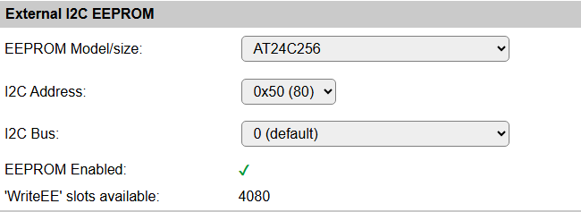

.. _Hardware_page:

Hardware page
*************

ESPEasy has some centralized hardware configuration settings, shown in this page, and divided in sections.

---------------
Wifi Status LED
---------------

To display the Wifi acitivity, a pin can be configured to light up a LED when data is transferred via Wifi. Optionally, the LED signal can be 'inverted'.

As many ESP boards have an onboard LED connected to GPIO-2 and inverted, it is shown as a note how to configure that.

.. image:: Hardware_Wifistatusled.png

---------
Reset pin
---------

To provide a possible escape from a malfunctioning ESP module, a factory-reset button/feature can be configured by setting up a GPIO-pin for this.

.. warning::
    **When connecting this pin to ground for ca. 10 seconds the unit will be completely reset, and all settings/configuration irretrievably deleted!**

This feature can be useful in a development/laboratory environment, for when the configuration gets corrupted in some way.

.. image:: Hardware_Resetpin.png

--------------------
PCF & MCP Direct I/O
--------------------

Added: 2025-02-02

For interacting with the PCF8574 or MCP23017 GPIO Extenders no Device Task is required, so no I2C Bus configuration is available.

When multiple I2C Buses are configured (ESP32 only), we need some configuration to overcome that situation, to avoid having to connect these I/O extenders on the first I2C Bus.

.. image:: Hardware_PCFMCP_I2CSelector.png

When using multiple PCF and/or MCP GPIO extenders, they must all be connected to this I2C Bus, and any Device Tasks should also use the same I2C Bus.

NB: If only 1 I2C Bus is configured, this section isn't shown.

--------------------
External I2C EEPROM
--------------------

Added: 2026-08-19

For persistently storing (numeric) values, an I2C EEPROM (AT24Cxx) or FRAM (MB85RCxx) module can be connected to the ESP, ranging in size from 4kB up to 256kB. This storage is made available as 'slots', where a single numeric value, of type ``double``, can be stored, and of course retrieved. Of each unit there is 128 bytes reserved for future (internal/housekeeping) use, and the remaining space is available for user-values.

The used module, I2C address (also used as 'enable' setting) and the I2C bus where the module is connected (when multiple I2C buses are available & configured), can be configured.

Once setup, a reboot is required to validate the connection to the module, and also a write-protected check is done, as some units come with a write-protect pin, to inhibit writing to the device.

When the module is enabled, the number of available slots is shown, and a warning if the module is write-protected.

Saving a value in a slot is done with command ``WriteEE,<slot>,<value>``, and retrieving the value using the special variable ``[ReadEE#<slot>]``. The max. number of slots can be obtained via ``[ReadEE#max]`` and the write-protect status via ``[ReadEE#wp]`` (1 = write-protected).

NB: ``<slot>`` is in the range 0 .. (Max.slots - 1) !

All values can be erased from the module by using the command ``WriteEE,erase,erase``, and re-checking the write-protected status via ``WriteEE,check,wp``.

See also :ref:`Command-Reference`

-------
SD Card
-------

When the compile-time option for SD-card support is enabled, the ``CS`` pin for the SD-card interface can be configured here. For the SD-card interface to work, **Init SPI** should also be enabled.

.. image:: Hardware_SDCard.png

-------------------
GPIO boot states
-------------------

For some GPIO pins, the boot state (initial configuration after startup) can be configured.

Some differences exist between ESP8266 and ESP32:

* ESP8266 can't initialize GPIO's 6, 7, 8, 9 and 11 (used for flash-chip by ESP8266 chip).
* ESP8285 can't initialize GPIO's 6, 7, 8 and 11 (used by flash of ESP8285 chip).
* ESP32 / ESP32-S2 can't initialize all GPIO's, only GPIO pins that are actually available for use are shown.

*ESP8266 GPIO boot states:*

.. image:: Hardware_GPIObootstatesESP8266.png

*ESP32 GPIO boot states:*

.. image:: Hardware_GPIObootstatesESP32.png

(Besides the serial pins, also I2C and SPI are configured)

If the board supports PSRAM, it has these differences:

.. image:: Hardware_GPIObootstatesESP32-PSRAM.png

Overview of the GPIO pin mapping of ESP32 (link to Espressif documentation): `ESP32 DevKitC <https://docs.espressif.com/projects/esp-idf/en/latest/esp32/_images/esp32-devkitC-v4-pinout.png>`_

*ESP32-S2 GPIO boot states:*

.. image:: Hardware_GPIObootstatesESP32-S2.png

(Only the serial port logging is enabled on this unit, no SPI or I2C)

If the board supports PSRAM, it hides GPIO-26

.. image:: Hardware_GPIObootstatesESP32-S2-PSRAM.png

(GPIO-26 is missing from the range, as it can not be used if PSRAM is present)

Overview of the GPIO pin mapping of ESP32-S2 (link to Espressif documentation): `ESP32-S2 Saola1 <https://docs.espressif.com/projects/esp-idf/en/latest/esp32s2/_images/esp32-s2_saola1-pinout.jpg>`_
