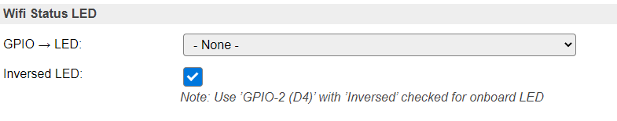
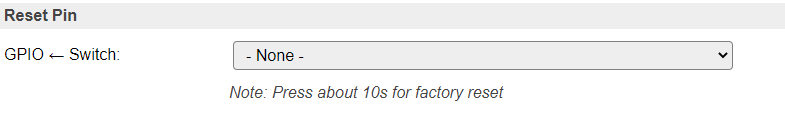
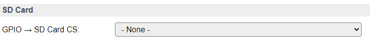
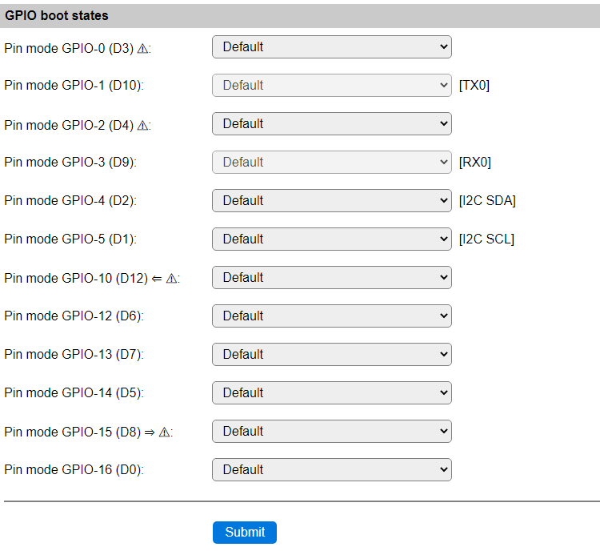
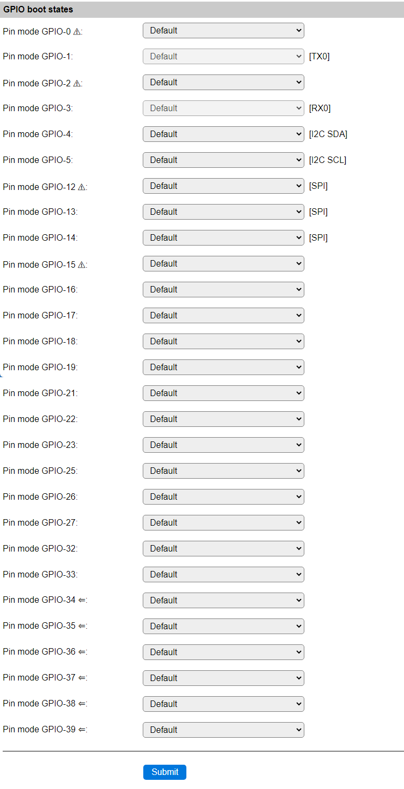
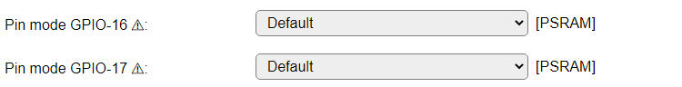
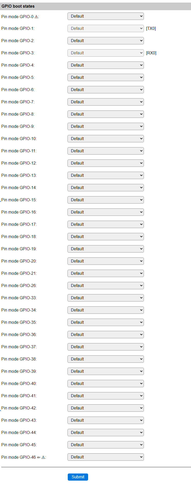

.. _Hardware_page:

Hardware page
*************

ESPEasy has some centralized hardware configuration settings, shown in this page, and divided in sections.

---------------
Wifi Status LED
---------------

To display the Wifi acitivity, a pin can be configured to light up a LED when data is transfered via Wifi. Optionally, the LED signal can be 'inverted'.

As many ESP boards have an onboard LED connected to GPIO-2 and inverted, it is shown as a note how to configure that.

---------
Reset pin
---------

To provide a possible escape from a malfunctioning ESP module, a factory-reset button/feature can be configured by setting up a GPIO-pin for this.

.. warning::
    **When connecting this pin to ground for ca. 10 seconds the unit will be completely reset, and all settings/configuration irretrievably deleted!**

This feature can be useful in a development/laboratory environment, for when the configuration gets corrupted in some way.

--------------------
PCF & MCP Direct I/O
--------------------

Added: 2025-02-02

For interacting with the PCF8574 or MCP23017 GPIO Extenders no Device Task is required, so no I2C Bus configuration is available.

When multiple I2C Buses are configured (ESP32 only), we need some configuration to overcome that situation, to avoid having to connect these I/O extenders on the first I2C Bus.

When using multiple PCF and/or MCP GPIO extenders, they must all be connected to this I2C Bus, and any Device Tasks should also use the same I2C Bus.

NB: If only 1 I2C Bus is configured, this section isn't shown.

-------
SD Card
-------

When the compile-time option for SD-card support is enabled, the ``CS`` pin for the SD-card interface can be configured here. For the SD-card interface to work, **Init SPI** should also be enabled.

-------------------
GPIO boot states
-------------------

For some GPIO pins, the boot state (initial configuration after startup) can be configured.

Some differences exist between ESP8266 and ESP32:

* ESP8266 can't initialize GPIO's 6, 7, 8, 9 and 11 (used for flash-chip by ESP8266 chip).
* ESP8285 can't initialize GPIO's 6, 7, 8 and 11 (used by flash of ESP8285 chip).
* ESP32 / ESP32-S2 can't initialize all GPIO's, only GPIO pins that are actually available for use are shown.

*ESP8266 GPIO boot states:*

*ESP32 GPIO boot states:*

(Besides the serial pins, also I2C and SPI are configured)

If the board supports PSRAM, it has these differences:

Overview of the GPIO pin mapping of ESP32 (link to Espressif documentation): `ESP32 DevKitC <https://docs.espressif.com/projects/esp-idf/en/latest/esp32/_images/esp32-devkitC-v4-pinout.png>`_

*ESP32-S2 GPIO boot states:*

(Only the serial port logging is enabled on this unit, no SPI or I2C)

If the board supports PSRAM, it hides GPIO-26

(GPIO-26 is missing from the range, as it can not be used if PSRAM is present)

Overview of the GPIO pin mapping of ESP32-S2 (link to Espressif documentation): `ESP32-S2 Saola1 <https://docs.espressif.com/projects/esp-idf/en/latest/esp32s2/_images/esp32-s2_saola1-pinout.jpg>`_

--------------------
GPIO wake from sleep
--------------------

.. note::
          This feature is only available on ESP32 devices.

Supported GPIO pins can be selected to wake the unit from deep sleep.
For ESP32 devices with EXT1 wake-up support, the internal RTC-Resistors can be disabled globally and it applies to **all** selected pins.
The signal level (HIGH or LOW) is configured globally and applies to **all** selected pins.
GPIO wake-up on newer devices supports per-pin trigger level configuration, but this comes at the cost of higher power consumption.
**TODO:**   Integrate per-pin trigger level selection for GPIO wake-up.

When the unit wakes up from deep sleep, an event is generated with the GPIO number that caused the wakeup.
``"EVENT: System#GPIOWake=X"``, where ``X`` is the GPIO number.

Make sure to add a pull-up or pull-down resistor to the selected GPIO pin(s) when needed, to avoid false wakeups.
(some GPIO pins have internal pull-up or pull-down resistors, but not all of them, and the internal pull-up/down may not be sufficient for stable operation in all cases)
For **GPIO Wake-up** all internal pull-up/down resistors should work. No need to add them anywhere as this is done automatically.

.. note::

   Depending on the ESP32 variant, two different wake-up mechanisms are used.

   **EXT1 Wake-up (RTC)**

   If ``SOC_PM_SUPPORT_EXT1_WAKEUP`` is available, EXT1 wake-up is used (e.g. ESP32 classic, ESP32-S2, ESP32-S3, ESP32-C6, ESP32-H2):

   - Only works on RTC-capable pins
   - Very low power (RTC domain)

   **GPIO Wake-up**

   On platforms without EXT1 support (e.g. ESP32-C3), GPIO wake-up is used:

   - Works on more pins (not RTC-limited)
   - Slightly higher power usage (HP domain)

   **Summary**

   - EXT1: preferred, low power
   - GPIO wake-up: fallback for newer chips, more flexible but less efficient

   The firmware automatically selects the correct method at compile time.

.. warning::
        When using this feature, be aware that if you are also using a GPIO in rules (e.g., Monitor,GPIO,8) or in a Plugin Task (P001), you might get an event at wakeup if the button is pressed slightly too long, which can cause unexpected behavior.
        If this is unwanted, take precautions such as monitoring the GPIO a bit later after boot (e.g., with a timer), or disabling the corresponding task and enabling it later after boot (e.g., with a timer) to avoid this.