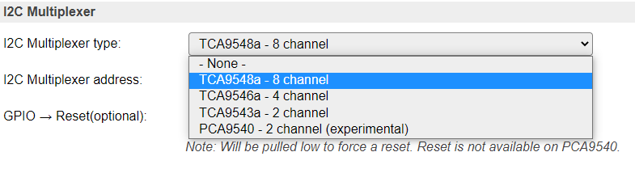
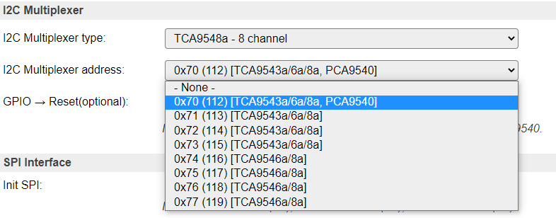
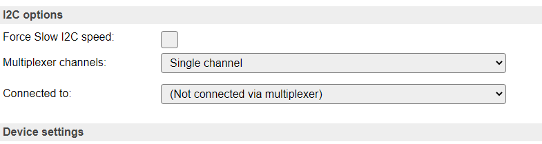
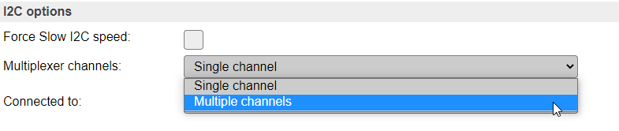
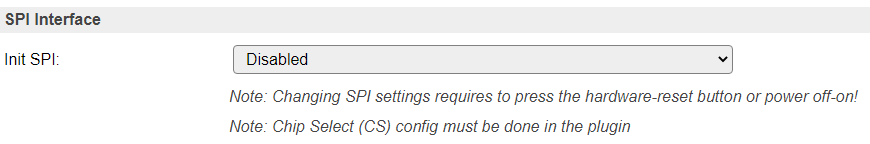

.. _Hardware_page:

Hardware page
*************

Overview
========

ESPEasy has some centralized hardware configuration settings, shown in this page, and divided in sections.

---------------
Wifi Status LED
---------------

To display the Wifi acitivity, a pin can be configured to light up a LED when data is transfered via Wifi. Optionally, the LED signal can be 'inverted'.

As many ESP boards have an onboard LED connected to GPIO-2 and inverted, it is shown as a note how to configure that.

---------
Reset pin
---------

To provide a possible escape from a malfunctioning ESP module, a factory-reset button/feature can be configured by setting up a GPIO-pin for this.

.. warning::
    **When connecting this pin to ground for ca. 10 seconds the unit will be completely reset, and all settings/configuration irretrievably deleted!**

This feature can be useful in a development/laboratory environment, for when the configuration gets corrupted in some way.

-------------
I2C Interface
-------------

When using devices that use the I2C bus (Inter-integrated circuit, also known as IIC, and mostly compatible with SM Bus) (`Wikipedia: I2C <https://en.wikipedia.org/wiki/I%C2%B2C>`_) some pins have to be configured, and initialized during boot, for the SDA and SCL connections. This can be any unused pair of pins on the ESP board.

The pins can be configured here, and will have default values initially (ESP8266: SDA: GPIO-4 (D2), SCL: GPIO-5 (D3), ESP32: SDA: GPIO-22, SCL: GPIO-23). When I2C is not used, these can be set to `- None -`, so the pins are available for other purposes.

The default bus clock speed can also be set here. If only devices supporting 100 kHz are connected (Old/Slow devices), then the value can be set to 100 kHz, by default 400 kHz is configured, that is supported by newer devices, though there are many devices supporting higher frequencies. ESP8266 is able to achieve ca. 400 kHz, while ESP32 allows much higher speeds.

Since build 20110, ESPEasy has a separate setting for Slow I2C devices, and per I2C device this slow clock speed can be selected in the Device edit page. This value is by default set to 100 kHz, but can be set lower or higher if desired.

*Device specific Force Slow I2C speed selection:*

---------------
I2C Multiplexer
---------------

Since build 20110, there is the option of using an I2C multiplexer. This option is not available in all builds, because of the size of the code. It is usually available in the normal, testing and custom builds, but ommitted from minimal, IR and hardware-specific builds.

Possible use-cases for an I2C multiplexer are:

* Connect multiple devices that have fixed or limited I2C addresses (For example, some OLED devices have a single fixed address but you need to connect 2 or more, or connect more than 3 TLS2561 devices, that support only 3 different addresses).
* Connect different devices that have the same I2C address (For example connecting a TSL2561 light/lux sensor and an APDS9960 proximity sensor).
* Connect slow and fast devices, where the speed of the fast device prohibits proper working of the slow device.

.. |br| raw:: html

     

.. note::
    If devices with conflicting I2C addresses are to be used, then *none* of them can be connected to the ESP main I2C bus, but they should each be connected to a separate channel of the multiplexer. |br|
    Devices that do not conflict with other devices *can* be connected to the ESP main I2C bus, this might improve the performance/responsiveness of these devices.

.. note::
    When using an I2C Multiplexer, make sure there is no address conflict with any of the devices you intend to connect, f.e. when connecting BME280 sensors, don't set the address of the multiplexer to 0x76 or 0x77.

There are a couple of I2C multiplexer chips available, currently there is support for:

* TCA9548a (8 channels, multiple channel-connections, 8 I2C addresses, with reset)
* TCA9546a (4 channels, multiple channel-connections, 8 I2C addresses, with reset, also TCA9545a can be used, but no support for the Interrupt function though)
* TCA9543a (2 channels, multiple channel-connections, 4 I2C addresses, with reset)
* PCA9540 (2 channels, fixed I2C address, no reset, experimental support)

The TCA9548a, TCA9546a and TCA9543a support connecting multiple channels to the main I2C channel. This can be configured on the Device edit page for I2C devices, once the I2C Multiplexer configuration is enabled by selecting a multiplexer type and an I2C address for the multiplexer.

Also, the TCA9548a, TCA9546a and TCA9543a chips have a connection for a reset signal available. This allows the chip to be reset if it gets stuck by some 'less compatible' or 'badly behaving' devices. Once connected and configured, the multiplexer can be reset from the software, if desired or required. This feature is not yet used in any I2C device plugin.

A TCA9543a board has the advantage of being quite a bit smaller than either TCA9546a or TCA9548a, while being digitally compatible. (But with less channels and only 4 I2C addresses).

All these chips/boards can be found at Adafruit, Aliexpress, Banggood, EBay, etc.

*Available multiplexer types:*

*Select the I2C Address for the multiplexer:*

Device configuration
^^^^^^^^^^^^^^^^^^^^

If an I2C multiplexer is configured, every Device edit page for I2C devices will show extra options to select the channel the device is connected on.

There is the default option of Single channel, or, when a TCA9548a, TCA9546a or TCA9543a is configured, Multiple channels.

*Example: A multiplexer is configured, but the device is connected directly on the ESP board I2C channel:*

*Configure a (single) multiplexer channel the device is connected on:*

NB: Only acceptable channels (0-7/0-3/0-1) will be available in the dropdown list, depending on the Multiplexer type configured.

*Select Single channel or Multiple channels:*

*Configure multiple channels for a device, 8 channel multiplexer configured*

Above configuration results in channels 0, 4, 5, 6 and 7 being connected to the ESP board I2C bus when this sensor is active via I2C.

NB: Only acceptable channel checkboxes (0-7/0-3/0-1) will be shown, depending on the Multiplexer type configured.

-------------
SPI Interface
-------------

When using devices that are connected via the SPI interface (`Wikipedia: SPI <https://en.wikipedia.org/wiki/Serial_Peripheral_Interface>`_), the interface must be initialized during boot. This can be enabled here. For ESP32 there is the option to select either the Hardware SPI (HSPI) interface or the Virtual SPI (VSPI) interface (software controlled).

The common SPI pins are shown here.

Other SPI pins to be used are device specific, and need to be configured from the corresponding Device edit page.

*For ESP8266:*

*For ESP32, disabled:*

*For ESP32, select the desired interface:*

NB: When using the VSPI interface and also the I2C interface is used, another pin has to be selected for I2C GPIO -> SCL, as its configuration is fixed for the VSPI setting.

--------
Ethernet
--------

On builds including ``_eth`` in their build name, it is also possible to use ethernet instead of WiFi.
Currently this is only present for ESP32 builds and no plans currently exist to support it for ESP82xx.

N.B. This is still in testing phase, so not all kinds of network communications work right now.

Preferred network medium
^^^^^^^^^^^^^^^^^^^^^^^^

Allows to switch between:

* WiFi (default)
* Ethernet

To activate a new configuration, a reboot is needed.

Ethernet PHY type
^^^^^^^^^^^^^^^^^

Select the used PHY controller type:

* LAN8710  (LAN8720 is also supported, but none of the newer features are supported)
* TLK110  

Ethernet PHY Address
^^^^^^^^^^^^^^^^^^^^

The PHY address depends on the hardware and the PHY configuration. 

* Espressif's Ethernet board with TLK110 PHY use PHY address 31.
* Common Waveshare LAN8720 PHY breakout use PHY address 1.
* Olimex ESP32 EVB REV B IoT LAN8710 PHY Board with CAN use PHY address 0.
* Other LAN8720 breakouts often use PHY address 0.

If the PHY address is incorrect then the EMAC will initialise but all attempts to read/write configuration registers on the PHY will fail.

GPIO pins
^^^^^^^^^

RMII PHY SMI Wiring
"""""""""""""""""""

Most PHY boards have documented their *RMII PHY SMI Wiring* pins:

* **MDC**  Output to PHY, usually pin 23
* **MDIO** Bidirectional, usually pin 18

Clock sync
""""""""""

The PHY and the ESP need to keep a clock in sync.
This can either be done via an external crystal, which is connected to a GPIO pin.
Another option is to let the ESP provide the clock to the PHY.

* External crystal oscillator
* 50MHz APLL Output on GPIO0
* 50MHz APLL Output on GPIO16
* 50MHz APLL Inverted Output on GPIO17

Power pin
"""""""""

On almost all PHY boards, or ESP boards equiped with an ethernet PHY, it is possible to turn the PHY on or off.
Either to save energy, or to make sure the external clock is not affecting the ESP boot mode when it restarts.

For example the Olimex ESP32-EVB does have the *external crystal oscillator* connected to GPIO-0, which could boot the ESP32 randomly into UART flash mode.
Most boards use a specific GPIO pin to control the power to the PHY.
The Olimex ESP32-EVB does have a specific delay circuit to only allow power to the PHY after boot and therefore does not need to control the PHY power.

For other boards, the default is often GPIO-17, but this may change per board.

RMII PHY Wiring
"""""""""""""""

Apart from these GPIO pins, there is a number of other pins reserved on the ESP32 for RMII PHY Wiring.

Since these GPIO pin assignments cannot be changed, it is also not needed to configure them.
However, they also cannot be used when *RMII PHY* is used.

.. include:: ../Reference/Ethernet_PHY_ESP32.rst

-------------------
GPIO boot states
-------------------

For some GPIO pins, the boot state (initial configuration after startup) can be configured.

Some differences exist between ESP8266 and ESP32:

* ESP8266 can't initialize GPIO's 6, 7 and 8 (technical limitation of ESP8266 chip) and 16 (always has pull-down setting)
* ESP32 can't initialize GPIO's from 16 and up (settings storage limitation, could be initialized from Rules in `System#Boot` event)

*ESP8266 GPIO boot states:*

*ESP32 GPIO boot states:*

