.. _Interfaces_page:

Interfaces page
***************

To configure the available (included in the build) device interfaces there are tabs for each type of interface bus. These tabs allow to set up the GPIO pins, clock speeds and other needed parameters for each interface.

* :ref:`i2c-bus`
* :ref:`spi-bus`
* :ref:`modbus`

.. _i2c-bus:

-------
I2C Bus
-------

When using devices that use the I2C bus (Inter-integrated circuit, also known as IIC, and mostly compatible with SM Bus) (`Wikipedia: I2C <https://en.wikipedia.org/wiki/I%C2%B2C>`_) some pins have to be configured, and initialized during boot, for the SDA and SCL connections. This can be any unused pair of pins on the ESP board.

The pins can be configured here, and will have default values initially (ESP8266: SDA: GPIO-4 (D2), SCL: GPIO-5 (D3), ESP32: No defaults). When I2C is not used, these can be set to `- None -`, so the pins are available for other purposes.

When having an I2C Priority task configured, the I2C GPIO pins (for that bus, when multiple buses are available) can no longer be changed, as that could disable the hardware, thus blocking the device. The configured GPIO pins will be display-only.

The default bus clock speed can also be set here. If only devices supporting 100 kHz are connected (Old/Slow devices), then the value can be set to 100 kHz, by default 400 kHz is configured, that is supported by newer devices, though there are many devices supporting higher frequencies. ESP8266 is able to achieve ca. 400 kHz, while ESP32 allows higher speeds.

ESPEasy has a separate setting for Slow I2C devices, and per I2C device this slow clock speed can be selected in the Device configuration page. This value is by default set to 100 kHz, but can be set lower or higher if desired.

*I2C ClockStretchLimit*

- `I2C-bus.org - Clock Stretching <https://www.i2c-bus.org/clock-stretching/>`_
- `ESPeasy wiki - Basics: The I2C Bus <https://www.letscontrolit.com/wiki/index.php/Basics:_The_I%C2%B2C_Bus>`_

This setting is only available for the first I2C Bus, as not many devices (should) need this set, and the devices that do need this should then be connected to I2C Bus 0.

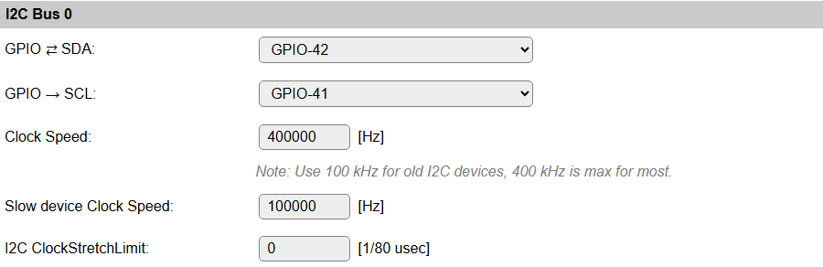

*Device specific Force Slow I2C speed selection:*

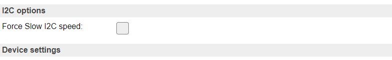

Added: 2023-11-23

A device flag has been added for specific devices to have **Force Slow I2C speed** set by default. After adding the device this option will be checked, but can still be unchecked to use (try) Fast I2C speed (400 kHz).

Added: 2025-02-02

Multiple I2C Buses can be configured on ESP32 builds. This aids in connecting all on-board sensors and devices when multiple GPIO pin-pairs are used for I2C devices. By default, 2 I2C Buses are made available, but via compile-time options, a 3rd I2C Bus can be enabled, if required.

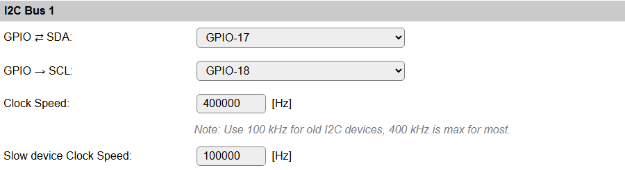

The available options are the same as for the first I2C Bus.

If a second (or third) I2C Bus are not needed, then leave the GPIO settings on ``- None -``, and the interface won't be initialized, and not shown in the configuration options.

NB: The I2C Buses should of course not be configured for the same GPIO pins as any other I2C Bus.

NB2: Some boards require that in the Serial Console Settings (Tools/Advanced), the ``Fall-back to Serial 0`` option is disabled, to free the GPIO pins for I2C use.

When multiple I2C Buses are configured (so, ``SDA`` and ``SCL`` GPIO-pins configured), each task configured with an I2C device will show a selection for the I2C Bus to use. As expected, the first I2C Bus is selected by default, and another interface can be selected as required.

*Device specific I2C Bus selection:*

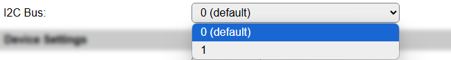

NB: If a multiplexer is configured for 1 of the I2C Buses (but *not* for all interfaces), the I2C Bus selector will save & reload the page to show/hide the multiplexer options, below.

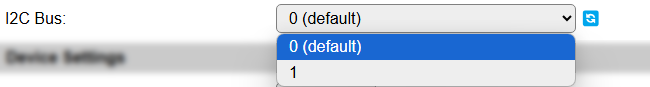

This screenshot shows the reload icon, to indicate that changing the selection will reload the page.

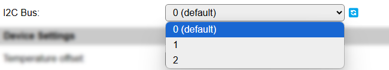

And an example for when 3 I2C Buses are available (compile-time option!) and configured.

---------------
I2C Multiplexer
---------------

Since build 20110, there is the option of using an I2C multiplexer. This option is not available in all builds, because of the size of the code. It is usually available in the normal, testing and custom builds, but ommitted from minimal, IR and hardware-specific builds.

Possible use-cases for an I2C multiplexer are:

* Connect multiple devices that have fixed or limited I2C addresses (For example, some OLED devices have a single fixed address but you need to connect 2 or more, or connect more than 3 TLS2561 devices, that support only 3 different addresses).
* Connect different devices that have the same I2C address (For example connecting a TSL2561 light/lux sensor and an APDS9960 proximity sensor).
* Connect slow and fast devices, where the speed of the fast device prohibits proper working of the slow device.

.. |br| raw:: html

     

.. note::
    If devices with conflicting I2C addresses are to be used, then *none* of them can be connected to the ESP main I2C bus, but they should each be connected to a separate channel of the multiplexer. |br|
    Devices that do not conflict with other devices *can* be connected to the ESP main I2C bus, this might improve the performance/responsiveness of these devices.

.. note::
    When using an I2C Multiplexer, make sure there is no address conflict with any of the devices you intend to connect, f.e. when connecting BME280 sensors, don't set the address of the multiplexer to 0x76 or 0x77.

There are a couple of I2C multiplexer chips available, currently there is support for:

* TCA9548a (8 channels, multiple channel-connections, 8 I2C addresses, with reset)
* TCA9546a (4 channels, multiple channel-connections, 8 I2C addresses, with reset, also TCA9545a can be used, but no support for the Interrupt function though)
* TCA9543a (2 channels, multiple channel-connections, 4 I2C addresses, with reset)
* PCA9540 (2 channels, fixed I2C address, no reset, experimental support)

The TCA9548a, TCA9546a and TCA9543a support connecting multiple channels to the main I2C channel. This can be configured on the Device edit page for I2C devices, once the I2C Multiplexer configuration is enabled by selecting a multiplexer type and an I2C address for the multiplexer.

Also, the TCA9548a, TCA9546a and TCA9543a chips have a connection for a reset signal available. This allows the chip to be reset if it gets stuck by some 'less compatible' or 'badly behaving' devices. Once connected and configured, the multiplexer can be reset from the software, if desired or required. This feature is not yet used in any I2C device plugin.

A TCA9543a board has the advantage of being quite a bit smaller than either TCA9546a or TCA9548a, while being digitally compatible. (But with less channels and only 4 I2C addresses).

All these chips/boards can be found at Adafruit, Aliexpress, Banggood, EBay, etc.

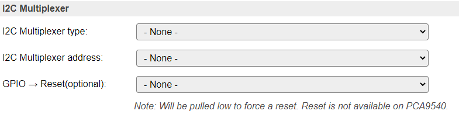

*Available multiplexer types:*

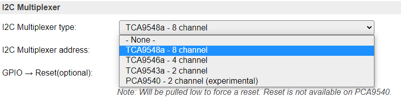

*Select the I2C Address for the multiplexer:*

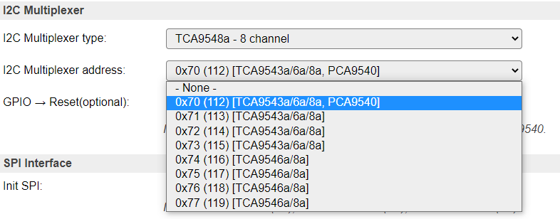

Added: 2025-02-02

With the introduction of multiple I2C Buses, it is also plausible to configure an I2C Multiplexer on the second (or third, when included in the build) I2C Bus.

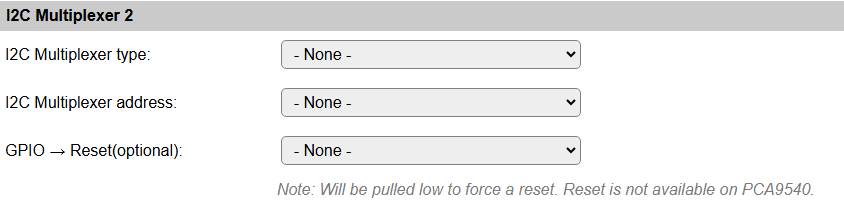

This allows the same configuration options as shown above for the first I2C Bus, as all I2C Buses are completely independent from each other.

Device configuration
^^^^^^^^^^^^^^^^^^^^

If an I2C multiplexer is configured for the selected I2C Bus, the Device edit page for I2C devices will show extra options to select the multiplexer channel the device is connected on.

There is the default option of Single channel, or, when a TCA9548a, TCA9546a or TCA9543a is configured, Multiple channels.

*Example: A multiplexer is configured, but the device is connected directly on the ESP board I2C channel:*

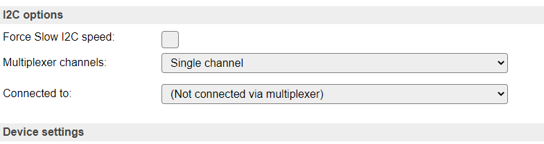

*Configure a (single) multiplexer channel the device is connected on:*

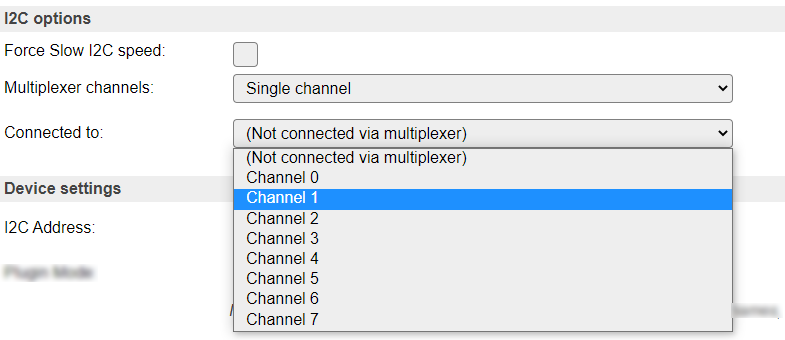

NB: Only acceptable channels (0-7/0-3/0-1) will be available in the dropdown list, depending on the Multiplexer type configured.

*Select Single channel or Multiple channels:*

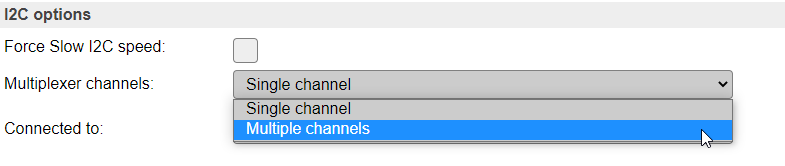

*Configure multiple channels for a device, 8 channel multiplexer configured*

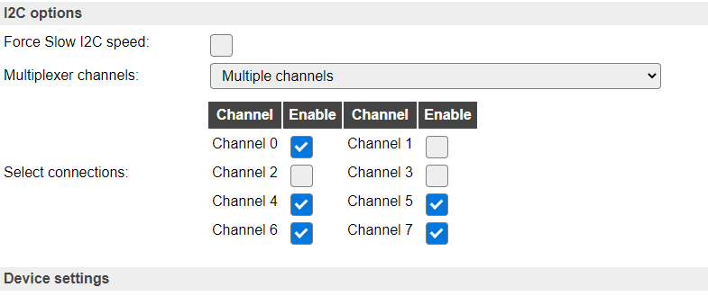

Above configuration results in channels 0, 4, 5, 6 and 7 being connected to the ESP board I2C bus when this sensor is active via I2C.

NB: Only acceptable channel checkboxes (0-7/0-3/0-1) will be shown, depending on the Multiplexer type configured.

|

.. _spi-bus:

-------
SPI Bus
-------

When using devices that are connected via the SPI interface (`Wikipedia: SPI <https://en.wikipedia.org/wiki/Serial_Peripheral_Interface>`_), the interface must be initialized during boot. This can be enabled here. For ESP32 there is the option to select the HSPI (often called Hardware SPI) interface, the VSPI (often called Virtual SPI) interface, or select User-defined GPIO pins for the ``SCLK``, ``MISO`` and ``MOSI`` signals.

The common SPI pins are shown here.

Other SPI pins to be used are device specific, and need to be configured from the corresponding Device edit page.

*For ESP8266:*

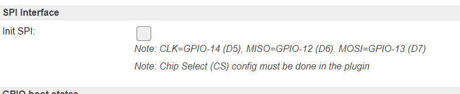

*For ESP32, disabled:*

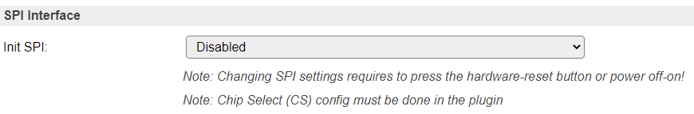

*For ESP32, select the desired configuration:*

NB: When using the VSPI configuration and also the I2C interface is used, another pin has to be selected for I2C GPIO -> SCL, as its configuration is fixed for the VSPI setting.

When selecting the *User-defined* options, 3 extra input fields are displayed, where the ``SCLK``, ``MISO`` and ``MOSI`` GPIO pins have to be selected. Nearly all pins can be used, but for the output signals ``SCLK`` and ``MOSI`` **no** *input-only* pins should be selected!

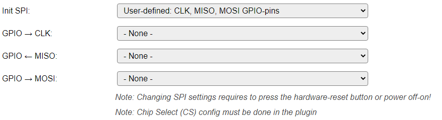

.. warning::
    When changing the setting for **Init SPI**, or changing any of the User-defined GPIO pins, the ESP32 unit needs a hardware reset. This can be achieved by pressing the reset button (when available, sometimes labelled ``EN`` or ``RST``), or by completely removing the power for ~30 seconds. Also take into account here that units with a backup battery (f.e. some LilyGo and Waveshare ESP32 models) may keep power on the unit, so specific measures may have to be taken!

NB: When selecting the *User-defined* option, **all 3 GPIO pins should be set**, or an error message will be displayed when the page is saved, and the SPI interface will not be enabled at the next boot.

|

.. _modbus:

------
Modbus
------

When using devices that use the Modbus RTU protocol the Modbus interface can be configured here. The Modbus RTU devices are connected via a RS485 serial interface. Multiple devices can be connected to the same serial interface, and are distinguished by their Modbus address. A serial to RS485 converter is required to connect Modbus RTU devices to the ESP board. 
Note that many plugins implement the Modbuis protocol for specific devices without the use of this generic Modbus interface. Only use the Modbus interface as configured on this page when using one or more plugins that depend on this generic Modbus RTU facility.

The Modbus interface uses a serial port on the ESP board to communicate with the Modbus RTU devices. The RS485 link is half-duplex, meaning that the ESP board can either send or receive data at a time. Most RS485 converters have a DE (Driver Enable) pin that can be controlled by the ESP board to switch between sending and receiving data. 
The DE pin can be configured here. If the converter has an automatic DE function, this can be set to "-None-". Some serial ports on the ESP board have a collision detect feature, which can be enabled here. When supported and enabled, the ESP board will detect if another device is sending data at the same time, and will wait sending data. This can help to avoid collisions on the RS485 link. In case all Modbus devices are well-behaving and plugins are well-configured the collision detect function is not required for Modbus RTU operation.

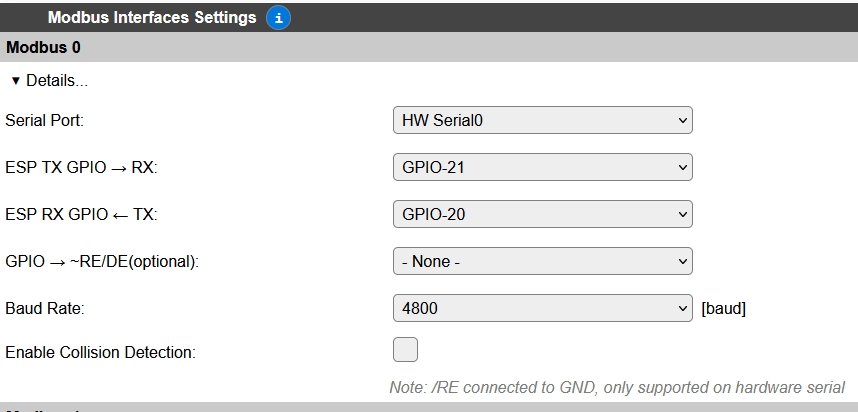

Main configuration item is the selection of the serial interface to use for Modbus. The available options depend on the ESP board used. For details about the available serial interfaces, see  serial helper page. The option "Not set" means that Modbus link is not used. When a serial interface is selected, it will be initialized and the Modbus RTU devices can be connected to it.

Selection of the RX and TX  pins is required.

If the RS485 converter has a DE (Driver Enable) pin to be controlled by the ESP board it shall be configured here. If the converter has an automatic DE function, this can be set to "-None-".  

The Baud rate for the Modbus RTU communication shall be set. The default value is 9600 baud, but it can be set to other values as required by the connected devices.

Collision Detection is a feature that can be used when the serial port hardware supports it, otherwise it is ignored.