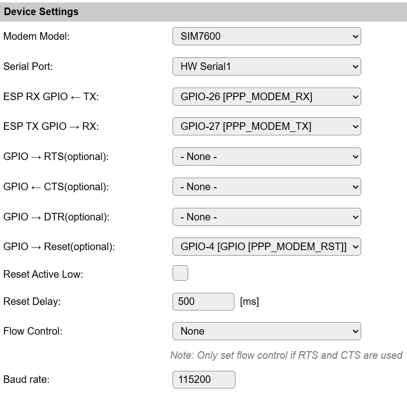
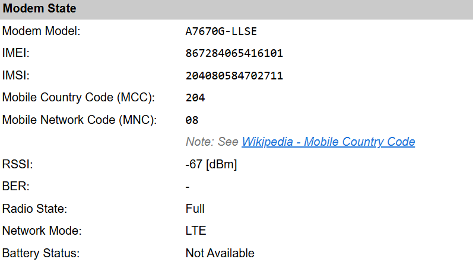
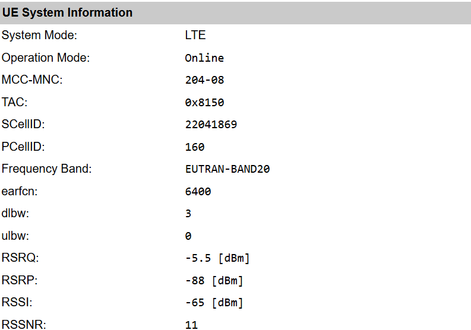

.. include:: _network_substitutions.repl

.. _NW005_page:

|NW005_typename|
==================================================

|NW005_shortinfo|

Network details
---------------

Type: |NW005_type|

Name: |NW005_name|

Status ESP32: |NW005_status|

Status ESP8266: |NW005_status_lb|

GitHub: |NW005_github|_

Maintainer: |NW005_maintainer|

Description
-----------

Configuration
-------------

Device Settings
^^^^^^^^^^^^^^^

DTR pin
-------

For SIMCOM A76xx modems, there is an emergency fallback option possible to regain access to the modem while the modem is in 'data' mode and not in 'console' mode.
ESPEasy does send the required AT-command ``AT&D1`` right before starting the network connection to enable this fallback in the modem settings.

These PPP modems do have a console/command mode and a data mode.
When entering AT commands, the modem must be pulled out of the data mode. However when the connection between the ESP and the modem got interrupted while the modem is still in data mode, it is impossible to regain access to the modem unless it is reset or power cycled.
This may occur when the ESP crashes or reboots without properly terminating the PPP network connection, or when the serial link between the ESP and the modem is not using flow control (which is strongly suggested to use!).

Not all modem boards do have the DTR pin exposed. So make sure to either have the reset pin available, or as a last resort, have the option to power cycle the modem board.
Power cycling should be considered as last resort to regain access to the modem, as it may take several minutes for a modem to get connected again after a power cycle.

Connection Settings
^^^^^^^^^^^^^^^^^^^

These settings are optional.

.. note:: These specific settings are stored in the file ``devsecurity.dat`` as these are specific to this device.

Access Point Name (APN)
-----------------------

The APN is like a default gateway for your device to connect to another network.

Typically the default APN as stored in the SIM card, or sent by the provider when setting up the connection, is just fine.

For some use cases, it may be required to set a specific APN, to override the pre-configured one stored in the SIM card.

A provider may offer several APNs, for example to connect to a specific customer network or to handle the traffic differently.

Whether or not this is even useful to change depends on the use case and the specific provider.

SIM Card Pin
------------

A SIM card often has some 4-digit pin, which must be entered when powering up the device.
If needed, the Pin number can be entered here.

Modem State
^^^^^^^^^^^

UE System Information
^^^^^^^^^^^^^^^^^^^^^

Useful AT commands
^^^^^^^^^^^^^^^^^^

The command ``ppp,write,<AT-command>`` can be used to interact directly with the modem.

.. note:: The displayed output on the web interface often also includes the ``OK`` at the end.  This is not part of the reply, but was originally printed on a separate line. However the way how these outputs are shown on the "Command Output" window, the extra newlines have been stripped from the response.  The log on the serial port will output these on separate lines.

* ``ppp,write,ATI`` Example output: ``+GCAP: +CGSM,+FCLASS,+DS``
* ``ppp,write,AT+IPR=?`` Listing supported baud rates: ``+IPR: (300,600,1200,2400,4800,9600,19200,38400,57600,115200,230400,460800,921600,1842000,3686400)``
* ``ppp,write,AT+CSPN?`` Show the SIM card carrier string: ``+CSPN: "Lebara",0``
* ``ppp,write,AT+CCLK?`` Show local time as known by the modem: ``+CCLK: "70/01/01,00:53:53+00"``

Example Devices
^^^^^^^^^^^^^^^

* `A7670E <https://nl.aliexpress.com/item/1005005220505235.html>`_ (DTR pin exposed, no RST pin)
* `A7670G <https://nl.aliexpress.com/item/1005008748473438.html>`_ (DTR pin exposed, no RST pin)
* `LilyGO T-PCIE V1.2 - AXP2101 - ESP32-WROVER - 16MB <https://www.tinytronics.nl/nl/development-boards/microcontroller-boards/met-wi-fi/lilygo-t-pcie-v1.2-axp2101-esp32-wrover-16mb>`_ with modem: `LilyGO TTGO T-PCIE A7670G  <https://www.tinytronics.nl/nl/communicatie-en-signalen/draadloos/telecom/modules/lilygo-ttgo-t-pcie-a7670g-uitbreidingsmodule>`_ 

To use the last LilyGo T-PCIe v1.2 along with their A7670G modem combination as network interface #3, this config import can be used to get started:

.. code-block::
  
  networkimportconfig,3,`{"nwpluginID":5,"enabled":"true","route_prio":200,"fallback":"false","sn_block":"true","start_delay":1000,"en_ipv6":"false","serPort":4,"RX":26,"TX":27,"RTS":-1,"CTS":-1,"rst":4,"rst_act_low":"false","rst_delay":500,"baudrate":115200,"flowctrl":0,"phytype":2,"DTR":-1}`

Change log
----------

.. versionchanged:: 2.0
  ...

  |added|
  Major overhaul for 2.0 release.

.. versionadded:: 1.0
  ...

  |added|
  Initial release version.

Description
-----------
