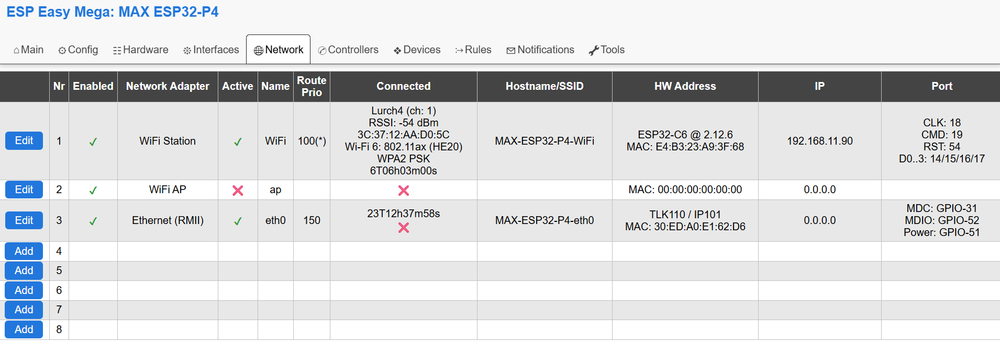

.. include:: _network_substitutions.repl

Network
*******

A Network plugin is comparable with a 'driver' for a network adapter.

.. note::
   The network code of ESPEasy has been rewritten in 2025/2026.
   Older builds of ESPEasy do have a different organisation of network related parameters.
   Most of these were accessible via the ``Tools->Advanced`` page.

.. _Network Plugins:

Network Plugins
===============

.. note::
   ESP32 builds do have a lot more networking capabilities compared to ESP8266.
   For ESP8266 we only have support for WiFi and no other network interfaces will be added for ESP8266.

.. csv-table::
   :header: "Plugin name", "ESP32 Plugin status", "ESP8266 Plugin status", "Plugin number"
   :widths: 9, 6, 6, 3

   ":ref:`NW001_page`","|NW001_status|","|NW001_status_lb|","NW001"
   ":ref:`NW002_page`","|NW002_status|","|NW002_status_lb|","NW002"
   ":ref:`NW003_page`","|NW003_status|","|NW003_status_lb|","NW003"
   ":ref:`NW004_page`","|NW004_status|","|NW004_status_lb|","NW004"
   ":ref:`NW005_page`","|NW005_status|","|NW005_status_lb|","NW005"

Network Overview Tab
====================

Overview of the Network tab on an ESP32-P4.

The first 2 entries will be the same for every ESPEasy setup and these cannot be removed.

* Nr. 1 is always WiFi STA (station) To connect the ESP board to an access point.
* Nr. 2 is always WiFi AP (Access Point) To let the ESP board act as an access point.

There are 2 types of Ethernet plugins:

* RMII, only available on ESP32-classic and ESP32-P4 (and ESP32-S31 when supported in the future)
* SPI, Possible on all supported ESP32 variants except ESP32-C2.

The last option is a PPP modem, to connect via 4g/LTE to the internet.

Active
^^^^^^

Indicates whether a network adapter has been 'started'.
This is related to "Fallback" and "Delay Startup".

This "Active" concept is needed to allow for another concept called the "Fallback Interface".

For example, on a standard ESP board with only WiFi, the WiFi AP interface can be considered a fallback interface.
Meaning the AP is "Enabled" but no need to set it "Active" as long as you can connect to your normal WiFi network.

The conditions on when to start the WiFi AP interface can be configured as well.

Only when one or more set conditions are met, then the AP will be activated.

Name
^^^^

A single word describing the network interface.
This can be appended to the hostname and is also referred to in network events to be used in rules.

Route Prio
^^^^^^^^^^
(ESP32 only)

The active and connected interface with the highest 'route prio' value is the default interface for new outgoing connections.  
The current default interface is marked with an asterisk.

This means the ESP is still reachable via other interfaces when needed, but new connections will be made only via the default route.

N.B. it is possible to block web access per interface via the checkbox for Block Web Access

.. note:: Do not set two interfaces active to same route prio as this may lead to undefined behavior.

Connected
^^^^^^^^^

Show basic information about the connection, or a red cross if not connected.

The shown duration is the duration since the last connected/disconnected status change.

Hostname/SSID
^^^^^^^^^^^^^

Shows the hostname as used for that specific network interface.

This hostname is used in the DHCP request and when mDNS is being used.

For the WiFi AP interface, the SSID is shown.

HW Address
^^^^^^^^^^

Lists the MAC address and some basic description of the network interface when applicable.

Description examples:

* WiFi interface on an ESP32-P4 lists the ESP32-variant used as external wifi adapter and the ESP-Hosted-MCU firmware version running.
* Ethernet will list the network adapter chip model.

For the PPP interface, the IMEI number is listed instead of the MAC address.

IP
^^

Shows the IPv4-address as it is currently in use on the network interface.

More detailed info on IPv6-addresses is listed on the page where the network interface can be configured and on the sysinfo page.

Port
^^^^

When applicable, the GPIO pins will be listed here.

* External WiFi module on ESP32-P4: SDIO bus
* Ethernet: GPIO pins
* PPP: Serial port + GPIO pins 

Export/Import Network Parameters
================================

.. note::
   This is working only on ESP32 as extra network interfaces are only supported on ESP32 builds of ESPEasy.

In order to simplify initial setup of a newly flashed module, it is possible to have a JSON string to enter via the ESPEasy console.

* ``networkexportconfig,N`` with N being the network adapter index.
* ``networkexportconfig,N,'{....}'`` with N being the network adapter index and the second parameter the literal JSON string as output from the ``networkexportconfig`` command. 

.. note::
   N.B. the 2nd parameter must be wrapped in quotes which are not used in the JSON string, like single quote or back-ticks.  Also the braces must be included.

Examples
--------

Export of network config on a `Waveshare ESP32-P4-NANO <https://www.waveshare.com/esp32-p4-nano.htm>`_ RMII Ethernet adapter set as network index 3:

.. code-block:: none
  
  networkexportconfig,3
  {"nwpluginID":3,"enabled":"true","route_prio":150,"fallback":"false","sn_block":"false","start_delay":1000,"en_ipv6":"false","Index":0,"phytype":1,"phyaddr":1,"MDC":31,"MDIO":52,"pwr":51,"clock":1}

To import this exact example:

.. code-block:: none

  networkimportconfig,3,`{"nwpluginID":3,"enabled":"true","route_prio":150,"fallback":"false","sn_block":"false","start_delay":1000,"en_ipv6":"false","Index":0,"phytype":1,"phyaddr":1,"MDC":31,"MDIO":52,"pwr":51,"clock":1}`

.. note::
   When a parameter is not present in the JSON when importing, the default will be used.
   Also when a parameter is not present in the stored config (applies to default values), the key/value pair will not appear in the exported JSON.

Allowed Parameters
------------------

.. csv-table:: Allowed import/export keywords per network plugin.
   :header: "Key","Value Type","Description","WiFi STA","WiFi AP","RMII Ethernet","SPI Ethernet","PPP "
   :widths: 15, 10, 20, 10, 10, 10, 10, 10
   
   "nwpluginID","int","ESPEasy NWPlugin ID","1","2","3","4","5 "
   "enabled","bool","","✔","✔","✔","✔","✔"
   "route_prio","int","See “Route Priority”","✔ (100 default)","✔ (10 default)","✔ (50 default)","✔ (50 default)","✔ (20 default)"
   "fallback","bool","See “Fallback Interface”","✔","✔","✔","✔","✔"
   "sn_block","bool","See “Block Web Access”","✔","✔","✔","✔","✔"
   "start_delay","int","See “Delay Startup”","✔","✔","✔","✔","✔"
   "append_hostname","bool","See “Append Name to Hostname”","✔","✔","✔","✔","✔"
   "en_ipv6","bool","See “Enable IPv6”","✔","✔","✔","✔","✔"
   "Index","int","Network ‘Nr’ on Network tab","1","2","✔","✔","✔"
   "phytype","int","Selected chip, see below","","","✔","✔","✔"
   "phyaddr","int","Ethernet PHY Address","","","✔","✔",""
   "MDC","int","GPIO pin MDC","","","✔","",""
   "MDIO","int","GPIO pin MDIO","","","✔","",""
   "pwr","int","GPIO pin Power","","","✔","",""
   "clock","int","Clock Mode","","","✔","",""
   "CS","int","GPIO pin CS","","","","✔",""
   "IRQ","int","GPIO pin IRQ","","","","✔",""
   "RST","int","GPIO pin Reset","","","","✔","✔"
   "ethspibus","int","SPI bus (0 or 1)","","","","✔",""
   "serPort","int","ESPEasySerial port enum","","","","","✔"
   "RX","int","GPIO pin RX","","","","","✔"
   "TX","int","GPIO pin TX","","","","","✔"
   "RTS","int","GPIO pin RTS","","","","","✔"
   "CTS","int","GPIO pin CTS","","","","","✔"
   "DTR","int","GPIO pin DTR","","","","","✔"
   "rst_act_low","bool","Reset Active Low","","","","","✔"
   "rst_delay","int","Delay after reset in ms","","","","","✔"
   "baudrate","int","Baudrate","","","","","✔ (115200 default)"
   "apn","string","Access Point Name (APN)","","","","","✔"
   "pin","string","PIN of SIM card","","","","","✔"
   "IP","string","IP address","","","✔","✔","✔"
   "gw","string","Gateway IP address","","","✔","✔","✔"
   "sn","string","Subnet mask","","","✔","✔","✔"
   "DNS","string","DNS server IP address","","","✔","✔","✔"

Phy Types
---------

RMII Ethernet:

* LAN8720 = 0
* TLK110  = 1
* RTL8201 = 2
* JL1101  = 3
* DP83848 = 4
* KSZ8041 = 5
* KSZ8081 = 6
* LAN867X = 7

SPI Ethernet:

* DM9051  = 10
* W5500   = 11
* KSZ8851 = 12

PPP:

* generic = 1
* SIM7600 = 2
* SIM7070 = 3
* SIM7000 = 4
* BG96    = 5
* SIM800  = 6

Clock Mode
----------

For ESP32-classic, the clock mode for RMII Ethernet has these options:

* Ext_crystal_osc       = 0
* Int_50MHz_GPIO_0      = 1
* Int_50MHz_GPIO_16     = 2
* Int_50MHz_GPIO_17_inv = 3

For ESP32-P4, the clock mode is a bit simpler as the clock pin can only be GPIO 32 / 44 / 50 (default)
and there are only 2 modes, either external crystal or clock generated by the ESP.

* Default     = 0
* Ext_crystal (GPIO-50) = 1
* Int_50MHz   (GPIO-50) = 2  

And the not yet supported other clock GPIO pins:

* Ext_crystal (GPIO-32) = 129  ``(1 | (32 << 2))``
* Int_50MHz   (GPIO-32) = 130  ``(2 | (32 << 2))``
* Ext_crystal (GPIO-44) = 177  ``(1 | (44 << 2))``
* Int_50MHz   (GPIO-44) = 178  ``(2 | (44 << 2))``

.. note:: Currently only GPIO-50 is supported, but later the other GPIO pins could be used and then these fixed values should be used.

M5Stack ESP32-S3 Atom with W5500 AtomPoE SPI Ethernet
^^^^^^^^^^^^^^^^^^^^^^^^^^^^^^^^^^^^^^^^^^^^^^^^^^^^^

Make sure SPI is configured with CLK: GPIO-5, MISO: GPIO-7, MOSI: GPIO-8

.. code-block:: none
  
  networkimportconfig,3,'{"nwpluginID":4,"enabled":"true","route_prio":150,"sn_block":"false","start_delay":1000,"en_ipv6":"true","phytype":11,"phyaddr":0,"CS":6,"IRQ":-1,"RST":-1}'

