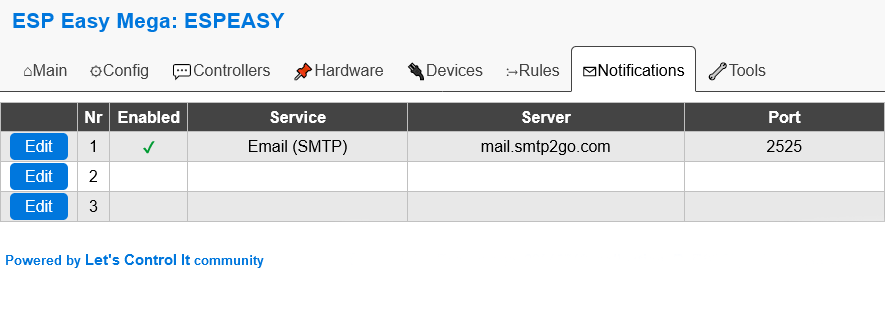
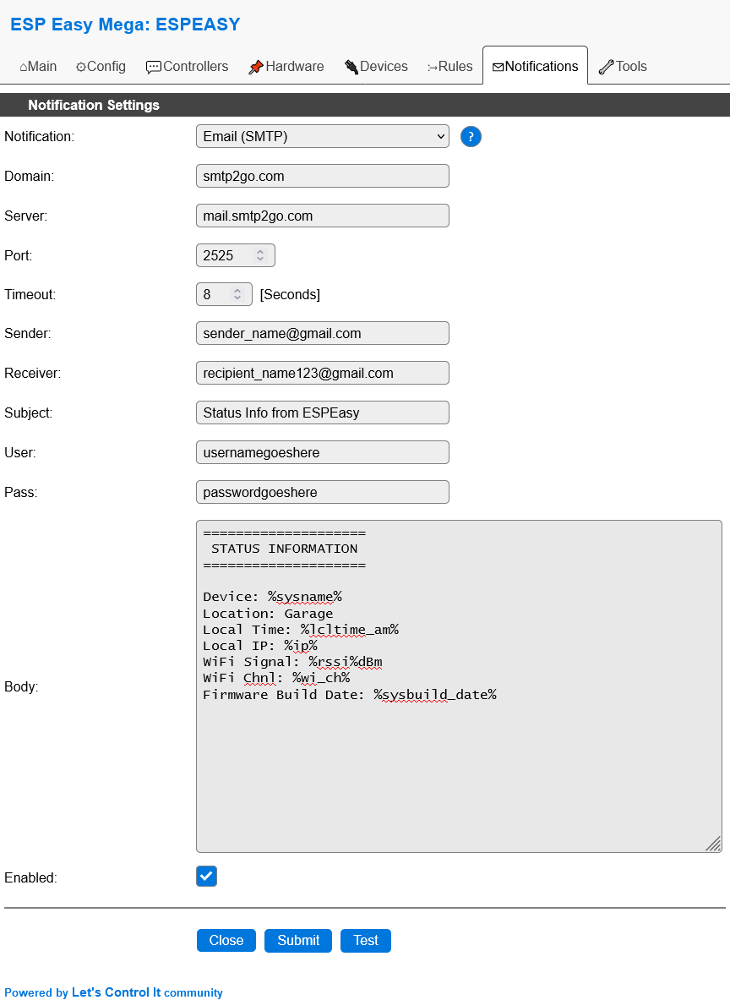

.. include:: _notify_substitutions_n00x.repl

.. _N001_page:

Notifications Email (SMTP)
===========================

|N001_shortinfo|

Type: |N001_type|

Name: |N001_name|

Status: |N001_status|

GitHub: |N001_github|_

Maintainer: |N001_maintainer|

Used libraries: |N001_usedlibraries|

Introduction
------------

*Notifications Email (SMTP)* is used to send an email message using ESPEasy rules.

|

Basic Rules Examples
---------------------

The general syntax for sending an email is:

.. code-block:: none

   notify <Nr>

Where <Nr> is the position number (1,2,3) assigned to the notification declaration.

For example, to send your pre-defined email message after WiFi has connected, use a rule like this:

.. code-block:: none

   on WiFi#Connected do
      notify 1
   endon

To send an email every day at noon, create a rule like this:

.. code-block:: none

   on Clock#Time=All,12:00 do //will run once a day at noon
      notify 1
   endon

.. hint::
    The examples discussed here have setup the Notification Email in the very first (Nr 1) row. So the command syntax will be "*notify 1*"

|

Email Configuration
--------------------

ESPEasy's Notifications tab allows up to three declarations for email (and buzzer) alerts.

|

The *Notifications Email* page is used to create pre-defined email messages.
At least one is required to use the email feature.

From the *Notifications* page, press *Edit* on an available *Nr* option. Next, Choose *Email (SMTP)* in the drop-down list.

* **Domain :** Mail provider domain.
* **Server :** Mail server address (DNS or IP number). Must support non-secure SMTP.
* **Port :** Server port number. TLS / SSL ports are NOT supported.
* **Timeout :** Maximum allowed time for server reply. Increase value if server timeouts occur.
* **Sender :** Sender's email address ("From:").
* **Receiver :** Recipient's email address ("To:"). Multiple allowed, use comma (,) between each address.
* **Subject :** Text for email's subject line.
* **User :** Server user name.
* **Pass :** Server password.
* **Body :** Message text. System variables allowed. Use   for new line. Maximum 512 characters.
* **Enabled :** Check this box to enable the email feature.

Be sure to press *Submit* to save your settings.

Note: For more flexibility, there are :ref:`adv_feat` within the notify command for changing the recipient(s), subject line, and message body.

|

Email Server Requirements
--------------------------

ESPEasy doesn't support the SSL protocol.
Unfortunately most Email service providers ended support for non-secure SMTP (without TLS / SSL) several years ago.
This means that ESPEasy's email is **not** directly compatible with popular providers such as gmail.com, yahoo.com, aol.com, and many others.

But there are two workarounds for the SSL issue, as follows:

* Operate a mail server inside your local network.
* Use an SMTP Email account from a provider that still supports non-secure SMTP (e.g. SMTP2go.com, smart-mail.de).
  Services such as SMTP2go will act as an SSL bridge from a non-secure sender.
  Personal (non-commercial) accounts are available at no cost too.

The table below provides sample entries for smtp2go.com and smtp.smart-mail.de

+-----------+--------------------+--------------------+--------------------------------------+
| Name      |     Example 1      |     Example 2      |          Description                 |
+===========+====================+====================+======================================+
| Domain:   |    smtp2go.com     |   smart-mail.de    |       Mail provider domain.          |
+-----------+--------------------+--------------------+--------------------------------------+
| Server:   |  mail.smtp2go.com  | smtp.smart-mail.de |        Mail server address.          |
+-----------+--------------------+--------------------+--------------------------------------+
| Port:     |        2525        |         25         |  SMTP port recommended by provider.  |
+-----------+--------------------+--------------------+--------------------------------------+
| Sender:   |   joe@gmail.com    | joe@anydomain.com  |   Sender's email address.            |
+-----------+--------------------+--------------------+--------------------------------------+
| Receiver: |   Jim@yahoo.com    |  Jim@domain.com    |   Recipient's email address.         |
|           |                    |                    |   Note: Multiple allowed,            |
|           |                    |                    |   use comma (,) between each address.|
+-----------+--------------------+--------------------+--------------------------------------+
| Subject:  |    Subject Text    |    Subject Text    |  Topic in email headline.            |
+-----------+--------------------+--------------------+--------------------------------------+
| User:     |      ESP123        | ESP@smart-mail.de  |  Username to the SMTP Server.        |
+-----------+--------------------+--------------------+--------------------------------------+
| Pass:     |   secretepw001%%   |   secretepw002$$   |  Password to the SMTP Server.        |
+-----------+--------------------+--------------------+--------------------------------------+
| Body:     |    Device uptime is %uptime% mins.   |  512 characters max.                 |
|           |    Connected via WiFi %ssid%.           |  Use   for new line.              |
+-----------+--------------------+--------------------+--------------------------------------+
| Enabled:  |     Check Box      |     Check Box      |  Email is disabled if box unchecked. |
+-----------+--------------------+--------------------+--------------------------------------+

|

.. _adv_feat:

Advanced Features
------------------

Along with the pre-defined settings, it is possible to customized the email's message body, subject line, and recipient(s), all from the Notify command rule.
So ad-hoc emails are possible.

.. hint::
    Use the latest ESPEasy build. Older releases do not support these advanced features.

Custom Message Body
___________________

The Basic syntax for a custom message body is:

.. code-block:: none

   notify <Nr>, "Your Custom Message Goes Here. System variables can be used too. Wrap this text in quotes."

So to specify a custom message with the Notify command, use a rule like this:

.. code-block:: none

   notify 1,"%sysname% is online. Location: Office. Local IP: %ip%. WiFi Signal: %rssi%dBm."

Custom Message Body and Subject Line
_____________________________________

To specify a custom message AND subject line, use a rule like this:

.. code-block:: none

   notify 1,"%sysname% is online. Location: Office. Local IP: %ip%. WiFi Signal: %rssi%dBm.","Your Custom Subject Line Goes Here."

Custom Recipient Address
_____________________________

The custom message can also include the email recipient.
The general syntax is:

.. code-block:: none

   notify <Nr>, "{email@domain.com},This is the email message. System variables can be used here."

For example:

.. code-block:: none

   notify 1,"{jimmydean@domain123.com},%sysname% has rebooted. Local IP: %ip%. WiFi Signal: %rssi%dBm. Have a great day."

To include a custom subject with the previous example, simply add it as the last argument. Like this:

.. code-block:: none

   notify 1,"{jimmydean@domain123.com},%sysname% has rebooted. Local IP: %ip%. WiFi Signal: %rssi%dBm. Have a great day.","System Reboot!"

Multiple email recipients can be specified too. Use a comma (,) between addresses.

.. code-block:: none

   notify 1,"{email123@domain.com,billy@steamhouseinc.com},The steam boiler is overheating!"

.. attention::
    A custom message MUST be provided whenever the recipient address is specified in the Notify command.
    A custom subject line is optional.

|
