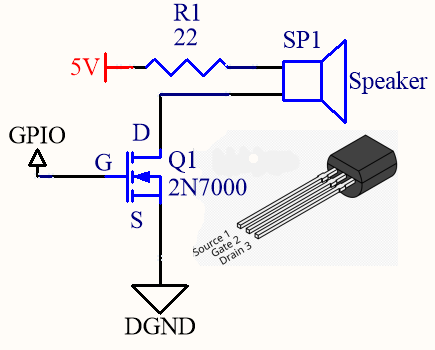
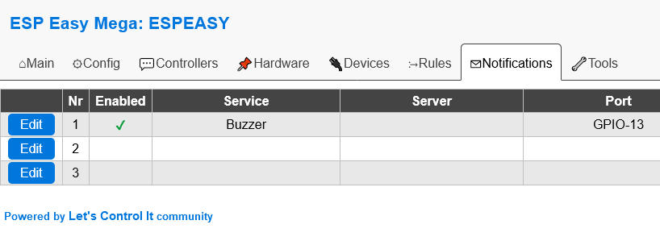
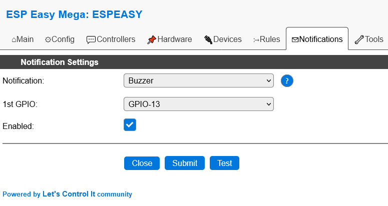

.. include:: _notify_substitutions_n00x.repl
.. include:: ../Plugin/_plugin_substitutions_p00x.repl

.. _N002_page:

Notifications Buzzer
=====================

|N002_shortinfo|

Type: |N002_type|

Name: |N002_name|

Status: |N002_status|

GitHub: |N002_github|_

Maintainer: |N002_maintainer|

Used libraries: |N002_usedlibraries|

Introduction
-------------

*Notifications Buzzer* is used to trigger an audio beep tone.
This is ideal for system alerts and other attention seeking situations.

A "Notify" command is used in the device rule file to produce the sound.
It is a simple 440Hz tone with 500mS duration.

Please be aware that ESPEasy supports a more advanced audio tone feature named *Buzzer (RTTTL)*  that can produce user defined melodies.

.. hint:: To learn about the RTTTL tone feature please click here :ref:`P000_Buzzer_page`

|

Speaker Driver
---------------

There are many ways to adapt the GPIO output to drive a piezo transducer or common speaker.
Adding an alert beep sound to a microcontroller is a popular topic discussed by Arduino project builders.
So for inspiration a quick internet search is all that is required.
The implementation can be fully DiY using a simple transistor driver circuit, a ready-to-use module, or 1000 watt rock concert amplifier with a stage full of speakers.

Be aware that the tone frequency is created by software.
So the audio output device must be the "passive" type that does not include an oscillator.

Keep in mind that common buzzers and beepers are turned on by a fixed voltage; Do **NOT** use that type with the Notifications feature.

The idle state for the Buzzer's GPIO pin is logic low.
So the driver circuit should have an active high turn-on state, which will be toggled on/off to create the tone's fixed 440Hz frequency.

Below is one such circuit, which requires only three components:

* 2N7000 MOSFET Transistor
* 22Ω 1/8W Resistor
* 8-16 ohm Speaker

|

ESPEasy Buzzer Configuration
-----------------------------

ESPEasy's *Notifications* tab allows up to three declarations for email and buzzer alerts.
Only one Buzzer entry is needed to enable the feature.

|

From the *Notifications* page, press *Edit* on an available *Nr* option. Next, Choose *Buzzer* in the drop-down list and select the GPIO pin number for your audio output.
Be sure to check the *Enabled* box before pressing the *Submit* button.

|

Command Syntax
---------------

The general syntax for making a buzzer noise is:

.. code-block:: none

   notify <Nr>

Where <Nr> is the position number (1,2,3) assigned to the notification declaration.

|

Rules Example
--------------

To make a buzzer sound on startup, create a rule like this:

.. code-block:: none

   On System#Boot do
     notify 1 // Beep!
   endon

To make a buzzer sound every 60 seconds, create a rule file with these commands:

.. code-block:: none

   On System#Boot do
     LoopTimerSet,1,60  // Start the timer.
   endon

   On Rules#Timer=1 do
     notify 1 // Beep!
   endon

.. hint:: The examples discussed here have setup the buzzer in the very first (Nr 1) row. So the command syntax will be "*notify 1*"

|
