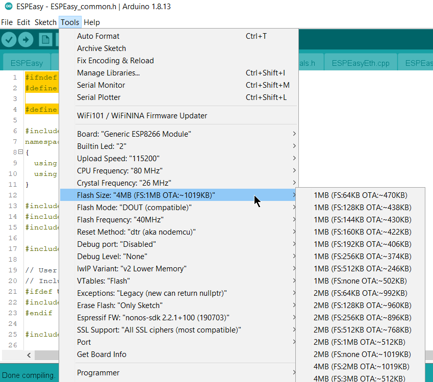

Arduino IDE
***********

The preferred way to build ESPEasy is using PlatformIO.
However, there are still lots of people happily using Arduino IDE.
Therefore we try to keep the project source compatible with Arduino IDE.

Since development is not done in Arduino IDE, it may happen that some commit breaks Arduino IDE compatibility.
Usually it is something as simple as an include not being relative compared to the file which is being compiled.
This is a bug, which PlatformIO does not complain about and thus can be missed easily during development.

If something like this happens, please open an issue (or pull request) for it on GitHub.
Also, if someone knows a build flag for PlatformIO to signal those errors, please let us know.

Prepare Arduino IDE
===================

When installing Arduino IDE, its default installation folder structure is to share libraries and sketches among all installations of Arduino IDE.
If you only build one project, this is just fine. 
However, if you try to build several projects or versions of projects, then you will run into library dependency issues.

See: `how to create portable version of Arduino IDE <https://www.arduino.cc/en/Guide/PortableIDE>`_

For building ESPEasy it is adviced to use a "portable installation" of Arduino IDE.

Arduino IDE Prerequisites
=========================

For building ESPEasy in Arduino IDE, you need to install the board manager and ESP8266/ESP32 library.

See these excellent tutorials:

* `How to install ESP8266 board for Arduino IDE <https://randomnerdtutorials.com/how-to-install-esp8266-board-arduino-ide/>`_
* `How to install ESP32 board for Arduino IDE <https://randomnerdtutorials.com/installing-the-esp32-board-in-arduino-ide-windows-instructions/>`_

Download ESPEasy Sources
========================

The sources can be downloaded from `GitHub <https://github.com/letscontrolit/ESPEasy>`_ as ZIP file.

In this document, the given file system paths refer to a portable installation of Arduino IDE in ``D:\temp\Arduino-EspEasy\``

The structure in the ZIP file are made for use in PlatformIO.
To use the source in Arduino IDE, you have to split the sources into 2 parts:

* The used libraries: ``D:\temp\Arduino-EspEasy\portable\sketchbook\libraries``
* The source code: ``D:\temp\Arduino-EspEasy\portable\sketchbook\ESPEasy``

Some used libraries differ from the original ones to make them work with ESPEasy.
So make sure to use the ones supplied in the ZIP file in the ``lib`` folder.
If some libraries are missing from the ``lib`` folder, you can install them via the Arduino IDE library manager.

The source code files to be placed in the ``ESPEasy`` directory must be taken from the (first) ``src`` directory in the ZIP file.
Meaning the file ``ESPEasy.ino`` must be in the ``ESPEasy`` folder. (including all files in sub folders)

Building using Custom.h
=======================

There is a ``Custom-sample.h`` file supplied, which has lots of defines that can be set or uncommented to make a specific build 
including just the plugins and controllers needed and maybe even some proper default settings.

To use this file, it must be renamed to ``Custom.h``.

There are two options to define ``USE_CUSTOM_H`` for an Arduino IDE build:

* In ``ESPEasy_common.h``: uncomment ``//#define USE_CUSTOM_H``
* Create a personal ``platform.local.txt`` file

Define USE_CUSTOM_H in ESPEasy_common.h
^^^^^^^^^^^^^^^^^^^^^^^^^^^^^^^^^^^^^^^

PlatformIO does recognize the presence of this file when building a ``Custom`` build environment.
But for Arduino IDE, a single line must be uncommented in ``ESPEasy_common.h``

Make sure to uncomment this line at the start of ``ESPEasy_common.h``: ``//#define USE_CUSTOM_H``
This define makes sure the ``Custom.h`` file is actually included during build.

Build definition via platform.local.txt
^^^^^^^^^^^^^^^^^^^^^^^^^^^^^^^^^^^^^^^

Locate the file ``platform.txt`` in the esp8266 platform directory of ArduinoIDE.

The exact location depends on the installation, usually in a directory below the main application called ``hardware/esp8266.com/``.

In the same directory add an (untracked) file called ``platform.local.txt`` with the following lines:

.. code-block:: none

   compiler.minsize=
   compiler.c.extra_flags=-DUSE_CUSTOM_H -DPUYA_SUPPORT=0 -DCONFIG_FREERTOS_ASSERT_DISABLE -DCONFIG_LWIP_ESP_GRATUITOUS_ARP -DCONFIG_LWIP_GARP_TMR_INTERVAL=30 -DCORE_POST_2_5_0 -DCORE_POST_2_6_0 -DNDEBUG -DICACHE_FLASH -DWEBSERVER_RULES_DEBUG=0 -DVTABLES_IN_FLASH -mtarget-align -Werror=unused-variable {compiler.minsize}
   compiler.c.elf.extra_flags=-DUSE_CUSTOM_H -DPUYA_SUPPORT=0 -DCONFIG_FREERTOS_ASSERT_DISABLE -DCONFIG_LWIP_ESP_GRATUITOUS_ARP -DCONFIG_LWIP_GARP_TMR_INTERVAL=30 -DCORE_POST_2_5_0 -DCORE_POST_2_6_0 -DNDEBUG -DICACHE_FLASH -DWEBSERVER_RULES_DEBUG=0 -DVTABLES_IN_FLASH -mtarget-align -Werror=unused-variable {compiler.minsize}
   compiler.S.extra_flags=-DUSE_CUSTOM_H -DPUYA_SUPPORT=0 -DCONFIG_FREERTOS_ASSERT_DISABLE -DCONFIG_LWIP_ESP_GRATUITOUS_ARP -DCONFIG_LWIP_GARP_TMR_INTERVAL=30 -DCORE_POST_2_5_0 -DCORE_POST_2_6_0 -DNDEBUG -DICACHE_FLASH -DWEBSERVER_RULES_DEBUG=0 -DVTABLES_IN_FLASH -mtarget-align -Werror=unused-variable {compiler.minsize}
   compiler.cpp.extra_flags=-DUSE_CUSTOM_H -DPUYA_SUPPORT=0 -DCONFIG_FREERTOS_ASSERT_DISABLE -DCONFIG_LWIP_ESP_GRATUITOUS_ARP -DCONFIG_LWIP_GARP_TMR_INTERVAL=30 -DCORE_POST_2_5_0 -DCORE_POST_2_6_0 -DNDEBUG -DICACHE_FLASH -DWEBSERVER_RULES_DEBUG=0 -DVTABLES_IN_FLASH -mtarget-align -Werror=unused-variable {compiler.minsize}
   compiler.ar.extra_flags=
   compiler.objcopy.eep.extra_flags=
   compiler.elf2hex.extra_flags=

Board definitions
=================

In Arduino IDE you must prepare the environment variables yourself.

* Board: "Generic ESP8266 Module"
* Flash Size: Pick the one reflecting your board (4M flash 1M FS is the most used)
* Flash Mode: "DOUT"

The other settings are likely to be correct when using the defaults.
See the screenshot to be sure.

