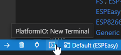

Documentation
*************

For documentation we use Sphinx and this will be read by ReadTheDocs.
We use the `Sphinx Bootstrap Theme <https://github.com/ryan-roemer/sphinx-bootstrap-theme>`_

This documentation is included in the GitHub repository.
It allows us to create documentation per version of ESPEasy.

See also the `ESPEasy wiki <https://www.letscontrolit.com/wiki/index.php/ESPEasy>`_
for more documentation which has not been moved here.

Needed Python packages::

   cd docs

   pip install -r requirements.txt

PlatformIO with VSCode
======================

.. note:: 

  Here used to be a reference to the Atom editor, but both Atom, and the PlatformIO plugin for Atom, are no longer maintained by their owners, so it was removed from this documentation.

As an alternative, VSCode can be used as a development environment. See also :ref:`PlatformIO_page`

With the ESPEasy project open in VSCode, open the PIO terminal in VSCode.

Install dependencies::

   cd docs
   pip install -r requirements.txt

Build on Windows::

   cd docs
   .\make.bat html

Build on Linux/Mac::

   cd docs
   ./make html

LaTeX (PDF) build on Linux
==========================

To build a PDF document of this documentation, you need to have LaTeX installed and some texlive packages.

Via apt-get installed packages::

  sudo apt-get install xzdec texlive-fonts-recommended texlive-latex-recommended texlive-latex-extra
