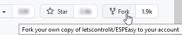

.. _PlatformIO_page:

PlatformIO
**********

ESP easy can be built using the Arduino IDE or PlatformIO (PIO).
Arduino IDE is not being used during development, so it may take some more effort to get it setup for building ESPeasy.

We advice to use PlatformIO as build environment.

PlatformIO is just the build, test and upload environment for many micro controllers like the ESP8266 and ESP32 we use.

On top of that you need to use an editor, or so called IDE in which PlatformIO will be used.

The current choice is:

* Microsoft Visual Studio Code. (MS VSCode)

VSCode is free to use and available for Windows, MacOS and Linux.

Apart from VSCode, there are more available, like Eclipse, MS Visual Studio (IDE) and probably more.

PlatformIO Prerequisites
========================

PlatformIO does need at least the following:

* Python
* Git command line tools (`download <https://git-scm.com/downloads>`_)

For most operating systems, Python is already present, but for Windows you may need to install it.
Starting October 2019, Python 3.x is supported in all build tools we use for ESPEasy.

Please follow `these steps <https://docs.platformio.org/en/latest/faq.html#faq-install-python>`_ to 
install Pyton in Windows for PlatformIO.

.. warning:: Do not forget to check "Add Python xxx to PATH".

.. Windows ExecutionPolicy
.. -----------------------

.. For PlatformIO 4.1.x and newer in Windows, you may need to change the Windows ExecutionPolicy 
.. to be able to start a powershell script.
.. PlatformIO does use a PowerShell script to activate the Python virtual environment.

.. Default Windows security settings prevent execution of a PowerShell script.

.. Enter in the PowerShell terminal window in VScode:

.. .. code-block:: none

..     Set-ExecutionPolicy -ExecutionPolicy Unrestricted -Scope CurrentUser

.. Please note this does lower your security, so make sure you know its implications.
.. See `Microsoft - About Execution Policies <https:/go.microsoft.com/fwlink/?LinkID=135170>`_ for more details.

These steps have been explained in this Youtube video: https://youtu.be/ArqwMcYSMsU though you might want to use the latest version of both the Git tools and Python.

PlatformIO with VSCode
======================

Install
-------

For development of ESPEasy, a number of extensions has to be installed in VS-Code:

* PlatformIO IDE (by PlatformIO)
* C/C++ IntelliSense (by Microsoft)
* Uncrustify (by Zachary Flower, originally by Laurent Tréguier)

Optional, but highly recommended:

* Bookmarks (by Alessandro Fragnani)
* GitLens - Git supercharged (by Gitkraken)
* Todo Tree (by Gruntfuggly)
* All Autocomplete (by Atishay Jain)
* Excel Viewer (by GrapeCity)
* Esbonio - An extension for editing sphinx projects (by Swyddfa)
* reStructuredText Syntax highlighting (by Trond Snekvik)
* Extension pack for reStructuredText (by LeXtudio Inc.)
* Markdown All in One (by Yu Zhang)

Uncrustify
----------

The extension Uncrustify is mainly to format the code using a standard code format definition.
This code format standard is defined in the file uncrustify.cfg in the main directory of this repository.
For new code contributions, it is highly appreciated if the code is formatted using this tool.

NB: Uncrustify has to be installed separately, as it is not included in the plugin! Download `Uncrustify from Sourceforge.net <https://sourceforge.net/projects/uncrustify/>`_

To do so:

* Right click mouse in editor
* "Format Document"

The first time (after installing uncrustify) it must be confirmed to use Uncrustify as formatter and using the default suggested config file.

After setting it as the default formatter, the hotkey Alt-Shift-F (Cmd-Shift-F on MacOS) can be used to format the entire document.

.. note:: 

  There used to be a reference to the Atom editor, but both Atom, and the PlatformIO plugin for Atom, are no longer maintained by their owners, so it was removed from this documentation.

Load a project using PlatformIO
-------------------------------

If you have PIO installed and the source tree cloned to your hard drive, then you can open the main dir of the repository.
The main directory of the repository is the level with the file platformio.ini in it.

Then in a few moments after opening the directory, on the left there will appear an alien logo, the logo of PlatformIO.
If you click that one, you will get a tree with lots and lots of project tasks and environments.

It is important  to note that PlatformIO does everything based on environments, which are defined in the platformio.ini file.
In the PlatformIO menu (on the left) everything is grouped per environment.

An environment entry has several tasks, like:

* Build
* Upload
* Monitor
* Upload and Monitor
* Clean
* ... many more.

Some of these options only are available when you have registered with PlatformIO and some are only for paid subscriptions.
At least the basic ones used for almost any user are available with the free account.

The environment definitions all have at least the used micro controller in the name and the amount of flash memory used.

For example:

* ..._ESP8266_4Mnn -> ESP8266 has external flash, which can vary in size from 512 kB to 16 MB, with nn configured as filesystem.
* ..._ESP8266_1M -> ESP8285 has the flash internal, which is almost always 1 MB. ESP8266 does have an external flash chip, which allows for exchanging it for a larger flash chip (recommended).
* ..._ESP32_4M316k -> ESP32 with 4 MB flash and a 1.8 MB partition for the sketch. (316k SPIFFS)
* ..._ESP32s2_4M316k -> ESP32s2 with 4 MB flash and a 1.8 MB partition for the sketch. (316k SPIFFS)
* ..._ESP32_16M8M_LittleFS -> ESP32 with 16 MB flash and a 4 MB partition for the sketch. (8MB LittleFS)
* ..._ESP32_16M1M_ETH -> ESP32 with 16 MB flash and a 4 MB partition for the sketch. (1MB SPIFFS, Wired ethernet support)

Make a custom build using PlatformIO
------------------------------------

The easiest is to go for the environment ``custom_ESP8266_4M1M`` and unfold that one.
Then select ``Build`` to see if it will start building.

If that's working, you can open the file ``pre_custom_esp8266.py`` and add or remove the plugins and controllers you need.
That Python file is used in the ``env:custom_ESP8266_4M1M`` (or any ``custom`` build environment) to define what should be embedded and what not.

For example to have only the controller ``C014``, you can remove ``CONTROLLER_SET_ALL``, and just add ``USES_C014``, 
The same for the plugins you need.

The file is built in the ``.pio/build/....`` directory right under the main repository directory (the one with the platformio.ini in it)

Instead of modifying ``pre_custom_esp8266.py`` (or ``pre_custom_esp32.py`` for that matter), one can also copy ``src/Custom-sample.h`` to ``src/Custom.h`` and make the desired changed in this file. This file is excluded from Github, so can be adjusted to your own requirements. When the Custom.h file is there (mind the uppercase C!), it will be used by the build scripts instead of the defaults set by ``pre_custom_esp8266.py`` (or ``pre_custom_esp32.py``).

.. note:: Custom IR builds have their own ``pre_custom_esp8266_IR.py`` or ``pre_custom_esp32_IR.py`` file.

All builds will be made in a directory with the same name as the environment used.

Once the build is successful, the .bin file(s) and .bin.gz file (where applicable) are copied to the ``build_output/bin`` folder.

Upload to ESP
=============

Linux
-----

For Linux, you may need to install 99-platformio-udev.rules to make PlatformIO upload tools work in vscode.

.. highlight::sh

Starter guide for (local) development on ESPEasy
================================================

For those with less development experience, or less experience in using Github, this chapter is intended as a **How To** guide to get started with development on ESPEasy.

It tries to help setting up Visual Studio Code (VSCode) with the PlatformIO development environment and additional VSCode plugins that aid in easier working on code and documentation.

The global steps described here are:

- Creating a private copy on Github
- Getting VSCode and PlatformIO set up
- Getting the source code from Github onto your system
- Compiling the source code
- Creating a branch to make your changes
- Modify the source code, compile & test
- Add a plugin (optional), compile & test
- Write documentation on the changes you made
- Commit your code and create a pull request on Github to publish your changes to the world
- Regular maintenance of your fork (housekeeping)

Advanced procedures:

- Get a pull request by someone else on your system to create a local custom build

Let's get started!

Github account
--------------

First requirement is to have a Github account. You can either use an existing account or create one (it's free), by opening a browser on https://github.com, and following the steps after clicking the Sign up (for Github) button.

The Github flow
---------------

When you want to extend some function of the software at hand, ESPEasy in this case, there is a general flow, or 'how things are done here', that is common for Github, but most likely somewhat different from other software development flows or processes.

The usual Github flow or way of working is described nicely on this page: `Understanding the GitHub flow <https://guides.github.com/introduction/flow/>`_ If you have not used git or github before, or have little knowledge on how all this works, this explanation can be very helpful.

Fork the ESPEasy repository
---------------------------

ESPEasy uses the 'Fork and Pull' development method. This is probably the most used method for open source projects. This involves creating a copy (the fork) of the project, and request to incorporate changes into the original project by means of pull requests.

`Reasons for forking <https://docs.github.com/en/get-started/quickstart/fork-a-repo>`_ Quote: "A fork is a copy of a repository. Forking a repository allows you to freely experiment with changes without affecting the original project."

As an 'external' developer, no (direct) write-access is granted to the ESPEasy repository. To experiment with the code, and still be able to later have your development work included in the project, a 'fork' has to be made to your own account. So, log into your Github account from a webbrowser, browse to https://github.com/letscontrolit/ESPEasy and click the Fork button to create that copy:

After this completes, you can view the fork in your Github dashboard at https://github.com/[your_github_handle]

(You have to replace [your_github_handle] with the name you selected during the Github sign-up procedure)

Install VSCode and PlatformIO
------------------------------

Earlier on this page, a complete description has been given on how to install **PlatformIO with VSCode** with the required and advised optional extensions and the git command-line tools.

NB: PlatformIO is often shortened to PIO.

Clone your forked repository to your computer
---------------------------------------------

To get the ESPEasy sources on your computer for compilation and making modifications, a 'clone' has to be made, using the ``git clone`` command

`Cloning a repository <https://docs.github.com/en/repositories/creating-and-managing-repositories/cloning-a-repository>`_ Quote: "You can clone your repository to create a local copy on your computer and sync between the two locations."

.. note::

    If available, a clone can of course also be made using GUI tools like `Github Desktop <https://desktop.github.com/>`_, `GitKraken <https://www.gitkraken.com/>`_, `SourceTree <https://www.sourcetreeapp.com/>`_ or `TortoiseGIT <https://tortoisegit.org/>`_, etc., but, as the ``git`` command-line tools have been installed as part of setting up the development environment, that is used in the steps here.

Open a Command prompt (Windows) or Terminal session (MacOS or Linux), and ``cd`` to a folder where the ESPEasy project can/should be a subfolder of.

Then type this command to create the clone:

.. code-block::

    git clone https://github.com/[your_github_handle]/ESPEasy.git

This will create a new folder called ``ESPEasy``, and download all files that make up the project into that folder.

Working on it:

Completed:

To be able to get the latest changes from the original project into your local copy, and to bring your changes as a 'pull request' (git terminology, often referred to as a 'PR', further explained below) to the ESPEasy repository, a connection has to be made from your local clone to the 'upstream' source (git terminology, pointer to the repository the fork was taken from). This command needs to be issued **only once** after cloning the repository into a folder on your computer, and should be executed from the ``ESPEasy`` folder that was just created:

.. code-block::

    git remote add upstream https://github.com/letscontrolit/ESPEasy

Now this Command prompt / terminal (or GUI tool) can be closed.

Open the folder with ESPEasy project
------------------------------------

Start VSCode, and open the ESPEasy folder that was just created. In Windows you can right-click the ESPEasy folder and select the 'Open with Code' option. First thing when opening a git repository, VSCode will ask you if you trust the authors of the files. The easiest option is to respond by clicking the 'Yes, I trust the authors' button, as that is the only way to get unrestricted access to the sources. After that confirmation, VSCode will take a little time to initialize all plugins.

Depending on your usual workflow, the current VSCode environment can be saved as a 'Workspace' (VSCode terminology), so it can be easily re-opened. This is especially useful if you also use VSCode for other projects/editing work.

Compile an ESPEasy PIO environment
----------------------------------

ESPEasy supports several different configurations of ESP units, ESP8266, ESP8285 and ESP32, and also some predefined hardware configurations and sets of plugins & controllers. This has been turned into several different PlatformIO environments, to make managing the different builds as easy as possible.

To compile such 'environment' (PIO terminology), select the PIO button (it looks like an alien) in VSCode:

.. image:: VSCode_PIO_Environments.png
    :alt: VSCode Platform IO environments

Expand an environment from the list, so the PIO options become visible (this will take some time for PIO to scan the configuration of that environment).

Now, the ``Build`` option is visible, and clicking that will build the project for the selected environment (configuration).

The first build will take some extra time, as PIO needs to first install some of its tooling and other required components and libraries, but as you haven't changed any files yet, the build should be successful:

.. image:: VSCode_build_success.png
    :alt: VSCode build success

(NB: For this build all tools and libraries where already installed, and the computer isn't that slow, so total execution didn't take too much time.)

Create a new branch
-------------------

As shown above, the git workflow starts by creating a new branch to do the development work in. This will record all changes to the sourcecode you make, and can be put in as a pull request (explained below) for ESPEasy.

A new branch is created by clicking on the 'mega' branch name (lower left in the status bar of VSCode) and selecting the option 'Create new branch...' from the list presented at the middle-top of the VSCode window. Then a new braanch name should be typed. Branch naming does use some conventions. New features are often named like 'feature/purpose-of-the-feature', and bugfixes are usually named like 'bugfix/what-is-to-be-fixed'. For the addition of this documentation, I've created a branch named 'feature/how-to-guide-for-new-developers':

.. image:: VSCode_statusbar_new_branch.png
    :alt: VSCode statusbar with new branch name

As an alternative, a new branch can also be created using command-line commands, you can type these after opening a Terminal in VSCode:

.. code-block::

    git checkout -b feature/how-to-guide-for-new-developers

The nett result of this command is the same as from using the UI flow shown above.

Change code of ESPEasy
----------------------

To improve or extend an existing plugin or other code of ESPEasy, after creating a new branch for it, open the source file and modify code the as needed. Then compile and see if it all is according to the requirements of the compiler. Errors (showing as red text messages) will abort the compilation process, warnings, yellow messages, allow to continue, but should be resolved as much as possible before committing the code.

Testing is done by uploading the generated .bin file to an ESPEasy unit, testing the changed functionality to ensure no errors or undesired behavior remain in the code.

This uploading can be done in 2 ways:

* *Use the Upload feature of PIO*: If the ESP unit is connected to the computer via USB and the serial chip of the unit is recognized by the OS, the Upload option can be selected to compile the sources (only what was changed since the last compilation) and start the upload procedure. After uploading the ESP will restart.
* *Use the Update Firmware option of ESPEasy*: On the Tools tab of ESPEasy, there is a button Update Firmware available (on units that have enough free Flash space) so a new .bin file can be uploaded. The latest successful compiled file can be found in the ``build_output/bin`` subfolder of your ``ESPEasy`` folder.

Add a plugin to ESPEasy
-----------------------

Instead of just changing an existing plugin or some other feature of ESPEasy, also, new plugins can be added. Plugins can be created from scratch, starting with the template ``_Pxxx_PluginTemplate.ino`` that includes instructions what each section is supposed to do, take a proposed plugin from the ESPEasyPlayground repository at https://github.com/letscontrolit/ESPEasyPluginPlayground, or from other sources (some plugins are in personal Github repositories, but never submitted to the ESPEasyPluginPlayground).

It requires sufficient testing, and analysis of the runtime behavior, of that piece of code, before it should be submitted for a pull request.

When creating a new plugin, a request for an available plugin ID should be posted in this support issue: `[Plugins] List of planned new plugins (request a Plugin-ID here) <https://github.com/letscontrolit/ESPEasy/issues/3839>`_

Especially for new plugins, it is highly recommended to write documentation, as explained in paragraph **Writing documentation**, below.

Using external libraries
~~~~~~~~~~~~~~~~~~~~~~~~

.. note:: 
    Since November 2022, the PlatformIO configuration for ESPEasy was changed to *require* all libraries to be locally available, to a) prevent unexpected 'surprises' when an external library is updated, and b) greatly improve build output stability and quality.

While developing a plugin or some other feature, often you use an existing library to re-use that (assumably) proven and tested functionality. To include such library, there is a prerequisite, and some generic steps to take:

Prerequisite:

- The library should have a valid ``library.json`` or ``library.properties`` file (both is also fine).

Procedure:

- Create a new folder in the ``lib`` subfolder of this repository, and give that the name of the library.
- Copy all files, preferrably excluding the ``.git`` folder that is created when cloning a git repository, into the new folder.
- In your source, reference the library by using ``#include <main_h_file.h>``, where the ``<>`` should stay, and ``main_h_file.h`` should be replaced by the needed .h file for the library. Multiple .h files can of course be included, as needed for using the required features.
- Include all files of the library in the (first) pull request for your changes, so the Github Actions build can also use it.

Writing documentation
---------------------

Updating, or adding if it does not yet exist, the documentation is a useful activity that should be part of changing or adding to the ESPEasy code. Some of the optional VSCode extensions are specifically aimed at that task.

The documentation is created in the reStructuredText format, using mostly a ``.rst`` extension, and can be built locally by installing the sphinx tool. This can be installed manually by opening a Terminal window in VSCode (an already open Terminal can also be used) and issuing these commands:

.. code-block::

    cd docs
    pip install -r requirements.txt

The python tool ``pip`` will read the file ``requirements.txt`` and install all tools mentioned in the file. Depending on what is already installed, more or less of the modules will be installed. This should be a 1-time process, though sometimes updates to the tooling are made, and re-running these commands will then update all to the latest, possibly required, version.

The sources for the documentation are in the repository in the ``docs`` folder and its subfolders.

When adding screenshots it is advised to use the ``.png`` file format, as that usually has the best visible result for screenshots. When adding photos, the ``.jpg`` file format will do nicely.

Documentation for writing in reStructuredtext format can be found on the `Sphinx website <https://www.sphinx-doc.org/en/master/>`_

Building the documentation into html files, for reviewing locally, can be done by running this command from the ``docs`` folder:

Start a new PIO Terminal:

.. image:: VSCode_OpenPIOTerminal.png

.. code-block::

    cd docs

On Windows:

.. highlight::bat

.. code-block::

    .\make.bat html

On Linux or MacOS:

.. highlight::sh

.. code-block::

    make html

The resulting output can be found in this folder with the ESPEasy folder: ``docs/build/html`` and can be viewed by opening the file ``index.html`` in a browser. Then the normal navigation within the documentation is available.

TODO: Add documentation about the (file) structure of the documentation.

Commit and create a pull request
--------------------------------

After changing and testing your changed source code, using builds uploaded to an actual ESP unit, the time has come to present the changed code to ESPEasy to be included in the regular build. This is called a 'pull request', and is explained in this Github documentation `About pull requests <https://docs.github.com/en/github/collaborating-with-pull-requests/proposing-changes-to-your-work-with-pull-requests/about-pull-requests>`_ Quote: "Pull requests let you tell others about changes you've pushed to a branch in a repository on GitHub."

To make changes available for others they have to be 'staged' and 'committed' (git terminology) before it can be uploaded (pushed) to the repository. This stage and commit is a 2 step process, and easiest done from the VSCode UI. First select the GitLens plugin, and select the files that need to be staged and committed:

Selecting multiple files and clicking one of the ``+`` buttons next to the selected files, will put the files in the staging area, so they can be committed. Every commit will need a useful commit message, that describes what the commit is all about:

.. image:: VSCode_staged_files.png
    :alt: VSCode list of staged files and commit message

Clicking the marked check button, or using the Ctrl-Enter key combination, will commit the staged files, using the commit message just typed.

After the commit is completed, more commits can be added, if desired. It is good practice to commit separate functional changes in separate commits. That will make the review process, as explained in the Github flow documentation, easier.

To have the commit(s) to be presented as a pull request, they must be published, and the easiest way to accomplish that is to use the Publish Changes button in VSCode:

.. image:: VSCode_Publish_changes.png
    :alt: VSCode publish change button

After clicking that button, you have to select the source the changes should be published to. As we don't have (direct) write access to the upstream ESPEasy repository, we can only publish to the 'origin' (git terminology), our own fork of the repository, so that option should be selected by clicking it, or pressing the Enter key:

.. image:: VSCode_select_publish_source.png
    :alt: VSCode select publish source

If this is the first time you try to push any changes to your repository, VSCode, or actually the GitLens plugin, will ask for your Github credentials, and will switch back and forth a few times between your webbrowser and VSCode to complete the authentication process. This is as intended.

Now that the Publish Changes is done, the pull request can be created. We have to switch to the ESPEasy repository on Github to complete that task. The Github website will show the options for that, assuming you are still logged in to your Github account from that browser:

When opening the https://github.com/letscontrolit/ESPEasy page (or refreshing it if it was already open), a message is shown that you have committed something to your forked repository, that can be pull-requested into the ESPEasy repository:

After clicking the 'Compare and pull request' button, a description for the PR can be given, the title can be updated, and the pull request created. Helpful information can be found in `Creating a pull request from a fork <https://docs.github.com/en/github/collaborating-with-pull-requests/proposing-changes-to-your-work-with-pull-requests/creating-a-pull-request-from-a-fork>`_

If needed, or requested during the review process, more changes can be made to files, or files added or deleted, then staged and committed, after which these can be pushed to Github, and the changes will be automatically added to the PR.

Regular maintenance of your fork
--------------------------------

If you have forked ESPEasy before (or some time ago), and want to start (new) work on the code, it is required to update your fork with the latest state of affairs of ESPEasy, to avoid surprises, or difficulties when trying to merge, after submitting a PR.

This expects the currently selected 'branch' to be ``mega``, as is visible in the VSCode statusbar:

The desired branch can be selected by clicking the currently selected branch name as shown in the VSCode status bar, or by typing this command from a VSCode terminal window:

.. code-block::

    git checkout mega

The update is 'pulled' (git terminology) by getting the latest from the ``upstream`` source (we defined that source after the initial clone), by opening a terminal window in VSCode and issuing this command:

.. code-block::

    git pull upstream mega

(NB: The current development branch of ESPEasy is called ``mega`` where other Github repos often use ``master``, or ``main``. ESPEasy *does* have a ``master`` branch, but it currently isn't actively maintained. The name of the 'main' branch of any repository can be chosen freely, the ``master`` or ``main`` name is just used by convention.)

Depending on the time passed since the last update and the changes made, some files will be updated from the git pull command.

To update your fork on Github, these changes should be 'pushed' (git terminology) to your fork by using the command:

.. code-block::

    git push

If this is the first time you try to push any changes to your repository, VSCode, or actually the GitLens plugin, will ask for your Github credentials, and will switch back and forth a few times between your webbrowser and VSCode to complete the authentication process. This is as intended.

Updating your fork this way should be done at least every time before you start new work, and can be done more often if desired. If kept up to date you will avoid starting with an out-dated state of the repository.

Get a pull request by someone else on your system
-------------------------------------------------

For those that want to test the code from a pull request, created by someone else, these commands can be used to get that code local:

1. Update your local repository to the latest git status on the server:

.. code-block::

    git checkout mega

    git pull upstream mega

    git push

2. Create a local branch to avoid cluttering your regular ``mega`` branch: (I've deliberately used plural ``pulls`` as a local folder to distinguish from the remote ``pull`` folder on Github)

.. note:: 
    For ``<prnumber>`` the pull request number (digits only, not including the # prefix!), as visible on the Github Pull requests tab of the ``letscontrolit/ESPEasy`` repository should be used.

.. code-block::

    git checkout -b pulls/<prnumber>

3. Download (fetch) the latest code (head) from the pull request on github into your local git repository

.. code-block::

    git fetch upstream pull/<prnumber>/head

4. Apply (pull) the latest fetched code (head) to the current branch (``pulls/<prnumber>``)

.. code-block::

    git pull upstream pull/<prnumber>/head

5. Build the desired PIO environment, or add the (new?) plugin to your Custom.h file to create your local Custom build. Like described above, you can also add a plugin to the ``pre_custom_esp8266.py`` or ``pre_custom_esp32.py`` Python scripts (when *not* having a Custom.h file, as that will be used for any Custom build first).

6. To update your local code after the PR has been updated on github, repeat step **3.** and **4.** within the branch created in step **2.** active (``git checkout pulls/<prnumber>``).

.. warning:: 
    This method does not enable or allow to contribute to that PR, that requires a different, somewhat more complicated, procedure, not documented here though available in the Github documentation.

