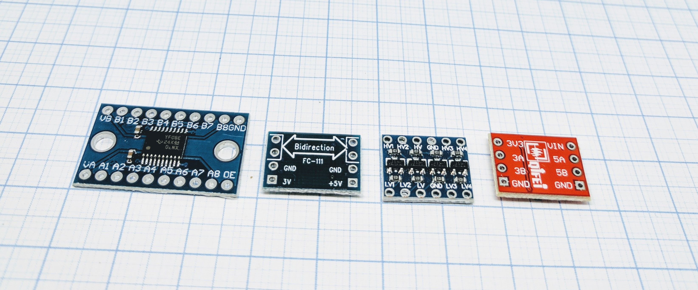
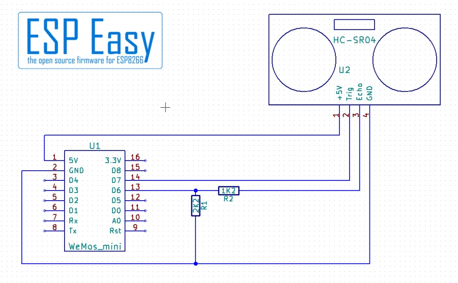
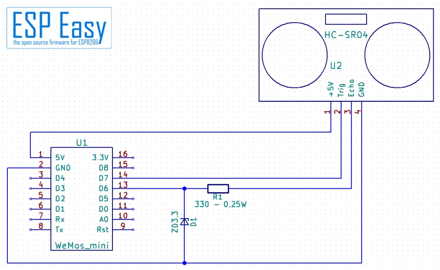
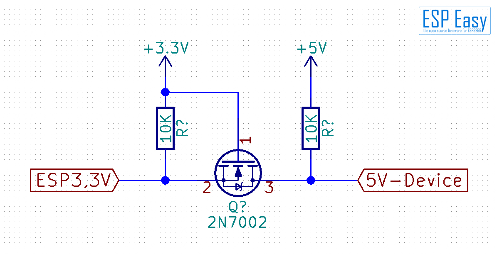
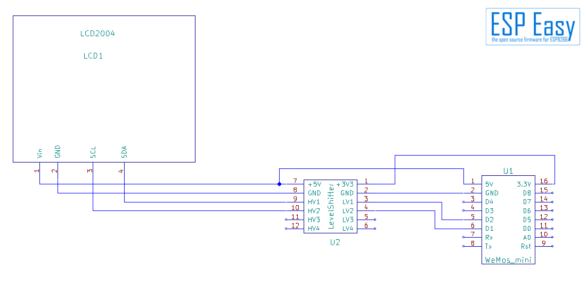

.. include:: ../Plugin/_plugin_substitutions_p00x.repl
.. _P000_Level_converter_page:

Level converter
===============

Introduction
------------

Level-converters, aka level-shifters, aka voltage dividers, are used to adapt between a 3.3V device like the ESP8266 and devices using 5V or more internally.
The ESP8266 runs with 3.3V - many devices need 5V or more, for example a LCD display or a Wiegand card reader. It is said that the ESP8266 can
take 5V at its inputs. Basically this is correct and confirmand by Espressif, the manufacturer. Anyways this as always has some limitations.

**First**, overcurrent. If you use a GPIO as input and the output of the connected device has 5V it should work. But if the internal resistance
of the device is low the current might exceed the limits of the ESP8266. With some specific settings of the ESP8266 the GPIO can not take 5V,
who checks every plugin or never made a setting mistake? So for making sure no GPIO is blown accidentally or by a bug some measurements should be taken.

**Second**, some devices need higher voltage if GPIO used as output. For example the PCF8574 or the MCP23017, port multiplexer. This chips use
3.3V or 5V as you choose. For some purpose higher voltage is useful. If using 5V there is a point you have to take care for:

The High and Low levels depend on the voltage!

With the PCF8574 the minimum "High" level Vih = 0.7 × Vdd, with 5V as Vdd it is 3.5V. With the MCP23017 the Vih = 0.8 × Vdd, with 5V as Vdd it is 4V.
(Vdd is the supplied voltage) So with 3.3V max from the ESP we are too low. It might work, it might fail. Worse, it might work with one chip
and fail with another one due to tolerances. In this case a level-converter is needed.

Specifications:
 * Level shifter, aka logic converter. Used to turn logics of higher voltage (5V) down to ESP friendly voltage (3.3V).

.. note::
   **Troubleshooting**:
   If your level converter does not work, please check cabling first. As said cabling mistakes and slack joints with the usual cheap breadboard cables are the most likely reason.
   If you use breakout board type level converters have a second one at hand. We've seen some "dead on arrival", other died by electrostatic discharge.
   And again, breadboards are somewhat unreliable. Use a digital multi-meter to check contacts and wires.

Wiring
------

.. warning::
   Be careful with wiring. A wrong connection from 5V to the 3.3V rail can cause damages of the ESP and/or the power supply.
   A direct connection by mistake from 5V to a GPIO may fry your ESP! Handle level-shifters with some care.
   The used FET transistors are somewhat sensible against electrostatic discharge. Use a anti-static mat.

.. code-block:: html

  ESP                 Level converter             Connected hardware
  GPIO (X)     <-->   3A, LV1, A1 etc.     <-->   5A, HV1, B2 etc.
  GPIO (Y)     <-->   3B, LV2, A2 etc.     <-->   5B, HV2, B2 etc.

  Power
  3.3V         <-->   3V3, LV, VA, 3V etc.
  5.0V         <-->   VIN, HV, VB, +5V etc.
  GND          <-->   GND

Different ways of level converting
----------------------------------

Other than using a level converter it is possible to do it "manually" through resistors.

Just Input - simple unidirectional
~~~~~~~~~~~~~~~~~~~~~~~~~~~~~~~~~~

As an example we will use a HC-SR04 ultrasonic distance metering module. The HC-SR04 needs 5V, it will not work with 3.3V.
It works like bat ears, sending ultrasonic pulses and waiting for the echo. It has an input "Trigger" for sending ultrasonic pulses and an output "Echo" for the received signals.
The "trigger" input is no problem as it can take 3.3V for "High". Just connect it to the desired GPIO. But the "Echo" pin sends back 5V signals!
As this signaling is working just in one direction ("unidirectional") from the HC-SR04 to the ESP8266, a simple voltage divider does the job. Look at the schematic:

Note the two resistors R1 and R2, configured as a voltage divider. The divider gives 2.2/(1.2+2.2) = 0.65 so with 5V you get 5V × 0.65 = 3.25V at the GPIO pin.

Just Input - precise unidirectional
~~~~~~~~~~~~~~~~~~~~~~~~~~~~~~~~~~~

The simple circuit with two resistors has one disadvantage. It is calculated for 5V. For other voltages you have to calculate another pair of resistor values. And worse,
spikes, short spikes of high voltage from unstable power supply or other reasons) pass through the divider. A better and more precise way is using a Zener diode.
A Zener diode simplified is a semiconductor that gets conductive at a specific voltage.

Here a Zener diode is used as voltage limiter. The resistor must not be omitted, it is necessary to limit the current. If a 5V signal comes the diode gets conductive - it would
short circuit the device output without the resistor. This circuit is dimensioned for input voltages from 5V to 9V (resistor should have 0.25W!). It can be used nicely for Wiegand
card readers for example. You may use even higher voltages, for example if you want to check a 24V pump. You need an adapted resistor value for that.

Input and Output - Bidirectional Level Converter
~~~~~~~~~~~~~~~~~~~~~~~~~~~~~~~~~~~~~~~~~~~~~~~~

For devices that use one wire for input and output ("bidirectional") or devices that need higher voltage on an input an active level converter is necessary.
This applies mainly to I²C devices as SCL (the clock signal) comes with 3.3V from the ESP and the SDA (data signal) goes in both directions. There are
specialized chips for this purpose. Most of them have 8 channels - bit of an overkill for an ESP. There is a much simpler way you can buy as a cheap
breakout board or solder together yourself.

A little FET and two resistors do the job. This is the circuit most level shifters you can buy at the market use.

How does it work? Lets have a simplified look in a nutshell. A FET gets conductive if the voltage at the gate (pin 1) is higher then the voltage at
the source (pin 2). So if the ESP gives 3.3V (High), gate and source have same voltage - the FET isolates both sides (pin 2 & 3) from each other.
If the ESP goes to 0.3V (Low), the gate still has 3.3V - now the FET gets conductive pulling the 5V-side down. If the 5V-side goes to zero (low)
because your device sends data, the diode inside the FET gets conductive and pulls the 3.3V side down to nearly zero (Low).

Use of a dedicated level converter
~~~~~~~~~~~~~~~~~~~~~~~~~~~~~~~~~~

Quite an easy job. The pins on a level shifter are usually divided in a LV (Low Voltage) and a HV (High Voltage) side. Sometimes it is just called 3V and 5V.
Connect the 3V pin to 3.3V from ESP and the 5V pin to 5V from your device, for example a LCD display. Don't forget ground, some breakouts have some additional
capacitors which need it. Then connect the GPIOs from the ESP to the LV side, the equivalent pins from your 5V device to the HV side. That's all.

Where to buy
------------

.. csv-table::
  :header: "Store", "Link"
  :widths: 5, 40

  "AliExpress","`Link 1 ($) <http://s.click.aliexpress.com/e/c5dMH05S>`_"

|affiliate|

.. More pictures
.. -------------
