.. include:: ../Plugin/_plugin_substitutions_p00x.repl
.. _P000_Relay_page:

Relay
=====

|P000_typename|
|P000_status|

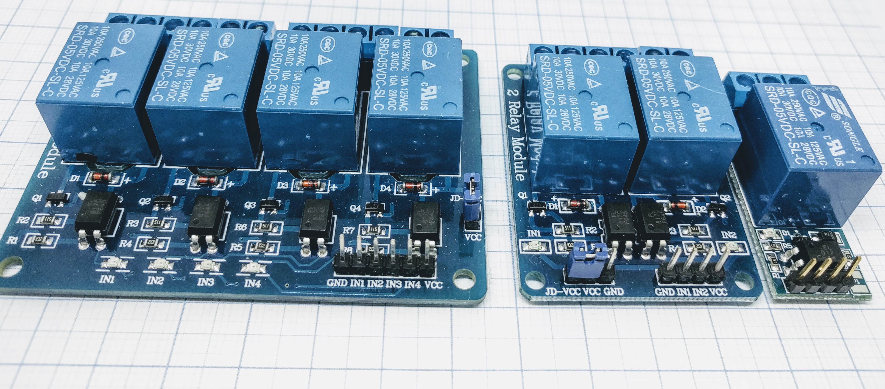

Introduction
------------

The ESP8266 can't switch high currents or voltages and no AC at all. But it can switch a relay that can switch high load, isolating high
voltage from the ESP circuit. There are several relay types in the wild.

The ESP can control a relay using one of it's GPIO pins. All relay boards that work with Arduino should also work with the ESP module.
Note this is only a possible application of the ESPs ability to send a logic 1/0 (TTL at 3.3V) on a GPIO. These relay are usually available
as 1,2,4,8,16 Relay modules and work electromagnetically. They can switch both AC/DC(or imitate a button press of a remote for example)
as they are "power operated mechanical switches". Each relay has the screw terminal. The middle one is usually "always connected" terminal.
The NC contact will be connected to the middle terminal when the relay is not powered. The NO is connected when the relay is powered
and activated. Note that there are "active high" and "active low" versions of these relays.

There are mainly two relay types in the wild: The good old mechanical relay with the nice "click-clack" sound and the electronic relays, so called
"Solid State Relays" (SSR) which are completely silent.

Specifications:
 * Opto coupler (mechanical)
 * Solid state (SSR)

Relays are the most used actuators in home automation. Most people use breakout boards with a relay on it. Sadly there is no "standard" relay board.
It seems every small manufacturing garage in china has it's own layout and schematic. Some use 5V, some use 12V, some do with opto couplers, some without...
the perfect chaos. Several problems result from this chaos. Relays keeping switched on no mater what your ESP says. Relays not switching at all.
And last but not least - sometimes they work. Let's get some order into that chaos.

.. note::
   You have just got your brand new relay board and it does not work. What to do?
   At first you should check the switching level. Is it switching on with "high" or with "low"?

   * Connect the board to power only (5V or 12V usually).
   * Plug a jumper cable to one of the inputs.
   * With the other end of the cable touch GND and +Vcc (5V or 12V).

   On one of these touches the relay should switch. If it switches when connecting to GND the board uses "low" as active (relay on) signal.
   In this case diodes or a transistor / FET as described above might help.

   Connect the board to the ESP carefully. Check voltages, the power supply should be able to deliver enough current for the relays!
   Check the connection cables. Jumper cables are well known for slack joints.

Mechanical relay
----------------

The mechanical relay is a simple construction.
It consist of a coil, one or more contacts and a spring. The spring keeps the contact in the "open" position. If the coil gets current, the magnetic
field pulls the contact into the second position, the contact closes. As soon as the current is switched off the spring pulls the contact back.
Mechanical relays may just have one contact switching to closed if the coil works (Normally open or NO). The contact might be a changeover contact which
has a "common" connector and a NO (open without coil current, "normally open") and a NC (closed without coil current, "normally closed") connection.
There might even be several contacts in one relay.

There are several special types of mechanical relay
~~~~~~~~~~~~~~~~~~~~~~~~~~~~~~~~~~~~~~~~~~~~~~~~~~~

Latching relay:

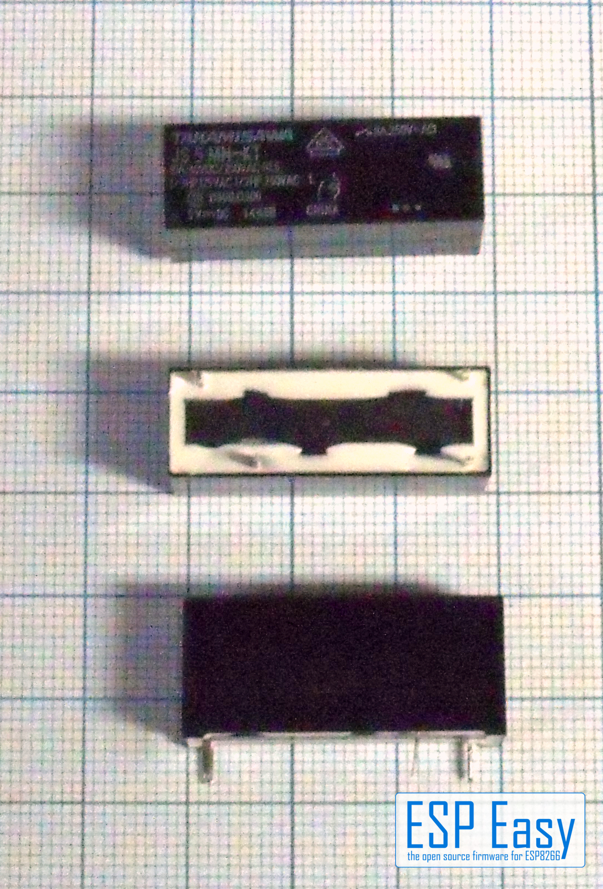

One current pulse switches on and keeps on when current goes off, a second pulse switches off.

Polarized relay:

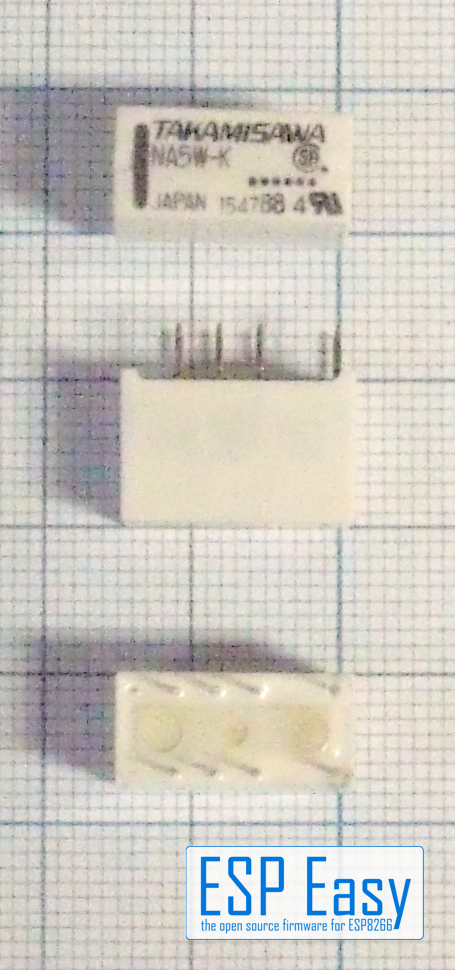

These relays have a defined + and - pin for the coil that must be followed.

.. warning:: These micro relays can not switch mains voltage! Use them for low voltage door openers or similar.

Pros and cons of mechanical relays
^^^^^^^^^^^^^^^^^^^^^^^^^^^^^^^^^^

:green:`+` Several contacts in one relay available.

:green:`+` NO/NC available.

:green:`+` Limited resistance to overload and overvoltage.

:red:`-` Noisy, might disturb in a living room or bedroom.

:red:`-` Mechanical, moving parts that might wear out over time.

:red:`-` Contact bumping when switching.

:red:`-` High current for the coil, needs a transistor or FET for driving and generates peaks on power supply.

:red:`-` The coil induces high voltage when switching off.

Solid state relay
-----------------

The solid state relay, SSR for short, is a complex electronic circuit. It uses an opto coupler for input, this isolating the driving circuit from the load voltage.
Isolation voltage is usually 2000V, 4000V or more. The switching element usually is a triac for AC switching types. For DC there are types with a MOSFET as switching element.

There are several special types of SSR relay
~~~~~~~~~~~~~~~~~~~~~~~~~~~~~~~~~~~~~~~~~~~~

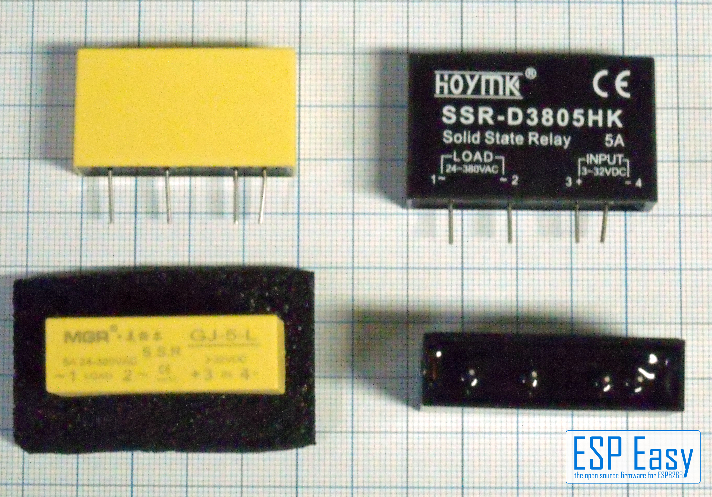

As with the mechanical relays there are specialized types of SSR's.

**AC Type** : Can only (!!) switch AC. AC with zero crossing circuit. This type switches on and off if the AC voltage is at the zero point. **Expensive** and necessary only for special applications.

**DC Type** : Can only (!!) switch DC! And a lot more that are reserved for special cases.

Pros and cons of SSR relays
^^^^^^^^^^^^^^^^^^^^^^^^^^^

:green:`+` Completely noiseless

:green:`+` Low driving current and voltage available. Some types can be driven directly from the ESP.

:green:`+` No mechanical parts, no wearing out.

:green:`+` No contact bumping.

:green:`+` No voltage peaks on the low voltage side.

:green:`+` Available for very high current for an affordable price.

:red:`-` Very sensitive to overvoltage and overcurrent.

:red:`-` No NC available usually.

:red:`-` Usually with only one or sometimes three "normally open" circuits.

:red:`-` Needs cooling! Smaller relays up to 5A must be mounted with at least 1cm distance to other parts.

:red:`-` Bigger relays usually need a heat sink. Watch out: Heat sink may carry mains voltage with some types!

:red:`-` Leak current! These relays leak some current even if switched off.

Leak currents
~~~~~~~~~~~~~

Leak Current from SSR's might lead into problems under certain circumstances.
The both types shown above ("Hoymk D3805KH" and "Mager GJ-6-L", 5A AC) were tested here.
The Mager GJ-5-L showed a low leaking current and is useable for most purposes.
The D3805HK showed a really high leaking current, enough for a 10W LED to glow and a small solenoid valve to keep open!
This is not recommended for normal use.

Meanwhile a third sample arrived: The SSR-D32A380/5 sold by Pollin.
Similar to the D3805HK it shows a leaking current, as the test LED is slightly glowing in the dark when off.
It seems to be a lower leaking then with the D3805HK, this is subject to some further investigation.
The advantage of the Pollin SSR: It contains a small LED on the top indicating if the relay is on.
This SSR is a bit bigger then the other two types tested, it just fits the case. So holes for the LEDs
can be drilled on the top side of the case.

.. danger::
   Always remember that a switched-off SSR is not completely switched off!
   Even a small leaking current is enough to give a shock. Nice surprise if you're on the ladder changing bulbs....

Choosing your relay
~~~~~~~~~~~~~~~~~~~

Which relay should be used?

Well, this depends on what you want to switch. If you control a heavy motor or pump, I'd always prefer a mechanical relay.
The resistance against short overcurrent is a good point here.
For experimenting we prefer mechanical relays too - we just love the "click" sound, i.e. we don't have to connect a load to see if it works.
If noise counts or if you place the relay in a dusty or humid environment a SSR is the better choice. It's completely encapsulated so dust
and humidity can't damage it. As it has no mechanical parts it is completely noise-free. So it's the perfect choice to switch lighting in a living room or sleeping room.
Of course you have to chose a relay that fits your parameters.

Which voltage you want to switch? AC or DC? Which current?

If you want to use a SSR for high current you have to calculate the space for a heat sink and you have to use a vented case. All these parameters
have to be figured into your project. It is also possible to use a small SSR to drive a really heavy external relay for a heavy machine for example.

Wiring
------

.. code-block:: html

  ESP               Relay (board)
  GPIO (X)   <-->   IN1
  GPIO (Y)   <-->   IN2

  Power
  5.0V       <-->   VCC
  GND        <-->   GND

Setup
-----

No device is needed, generally you use rules to activate relays, or you send commands to activate them. Below you
find more information on how to do this.

.. note::
  If you want to monitor and have the GPIO state published you do this by adding as a |P001_typename| ,
  it will not be a switch per say but you will get the state published automatically.

Rules examples
--------------

.. code-block:: html

    On Switch#State Do
     if [Switch#State]=1
      GPIO,12,1
     else
      GPIO,12,0
     endif
    EndOn

This rule will turn the relay ON when the button is pressed, and OFF when released.

Indicators (recommended settings)
---------------------------------

No device is needed.

Commands
--------

.. include:: P001_commands_GPIO.repl

How to connect your relay
-------------------------

You can connect the relay in multiple ways, we explain them all below.

Basic ESP circuit: mechanical relays
~~~~~~~~~~~~~~~~~~~~~~~~~~~~~~~~~~~~

The basic circuit is simple.
As the relay usually consumes more current as the ESP can handle it needs a transistor or FET to drive the relay.
To suppress the voltage peak when switching off the coil a free-wheeling diode is needed. This can be a standard silicium diode, a 1N4148 for example.

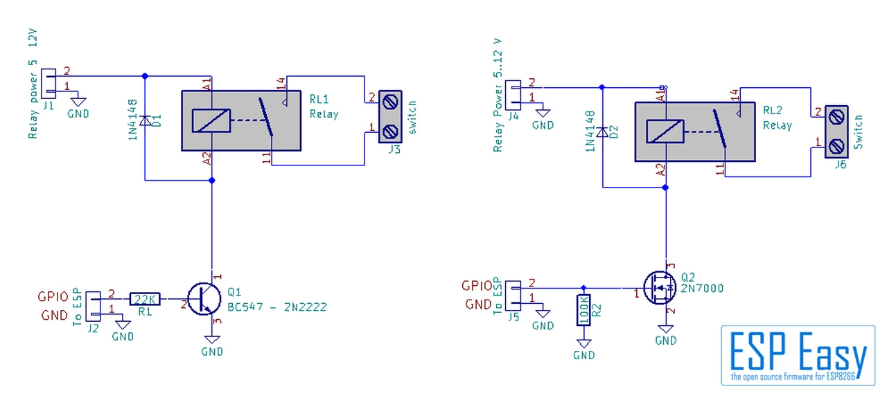

Well, there is another way to switch the relay. In the above example we used a NPN transistor or a N-channel FET. A PNP transistor or P-Channel FET can be used too.
Some board manufacturers do this and now we run into problems promptly. The relays usually need some higher voltage then the ESP, 5V or 12 V in most cases.
The PNP transistor in the example is connected to +5V. It will switch the relay to "on" if the voltage at the input is at least 0.7V below the Vcc of 5V.
The ESP delivers a maximum of 3.3V if the GPIO is "high", around 0.5V if it is "low". Both voltages are far below the 5V-0.7V = 4.3V threshhold of the relay board.
The relay is permanently on, no matter what your ESP says. We can get this to work in a simple way with a 5V relay board. A standard diode has a loss of around 0.7V.
We can use this to get a higher output level from the ESP. We simply use two diodes in the connection between relay board and ESP. This raises the voltage from the
ESP up to 3.3v + 1.4V = 4.7V. This is above the threshhold of 4.3V. If the board uses a FET it might be necessary to use three diodes. That usually will work.
On top: This circuit switches the relay off if the GPIO is "high", this leading to irritations sometimes.
The picture shows the basic circuit with a PNP transistor, and the " 2 Diodes " solution:

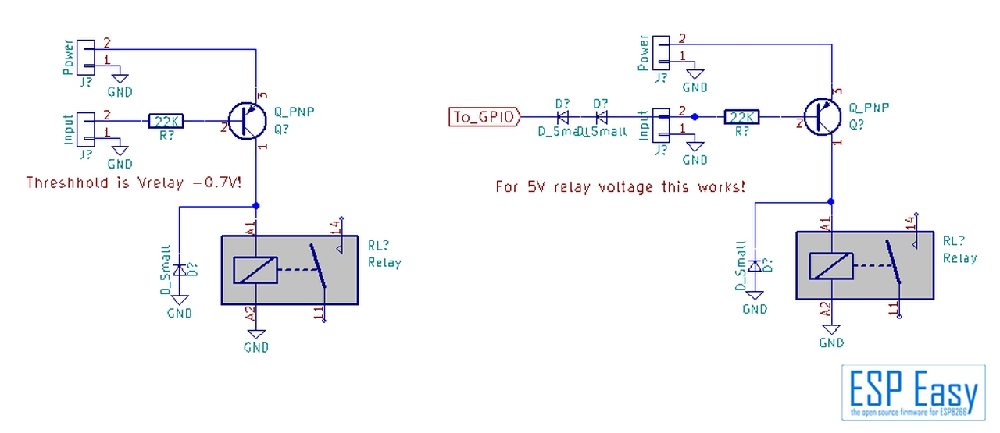

More complex: using an opto coupler
~~~~~~~~~~~~~~~~~~~~~~~~~~~~~~~~~~~

Many widespread relay boards use opto couplers. Honestly we don't know the reason besides it looks good in advertising.
In theory the opto coupler isolates the relay coil from the ESP circuit. Well, that's nice theory. In real world we use the same power supply for relays and ESP.
This bridges the opto coupler as the circuits are connected via power supply making the opto coupler completely useless. Anyways the relay isolates the load from
the ESP anyways. It might be useful only if relay switching interferes with the ESP. In this case you might try a separate power supply for relay coils.
This isolates the ESP completely from the coil circuits. Note that a jumper has to be set for that on some boards.
Again there are two possible ways to use this circuit. The opto coupler input has one pin to the ESP and one to ground - this works without any problem but it is not widespread.

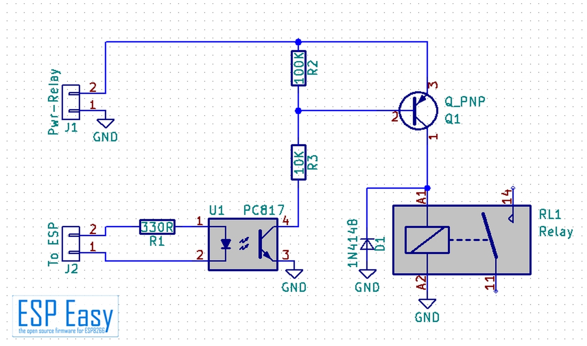

Most boards we've seen connect the opto coupler to 5V or 12V and the other input pin to the ESP.

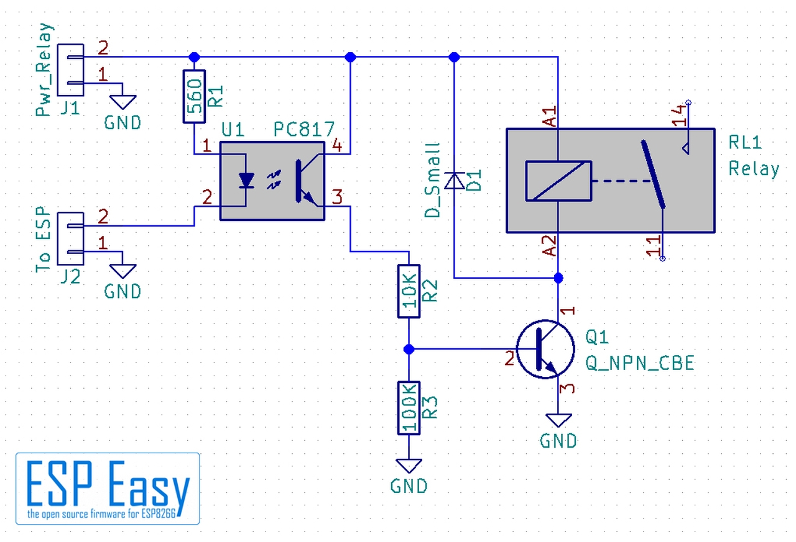

This runs into same issues as with the PNP transistor above. The high voltage of 3.3V from ESP is far below 5V, this keeping the relay permanently active.
The solution is same as with the transistor board above. Use some diodes between ESP and relay board usually does the job with relay boards using 5V.
Depending on the circuit you will have to experiment how many diodes are necessary.

Boards with 12V
~~~~~~~~~~~~~~~

If your relay board uses 12V and needs "Low" to switch the relay on it gets somewhat more complex. Basically it is possible to use a lot of diodes but
it's not very handy. You may try a Zener diode of around 8.5.. 8.7 V. Honestly we don't recommend it. In this case it is better to use an additional
transistor or FET to get it to work. This has one advantage: It inverts the switching signal so a "low" output says the relay is off.

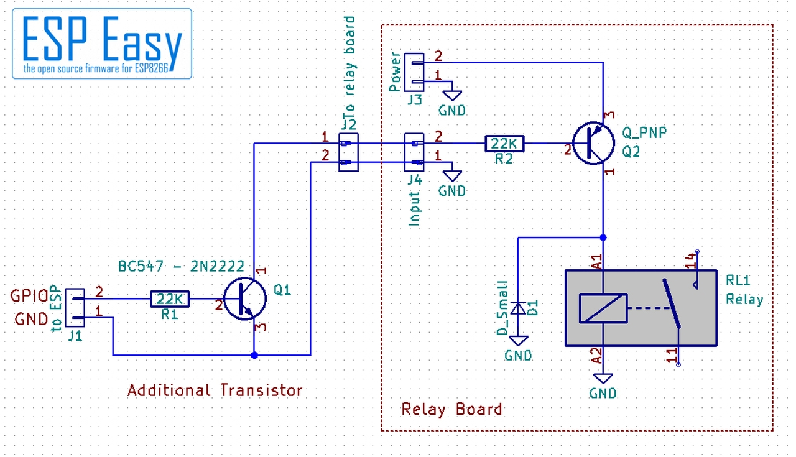

Special designed boards
~~~~~~~~~~~~~~~~~~~~~~~

There are some boards in the wild which can be configured if "low" or "high" should switch the relay on.
With this boards you will have to experiment a bit with your ESP and the board, there should be a combination that works.

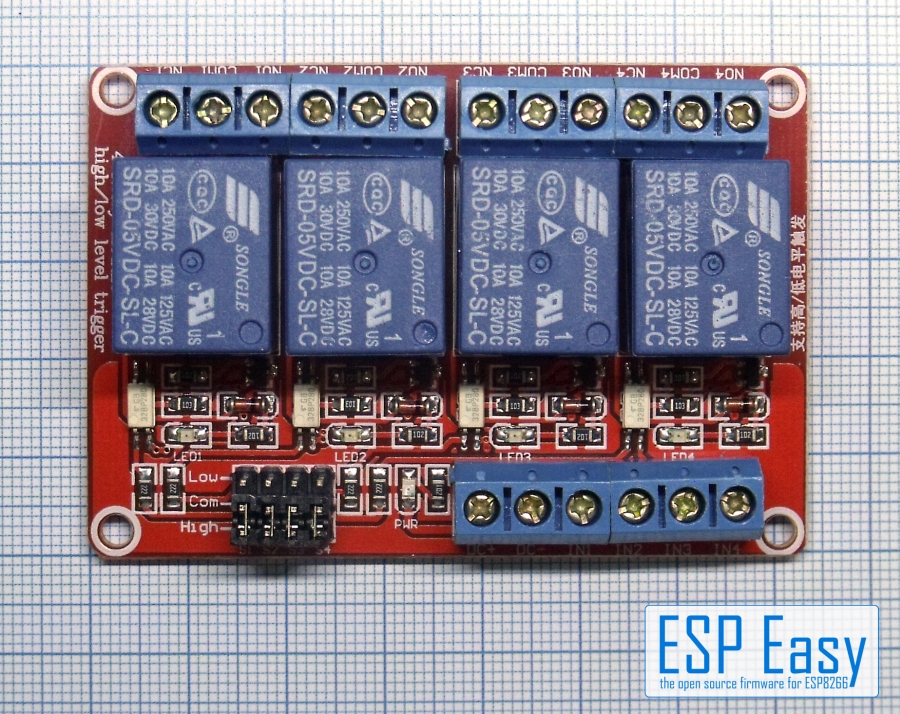

Note the jumpers down left - that's the configuration for switching on high or low level.

Basic ESP circuit: SSR
~~~~~~~~~~~~~~~~~~~~~~

This is more simple. If you got a SSR that has an input of "3...12V" or "3...30V" it usually can be driven directly from the ESP.
The only thing you should keep in mind: Do not omit the varistor (RVx in the schematics). It protects the SSR from voltage peaks that
may kill it within some milliseconds. Instead of the varistor a TVS diode can be used, for example a P6K400CA.
Be careful, you have to use a bidirectional type!

.. image:: P000_Relay_11.jpg

It is possible to direct drive a SSR from the ESP but we won't recommend this. We prefer the same circuit as with the mechanical relay.
It makes the relay circuit more universal and reduces load on the ESP.

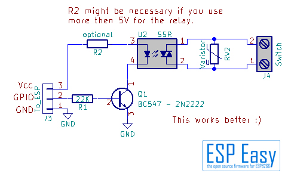

Instead of the 2N2222/BC547 you may use a small FET, a BSS138 or 2N7000 / 7002. Omit the 22K resistor if useing a FET.
R2 is needed if your relay can't take the Vcc directly. If you use a "3...30V" input SSR it's not necessary.

Any opto coupler is completely needless if you use a SSR. The SSR has an opto coupler built in to isolate the load from the ESP.
At this time there are not that much relay boards with SSR in the market, this will change over time as they get more popular.
From what is on the market be careful what you buy. Most boards we've seen nowadays on AliExpress and Ebay have a DC relay installed - they can switch DC only! They can't switch mains voltage.

Some words about DIY relay boards
---------------------------------
All in all it's no problem to build your own relay board fitting your needs exactly. But watch out if you want to switch
mains voltage. There is a reason why in some countries the policies specify a minimum distance between the parts with high
voltage and the low voltage circuits. Do not use experimental PCB's with copper pads or stripes!
Good breakout boards are milled out, there is a gap in the PCB for isolating mains from low voltage.
Prefer these boards over others without milling.

.. danger::
   Be very careful - mains voltage can burn your home or kill you. In case of doubt ask an expert!

Where to buy
------------

.. csv-table::
  :header: "Store", "Link"
  :widths: 5, 40

  "AliExpress","`Link 1 ($) <http://s.click.aliexpress.com/e/cM59HXVq>`_ `Link 2 ($) <http://s.click.aliexpress.com/e/cerop6s0>`_"

|affiliate|

.. More pictures
.. -------------
