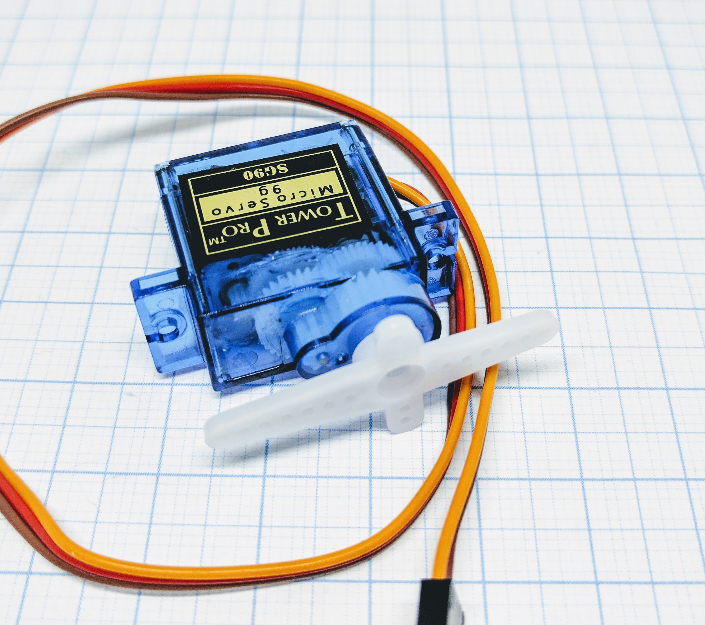

.. include:: ../Plugin/_plugin_substitutions_p00x.repl
.. _P000_Servo_motor_page:

Servo motor
===========

|P000_typename|
|P000_status|

Introduction
------------

Usual servos can turn about 180° (90° in both directions from zero point).
There are some rare servos with 270° turn. If you use a 180° type you may turn it 90° to the left or to the right.

.. danger::
   Trying to turn a servo more then what it can handle will run the servo against a stopper inside the gear.
   As ESP Easy tries to go further the servo starts humming and gets hot, it will die over time.

The third type "continuous turn servo" is not supported at this time.

Specifications:
 * Controlling servo motors using PWM

Wiring
------

.. code-block:: html

  ESP               Servo
  GPIO (X)   <-->   S (signal)

  Power
  5.0V       <-->   VCC
  GND        <-->   GND

Setup
-----

No device is needed, generally you use rules to activate servos, or you send commands to activate them. Below you
find more information on how to do this.

Rules examples
--------------

.. code-block:: html

  On Switch#State Do
   if [Switch#State]=1
    Servo,12,1,-45
    Servo,14,2,45
   else
    Servo,12,1,0
    Servo,14,2,0
   endif
  EndOn

This rule will tilt the servos 45° when the button is pressed, and it'll go back to 0 once released.

Indicators (recommended settings)
---------------------------------

No device is needed.

Commands
--------

.. include:: P001_commands_GPIO.repl

Where to buy
------------

.. csv-table::
  :header: "Store", "Link"
  :widths: 5, 40

  "AliExpress","`Link 1 ($) <http://s.click.aliexpress.com/e/c5RaXUgu>`_"

|affiliate|

.. More pictures
.. -------------
