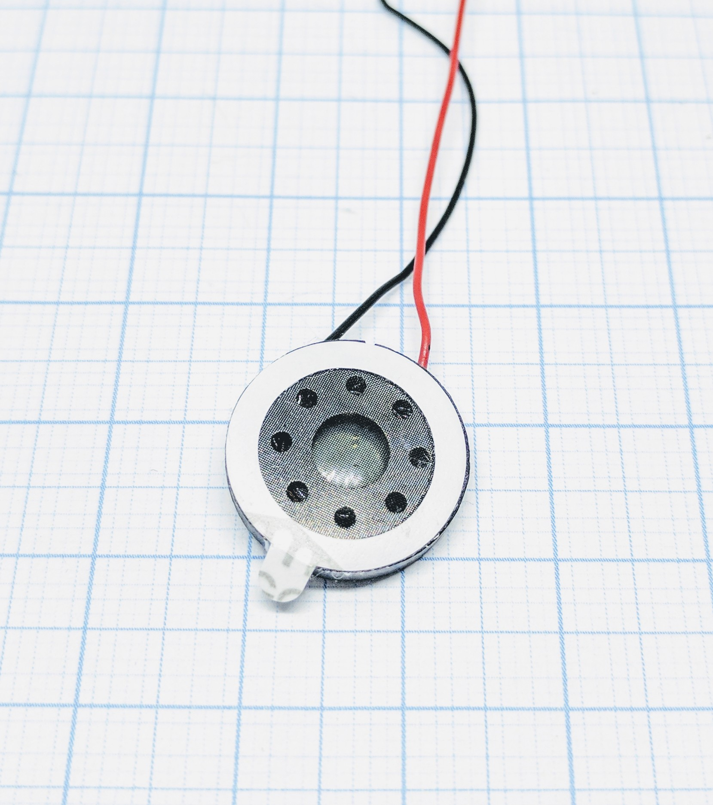

.. include:: ../Plugin/_plugin_substitutions_p00x.repl
.. _P000_Speaker_page:

Speaker
=======

|P000_typename|
|P000_status|

Introduction
------------

RTTTL (Ring Tone [Text] Transfer Language) was developed by Nokia to play more "easy on the ear" melodies as ringtones for mobile phones. The tunes over all characteristics are created by using three different commands:

**d** - duration

**o** - octave

**b** - tempo (beat)

After that the actual tune is then created using standard notes (a, b, c, d, e, f, and g), before the note the duration is set, after the note the octave is set:

.. code-block:: html

   <duration><note><octave>

To compose a jingle you separate the notes with a comma.

Specifications:
 * Output sound

Wiring
------

.. code-block:: html

  ESP              Speaker
  GPIO     <-->    Positive (red)
  GND      <-->    Negative (black)

Setup
-----

No device is needed, generally you use rules to activate different notifications, or you send commands to activate them. Below you find more information on how to do this.

Rules examples
--------------

From ESP Easy v2.0.0 its possible to play melodies via `RTTTL <https://en.wikipedia.org/wiki/Ring_Tone_Transfer_Language#Technical_specification>`_ (don't forget to remove the spaces and replace # with -, this might be fixed in future releases):

.. code-block:: html

   http://<ESP IP address>/control?cmd=rtttl,14:d=4,o=5,b=112:8a,8a,a,8a,8a,a,8a,8c6,8f.,16g,2a,8a-,8a-,8a-.,16a-,8a-,8a,8a.,16a,8a,8g,8g,8a,g,c6

This plays a melody on pin 14.

You can also use these from rules. We use it to let our alarm system give feedback to the user via a piezo speaker.

To make a boot-sound on startup, create a rule like this:

.. code-block:: html

   On System#Boot do
     rtttl,14:d=10,o=6,b=180,c,e,g
   endon

`A place to find more tunes <http://www.picaxe.com/RTTTL-Ringtones-for-Tune-Command/>`_, all saved as txt files.

Besides RTTTL it's also possible to play a single tone on a pin, via a buzzer, speaker or piezo element:

.. code-block:: html

   http://<ESP IP address>/control?cmd=tone,14,1300,200

Plays a 1300 Hz tone for 200 ms on GPIO-14.

Indicators (recommended settings)
---------------------------------

No device is needed.

Commands
--------

.. include:: P001_commands_RTTTL.repl

Where to buy
------------

.. csv-table::
  :header: "Store", "Link"
  :widths: 5, 40

  "AliExpress","`Link 1 ($) <http://s.click.aliexpress.com/e/cPcaaQXI>`_"

|affiliate|

.. More pictures
.. -------------
