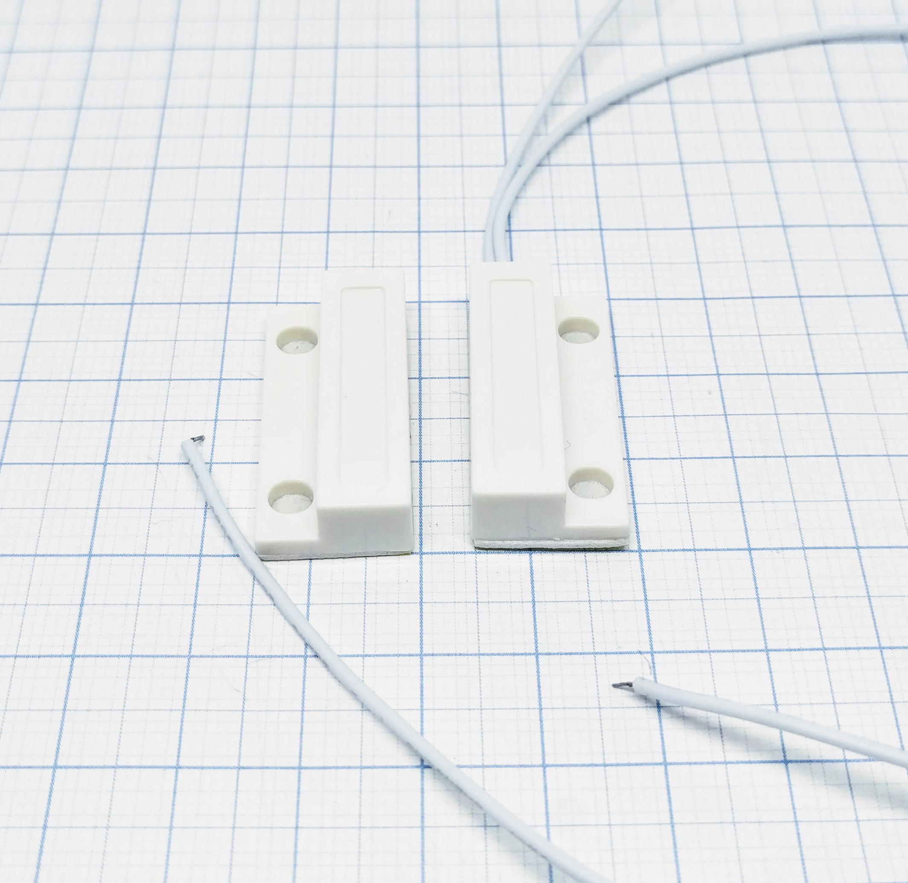
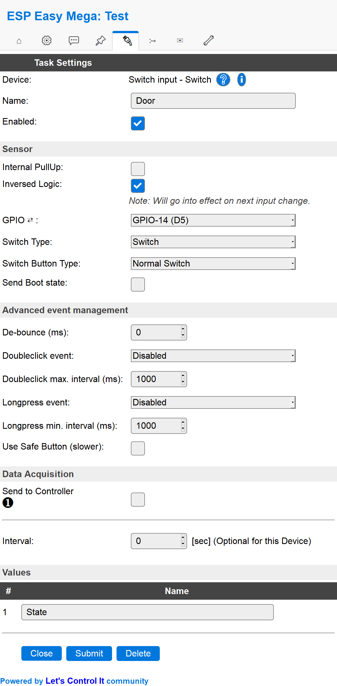

.. include:: ../Plugin/_plugin_substitutions_p00x.repl
.. _P001_Door_switch_page:

Door switch
===========

|P001_typename|
|P001_status|

Introduction
------------

Any door switch module can be used as an digital input. Most none contact door switches use a technology called
reed switch. By using a magnet (the part with no wires) the reed inside the other part (with wires) will connect
the two parts of the reed and making a signal go low or high depending on how you have connected the switch.
You may use it by simply connect it to either a GPIO that is normally high (pull-up) or normally low (pull-down).

Specifications:
 * Give a high or low signal to a GPIO
 * Power needed: 3.3V (typically)
 * Output voltage: same as input (typically)

Wiring
------

.. code-block:: html

  ESP               Door switch
  GPIO (X)   <-->   Signal

  Power
  3.3V       <-->   Signal
              or
  GND        <-->   Signal

Setup
-----

Task settings
~~~~~~~~~~~~~

* **Device**: Name of plugin
* **Name**: Name of the task (example name **Door**)
* **Enable**: Should the task be enabled or not

Sensor
^^^^^^

* **Internal pull-up**: Check if you want to use the internal pull-up of the ESP (not all GPIO pins have this internal pull-up.)
* **Inverse logic**: Sometimes you may want the physical high value to be published as a low value. For example if the button is
  triggering a high (1) value when you push it you maybe use it to turn of a LED so the :code:`Switch#State` would then logically be
  preferred to be set as 0 and thus used as a variable for controlling that LED. See rules example below.

* **GPIO**: Which GPIO should be used, recommended to not use a latching switch that may set the ESP into flash mode if left
  to high/low.

* **Switch type**: Set the switch type to either "Switch" or "Dimmer". Door (reed) switch is a "Switch".

  * Switch: The default way of handling a switch is by a on/off button. It's either on (:code:`1`) or off (:code:`0`).

  * Dimmer: Not used by door (reed) switches, if you still want to use it you can have a look at the
    :ref:`P001_Switch_page` page.

* **Switch button type**: Set the type of switch, "Normal switch", "Push button active low", or "Push button active high".
  * Normal switch: This is the general setting to use for a PIR switch.

  * Push button active low: Not used by door (reed) switches (in general), if you still want to use it you can have a look at the
    :ref:`P001_Switch_page` page.

* **Send boot state**: If checked the unit will publish the switch state when booting. If not checked you may find yourself
  with a latching switch caught in limbo. This means that the unit is registering a low/high value but the physical state of
  the switch might be the opposite. If you use a mechanical switch that may be physically set to a state you should check this
  option.

Advanced event management
^^^^^^^^^^^^^^^^^^^^^^^^^

* **De-bounce (ms)**: How long should the pulse (the time you press the button) be, if set to high you need to have it published
  for a longer time before the unit will register it as an state change. You could experiment with this setting to find a good
  behavior of the button if you feel that it's not responding according to your preferences.

* **Double click event**: Not used by door (reed) switches (in general), if you still want to use it you can have a look at the
  :ref:`P001_Switch_page` page.

* **Double click max interval (ms)**: Same as above..
* **Long press event**: Same as above..
* **Long press min interval (ms)**: Same as above..
* **Use safe button (slower)**: Same as above..

Data acquisition
^^^^^^^^^^^^^^^^

* **Send to controller** 1..3: Check which controller (if any) you want to publish to. All or no controller can be used.
* **Interval**: How often should the task publish its value (optional for switch plugins).

Indicators/values (recommended settings)
^^^^^^^^^^^^^^^^^^^^^^^^^^^^^^^^^^^^^^^^

.. csv-table::
  :header: "Indicator", "Value Name", "Interval", "Decimals", "Extra information"
  :widths: 8, 5, 5, 5, 40

  "State", "State", "0", "N/A", "Usually you just want the state being published when door is actually being opened/closed. If you want a continuous publishing of the state you may use the interval setting to do so."

Rules examples
--------------

.. code-block:: html

    on Door#State=1 do
      timerSet,1,1
    endon

    on rules#timer=1 do
     if [Door#State]=0
      //Action if door is closed
     else
      //Action if door is opened
     endif
    endon

.. Commands available
.. ~~~~~~~~~~~~~~~~~~

.. .. include:: P001_commands.repl

Where to buy
------------

.. csv-table::
  :header: "Type", "Link"
  :widths: 5, 40

  "Door switch","`AliExpress 1 ($) <http://s.click.aliexpress.com/e/ccCdXCVi>`_ `Banggood 1 ($) <https://www.banggood.com/search/reed-door.html?p=V3270422659778201806&custlinkid=76099>`_ `eBay 1 ($) <http://rover.ebay.com/rover/1/711-53200-19255-0/1?ff3=4&pub=5575404073&toolid=10001&campid=5338336929&customid=&mpre=https%3A%2F%2Fwww.ebay.com%2Fsch%2Fi.html%3F_odkw%3Ddoor%2Bswitch%26_osacat%3D0%26_from%3DR40%26_trksid%3Dm570.l1313%26_nkw%3Dreed%2Bdoor%26_sacat%3D0>`_"
  "Reed switch","`AliExpress 2 ($) <http://s.click.aliexpress.com/e/0gMmOoY>`_ `Banggood 2 ($) <https://www.banggood.com/search/reed-switch.html?p=V3270422659778201806&custlinkid=76096>`_ `eBay 2 ($) <http://rover.ebay.com/rover/1/711-53200-19255-0/1?ff3=4&pub=5575404073&toolid=10001&campid=5338336929&customid=&mpre=https%3A%2F%2Fwww.ebay.com%2Fsch%2Fi.html%3F_odkw%3Dreed%2Bdoor%26_osacat%3D0%26_from%3DR40%26_trksid%3Dm570.l1313%26_nkw%3Dreed%2Bswitch%26_sacat%3D0>`_"

|affiliate|

.. More pictures
.. -------------
