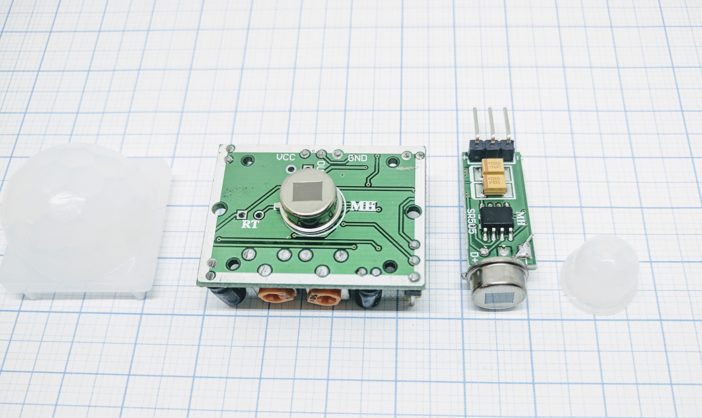
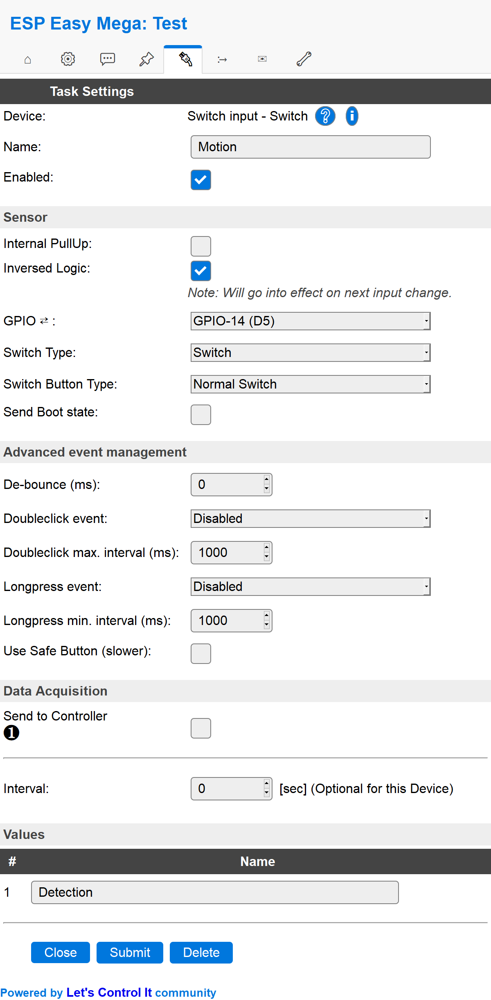

.. include:: ../Plugin/_plugin_substitutions_p00x.repl
.. _P001_PIR_sensor_page:

PIR sensor
==========

|P001_typename|
|P001_status|

Introduction
------------

A big difference from the regular tactile buttons and a PIR is that a PIR will output a high or low Signal
without someone actually pushing a physical button. The PIR uses a pyro detector which will detect change
in radiated heat. A person or an animal is always radiating some level of heat and when someone enters
the vision of the PIR the amount of heat will change and the PIR will trigger a signal.

Specifications:
 * Motion (change in heat)
 * Power needed: 5V (typically)
 * Output voltage: 3.3V (typically)

.. note::
   Some PIR sensor boards have a jumper which will allow you to have the unit send a single pulse when
   the motion is detected or send a single repeatedly as long as motion is detected. Good boards also
   have a sensitivity adjustment and time delay setting which lets you tweak the way the unit is behaving,
   that could be really helpful if the default settings are triggering too much or not enough.

Wiring
------

.. code-block:: html

  ESP               PIR
  GPIO (X)   <-->   I/O or OUT

  Power
  5V         <-->   VCC
  GND        <-->   GND

Setup
-----

Task settings
~~~~~~~~~~~~~

* **Device**: Name of plugin
* **Name**: Name of the task (example name **Motion**)
* **Enable**: Should the task be enabled or not

Sensor
^^^^^^

* **Internal pull-up**: Check if you want to use the internal pull-up of the ESP (not all GPIO pins have this internal pull-up.)
* **Inverse logic**: Sometimes you may want the physical high value to be published as a low value. For example if the button is
  triggering a high (1) value when you push it you maybe use it to turn of a LED so the :code:`Switch#State` would then logically be
  preferred to be set as 0 and thus used as a variable for controlling that LED. See rules example below.

* **GPIO**: Which GPIO should be used, recommended to not use a latching switch that may set the ESP into flash mode if left
  to high/low.

* **Switch type**: Set the switch type to either "Switch" or "Dimmer". PIR is a "Switch".

  * Switch: The default way of handling a switch is by a on/off button. It's either on (:code:`1`) or off (:code:`0`).

  * Dimmer: Not used by PIR switches, if you still want to use it you can have a look at the
    :ref:`P001_Switch_page` page.

* **Switch button type**: Set the type of switch, "Normal switch", "Push button active low", or "Push button active high".
  * Normal switch: This is the general setting to use for a door (reed) switch.

  * Push button active low: Not used by PIR switches (in general), if you still want to use it you can have a look at the
    :ref:`P001_Switch_page` page.

* **Send boot state**: If checked the unit will publish the switch state when booting. If not checked you may find yourself
  with a latching switch caught in limbo. This means that the unit is registering a low/high value but the physical state of
  the switch might be the opposite. If you use a mechanical switch that may be physically set to a state you should check this
  option.

Advanced event management
^^^^^^^^^^^^^^^^^^^^^^^^^

* **De-bounce (ms)**: How long should the pulse (the time you press the button) be, if set to high you need to have it published
  for a longer time before the unit will register it as an state change. You could experiment with this setting to find a good
  behavior of the button if you feel that it's not responding according to your preferences.

* **Double click event**: Not used by PIR switches (in general), if you still want to use it you can have a look at the
  :ref:`P001_Switch_page` page.

* **Double click max interval (ms)**: Same as above..
* **Long press event**: Same as above..
* **Long press min interval (ms)**: Same as above..
* **Use safe button (slower)**: Same as above..

Data acquisition
^^^^^^^^^^^^^^^^

* **Send to controller** 1..3: Check which controller (if any) you want to publish to. All or no controller can be used.
* **Interval**: How often should the task publish its value (optional for switch plugins).

Indicators/values (recommended settings)
^^^^^^^^^^^^^^^^^^^^^^^^^^^^^^^^^^^^^^^^

.. csv-table::
  :header: "Indicator", "Value Name", "Interval", "Decimals", "Extra information"
  :widths: 8, 5, 5, 5, 40

  "State", "Detection", "0", "N/A", "Usually you just want the state being published when door is actually being opened/closed. If you want a continuous publishing of the state you may use the interval setting to do so."

Rules examples
--------------

.. code-block:: html

    on Motion#Detection=1 do
      timerSet,1,1
    endon

    on rules#timer=1 do
     if [Motion#Detection]=0
      //Action if NO motion is detected
     else
      //Action if motion is detected
     endif
    endon

.. Commands available
.. ~~~~~~~~~~~~~~~~~~

.. .. include:: P001_commands.repl

Where to buy
------------

.. csv-table::
  :header: "Store", "Link"
  :widths: 5, 40

  "AliExpress","`Link 1 ($) <http://s.click.aliexpress.com/e/j0xC1UU>`_"
  "Banggood","`Link 2 ($) <https://www.banggood.com/RobotDyn-5V-PIR-Motion-Sensor-Adjustable-Time-Delay-Sensitive-Module-For-Arduino-p-1244536.html?p=V3270422659778201806>`_"
  "eBay","`Link 3 ($) <https://rover.ebay.com/rover/1/711-53200-19255-0/1?icep_id=114&ipn=icep&toolid=20004&campid=5338336929&mpre=https%3A%2F%2Fwww.ebay.com%2Fitm%2FNew-HC-SR501-Infrared-PIR-Motion-Sensor-Module-for-Arduino-Raspberry-pi%2F132113984394%3Fepid%3D14013121702%26hash%3Ditem1ec29b6b8a%3Ag%3AkusAAOSwT5xZTInL>`_"

|affiliate|

More pictures
-------------
