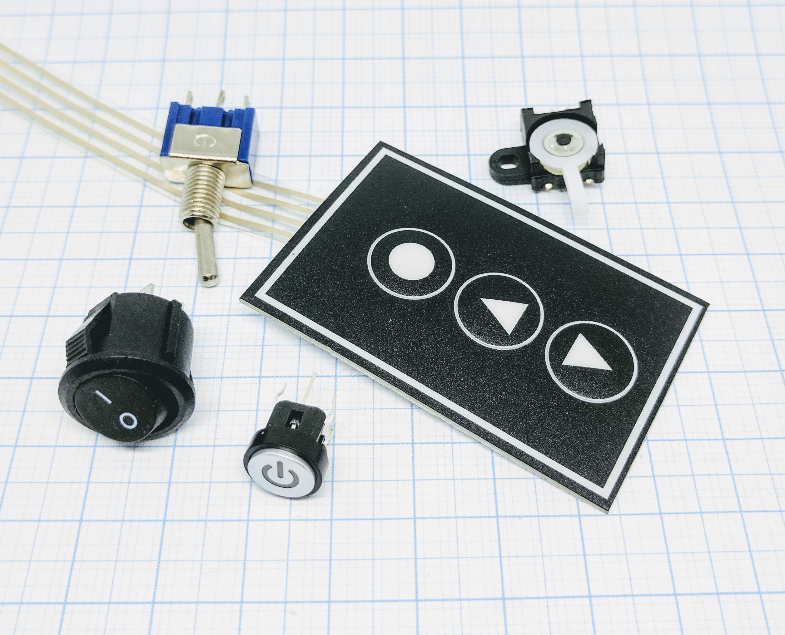
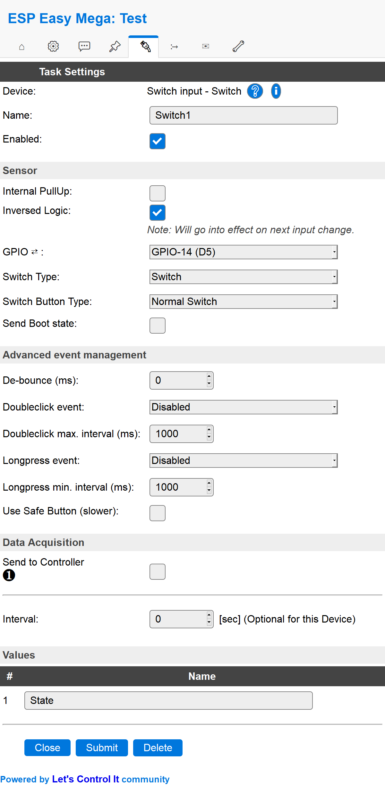

.. include:: ../Plugin/_plugin_substitutions_p00x.repl
.. _P001_Switch_page:

Switch
======

|P001_typename|
|P001_status|

Introduction
------------

Any switch module can be used as an digital input. In everyday language the switch is often referred to as a "button".
You may use it by simply connect it to either a GPIO that is normally high (pull-up) or normally low (pull-down). Other
types of switches are door switches (reed switch), sound activated switches and pulse activated switches.

Specifications:
 * Give a high or low signal to a GPIO
 * Power needed: 3.3V (typically)
 * Output voltage: same as input (typically)

Wiring
------

.. code-block:: html

  ESP               Switch/button
  GPIO (X)   <-->   Signal

  Power
  3.3V       <-->   Signal
              or
  GND        <-->   Signal

Setup
-----

Task settings
~~~~~~~~~~~~~

* **Device**: Name of plugin
* **Name**: Name of the task (recommended name **SwitchN**, where N is a number)
* **Enable**: Should the task be enabled or not

Sensor
^^^^^^

* **Internal pull-up**: Check if you want to use the internal pull-up of the ESP (not all GPIO pins have this internal pull-up.)
* **Inverse logic**: Sometimes you may want the physical high value to be published as a low value. For example if the button is
  triggering a high (1) value when you push it you maybe use it to turn of a LED so the :code:`Switch#State` would then logically be
  preferred to be set as 0 and thus used as a variable for controlling that LED. See rules example below.

* **GPIO**: Which GPIO should be used, recommended to not use a latching switch that may set the ESP into flash mode if left
  to high/low.

* **Switch type**: Set the switch type to either "Switch" or "Dimmer". Dimmer is used if you have a knob that can be turned and
  thus give multiple switch trigger signals.

  * Switch: The default way of handling a switch is by a on/off button. It's either on (:code:`1`) or off (:code:`0`).
  * Dimmer: If you use the dimmer option you will be able to control the device using a dimmer (knob that can be turned).
    The value allowed for dimmers are :code:`0..255` and a new setting is added to the web form (Dim value).

* **Switch button type**: Set the type of switch, "Normal switch", "Push button active low", or "Push button active high".
  * Normal switch: If you use a normal switch you should use this (you can always start with this setting).

  * Push button active low: If you use a momentary switch you may want the state to be activated when you have it published
    and not wait for it to be released. Depending on your setup you can then experiment with the active low / active high
    to make it behave as you want.

  * Push button active high: See bullet point above.

* **Send boot state**: If checked the unit will publish the switch state when booting. If not checked you may find yourself
  with a latching switch caught in limbo. This means that the unit is registering a low/high value but the physical state of
  the switch might be the opposite. If you use a mechanical switch that may be physically set to a state you should check this
  option.

Advanced event management
^^^^^^^^^^^^^^^^^^^^^^^^^

* **De-bounce (ms)**: How long should the pulse (the time you press the button) be, if set to high you need to have it published
  for a longer time before the unit will register it as an state change. You could experiment with this setting to find a good
  behavior of the button if you feel that it's not responding according to your preferences.

* **Double click event**: If enabled the unit will detect double clicks which are within the set interval (see below). The double
  click event is identified as :code:`Switch#State=3`. There's three options for the double click:
  * Active only on low: the double clicks will be counted by how many low signals that is triggered within the set time.
  * Active only on high: the double clicks will be counted by how many high signals that is triggered within the set time.

  * Active on high & low: the double clicks will be counted by how many high and low signals that is triggered within the set time.
    This means that a double click could be registered as a press and release of a button. So not actually double click.

* **Double click max interval (ms)**: This is the interval that you need to perform the double click within.

* **Long press event**: If enabled the unit will detect a long press of a button. There's three different behaviors of the long press:

  * Active only on low: this means that the unit will only be triggering the long press event if the signal is low. Two different event
    values are used, :code:`10` if the state goes from 0 to 1 (:code:`Switch#State=10`), and  :code:`11` if the state goes
    from 1 to 0 (:code:`Switch#State=11`).

  * Active only on high: same as above but only triggered on high signal.
  * Active on high & low: the long press will be triggered both on high and low signals.

* **Long press min interval (ms)**: This is the interval that you need to press the button before the long press event is triggered.

* **Use safe button (slower)**:

Data acquisition
^^^^^^^^^^^^^^^^

* **Send to controller** 1..3: Check which controller (if any) you want to publish to. All or no controller can be used.
* **Interval**: How often should the task publish its value (optional for switch plugins).

Indicators/values (recommended settings)
^^^^^^^^^^^^^^^^^^^^^^^^^^^^^^^^^^^^^^^^

.. csv-table::
  :header: "Indicator", "Value Name", "Interval", "Decimals", "Extra information"
  :widths: 8, 5, 5, 5, 40

  "State", "State", "0", "N/A", "Usually you just want the state being published when an actual push has been happening. If you want a continuous publishing of the state you may use the interval setting to do so."

Rules examples
--------------

.. code-block:: html

    on Switch#State do
     if [Switch#State]=3
      //double click triggered!
      GPIO,12,0
     else
      GPIO,2,[Switch#State]
      GPIO,12,1
     endif
    endon

.. Commands available
.. ~~~~~~~~~~~~~~~~~~

.. .. include:: P001_commands.repl

Where to buy
------------

.. csv-table::
  :header: "Store", "Link"
  :widths: 5, 40

  "Toggle switch","`AliExpress 1 ($) <http://s.click.aliexpress.com/e/fY7OgXO>`_ `Banggood 1 ($) <https://www.banggood.com/5pcs-12V-Round-Rocker-Toggle-ONOFF-Switch-3-Pins-p-1046835.html?p=V3270422659778201806>`_ `Banggood 2 ($) <https://www.banggood.com/Red-3-Pin-ON-ON-SPDT-Mini-Toggle-Switch-AC-6A125V-3A250V-p-967014.html?p=V3270422659778201806>`_ `eBay 1 ($) <https://rover.ebay.com/rover/1/711-53200-19255-0/1?icep_id=114&ipn=icep&toolid=20004&campid=5338336929&mpre=https%3A%2F%2Fwww.ebay.com%2Fsch%2Fi.html%3F_from%3DR40%26_trksid%3Dm570.l1313%26_nkw%3Dtoggle%2Bswitch%26_sacat%3D0%26LH_TitleDesc%3D0%26_osacat%3D0%26_odkw%3DMomentary%2Bswitch>`_"
  "Float switch","`AliExpress 2 ($) <http://s.click.aliexpress.com/e/clw6aFEY>`_ `Banggood 3 ($) <https://www.banggood.com/10W-Black-Side-Mount-Water-Level-Sensor-Controller-Liquid-Float-Switch-p-961256.html?p=V3270422659778201806>`_ `Banggood 4 ($) <https://www.banggood.com/Side-mounted-Liquid-Water-Level-Sensor-Right-Angle-Float-Switch-p-945298.html?p=V3270422659778201806>`_ `eBay 2 ($) <https://rover.ebay.com/rover/1/711-53200-19255-0/1?icep_id=114&ipn=icep&toolid=20004&campid=5338336929&mpre=https%3A%2F%2Fwww.ebay.com%2Fsch%2Fi.html%3F_from%3DR40%26_trksid%3Dm570.l1313%26_nkw%3DFloat%2Bswitch%26_sacat%3D0%26LH_TitleDesc%3D0%26_osacat%3D0%26_odkw%3DMembrane%2Bswitch>`_"
  "Membrane switch","`AliExpress 3 ($) <http://s.click.aliexpress.com/e/ZkI1ov6>`_ `Banggood 5 ($) <https://www.banggood.com/4-x-3-Matrix-12-Key-Array-Membrane-Switch-Keypad-Keyboard-For-Arduino-p-87370.html?p=V3270422659778201806>`_ `Banggood 6 ($) <https://www.banggood.com/5Pcs-DC-4-Key-Matrix-Membrane-Switch-Control-Keypad-Keyboard-With-LED-p-965091.html?p=V3270422659778201806>`_ `eBay 3 ($) <https://rover.ebay.com/rover/1/711-53200-19255-0/1?icep_id=114&ipn=icep&toolid=20004&campid=5338336929&mpre=https%3A%2F%2Fwww.ebay.com%2Fsch%2Fi.html%3F_from%3DR40%26_trksid%3Dm570.l1313%26_nkw%3DMembrane%2Bswitch%26_sacat%3D0%26LH_TitleDesc%3D0%26_osacat%3D0%26_odkw%3DCapacitive%2Btouch%2Bswitch>`_"
  "Capacitive (touch) switch","`AliExpress 4 ($) <http://s.click.aliexpress.com/e/cMIem1Nq>`_ `Banggood 7 ($) <https://www.banggood.com/TTP223B-Digital-Touch-Sensor-Capacitive-Touch-Switch-Module-For-Arduino-p-1158322.html?p=V3270422659778201806>`_ `Banggood 8 ($) <https://www.banggood.com/Jog-Type-Touch-Sensor-Module-Capacitive-Touch-Switch-Module-p-916212.html?p=V3270422659778201806>`_ `Banggood 9 ($) <https://www.banggood.com/2_7V-6V-HTTM-Series-Capacitive-Touch-Switch-Button-Module-p-1245166.html?p=V3270422659778201806>`_ `eBay 4 ($) <https://rover.ebay.com/rover/1/711-53200-19255-0/1?icep_id=114&ipn=icep&toolid=20004&campid=5338336929&mpre=https%3A%2F%2Fwww.ebay.com%2Fsch%2Fi.html%3F_from%3DR40%26_trksid%3Dm570.l1313%26_nkw%3DCapacitive%2Btouch%2Bswitch%26_sacat%3D0>`_"
  "Limit switch","`AliExpress 5 ($) <http://s.click.aliexpress.com/e/bWOekFqo>`_ `Banggood 10 ($) <https://www.banggood.com/10Pcs-Micro-Limit-Switch-Roller-Lever-5A-125V-Open-Close-Switch-p-945733.html?p=V3270422659778201806>`_ `Banggood 11 ($) <https://www.banggood.com/10-Types-250VAC-Limit-Switch-IP65-Adjustable-Actuator-Roller-Arm-Rod-Spring-Coil-Endstop-Switch-p-1297617.html?p=V3270422659778201806>`_ `eBay 5 ($) <https://rover.ebay.com/rover/1/711-53200-19255-0/1?icep_id=114&ipn=icep&toolid=20004&campid=5338336929&mpre=https%3A%2F%2Fwww.ebay.com%2Fsch%2Fi.html%3F_from%3DR40%26_trksid%3Dm570.l1313%26_nkw%3DLimit%2Bswitch%26_sacat%3D0%26LH_TitleDesc%3D0%26_osacat%3D0%26_odkw%3DMagnetic%2Breed%2Bswitch>`_"
  "Momentary switch","`AliExpress 6 ($) <http://s.click.aliexpress.com/e/bPEYQDfw>`_ `Banggood 12 ($) <https://www.banggood.com/420pcs-14-Types-Momentary-Tact-Tactile-Push-Button-Switch-SMD-Assortment-Kit-Set-p-1154674.html?p=V3270422659778201806>`_ `Banggood 13 ($) <https://www.banggood.com/100-Pcs-Micro-Switch-Tact-Cap-Slim-Cap-Tactile-Push-Button-Switch-Momentary-Tact-p-1277707.html?p=V3270422659778201806>`_ `Banggood 14 ($) <https://www.banggood.com/36V-2A-12mm-Momentary-Push-Button-Switch-LED-Switch-Waterproof-Switch-p-994547.html?p=V3270422659778201806>`_ `eBay 6 ($) <https://rover.ebay.com/rover/1/711-53200-19255-0/1?icep_id=114&ipn=icep&toolid=20004&campid=5338336929&mpre=https%3A%2F%2Fwww.ebay.com%2Fsch%2Fi.html%3F_from%3DR40%26_trksid%3Dm570.l1313%26_nkw%3DMomentary%2Bswitch%26_sacat%3D0%26LH_TitleDesc%3D0%26_osacat%3D0%26_odkw%3DLimit%2Bswitch>`_"

|affiliate|

.. More pictures
.. -------------
