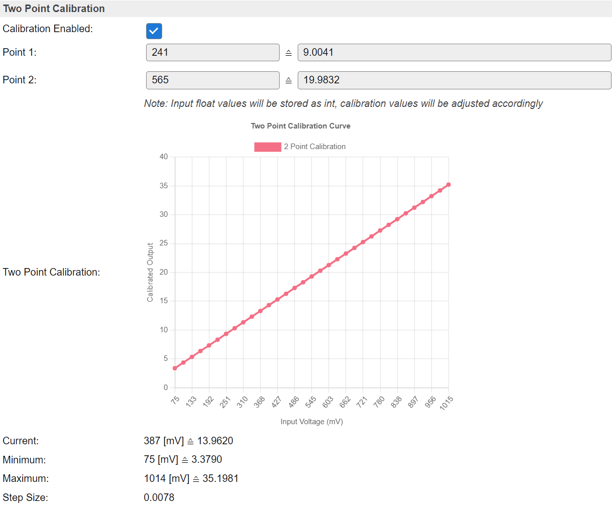
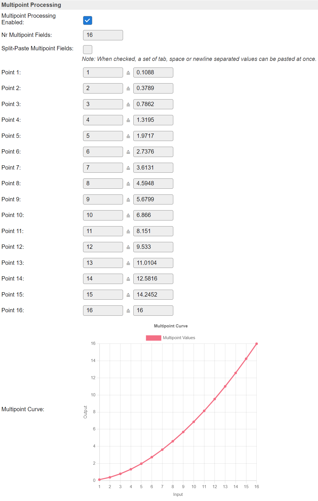
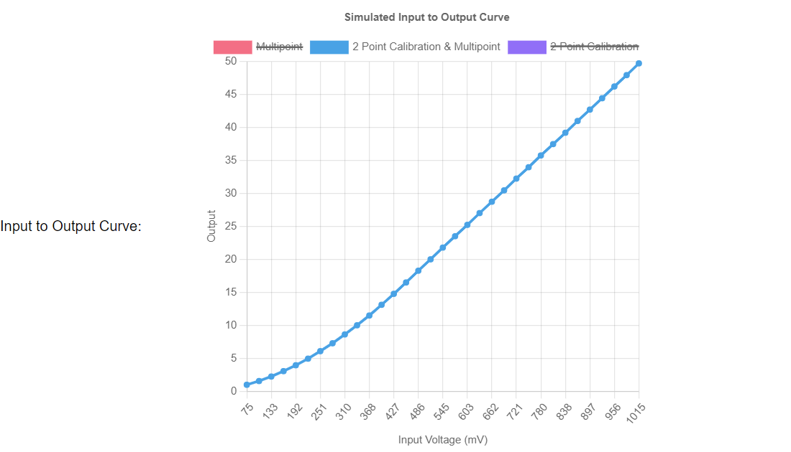
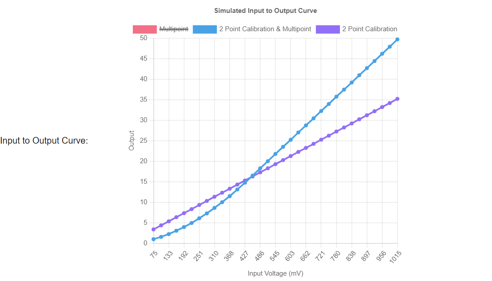
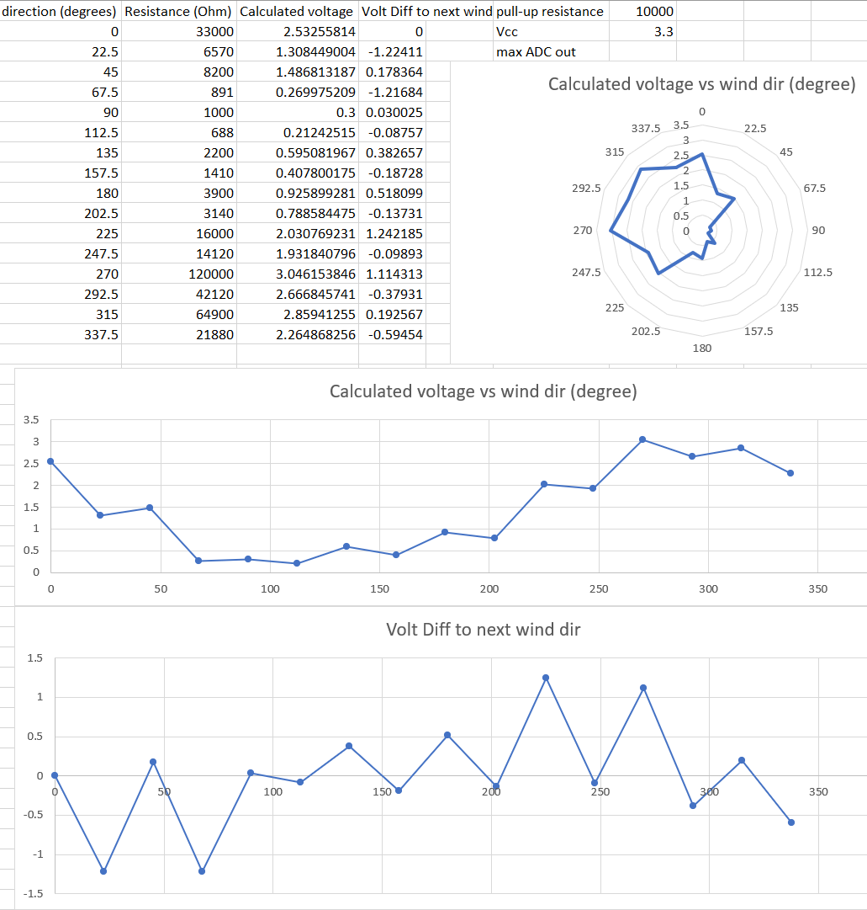
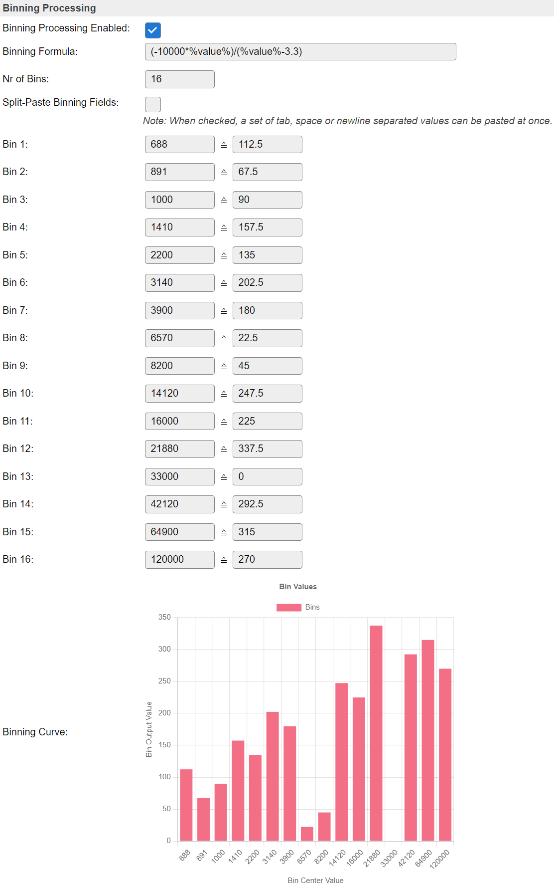

.. include:: ../Plugin/_plugin_substitutions_p00x.repl
.. _P002_page:

|P002_typename|
==================================================

|P002_shortinfo|

Plugin details
--------------

Type: |P002_type|

Name: |P002_name|

Status: |P002_status|

GitHub: |P002_github|_

Maintainer: |P002_maintainer|

Used libraries: |P002_usedlibraries|

Description
-----------

All ESP chips have one or more ADCs available to measure an analog signal.

* ESP8266: 1x 12-bit ADC on the A0 pin or the supplied voltage (on ``VCC`` Builds)
* ESP32: 1 Hall Effect sensor + 18 pins which can be configured to read supplied voltage.
* ESP32-S2: 20 pins which can be configured to read supplied voltage.

The ESP32 chips have 2 ADCs.
Each pin that can be set to read an analog voltage will then be hard-wired to one of both ADCs.
See below for the limitations on sampling analog values with WiFi active.

See the `ESP32 API reference <https://docs.espressif.com/projects/esp-idf/en/latest/esp32/api-reference/peripherals/adc.html>`_ for more detailed information on the features and limitations of these pins.

Range and Calibration
---------------------

2022/07/11: Added support for Attenuation selection + Factory calibration 

The ESP8266 ADC has a fixed range of 0...1V.
However, almost all boards do have some resistors to act as a voltage divider to extend this range to 3.6V

All ESP32 versions allow for changing the range per pin (channel) by setting some attentuation resistor active.
The default active attentuation is 11 dB, which allows for a maximum input voltage of 3.1V
Upto roughly 2.5V the ADC does show a nearly linear response.

Suggested ranges ESP32:

.. code-block:: none

  +----------+-------------+-----------------+
  |          | attenuation | suggested range |
  |    SoC   |     (dB)    |      (mV)       |
  +==========+=============+=================+
  |          |       0     |    100 ~  950   |
  |          +-------------+-----------------+
  |          |       2.5   |    100 ~ 1250   |
  |   ESP32  +-------------+-----------------+
  |          |       6     |    150 ~ 1750   |
  |          +-------------+-----------------+
  |          |      11     |    150 ~ 2450   |
  +----------+-------------+-----------------+
  |          |       0     |      0 ~  750   |
  |          +-------------+-----------------+
  |          |       2.5   |      0 ~ 1050   |
  | ESP32-S2 +-------------+-----------------+
  |          |       6     |      0 ~ 1300   |
  |          +-------------+-----------------+
  |          |      11     |      0 ~ 2500   |
  +----------+-------------+-----------------+

N.B. The ESP32 cannot measure down to 0V. The minimum Voltage depends on the set attenuation.

Each (recent) ESP32 chip does have a factory calibration burnt in to compensate for the non-linear behavior of the ADC and to correct for the used internal voltage reference.

Only the really early production runs of the ESP32 do not have such factory calibration.

N.B. The initial chart on the setup page of an Analog Input task will only show the active attenuation. Others can be shown by clicking on the labels in the chart legend.

With ``Apply Factory Calibration`` checked, the Analog Input plugin in ESPEasy will perform the reading in mV.

.. note:: Even though the various attenuation settings seem to have their own calibration, there is still some difference in reported measured voltage in mV per attentuation setting.

Oversampling
------------

The "Oversampling" mode has 3 options:

* Use Current Sample
* Oversampling
* Binning

"Use Current Sample" only takes a sample when the task is run.

With ``Oversampling`` selected, the task will take a sample 10x per second.
These are averaged over the period set by the ``Interval`` timer. (or shorter interval when the task is executed via the ``TaskRun`` command)

This mode also takes out the highest and lowest sample values to make sure a single fluke measurement is not affecting the output value too much.

The returned value is the average of recorded samples over the ``Interval`` persiod, minus the minimum and maximum sample value in that period.
Thus at 1 second interval, the average is typically taken over 8 samples.

"Binning" can be compared to "sort and count" like those bank teller machines sorting coins.
Only difference is that we're not interested in the total value of all the coins, but want to know which coin we had the most.

So we're doing a classification of the most frequently occuring coin.

Binning data processing differs from the other two.
See also the section "Binning Processing" below.

Two Point Calibration
---------------------

The measured sample taken by the ADC (either a raw value, or mV when ESP32 Factory Calibration is enabled) often has to be mapped on a specific range.
For example when measuring the voltage of a car battery, one needs to have some voltage divider to transform the battery voltage to a range suitable for the ADC.

On the output, one may want to see the actual battery voltage again.
This mapping can be done using the "Two Point Calibration".

For this, one must measure 2 known voltages and input the raw ADC value.

Example of some Two Point Calibration:

(Chart option added: 2022/07/11)

The values below the chart  only taking the Two Point Calibration into account.

* The current ADC value with the corresponding output when the set Two Point Calibration is applied.
* The minimum and maximum values are based on the maximum range which can be measured with the set attenuation.
* The step size is the minimal step size of the output value.

.. note:: It is possible to enter a floating point value as "ADC" input for the 2-point calibration.
          Since this value is stored as an integer value, the calibrated values will be adjusted accordingly to still represent the same calibration curve.

It is best to turn off the 2-point calibration and let the ESP run for a while with a stable voltage applied.
The measured value (either in raw ADC or in mV on ESP32 with Factory Calibration enabled) can then be averaged over a longer period to get the most accurate value.

For example the system is measuring the voltage over a 10k resistor (with another 330k resistor in series) and a diode.
This means there is some voltage drop over de diode and thus we need 2 calibration sets.
The attenuation is set to 0dB on an ESP32.

Measured with 9.00V applied and 20.00V applied:

* 240.88 mV => 9
* 565.4957 mV => 20

When entered in the 2-point calibration fields, the page will reload with these converted values:

* 241 mV => 9.0041
* 565 mV => 19.9832

Multipoint Processing
---------------------

Added: 2022/07/11

The values entered in the "Multipoint Processing" section can be considered a look-up table.

* For "Binning", these represent the bins and their output values.
* For just taking samples, these can be seen as an extention to the "Two Point Calibration" to model a more elaborate response curve of a sensor. (e.g. measuring water level in a round tank)

Often such curves will be modeled first in a spreadsheet program.
To simply copy/paste 2 columns of data from a spreadsheet into the task settings, one has to check "Split-Paste Multipoint Fields" first and then paste these columns into the first field.
By checking this checkbox, some JavaScript will be set active to decode the values and place them in separate fields.

Example of some curve generated in a spreadsheet and paste into the fields:

To see the effect of all selected settings, a chart will be generated with simulated data using the input range of the ADC.
Thus taking into account the set attenuation (on ESP32).

By default, only the curve matching the actual settings is displayed.
But the others can be enabled by simply clicking their labels in the chart legend.

For example, enabling the "2 Point Calibration only" curve too:

The purple line shows the mapping of input to output when only enabling the 2-point calibration.

The blue line shows the mapping when using both 2-point calibration and the multipoint curve.

The example multipoint curve used here was deliberately constructed to map an input of 16 to an output of 16 to show what happens "outside" the defined range of the multipoint curve.

Those inputs (of the multipoint curve) higher than 16 will be extrapolated continuing the last 2 given points of the Multipoint curve.

Binning Processing
------------------

Added: 2022/07/11

For some use cases, a strict classification of data is needed.

A typical use case is the wind vane of a very popular set to build your own weather station, the DS-15901.

This wind vane uses a magnet to trigger a number of reed switches which will then activate a resistor.
What makes this setup rather complex is that for some angles 2 resistors will be active and thus effectively lower the seen resistance inbetween 2 other wind directions.

The example setup measures the voltage over the wind vane, with a 10k resistor set as pull-up resistor to 3.3V.

Here the plot of the measured voltage over the wind vane per direction:

For this use case, it is not possible to use oversampling as this may result in very unstable readings.
We need to map a range of values to a single output value.

Plotting the resistance range from the wind vane datasheet:

As can be seen, the ranges are quite small for some and quite large for others.
But also the wind direction is not increasing when the resistance increases.

Therefore we need a look-up table. 

What binning does is it tries to match each sample to a specific bin (similar to an entry in the Multipoint Processing table) and simply counts each occurence per bin.
After a measurement period (the time between 2 calls to "run" the task, typically the "interval") the bin with the highest count is picked and the output value of this bin will be returned as output.

When using "Binning", it can be useful to also have some formula to process the data first before mapping the data to the correct bin.

For example the wind vane with a 10k in series, connected to 3.3V.
To convert the measured voltage into a resistance, one can use this formula: ``(-10000*%value%)/(%value%-3.3)``

The 2-point calibration can be used to simply convert mVolt to Volt by entering just a single calibration point to convert ``1000`` -> ``1``.

Or change the Binning Formula accordingly to handle mVolt instead of Volt: ``(-10000*%value%)/(%value%-3300)``

.. note:: The Binning Formula will be processed before matching bins. The regular Formula field which is present on nearly all tasks at the bottom of the page is processing only the values sent to the "output" of a task.

With the sampled values converted into a resistance, one can simply use the stated values in the sensor datasheet.

On each sample taken between two run calls of the task, the sample value will be processed by all set steps (Factory Calibration, 2-point calibration, Binning formula) and the resulting value will be matched against the range of each bin.
The count for the matching bin will be incremented by 1.

At the end of such a period of the task:

* The bin with the highest count "wins".
* The assigned value of the winning bin will be put as task value output and send to any connected controllers.
* The counts in all bins will then also be cleared to be ready for the next run.

.. note:: The values set to define a bin represent the center of the bin. The bin range is upto halfway the center of the next bin.

Processing Order
----------------

All steps between ADC and output of the task are processed in the order they appear on the settings page:

* Attenuation (ESP32 only)
* Factory Calibration  (ESP32 only)
* Two Point Calibration
* Multipoint Processing or Binning Processing ("Binning formula" first when set to Binning)
* Formula at the bottom, when set.

Hall Effect Sensor (ESP32)
--------------------------

The ESP32 has a Hall Effect Sensor included, to measure a magnetic field.

N.B. This value can also be negative, if the polarity of the magnetic field is swapped.

Note that even the hall sensor is internal to ESP32, reading from it uses channels 0 and 3 of ADC1 (GPIO 36 and 39). 
Do not connect anything else to these pins and do not change their configuration. Otherwise it may affect the measurement of low value signal from the sensor.

WiFi activity and ADC
---------------------

The ADC on the ESP8266 is also used during WiFi RF calibration.
This can result in incorrect readings of the ADC while a WiFi connection attempt is in progress.

ESP32 has 2 ADCs present.
``ADC1`` and ``ADC2``

Since the ``ADC2`` is shared with the WIFI module, which has higher priority, reading operation of ``adc2_get_raw()`` may fail between ``esp_wifi_start()`` and ``esp_wifi_stop()``.

Use of Formula
--------------

A very typical use case for using the ADC is to measure some resistance.
The best way to do this, is to have a constant current applied to this resistor.
This way the measured voltage over the resistor has a linear correlation with the resistance.
But that makes it somewhat complicated to connect such a sensor and it may also become rather difficult to find a good compromise between resolution and noise when the measured resistor can vary over a wide range.

The simplest way to connect such a resistor is by adding a second resistor in series.
However this makes the measured voltage no longer linear to the measured resistance.

Then we only need a way to compute the measured resistance instead of the voltage.

For this we first need to make sure the calibration is done so the ADC plugin outputs the correct voltage applied to the configured analog input pin.
On ESP32 this is relatively easy by enabling Factory Calibration. However the values are then in mVolt, not in Volt.

Then we must derive a formula to convert the voltage into a resistance value.

For example the unknown resistor is r1 and the series resistor is r2.

With 3V3 applied to both resistors in series, the measured voltage ``v`` is:

``v = 3v3 / (r1 + r2) * r1``

This can be derived into:

``(-1 * r2 * v) / (v - 3v3)``

When using 10k as a value for r2, we can use this in the formula field:

``(-10000*%value%)/(%value%-3.3)``

Or using the mVolt readings when using Factory Calibration:

``(-10000*%value%)/(%value%-3300)``

With proper calibration and this formula present, we now get the measured resistance on the output.

Supported hardware
------------------

|P002_usedby|

.. Commands available
.. ^^^^^^^^^^^^^^^^^^

.. .. include:: P002_commands.repl

.. Events
.. ~~~~~~

.. .. include:: P002_events.repl

Change log
----------

.. versionchanged:: 2.0
  ...

  |improved| 2020-04-25  Added support for ESP32 ADC pins + Hall Effect Sensor.
  |improved| 2022-07-11  Added ESP32 Factory calibration, multipoint processing, binning and charts.
  |improved| 2022-07-27  Improved resolution when using ESP32 Factory Calibration.

.. versionadded:: 1.0
  ...

  |added|
  Initial release version.
