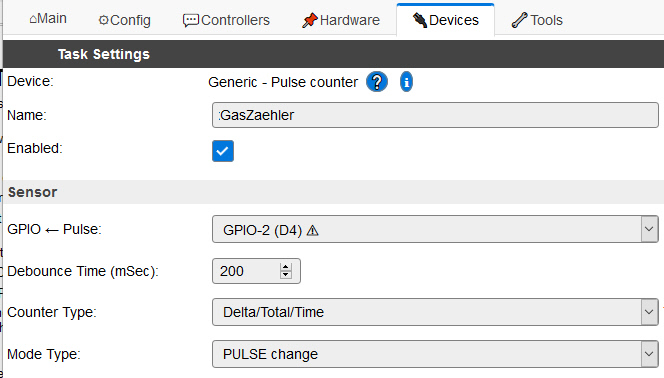
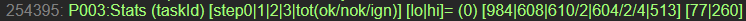
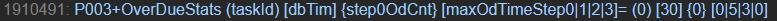

.. include:: ../Plugin/_plugin_substitutions_p00x.repl
.. _P003_page:

|P003_typename|
==================================================

|P003_shortinfo|

Plugin details
--------------

Type: |P003_type|

Name: |P003_name|

Status: |P003_status|

GitHub: |P003_github|_

Maintainer: |P003_maintainer|

Used libraries: |P003_usedlibraries|

Supported hardware
------------------

|P003_usedby|

SETUP
-----

The setup dialog:

Task's Sensor Parameters
^^^^^^^^^^^^^^^^^^^^^^^^

:GPIO <- Pulse:
   Select the GPIO pin at which the pulse is counted

:Debounce Time (mSec):
  Period in which you allow the signal to be unstable (bouncing) after a level change (high -> low / low -> high).
  The specific use of this parameter to filter out valid signals, depends on the Mode Type (cf. description below).

:Counter Type:
  (practical use of this parameter is unclear, but kept for compatibility reasons)

:Mode Type:
  Determines if you want to count **edges** or **pulses** and

  weather you are interested in counting rising, falling or both **edges** of a signal

  or low, high or changing **pulses**.
  
  See Description below.

For setup of some specific device examples see: |P003_usedby|

Description
-----------
P003 is a general purpose pulse counter for counting high/low state changes and pulses at an ESP GPIO.
It may be used to count water or gas meter pulses or speed measurement of fans, etc.
It provides three values:

:``Count``:
  Number of counted pulses since last transmission (Delta)
:``Total``:
  Total number of counted pulses (since power on or cold restart)
:``Time``:
  Time between current and most recent pulse in milliseconds

This allows you to simply count the pulses using ``Total`` or use Count and Time to calculate the number of pulses per time unit.
But please note: When ``Count`` > 1, the ``Time`` only applies to the most recent of the counted pulses and you have to guess how long the previous were. 

P003 offers two different **pulse detection methods** which can be used depending on the kind and quality of signal you want to count:

:Edge Mode Types:
  ``CHANGE``, ``RISE``, ``FALLING``
:Pulse Mode Types:
  ``PULSE low``, ``PULSE high``, ``PULSE change``

For **Edge** mode types, the counter is incremented when a rising, falling signal edge or either of these (change) is detected at the selected GPIO (GPIO interrupts are used).
BUT incrementing is only done, if the time between most recent counting and current edge is longer than the selected Debounce Time). 

These **Edge** mode types are best suited for high frequency signals with quite constant frequency so that debounce time can be adjusted to that.
Counting of 40 cycles/second (2400 rpm with Debounce time =25ms) should be possible or possibly up to 4 times faster (Debounce time = 0),
depending on the cpu workload through other ESPEasy tasks and WiFi handling. 
However the electrical signal must (when Debounce Time had ended) be stable (well filtered and no crossover of signals or signal spikes).
Otherwise there is a tendency of counting slightly too much pulses.

For **Pulse** mode types the pulse detection is also initiated by the rising, falling or change signal edge, 
but it is only counted as a pulse, if the GPIO signal is stable over three consecutive GPIO level samples. 
First, after an edge was detected, we wait for the Debounce Time, and then the GPIO level is checked three times with two intermediate delays of half the debounce time.
Only when all three times the level is identical the signal is counted as a pulse.
So the minimum pulse length is Debounce Time x 2.. Otherwise the three checks are repeated until a sable signal is detected. 

The **Pulse** mode types are best suited for lower frequency signals (>80ms=12,5 cycles/second=750prm with Debounce Time >20ms)
and also can count reliably very low frequencies and long pulses of minutes and hours (e.g. an gas meter that does not send any signal,
when all consumers are off for a long period). Electrical interferences (shorter than Debounce Time) are well filtered out. 

Tests of Pulse modes showed, that good results are achieved with a Debounce Time of 1/10 to 1/4 of the shortest expected pulse length. 

Persistence of Counter values
-----------------------------

The three counter values are not persisted upon cold restart, power off or firmware upload,
but are persisted (recovered) after warn reset or processor deep freeze.

Electrical signal quality
-------------------------

Make sure physical connections are electrically well separated so no crossover of the signals happen. 
Especially with edge pulse mode at rates above ~5'000 RPM with longer lines. Best use a cable with ground and signal twisted.

Statistical logging for PUSE modes
----------------------------------

The **Pulse** modes provide at runtime statistical information in the log output in order to support problem finding and the tuning of debounce time. 
The interpretation is a little tricky, as it is related to the implemented step by step detection method. 
But its use may be helpful, if you want to get an explanation for unexpected counting results. 
It gives an indication for the signal quality and helps to adjust the debounceTime. 
You can ignore it, if your counter works well.

The information is provided, when the log level is ``Debug`` or lower (cf. "Advanced Settings" dialog). 
It is temporary possible to output the logging in log level ``Info`` by use of the Pulse Counter command ``LogPulseStatistic,i`` (see "Commands available").

Records like the above are written to log output, whenever a new valid pulse level was detected.
Additional writing of such a record can also be triggered through the ``LogPulseStatistic`` command (see "Commands available").
This allows you to generate a log output for inspection in situations, where no regular pulse is counted,
because no pulse is currently generated or when no stable pulse can be determined because of a heavily floating signal. 

The meaning of the numbers is explained using the following example:

+----------------------------------------------------------------------+
| = (0) [2046017|2045826|2045826/1|2045821/0/5|2045810] [11979|104201] |
+----------------------------------------------------------------------+

The **single number** ``(0)`` is the task index.

The **first array** ``[ 2046017 | 2045826 | 2045826/1 | 2045821/0/5 | 2045810 ]`` contains five number
groups from the following processing steps:

- Step0 (``[ 2046017 |``): Number of detected signal edges in the interrupt. Here not only the processed events are counted but also the ignored edges which occur while the previous is still being processed in further steps. The difference between this and the next number is an indication for the bouncing ratio.
- Step1 (``| 2045826 |``): Number of GPIO level reads at end of debounceTime in Step1.
- Step2 (``| 2045826/1 |``): First number is the GPIO level "ok" reads (debounceTime/2 after Step1) with the same level as in Step1.  The second number (here 1) indicates the number "nok" reads with the opposite level as in Step1 which were then reprocessed in Step2 after debounceTime/2. This is an indication, that the signal was not stable after debounce time.
- Step3 (``| 2045821/0/5 |``): The first two numbers are of the same meaning as above and the third ("5") indicates how often the detected level n Step3 is the same as the current valid signal level. It basically confirms the current signal after an interference or spike within a steady signal. These are ignored ("ign") and not counted.
- Total (``| 2045810 ]``: Is the resulting total counter after Step3. Note that in ``PULSE low`` or ``PULSE high`` this counter is only incremented every second log entry.

Please note, that with the commands ``resetpulsecounter`` the "ok" counters are also reset to 0 while
the "nok" and "ign" error counters are persisted, so you can after a reset still have these quality
indicators. Similar with ``setpulsecountertotal`` where the "ok" counters are shifted by the same amount
as the total counter, so you can still use their difference for analysis.
Upon warm reset or when task settings are changed, the "ok" counters are all reset to the persisted
``Total`` value, while the error counters are reset to 0. This is an indirect resetting of the error counters.

The **second array** ``[11979|104201]`` of two numbers show the length in milliseconds of the most recently counted low and high pulse. 
So, from log message to log message alternating one or the other number changes, depending if a low or high pulse had just ended.
The numbers remain unchanged from message to message in case of error detections ("nok" or "ign"), where no counting too place.

Note that the plugin's ``Time`` value reflects in ``PUSE change`` the tile between pulse changes and thus
the high or low time of the most recently ended pulse, while in ``PULSE low`` it's always the distance
between the most recent and the previous low signal and thus the sum of the most recent high and
low time. For ``PULSE high`` respectively.

As already mentioned above, additional writing of the above log record can also be triggered through the ``LogPulseStatistic`` command. 
Together with that, a further ``OverdueStats`` record like the following is written to the log:

This provides information about the timing behaviour and if the Pulse Counter could do his working steps without too long delays through other ESPEasy processes.

The meaning of the numbers is explained using the following example:

+---------------------------+
| = (0) [30] {1} [20|3|2|1] |
+---------------------------+

The ``(0)`` is the task index.

The ``[30]`` is the set debounce time in ms.

The ``{1}`` indicate that it was once not possible to timely complete the debounce in step 0. 
This means, that the debounce time was over, before the pulse check processing could start because of other blocking ESPEasy processes. 
This counter sums up these occurences since last reset, thus showing, how often this happened. 
Values > 0 here, in combination with significant overdue time for step 0 (see next) may explain missing pulses.

``[20|3|2|1]`` these are the maximum overdue times in milliseconds for each of the processing steps (0-3) that happened since last reset.
When you here encounter delays longer than half of the debounce time, it explains missing pulses because of other blocking ESPEasy processes or processor overload.

Note: These counters can, during runtime, be reset to 0 by the Pulse Counter command ``LogPulseStatistic,r`` (see "Commands available").

Commands available
------------------

.. include:: P003_commands.repl

Change log
----------

.. versionchanged:: 2.2
  ...

  |added|
  Added new PULSE mode types.

.. versionchanged:: 2.0
  ...

  |added|
  Major overhaul for 2.0 release.

.. versionadded:: 1.0
  ...

  |added|
  Initial release version.

