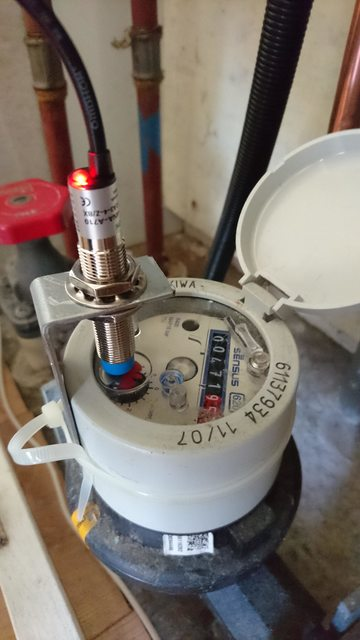
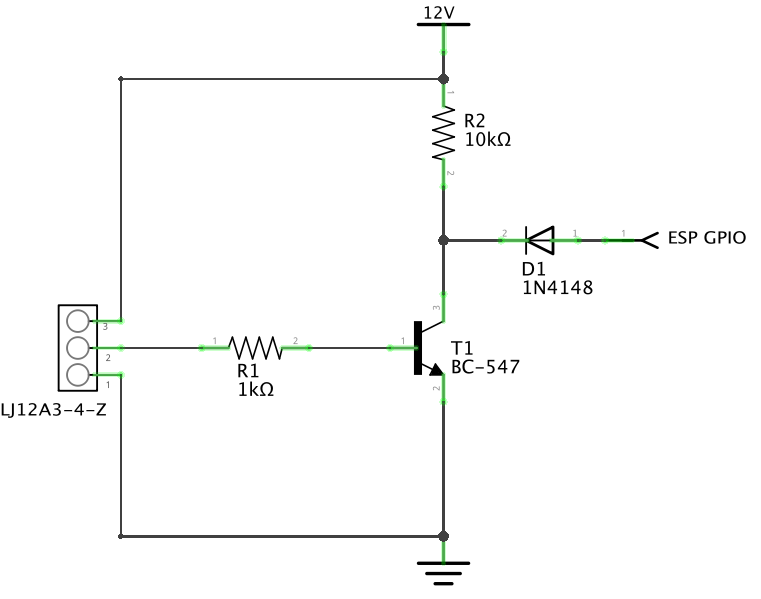
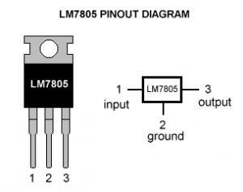
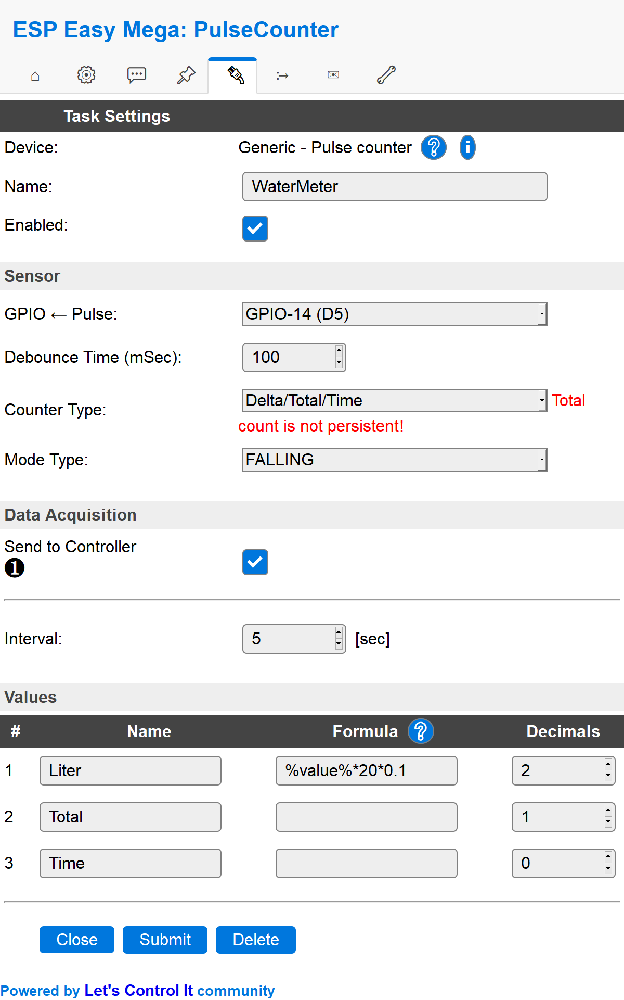

.. include:: ../Plugin/_plugin_substitutions_p00x.repl
.. _P003_LJ12A3_page:

LJ12A3
======

|P003_typename|
|P003_status|

Introduction
------------
The ESP8266 module can be used as a general purpose digital pulse counter device for various digital sensors.
Think about optical sensors with a digital output. To be used for things like gas, water, electricity, door open/close counters, etc.

In this example we will connect an inductive proximity switch (LJ12A3-4-Z/BX).
A LJ12A3-4-Z/BX module can be used in order to detect metal.
For example in your water consumption meter (as seen in picture).

Specifications:
 * Inductive proximity sensor
 * Detection distance: 4mm
 * Working voltage range: 10V-30V
 * Dimension: M12x10x55mm

Wiring
------

.. code-block:: none

  ESP               LJ12A3
  GPIO (14)  <-->   Signal (black)

  Power
  12V        <-->   VCC (brown)
  GND        <-->   GND (blue)

.. note:: You need to use a voltage divider to get the signal level down from 12V to 5V.

The LJ12A3-4-Z/BX-**5V** way
^^^^^^^^^^^^^^^^^^^^^^^^^^^^

Just buy the 5V version of the proximity sensor and you are good to go.

The resistor way
^^^^^^^^^^^^^^^^

The 7805 way
^^^^^^^^^^^^

7805 IC specifications:
 * Input voltage range 7-35V
 * Current rating Ic = 1A
 * Output voltage range: Vmax=5.2V, Vmin=4.8V
 * Where to buy: `AliExpress ($) <http://s.click.aliexpress.com/e/bmR1wUxq>`_

.. note:: 7805 is not very efficient and has drop-out voltage problems. A lot of energy is wasted in the form of heat.
          Higher the input voltage, less efficient your 7805 will be.

Setup
-----

.. danger:: Only task number 1..4 is currently supported for the pulse plugin!

Task settings
^^^^^^^^^^^^^

* **Device**: Name of plugin
* **Name**: Name of the task (example name **WaterMeter**)
* **Enable**: Should the task be enabled or not

Sensor
^^^^^^

* **GPIO <-- Pulse**: Pulse input is generally set to **GPIO 14 (D5)**.
* **Debounce time**: Debounce time is generally set to **100**.
* **Counter type**: In this example the type is set to **Delta/Total/Time**.
* **Mode type**: Pulse input is generally set to **Falling** or **PULSE low**

  ``CHANGE`` = count on signal being changed, low to high (0.8-V to 2.4+V) or high to low (2.4+V to 0.8-V)

  ``RISING`` = count if signal is rising, from low to not low (0.8-V to 0.8+V)

  ``FALLING`` = count if signal is falling, from high to not high (2.4+V to 2.4-V)

  ``PULSE low`` = count if a stable low signal ended followed by a stable high signal
  
  ``PULSE high`` = count if a stable high signal ended followed by a stable low signal.

  ``PULSE change`` = count if the stable signal changes from high to low or from low to high
  

.. warning:: GPIO 16 (D0) is not compatible with pulse counters.

Data acquisition
^^^^^^^^^^^^^^^^

* **Send to controller** 1..3: Check which controller (if any) you want to publish to. All or no controller can be used.
* **Interval**: How often should the task publish its value (5..15 seconds is normal).

Indicators (recommended settings)
^^^^^^^^^^^^^^^^^^^^^^^^^^^^^^^^^

.. csv-table::
  :header: "Indicator", "Value Name", "Interval", "Decimals", "Extra information"
  :widths: 8, 5, 5, 5, 40

  "Count", "mL", "5", "2", "Using the formula ``%value%*20*0.1`` to convert the pulse count into liters per minute.
            You might have to tweak the value to fit your application, our flow meter gives 0.1L per pulse and since
            our interval was set to 5 seconds we have to multiply the value with ``20`` (the reading is done once every
            20th of a minute) and also multiply it with ``0.1`` because that is the value in liters (per pulse).
  "
  "Total", "Total", "N/A", "1", "Total value is the counted pulses since last reboot.
  .. note:: Only updated if counter type is set to ``Delta/Total/Time``, ``Total``, or ``Delta/Total``
  "
  "Time", "Time", "N/A", "0", "Time since last pulse was intercepted, in mSec.
  .. note:: Only updated if counter type is set to ``Delta/Total/Time``
  "

Rules examples
--------------

.. code-block:: none

   On WaterMeter#mL Do
    If [WaterMeter#mL]=0
      Publish,%sysname%/WaterConsumption/status,No water running
    Else
      Publish,%sysname%/WaterConsumption/status,Water is being tapped
    EndIf
   EndOn

.. Commands available
.. ~~~~~~~~~~~~~~~~~~

.. .. include:: P003_commands.repl

Where to buy
------------

.. csv-table::
  :header: "Store", "Link"
  :widths: 5, 40

  "AliExpress","`Link 1 ($) <http://s.click.aliexpress.com/e/1YcZUUo>`_ `Link 2 ($) <http://s.click.aliexpress.com/e/cWBJkHes>`_"
  "Banggood","`Link 3 ($) <https://www.banggood.com/LJ12A3-4-ZBY-PNP-DC6-36V-Inductive-Proximity-Sensor-Detection-Switch-p-982679.html?p=V3270422659778201806>`_"
  "eBay","`Link 4 ($) <https://rover.ebay.com/rover/1/711-53200-19255-0/1?icep_id=114&ipn=icep&toolid=20004&campid=5338336929&mpre=https%3A%2F%2Fwww.ebay.com%2Fsch%2Fi.html%3F_from%3DR40%26_trksid%3Dm570.l1313%26_nkw%3DLJ12A3%26_sacat%3D0%26LH_TitleDesc%3D0%26_osacat%3D0%26_odkw%3DAnalog%2BPressure%2Bsensor>`_"

|affiliate|

.. More pictures
.. -------------
