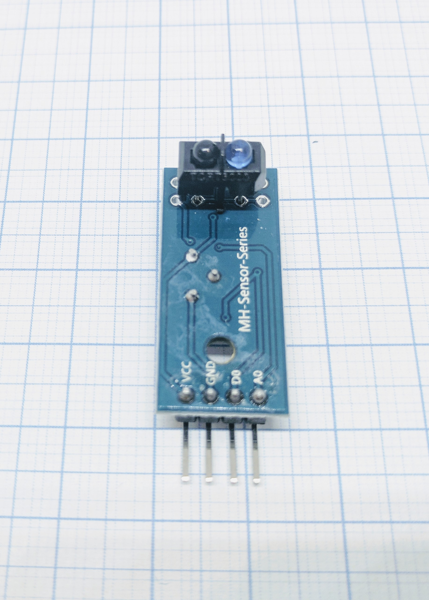
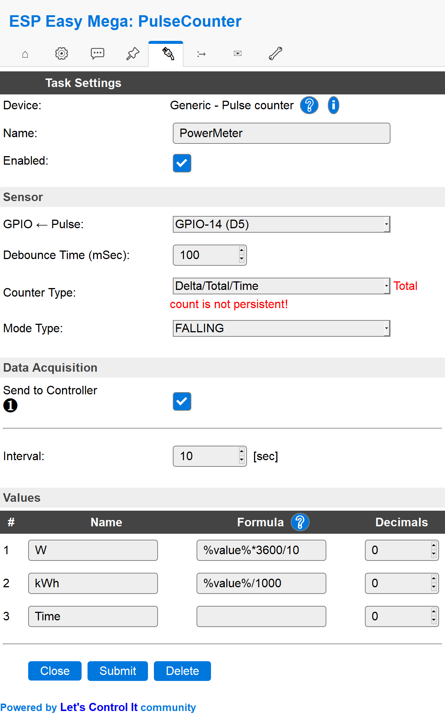
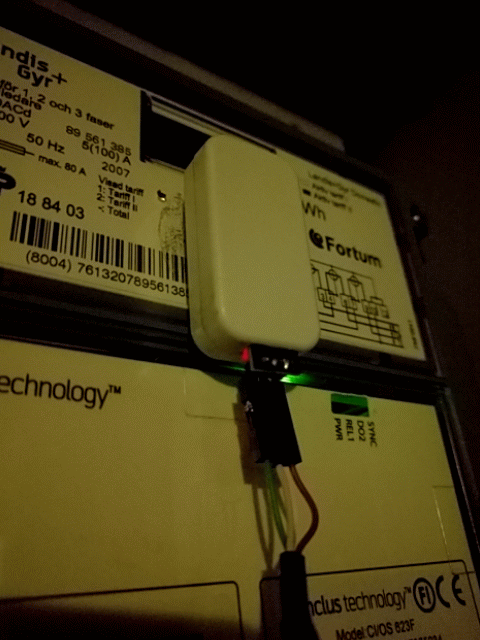
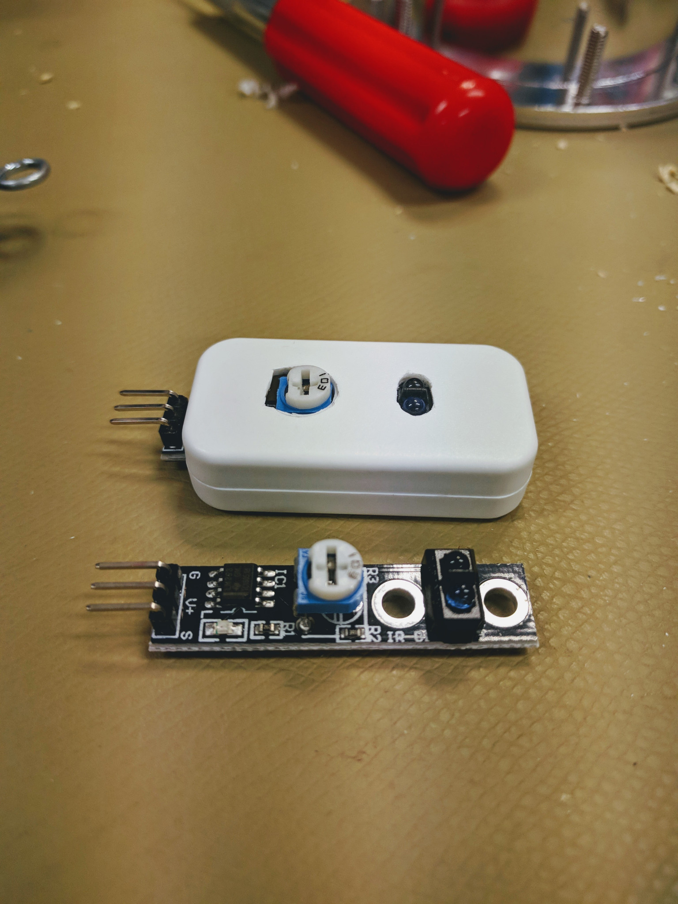
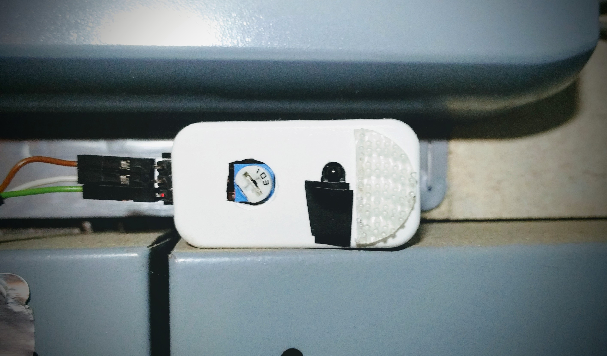
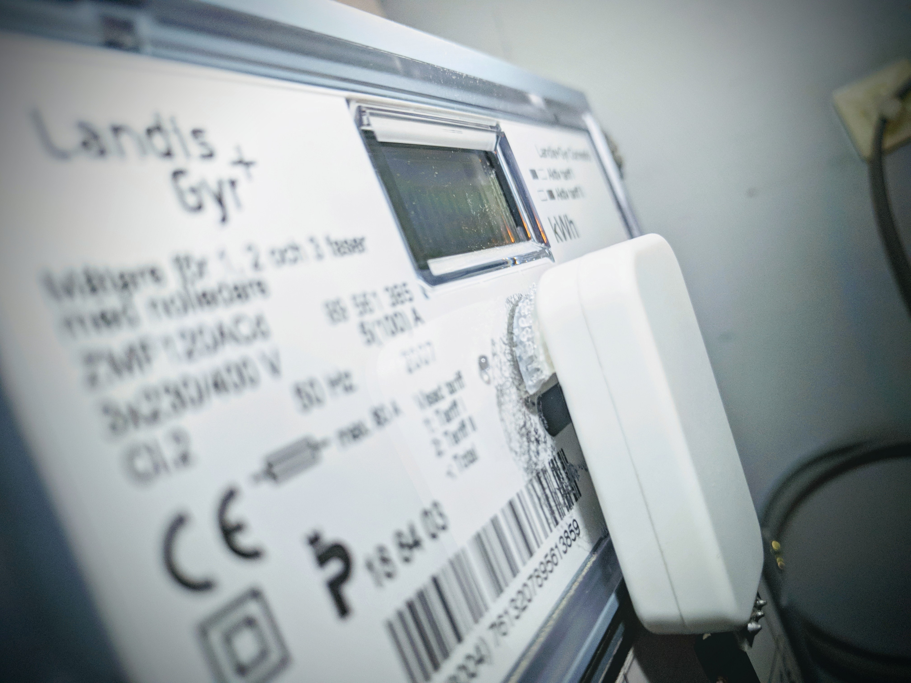

.. include:: ../Plugin/_plugin_substitutions_p00x.repl
.. _P003_TCR5000_page:

TCR5000
=======

|P003_typename|
|P003_status|

Introduction
------------

The ESP8266 module can be used as an general purpose digital pulse counter device for various digital sensors.
Think about optical sensors with a digital output. To be used for things like gas, water, electricity, door open/close counters, etc.

In this example we will connect an optical sensor. Connect the digital output to a GPIO pin on the ESP module.

Specifications:
 * IR emitter + phototransistor (for ex. water/electricity meters)
 * Distance

Wiring
------

.. code-block:: none

  ESP                TCR5000
  GPIO (14)   <-->   S

  Power
  5.0V        <-->   V+
  GND         <-->   G

Setup
-----

.. danger:: Only task number 1..4 is currently supported for the pulse plugin!

Task settings
~~~~~~~~~~~~~

* **Device**: Name of plugin
* **Name**: Name of the task (example name **PowerMeter**)
* **Enable**: Should the task be enabled or not

Sensor
^^^^^^

* **GPIO <-- Pulse**: Pulse input is generally set to **GPIO 14 (D5)**.
* **Debounce time**: Debounce time is generally set to **100**.
* **Counter type**: In this example the type is set to **Delta/Total/Time**.
* **Mode type**: Pulse input is generally set to **Falling** or **PULSE low**

  ``CHANGE`` = count on signal being changed, low to high (0.8-V to 2.4+V) or high to low (2.4+V to 0.8-V)

  ``RISING`` = count if signal is rising, from low to not low (0.8-V to 0.8+V)

  ``FALLING`` = count if signal is falling, from high to not high (2.4+V to 2.4-V)
  
  ``PULSE low`` = count if a stable low signal ended followed by a stable high signal
  
  ``PULSE high`` = count if a stable high signal ended followed by a stable low signal.

  ``PULSE change`` = count if the stable signal changes from high to low or from low to high
  

.. warning:: GPIO 16 (D0) is not compatible with pulse counters.

Data acquisition
^^^^^^^^^^^^^^^^

* **Send to controller** 1..3: Check which controller (if any) you want to publish to. All or no controller can be used.
* **Interval**: How often should the task publish its value (5..15 seconds is normal).

Indicators (recommended settings)
^^^^^^^^^^^^^^^^^^^^^^^^^^^^^^^^^

.. csv-table::
  :header: "Indicator", "Value Name", "Interval", "Decimals", "Extra information"
  :widths: 8, 5, 5, 5, 40

  "Count", "W", "10", "0", "Using the formula ``%value%*3600/10`` to convert the pulse count into Watts.
            You might have to tweak the value to fit your application, our energy meter gives 1Wh per pulse and since
            our interval was set to 10 seconds we have to first multiply the value with ``3600`` (3600 seconds per hour) and
            also divide that value with ``10`` because we measure the Watt over a time period of 10 seconds (of that hour).
  "
  "Total", "kWh", "10", "0", "Using the formula ``%value%/1000`` we get the numbers of kWh (1000 Wh = 1 kWh) used since last reboot.
  .. note:: Only updated if counter type is set to ``Delta/Total/Time``, ``Total``, or ``Delta/Total``
  "
  "Time", "Time", "N/A", "0", "Time since last pulse was intercepted, in mSec.
  .. note:: Only updated if counter type is set to ``Delta/Total/Time``
  "

Rules examples
--------------

.. code-block:: none

   On PowerMeter#W Do
    If [PowerMeter#W]>1500
      NeoPixelAll,255,0,0 //using too much energy!
    Else
      NeoPixelAll,0,255,0 //good job, low energy consumption
    EndIf
   EndOn

.. Commands available
.. ~~~~~~~~~~~~~~~~~~

.. .. include:: P003_commands.repl

Where to buy
------------

.. csv-table::
  :header: "Store", "Link"
  :widths: 5, 40

  "AliExpress","`Link 1 ($) <http://s.click.aliexpress.com/e/bo2Sbx4c>`_"
  "Banggood","`Link 2 ($) <https://www.banggood.com/TCRT5000-Infrared-Reflective-Switch-IR-Barrier-Line-Track-Sensor-Module-p-1038443.html?p=V3270422659778201806>`_"
  "eBay","`Link 3 ($) <https://rover.ebay.com/rover/1/711-53200-19255-0/1?icep_id=114&ipn=icep&toolid=20004&campid=5338336929&mpre=https%3A%2F%2Fwww.ebay.com%2Fsch%2Fi.html%3F_from%3DR40%26_trksid%3Dm570.l1313%26_nkw%3DTCRT5000%26_sacat%3D0%26LH_TitleDesc%3D0%26_osacat%3D0%26_odkw%3DLJ12A3>`_"

|affiliate|

More pictures
-------------

A really nice feature of SOME digital pulse counters is the small red led diode which flash for each detected pulse.
Using the adjustment wheel you can fine tune the detection level which makes the device really robust and withstand
unwanted signals from the outside. Turn the wheel until the red led light shines constantly and then turn it back
slowly until it start to detect pulses, this is the level you want to have.

It is sometimes good to mask the LED used to measure distance/pulses since the reflection could
trigger a pulse.

