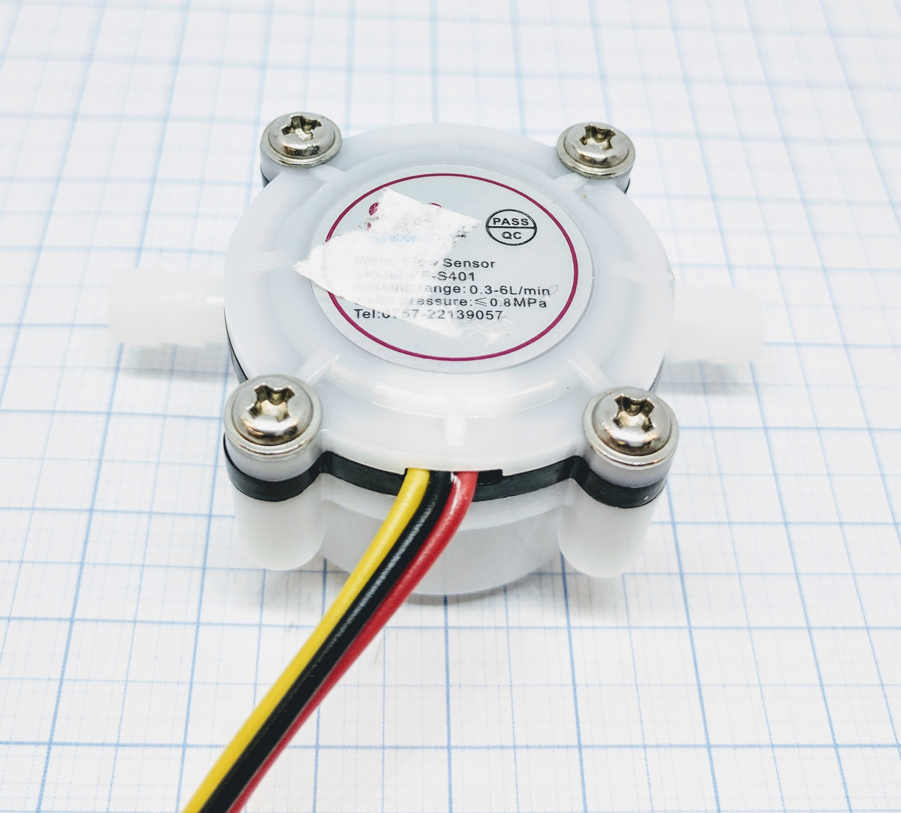
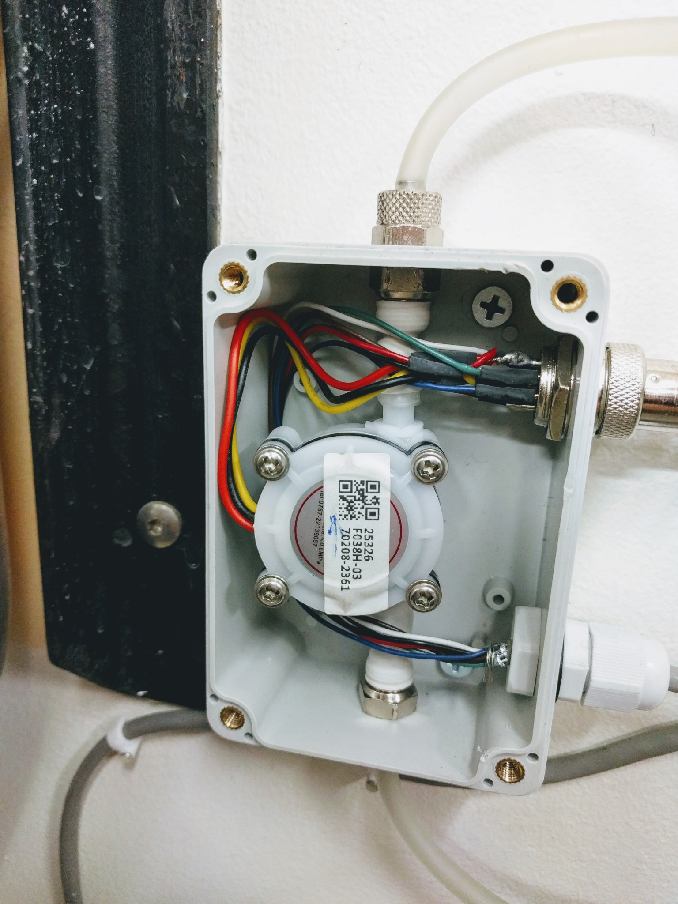
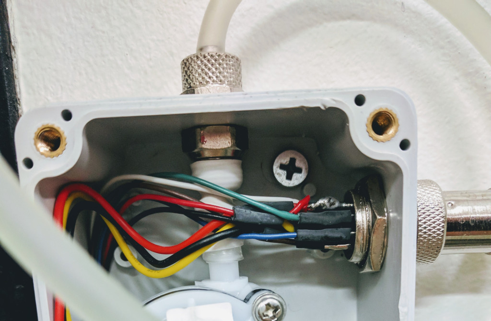
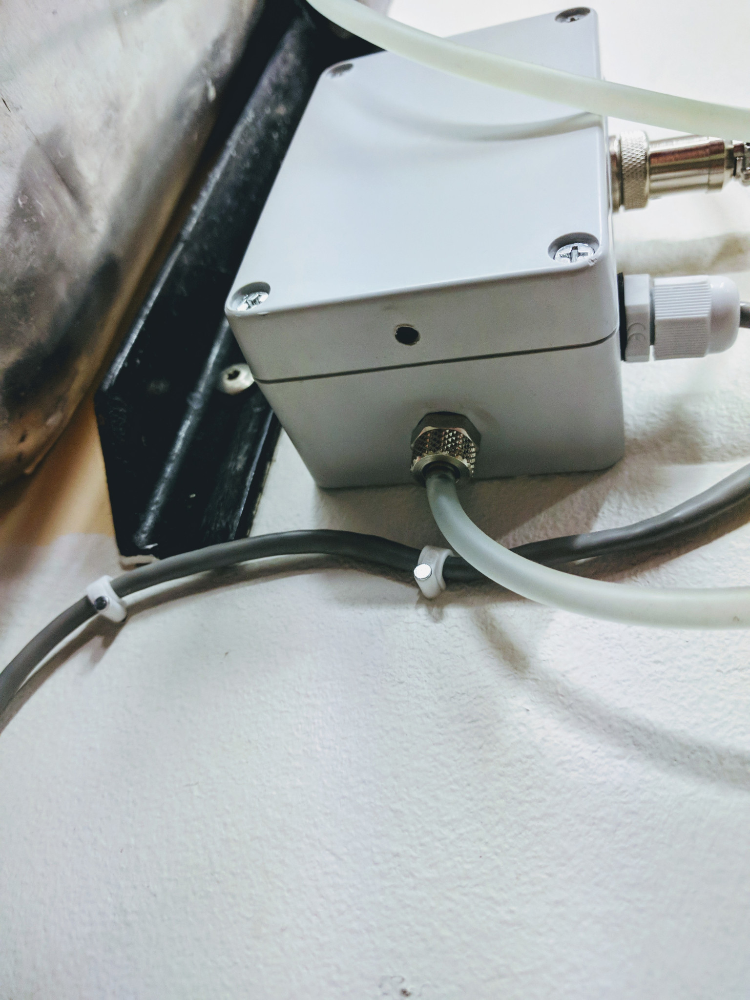
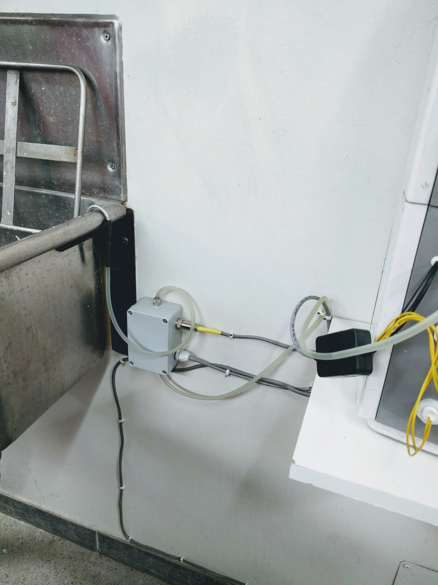

.. include:: ../Plugin/_plugin_substitutions_p00x.repl
.. _P003_YFS401_page:

YFS401
======

|P003_typename|
|P003_status|

Introduction
------------

Just as the ESP may be used with specific pulse counters it may also be used with any generic pulse based unit as long as the pulses are not giving to high voltages.
A generic 5V flow sensor that gives a pulse each complete revolution. You may have to measure what each revolution/pulse means in volume.
The one used in this example is called YF-S401, a 5V unit, which is great to use for watering systems or in this case (pictured) to measure a drainage system.

Specifications:
 * General, output as pulse
 * Min. working voltage: 4.5V
 * Max. working current: 15mA (5V)
 * Working voltage range: 5V-12V
 * Flow range detectable: approx. 0.3-6L/min

Wiring
------

.. code-block:: none

  ESP               YFS401
  GPIO (14)  <-->   Signal (yellow)

  Power
  5.0V       <-->   VCC (red)
  GND        <-->   GND (black)

Setup
-----

.. FIXME: wrong image .. image:: P003_Setup_YFS401_1.png

.. danger:: Only task number 1..4 is currently supported for the pulse plugin!

Task settings
~~~~~~~~~~~~~

* **Device**: Name of plugin
* **Name**: Name of the task (example name **WaterMeter**)
* **Enable**: Should the task be enabled or not

Sensor
^^^^^^

* **Device**: Name of plugin
* **Name**: Name of the task (example name **WaterMeter**)
* **Enable**: Should the task be enabled or not

Sensor
^^^^^^

* **GPIO <-- Pulse**: Pulse input is generally set to **GPIO 14 (D5)**.
* **Debounce time**: Debounce time is generally set to **100**.
* **Counter type**: In this example the type is set to **Delta/Total/Time**.
* **Mode type**: Pulse input is generally set to **Falling** or **PULSE low**

  ``CHANGE`` = count on signal being changed, low to high (0.8-V to 2.4+V) or high to low (2.4+V to 0.8-V)

  ``RISING`` = count if signal is rising, from low to not low (0.8-V to 0.8+V)

  ``FALLING`` = count if signal is falling, from high to not high (2.4+V to 2.4-V)

  ``PULSE low`` = count if a stable low signal ended followed by a stable high signal
  
  ``PULSE high`` = count if a stable high signal ended followed by a stable low signal.

  ``PULSE change`` = count if the stable signal changes from high to low or from low to high
  
.. warning:: GPIO 16 (D0) is not compatible with pulse counters.

Data acquisition
^^^^^^^^^^^^^^^^

* **Send to controller** 1..3: Check which controller (if any) you want to publish to. All or no controller can be used.
* **Interval**: How often should the task publish its value (5..15 seconds is normal).

Indicators (recommended settings)
^^^^^^^^^^^^^^^^^^^^^^^^^^^^^^^^^

.. csv-table::
  :header: "Indicator", "Value Name", "Interval", "Decimals", "Extra information"
  :widths: 8, 5, 5, 5, 40

  "Count", "mL", "5", "2", "Using the formula ``%value%*0.65`` to convert the pulse count into milliliters per minute.
  You might have to tweak the value to fit your application, our flow meter gives 0.65mL per pulse.
  "
  "Total", "Total", "N/A", "1", "Total value is the counted pulses since last reboot, for total in liters you could
  use this formula ``%value%*0.65*0.001``. 1mL = 0.001L.
  .. note:: Only updated if counter type is set to ``Delta/Total/Time``, ``Total``, or ``Delta/Total``
  "
  "Time", "Time", "N/A", "0", "Time since last pulse was intercepted, in mSec.
  .. note:: Only updated if counter type is set to ``Delta/Total/Time``
  "

Rules examples
--------------

.. code-block:: none

   On WaterMeter#mL Do
    If [WaterMeter#mL]=0
      Publish,%sysname%/WaterStream/status,Water stream empty
    Else
      Publish,%sysname%/WaterStream/status,Water is life!
    EndIf
  EndOn

Where to buy
------------

.. csv-table::
  :header: "Store", "Link"
  :widths: 5, 40

  "AliExpress","`Link 1 ($) <http://s.click.aliexpress.com/e/cnLNRRM4>`_"
  "Banggood","`Link 2 ($) <https://www.banggood.com/G12inch-DN15-Transparent-Water-Flow-Meter-Flowmeter-Hall-Flow-Sensor-Indicator-Counter-p-1101851.html?p=V3270422659778201806>`_ `Link 3 ($) <https://www.banggood.com/G12-Copper-Hall-Effect-Liquid-Water-Flow-Sensor-Flowmeter-Meter-p-1172960.html?p=V3270422659778201806>`_ `Link 4 ($) <https://www.banggood.com/Water-Flow-Sensor-Flowmeter-Switch-Meter-Counter-Hall-Sensor-0_3-6Lmin-p-1100517.html?p=V3270422659778201806>`_"
  "eBay","`Link 5 ($) <https://rover.ebay.com/rover/1/711-53200-19255-0/1?icep_id=114&ipn=icep&toolid=20004&campid=5338336929&mpre=https%3A%2F%2Fwww.ebay.com%2Fsch%2Fi.html%3F_from%3DR40%26_trksid%3Dm570.l1313%26_nkw%3Dfluid%2Bsensor%2Bmeter%26_sacat%3D0%26LH_TitleDesc%3D0%26_osacat%3D0%26_odkw%3DFlow%2Bsensor%2Bmeter>`_"

|affiliate|

More pictures
-------------

