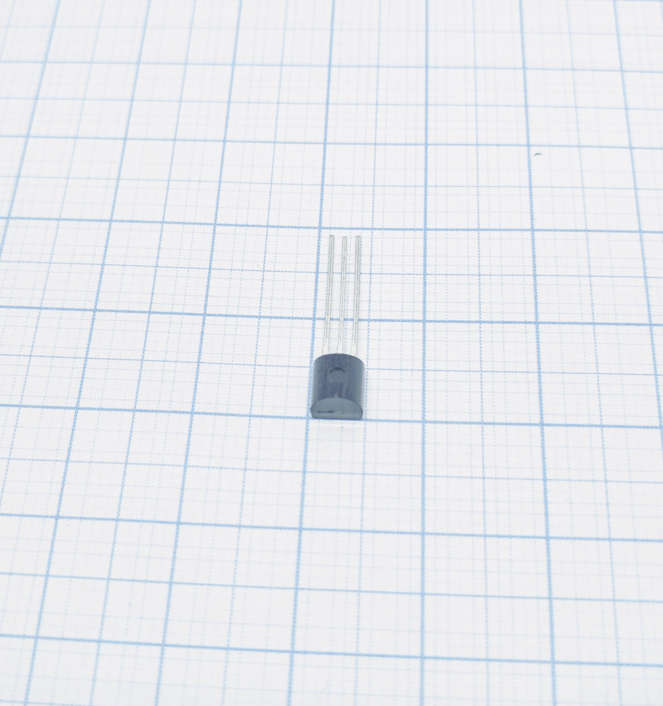
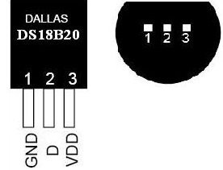
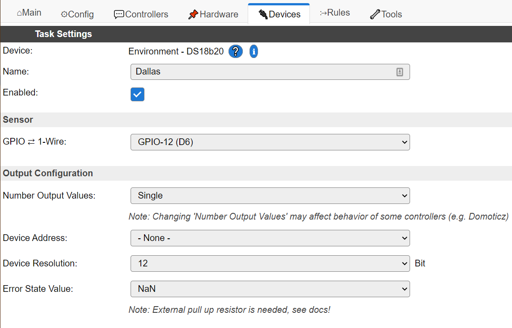
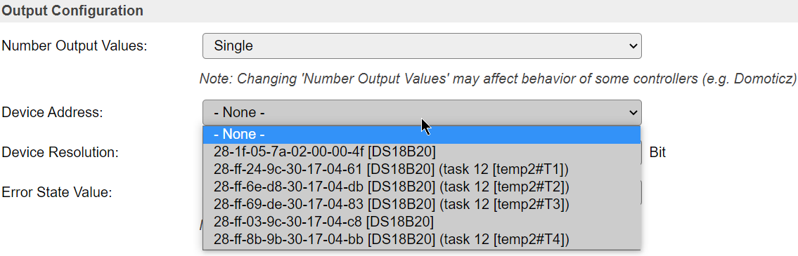
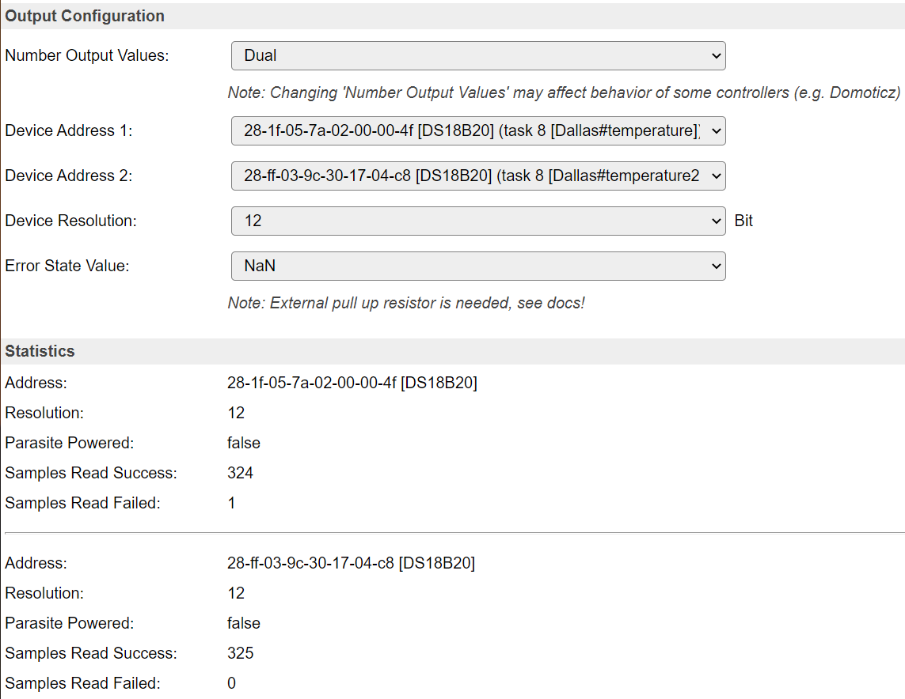
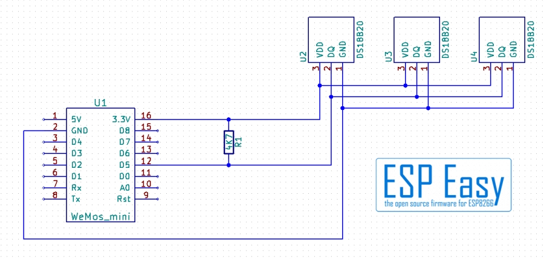
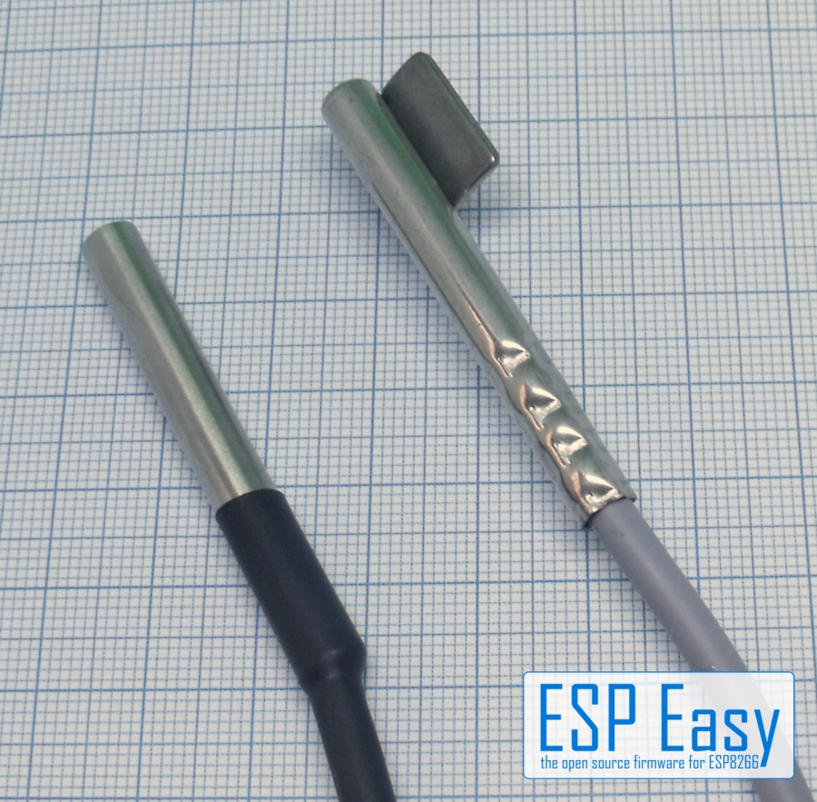
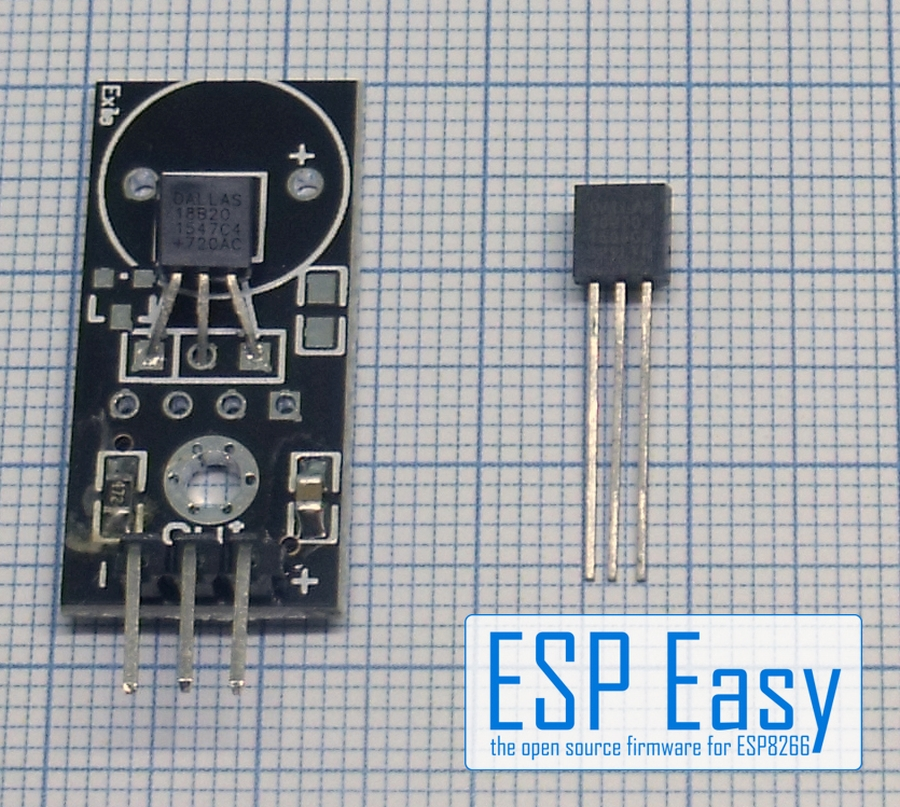

.. _P004_DS18b20_page:

.. |br| raw:: html

      

DS18b20 temperature sensor
==========================

|br|

Introduction
------------

.. note:: Beware of cheap remakes from the Chinese market. They might have wider tolerance and/or different pinouts.
    The DS18B20 manufactured by Dallas and Maxim is a very simple to use temperature sensor with a tolerance of ±0.5°C.

Its advantages: Very simple to use due to "1-wire" data protocol. Chainable, it is possible to chain up to 100
sensors on one cable (remember ESP Easy has 12 tasks max...). No calibration necessary if the tolerance fits your
needs as the sensor gives digital data directly. Many forms available from bare chip to waterproof and tube sensors.

Specifications:
 * Temperature (-55C to +125C)
 * Voltage requirements: 3.3-5V

.. note:: The DS18B20 runs well on 3.3V so no level shifter or special power supply is needed. But the official
    statement is that you should use 5V and a level shifter if you have multiple sensors on a long wire.

Wiring
------

|br|

.. code-block:: none

  ESP               DS18b20
  GPIO (14)  <-->   1-wire/D (yellow)

  Power
  3.3/5.0V   <-->   VDD (red)
  GND        <-->   GND (black)

The sensor needs a pull up resistor. If you use the breakout board type the resistor usually is already on the board.
This gets you into problems if using several DS18B20 breakout boards. There should be **only one resistor for the entire line**
so you might have to remove resistors leaving just one at one end of the line.

Typical value for the pull up resistor is 4k7 ohms. For multiple sensors on the same wire this value may need to be lowered a bit.

Do not use very thin cabling! Tested with a 3x0.14mm² cable the length with 5 Sensors was 10 meters, longer cabling did not work.
Use a phone line cable (2x2x0.6mm²) instead if you need long distances up to 50..100 meters. Remember: Use only one pull-up resistor for the whole line!

The preferred structure is a straight line. If possible avoid "stubs". If necessary it can be cabled in a "star" infrastructure.
But be aware that stubs and star form reduce the possible cable length.

Setup
-----

|br|

Task settings
~~~~~~~~~~~~~

* **Device**: Name of plugin
* **Name**: Name of the task (example name **TempN**, where N is a number).
* **Enable**: Should the task be enabled or not

Sensor
^^^^^^

GPIO <--> 1-wire
""""""""""""""""

Pin used for communicating with the Dallas sensor(s).

Please note the pin must be pulled up by a resistor, so only use pins that can be in a pulled up state during boot (thus NOT use GPIO 15 on ESP8266).

Number Output Values
""""""""""""""""""""

(Added 2020-11-16)

Selector to set number of Dallas sensors for this task.

Number of address selectors is based on the set Number Output Values.

If more then one sensor is set to a task, all sensors will be sent a start measurement command in the order they are selected.
After the expected reading period (depending on the set resolution) the sensors will be read in the same order.

This means their measurement period overlap, which can be of great use to make sure the temperature values are taken at the same moment.

Not all controllers can handle reading multiple sensors in a single run. 
For example you cannot send directly to Domoticz controllers running multiple sensors in the same task.
If it is still needed to have multiple sensors in the same task, one can still send the data via rules to Domoticz.

.. note:: Interleaved reading of multiple sensors on a task can only be done if the sensors are powered via their Vdd pin.
          Parasite powered sensors are not supported in this mode.

Device address
""""""""""""""

Selector for a specific **sensor address**.

If a found sensor is already assigned (and saved) to a task, the task name and variable name is shown in the combo box. (Added 2020-11-16)

|br|

.. note:: It may be hard to keep these addresses apart.
          Either add them one by one, or heat up a single one by holding it in your hand.
          When the web page for a Dallas temperature task is loaded the bus is scanned thus newly attached sensors will then show up in the list.

Device resolution
"""""""""""""""""

Possible values: 9..12 bits

The resolution determines the time needed for taking a measurement.
At 12 bit resolution a measurement takes roughly 800 msec.

As temperatures do not change very fast usually a high accuracy can be chosen without problem.
  
N.B. resolution applies to all sensors for this task.

Error State Value
"""""""""""""""""

Select the value to send if the sensor could not be read.

Almost all controllers will not send values if the value is ``NaN``. 
By chosing a specific value one can make sure values are sent.

Statistics
^^^^^^^^^^

Dallas 1-wire sensors may sometimes return a read error.
A typical setup running Dallas sensors on ESPEasy should have less than 1-in-1000 reads fail.

A failed read attempt will be replaced by the set value of the **Error State Value**.

The number of read errors may depend on a number of factors, like cabling or using non genuine sensors.

Some known counterfeit sensors are known to cause problems when used with > 3 on the same bus.
Others always report being "Parasite Powered" while they are not.

The Statistics can help determining why a setup of sensors may not perform as well as it should.

|br|

.. note:: If you need a star infrastructure or stubs or if you need just longer cabling there is a way out.
          One line runs on one GPIO. But nobody said you can't use two GPIO's. If the cabling gets too long or
          you have too much stubs or star cables try to split into two circuits. Place the ESP in the mid and
          cut the line into two circuits, for example "Ground Floor" and "1st Floor". Use two GPIO's, one for each circuit.

.. note:: Usually the DS18B20 works without issues. It's also usual that most problems result from cabling mistakes.
          With long cabling you might get wrong data sometimes. It might be helpful to reduce the resistor a bit, 2.2 kOhm is lowest possible.
          If nothing works disconnect all sensors from line and connect back one by one, checking every time. Cable may be too long
          (or too thin for the given distance). Keep cabling away from other cables to avoid interferences. If necessary place a
          10µF capacitor on the sensors between 3.3v and GND.

Data Acquisition
^^^^^^^^^^^^^^^^

* **Send to controller** 1..3: Check which controller (if any) you want to publish to. All or no controller can be used.
* **Interval**: How often should the task publish its value (5..15 seconds is normal).

Values
^^^^^^^^^^^^^^^^^^^^^^^^^^^^^^^^^
* **Name**: Value Name of temperature indicator.
* **Formula**: Optional math conversion. The measured temperature defaults to Celsius. It can be converted to Fahrenheit by entering this formula:

.. code-block:: none

  (%value%*9/5)+32

Indicators (recommended settings)
^^^^^^^^^^^^^^^^^^^^^^^^^^^^^^^^^

.. csv-table::
  :header: "Indicator", "Value Name", "Interval", "Decimals", "Extra information"
  :widths: 8, 5, 5, 5, 40

  "Temperature", "Celsius", "10", "1", ""

Rules examples
--------------

.. code-block:: none

    On Temperature1#Celsius Do
     If [Temperature1#Celsius]>37
       NeoPixelAll,255,0,0 //Your body temperature is too high!
     Else
       NeoPixelAll,0,255,0 //Body temperature is OK.
     EndIf
    EndOn

.. Commands available
.. ~~~~~~~~~~~~~~~~~~

.. .. include:: P004_commands.repl

Where to buy
------------

.. csv-table::
  :header: "Store", "Link"
  :widths: 5, 40

  "AliExpress","`Link 1 ($) <http://s.click.aliexpress.com/e/bWymv0bQ>`_"
  "Banggood","`Link 2 ($) <https://www.banggood.com/DS18B20-Waterproof-Digital-Temperature-Temp-Sensor-Probe-1M-2M-3M-5M-10M-15M-p-1211828.html?p=V3270422659778201806>`_ `Link 3 ($) <https://www.banggood.com/10Pcs-DS18B20-Temperature-Sensor-DALLAS-18B20-TO-92-Encapsulation-p-953364.html?p=V3270422659778201806>`_ `Link 4 ($) <https://www.banggood.com/5pcs-PT100-DS18B20-Temperature-Sensor-Stainless-Steel-Bushing-Blind-Tube-Protect-Case-Sleeve-6x50mm-p-1212105.html?p=V3270422659778201806>`_"
  "eBay","`Link 5 ($) <https://rover.ebay.com/rover/1/711-53200-19255-0/1?icep_id=114&ipn=icep&toolid=20004&campid=5338336929&mpre=https%3A%2F%2Fwww.ebay.com%2Fsch%2Fi.html%3F_from%3DR40%26_trksid%3Dm570.l1313%26_nkw%3DDS18B20%26_sacat%3D0%26LH_TitleDesc%3D0%26_osacat%3D0%26_odkw%3Dfluid%2Bsensor%2Bmeter>`_"

|affiliate|

More pictures
-------------

|br|

|br|
