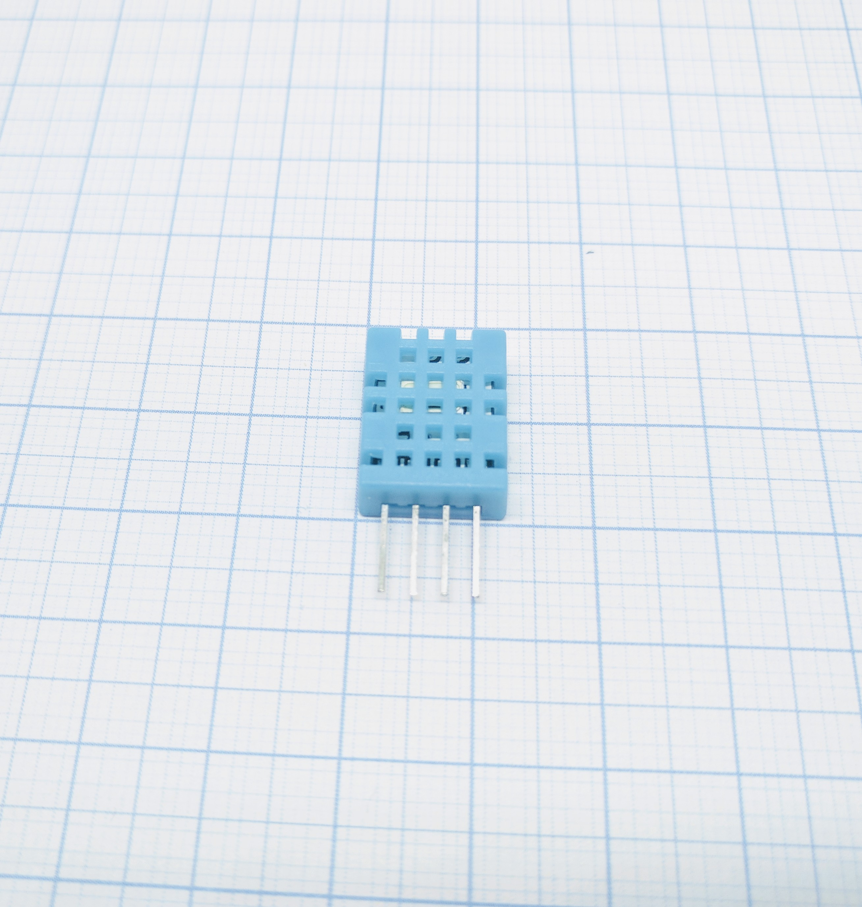
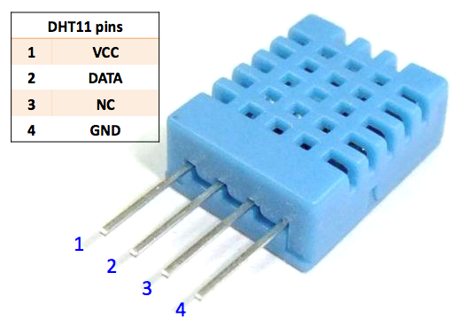
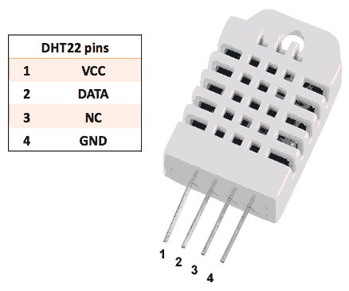
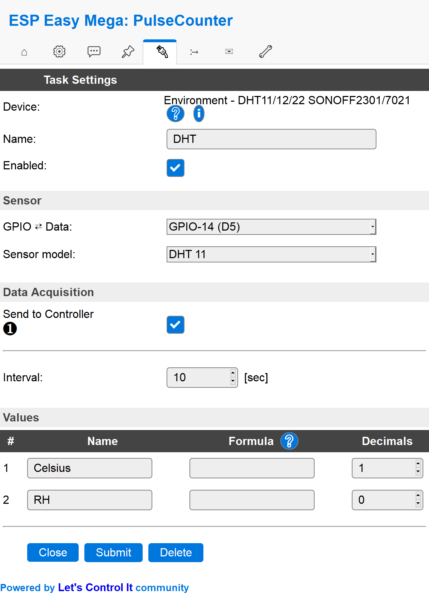

.. include:: ../Plugin/_plugin_substitutions_p00x.repl
.. _P005_DHT11_DHT22_page:

DHT11/DHT22
===========

|P005_typename|
|P005_status|

Introduction
------------

DHT11 and its sibling DHT22 are temperature and humidity sensors which
using a custom 1-wire protocol. That means that they are not compatible with
the same 1-wire bus as standard 1-wire units.

Specifications:
 * Temperature (-40C to +85C)
 * Humidity (0-100 % rel. humidity)

Wiring
------

The DHT sensor needs to be connected to a configurable GPIO on the ESP module.
In case you have a simple ESP-01 module, it's best to use the GPIO-2 pin.

DHT11 (blue)

DHT22 (white)

.. code-block:: none

  ESP               DHT11/DHT22
  GPIO (X)   <-->   Data (2nd pin)

  Power
  5.0V       <-->   VCC (1st pin)
  GND        <-->   GND (4th pin)

.. note:: Do not use GPIO 15 as an input for the DHT11/22. During startup of the
          ESP8266, this pin must be ``LOW`` for proper operation. It is good to
          avoid using GPIO 0 as an input as well. This pin must be ``HIGHT`` at
          startup, unless program mode is required. The data pin of the DHT11/22
          needs a pull-up resistor. A value of 4.7k - 10k proves to be sufficient.

Setup
-----

Task settings
~~~~~~~~~~~~~

* **Device**: Name of plugin
* **Name**: Name of the task (example name **DHT**)
* **Enable**: Should the task be enabled or not

Sensor
^^^^^^

* **GPIO <--> Data**: Pulse input is generally set to **GPIO 14 (D5)**.
* **Sensor model**: Pick your **sensor model**, either DHT11 or DHT22.

Data acquisition
^^^^^^^^^^^^^^^^

* **Send to controller** 1..3: Check which controller (if any) you want to publish to. All or no controller can be used.
* **Interval**: How often should the task publish its value (5..15 seconds is normal).

Indicators (recommended settings)
^^^^^^^^^^^^^^^^^^^^^^^^^^^^^^^^^

.. csv-table::
  :header: "Indicator", "Value Name", "Interval", "Decimals", "Extra information"
  :widths: 8, 5, 5, 5, 40

  "Temperature", "Celsius", "10", "1", ""
  "Humidity", "RH", "10", "1", ""

Rules examples
--------------

.. code-block:: none

    On DHT#Celsius Do
     If [DHT#Celsius]>-15
       NeoPixelAll,255,0,0 //Red light
     Else
       NeoPixelAll,0,255,0 //Green light
     EndIf
    EndOn

.. Commands available
.. ~~~~~~~~~~~~~~~~~~

.. .. include:: P005_commands.repl

How to patch Wemos DHT shield
-----------------------------

The Wemos DHT shield uses a pin which is also toggled at boot disrupting the connected DHT22 sensor.

This causes the sensor to become unresponsive after a reboot.

The DHT sensor needs to be connected to a configurable GPIO on the ESP module. 
In case you have a simple ESP-01 module, it's best to use the GPIO-2 pin.

See this `elaborate post on GitHub <https://github.com/letscontrolit/ESPEasy/issues/2569#issuecomment-688901549>`_ 
describing the problem and how to patch the board to make it work like it should.

Where to buy
------------

.. csv-table::
  :header: "Store", "Link"
  :widths: 5, 40

  "AliExpress","`Link 1 ($) DHT11 <http://s.click.aliexpress.com/e/Rw9LhDW>`_ `Link 2 ($) DHT22 <http://s.click.aliexpress.com/e/bym03SW8>`_"
  "Banggood","`Link 3 ($) DHT11 <https://www.banggood.com/KY-015-DHT11-Temperature-Humidity-Sensor-Module-For-Arduino-p-916173.html?p=V3270422659778201806>`_ `Link 4 ($) DHT22 <https://www.banggood.com/AM2302-DHT22-Temperature-And-Humidity-Sensor-Module-For-Arduino-SCM-p-937403.html?p=V3270422659778201806>`_"
  "eBay","`Link 5 ($) DHT11 <https://rover.ebay.com/rover/1/711-53200-19255-0/1?icep_id=114&ipn=icep&toolid=20004&campid=5338336929&mpre=https%3A%2F%2Fwww.ebay.com%2Fsch%2Fi.html%3F_from%3DR40%26_trksid%3Dm570.l1313%26_nkw%3DDHT11%26_sacat%3D0%26LH_TitleDesc%3D0%26_osacat%3D0%26_odkw%3DDHT11>`_ `Link 6 ($) DHT22 <https://rover.ebay.com/rover/1/711-53200-19255-0/1?icep_id=114&ipn=icep&toolid=20004&campid=5338336929&mpre=https%3A%2F%2Fwww.ebay.com%2Fsch%2Fi.html%3F_from%3DR40%26_trksid%3Dm570.l1313%26_nkw%3DDHT22%26_sacat%3D0%26LH_TitleDesc%3D0%26_osacat%3D0%26_odkw%3DDHT22>`_"

|affiliate|

.. More pictures
.. -------------
