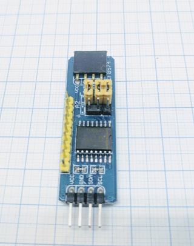
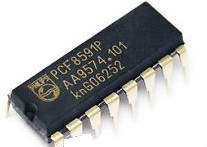
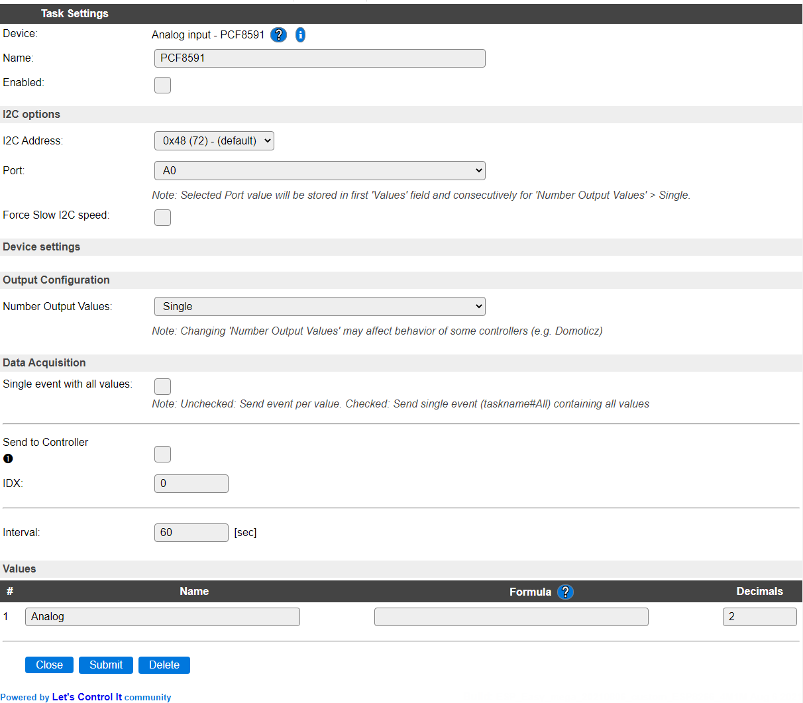
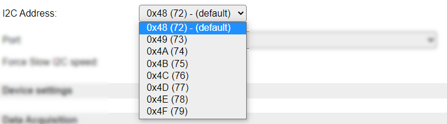
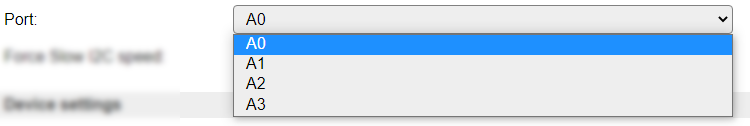
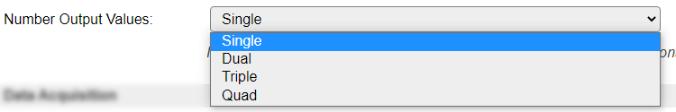
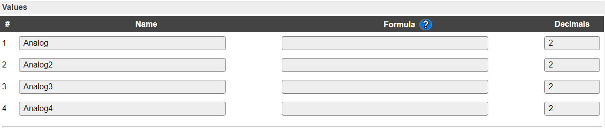
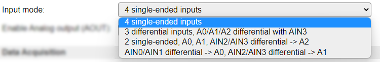
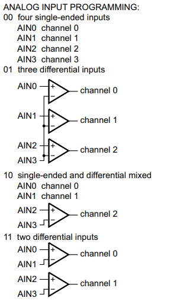

.. include:: ../Plugin/_plugin_substitutions_p00x.repl
.. _P007_page:

|P007_typename|
==================================================

|P007_shortinfo|

Plugin details
--------------

Type: |P007_type|

Name: |P007_name|

Status: |P007_status|

GitHub: |P007_github|_

Maintainer: |P007_maintainer|

Used libraries: |P007_usedlibraries|

Introduction
------------

The PCF8591 is an Analog to Digital and Digital to Analog converter, connected via an I2C bus. The plugin supports to read from 1 up to 4 input values, and has a single analog output that can be changed by a command. If desired, multiple Tasks *can* be defined, addressing other, or duplicate, inputs.

Supported hardware
------------------

The chip is separately available, or on a complete module, and can be bought from several sources.

it is compatible with 3.3V logic, when powered with 3.3V, so no level converters are needed to connect it to an ESP.

|P007_usedby|

Configuration
-------------

* **Name** A unique name should be entered here.

* **Enabled** The device can be disabled or enabled. When not enabled the device should not use any resources.

I2C Options 
^^^^^^^^^^^^

The available settings here depend on the build used. At least the **Force Slow I2C speed** option is available, but selections for the I2C Multiplexer can also be shown. For details see the :ref:`Hardware_page`

As the chip is specified to only work correctly up to 100 kHz, the **Force Slow I2C speed** checkbox should normally be *enabled*.

* **I2C Address**: The address the device is using. There are a number of addresses the module can use, and they can usually be set at the board using jumper pins.

The available options:

* **Port** As there are multiple Ports available on each board, the desired Port can be selected here.

Available options:

* **Force Slow I2C Speed** Should be **enabled**, as by PCF8591 chip specification, the I2C bus clock should be **max. 100 kHz**. This is the default **Slow device Clock Speed** I2C setting for ESPEasy (see Hardware tab). When using the default I2C Clock Speed of 400 kHz, readings will be unreliable, *especially* when reading multiple values in 1 task.

Output Configuration
^^^^^^^^^^^^^^^^^^^^

* **Number Output Values** As this device supports 4 Analog inputs, the number of measurements handled by this task can be configured.

Available options:

The names should speak for themselves.

When selecting f.e. the Quad option and saving the settings, the number of output values is changed to 4, resulting in these Values:

.. note::
   If Port is set to A1, A2 or A3, then the value measured from the selected **Port** will be stored in the first Values field, and any next field(s) consecutively. If **Number Output Values** is larger than the remaining number of Ports, then the remaining Values will be set to 0!

   For any 'excess' values, events *will* be generated!

Hardware configuration
^^^^^^^^^^^^^^^^^^^^^^

* **Input mode** The chip supports several input modes, the desired mode can be selected here.

Available options are:

* *4 single-ended inputs* De standard configuration is to have 4 inputs that are measured with regards to GND.
* *3 differential inputs, A0/A1/A2 differential with AIN3* AIN0 .. AIN2 are measured differential to AIN3, resulting in 3 available values.
* *2 single-ended, A0, A1, AIN2/AIN3 differential -> A2* AIN0 and AIN1 are measured with regards to GND into the first 2 values, the third value is measured differentially from AIN2 and AIN3.
* *AIN0/AIN1 differential -> A0, AIN2/AIN3 differential -> A1* 2 values are measured, the first differentially from AIN0 and AIN1, and the second differentially from AIN2 and AIN3.

When configuring a differential option from above list, the 4th and 3rd values are undefined when not used, but can still be read. The results are then undefined.

The chip documentation describes it like this:

* **Enable Analog output (AOUT)** Enabling the Analog output has 2 effects:

1) The AOUT pin can be set to a linear value in the range 0..255 between 0V and Vref (Vref can sometimes be set using a potentiometer on the board) using the ``analogout`` command (see below).

2) The internal oscillator will be enabled continuesly, causing higher power usage, but also improved measurements when reading an analog input as it avoids the startup time of the oscillator that can cause inaccurate readings.

Data Acquisition
^^^^^^^^^^^^^^^^

This group of settings, **Single event with all values**, **Send to Controller** and **Interval** settings are standard available configuration items. Send to Controller is only visible when one or more Controllers are configured.

* **Interval** By default, Interval will be set to 60 sec. It is the frequency used to read sensor values and send these to any Controllers configured for this device.

Values
^^^^^^

The name for the value(s) is initially set to a default name, but can be changed if desired. Also, a formula can be entered to re-calculate a value before display/sending to a controller, and the number of decimals can be changed, for a Temperature, usually 1 decimal is enough to be displayed (value will be rounded).

Commands available
^^^^^^^^^^^^^^^^^^

.. include:: P007_commands.repl

.. Events
.. ~~~~~~

.. .. include:: P007_events.repl

Change log
----------

.. versionchanged:: 2.0
  ...

  |added|
  2022-05-08 Selection of Input mode, Enable Analog output (AOUT) and ``analogout`` command.

  |added|
  2021-08-06 Selection of 1 to 4 input values to be read.

  |changed|
  2021-08-03 Replaced single Port inputfield with separate I2CAddress and Port selections.

  |added|
  Major overhaul for 2.0 release.

.. versionadded:: 1.0
  ...

  |added|
  Initial release version.

