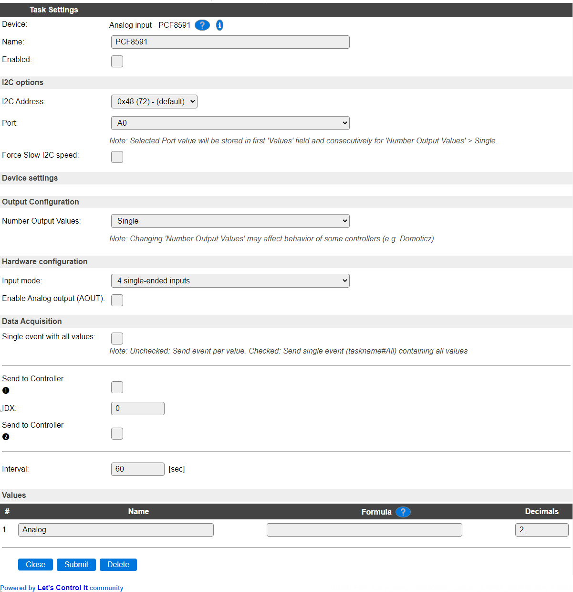
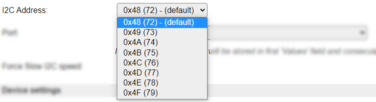
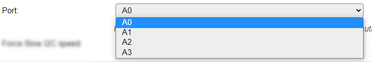

.. include:: ../Plugin/_plugin_substitutions_p00x.repl
.. _P007_page:

|P007_typename|
==================================================

|P007_shortinfo|

Plugin details
--------------

Type: |P007_type|

Name: |P007_name|

Status: |P007_status|

GitHub: |P007_github|_

Maintainer: |P007_maintainer|

Used libraries: |P007_usedlibraries|

Introduction
------------

The PCF8591 is an Analog to Digital converter, connected via an I2C bus. The plugin supports to read 1 input, if more inputs need to be read, extra Tasks can be defined, addressing the extra inputs.

Supported hardware
------------------

The chip is separately available, or on a complete module, and can be bought from several sources.

it is compatible with 3.3V logic, when powered with 3.3V, so no level converters are needed to connect it to an ESP.

|P007_usedby|

Configuration
-------------

**Name** A unique name should be entered here.

**Enabled** The device can be disabled or enabled. When not enabled the device should not use any resources.

I2C Options 
^^^^^^^^^^^^

The available settings here depend on the build used. At least the **Force Slow I2C speed** option is available, but selections for the I2C Multiplexer can also be shown. For details see the :ref:`Hardware_page`

**I2C Address**: The address the device is using. There are a number of addresses the module can use, and they can usually be set at the board using jumper pins.

The available options:

**Port** As there are multiple Ports available on each board, the desired Port can be selected here.

Available options:

Data Acquisition
^^^^^^^^^^^^^^^^

This group of settings, **Single event with all values**, **Send to Controller** and **Interval** settings are standard available configuration items. Send to Controller is only visible when one or more Controllers are configured.

**Interval** By default, Interval will be set to 60 sec. It is the frequency used to read sensor values and send these to any Controllers configured for this device.

Values
^^^^^^

The name for the value is initially set to a default name, but can be changed if desired. Also, a formula can be entered to re-calculate the value before display/sending to a controller, and the number of decimals can be changed, for Temperature, usually 1 decimal is enough to be displayed (value will be rounded).

.. Commands available
.. ^^^^^^^^^^^^^^^^^^

.. .. include:: P007_commands.repl

.. Events
.. ~~~~~~

.. .. include:: P007_events.repl

Change log
----------

.. versionchanged:: 2.0
  ...

  |added|
  2021-08-03 Replaced single Port inputfield with separate I2CAddress and Port selections.

  |added|
  Major overhaul for 2.0 release.

.. versionadded:: 1.0
  ...

  |added|
  Initial release version.

