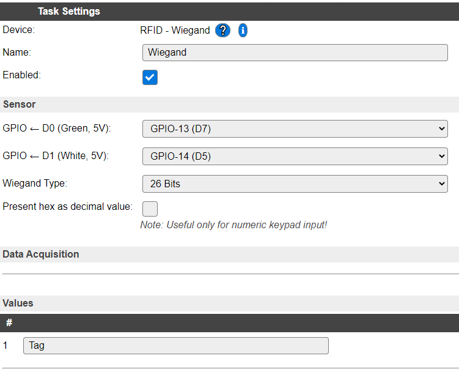

.. include:: ../Plugin/_plugin_substitutions_p00x.repl
.. _P008_page:

|P008_typename|
==================================================

|P008_shortinfo|

Plugin details
--------------

Type: |P008_type|

Name: |P008_name|

Status: |P008_status|

GitHub: |P008_github|_

Maintainer: |P008_maintainer|

Used libraries: |P008_usedlibraries|

Description
-----------

The Wiegand plugin reads the Wiegand protocol, either the 26 or 34 bit variant, transmitted over a 2-wire serial connection. The RFID reader or keypad has to be connected to two GPIO pins on the ESP module. The plugin uses an interrupt routine to decode the bitstream. A RFID reader will send a message containing the unique RFID Tag ID. A keypad will send the input after pressing the #, or another configured, confirmation key.

Data is transmitted in hexadecimal format.
For numeric keypads an option is provided to transform the hex value into a decimal representation, so that when entering value 1234# (# is the confirmation key here), not the result 4660 (0x1234) is made available, but actually 1234. This for easier processing/validating of the entered value. Any input of A-F is replaced by 0 when this option is enabled! It should not be enabled when using a RFID reader, as the Tag ID won't be correct.

The value is placed in the Tag variable (this name can be changed).

Supported hardware
------------------

|P008_usedby|

.. Commands available
.. ^^^^^^^^^^^^^^^^^^

.. .. include:: P008_commands.repl

.. Events
.. ~~~~~~

.. .. include:: P008_events.repl

Change log
----------

.. versionchanged:: 2.0
  ...

  |added|
  Major overhaul for 2.0 release.

.. versionadded:: 1.0
  ...

  |added|
  Initial release version.

