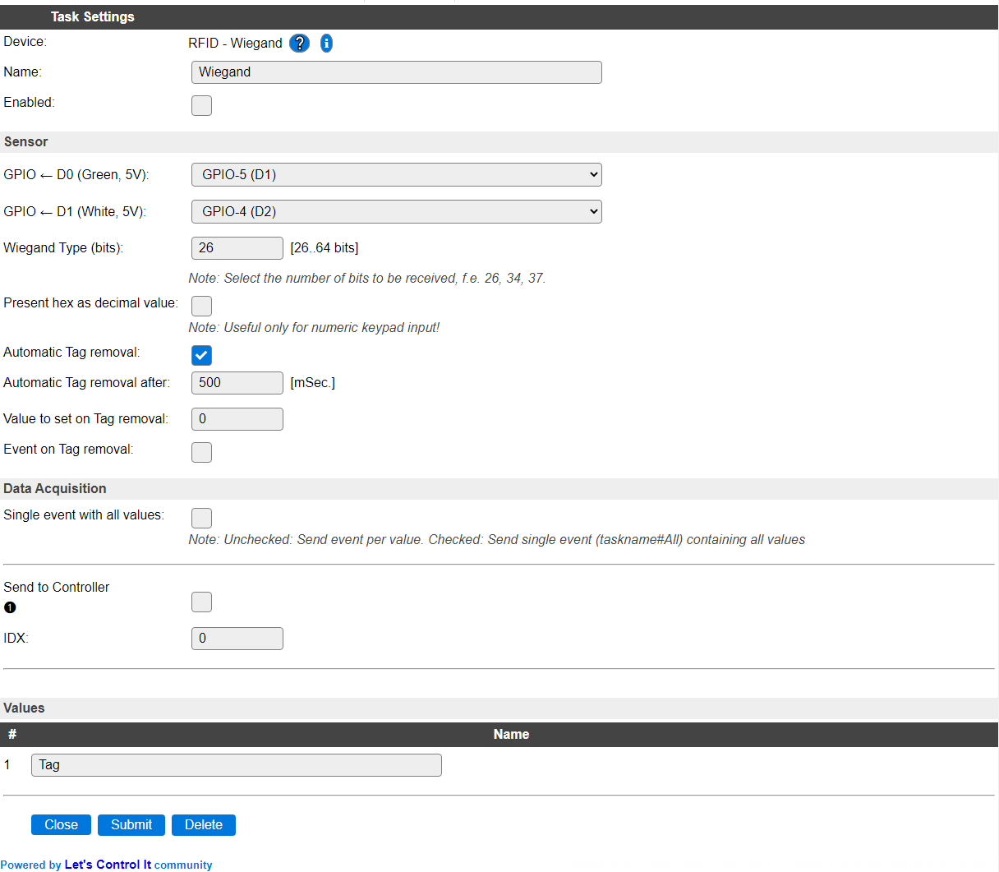

.. include:: ../Plugin/_plugin_substitutions_p00x.repl
.. _P008_page:

|P008_typename|
==================================================

|P008_shortinfo|

Plugin details
--------------

Type: |P008_type|

Name: |P008_name|

Status: |P008_status|

GitHub: |P008_github|_

Maintainer: |P008_maintainer|

Used libraries: |P008_usedlibraries|

Description
-----------

The Wiegand plugin reads the Wiegand protocol, from 26 to 64 bits (mostly 26, 34 or 37 is used), transmitted over a 2-wire serial connection. The RFID reader or keypad has to be connected to two GPIO pins on the ESP module. The plugin uses an interrupt routine to decode the bitstream. A RFID reader will send a message containing the unique RFID Tag ID. A keypad will send the input after pressing the #, or another configured, confirmation key.

Data is transmitted in hexadecimal format. (See below for an option to transform to decimal when using a decimal numeric keypad.)

The value is placed in the Tag variable (this name can be changed).

* **Enable backward compatibility mode** (Added: 2021-11-20) When enabled, uses the GPIO pins in 'reversed' mode, to be compatible with previous versions of this plugin (by default it will be enabled when updating an existing device/task), to ensure the same Tag results are given as on previous ESPEasy releases. When unchecked (default when newly added), the scan results will be the same as received with other Wiegand protocol RFID & Keypad readers.

* **Wiegand Type (bits)** Select the number of bits to expect from the device. Often used values are 26 and 34, resulting in 24 and 32 bit received data. Selection allows up to 64 bits to be received, giving a 62 bit value, as 2 bits are used for parity information during transmission, and discarded from the received value. When set too high, no data will be recognized, and automatic resets will appear in the log after 5 seconds (``Info   : RFID : reset bits: nn``).

* **Present hex as decimal value** (Disabled by default) For decimal numeric keypads this option is provided to transform the hex value into a decimal representation, so that when entering value 1234# (# is the confirmation key here), not the result 4660 (0x1234) is made available, but actually 1234. This for easier processing/validating of the entered value. Any input of A-F is replaced by 0 when this option is enabled! It should not be enabled when using a RFID reader, as the Tag ID won't be correct!

* **Automatic Tag removal** (Enabled by default) after scanning a tag, it can be automatically removed (reset).

* **Automatic Tag removal after** (Default 500 mSec) The timeout in milli seconds (range 250 - 60000) after which the last Tag will be automatically removed, if that option is enabled.

* **Value to set on Tag removal** (Default 0) Set a value to the Tag when the previous tag is removed. (Range 0 to 2147483647 as larger values are difficult to store in settings.)

* **Event on Tag removal** (Disabled by default) When enabled sends the removed Tag value as an event and to all enabled controllers.

Supported hardware
------------------

|P008_usedby|

.. Commands available
.. ^^^^^^^^^^^^^^^^^^

.. .. include:: P008_commands.repl

.. Events
.. ~~~~~~

.. .. include:: P008_events.repl

Change log
----------

.. versionchanged:: 2.0
  ...

  |improved| 2022-08-02 Make plugin multi-instance compatible.

  |improved| 2021-11-20 Correct reverted GPIO/interrupt handlers with optional backward compatibility mode.

  |added| 2021-08-23 Extended selection of received bits to 26..64 bit range.

  |added|
  Major overhaul for 2.0 release.

.. versionadded:: 1.0
  ...

  |added|
  Initial release version.
