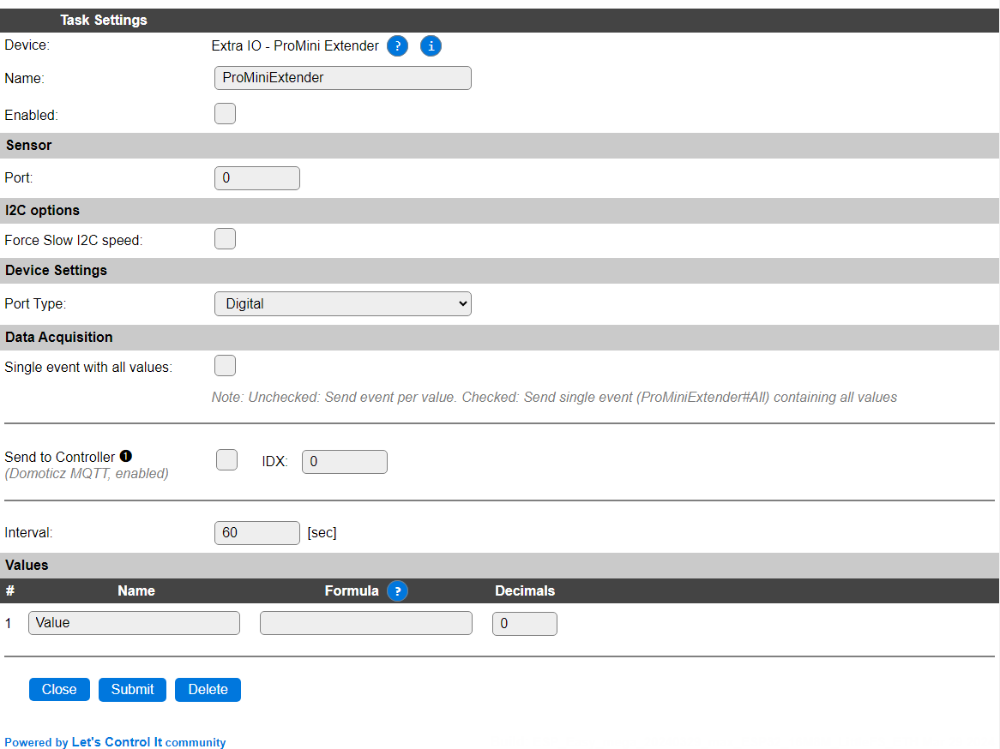
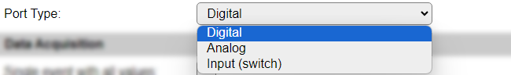

.. include:: ../Plugin/_plugin_substitutions_p01x.repl
.. _P011_page:

|P011_typename|
==================================================

|P011_shortinfo|

Plugin details
--------------

Type: |P011_type|

Name: |P011_name|

Status: |P011_status|

GitHub: |P011_github|_

Maintainer: |P011_maintainer|

Used libraries: |P011_usedlibraries|

Supported hardware
------------------

|P011_usedby|

This plugin supports the Pro Mini Extender, that's a software solution installed on an Arduino Nano, providing 5 available analog input/output pins and 14 digital input/output pins.

The Pro Mini Extender software has to be manually installed on the Arduino Nano (or a Chinese clone), using the ``MiniProExtender`` software project from this `ESPEasySlaves repository <https://github.com/letscontrolit/ESPEasySlaves>`_ via the Arduino IDE.

After installing the software on the Arduino Nano, the simplest solution is to power the PME with 3.3V, even if it's specified for 5V, so no level converter is needed for the I2C connection with the ESP, that only allows for 3.3V signal levels. The 3.3V power has to be connected to the 5V pin on the Arduino Nano, **not** on the 3.3V pin, as that's a low-power output-only pin!

NB: This software can also be installed on other Arduino models, that support I2C, Analog and Digital pins, but this hasn't been actively tested. Depending on the available IO pins, some of the features may not match with the Arduino Nano.

Device Configuration
--------------------

* **Name** A unique name should be entered here.

* **Enabled** The device can be disabled or enabled. When not enabled the device should not use any resources.

Sensor
^^^^^^

* **Port** Select the port (pin) of the Pro Mini Extender that is addressed by this task. For a *Digital* or *Input (Switch)* the range is 0..13, for an *Analog* input, the available pins are 0..3 and 6..7, as A4 and A5 are the (fixed) I2C pins of the Arduino Nano.

I2C Options 
^^^^^^^^^^^^

The available settings here depend on the build used. At least the **Force Slow I2C speed** option is available, but selections for the I2C Multiplexer can also be shown. For details see the :ref:`Hardware_page`

Device Settings
^^^^^^^^^^^^^^^

* **Port Type**:

* *Digital*: An On/Off Input/Output type of port, every **Interval** the pin is read and the state is made available in the **Value** field.

* *Analog*: Read the current analog value of the port.

* *Input (switch)*: Act like an input switch, the pin is read every 20 msec, and if the state changes, the new state is reported as an event, with the new value. The **Interval** is ignored when this Port Type is selected.

Data Acquisition
^^^^^^^^^^^^^^^^

This group of settings, **Single event with all values**, **Send to Controller** and **Interval** settings are standard available configuration items. Send to Controller is only visible when one or more Controllers are configured.

**Interval** By default, Interval will be set to 60 sec. It is the frequency used to read sensor values and send these to any Controllers configured for this device.

Values
^^^^^^

The single **Value** available holds the last digital, analog or input (switch) state value.

Commands available
^^^^^^^^^^^^^^^^^^

.. include:: P011_commands.repl

.. Events
.. ~~~~~~

.. .. include:: P011_events.repl

Get Config Values
^^^^^^^^^^^^^^^^^

Get Config Values retrieves values or settings from the sensor or plugin, and can be used in Rules, Display plugins, Formula's etc. The square brackets **are** part of the variable. Replace ``<taskname>`` by the **Name** of the task.

.. include:: P011_config_values.repl

Change log
----------

.. versionchanged:: 2.0
  ...

  |added| 2024-03: Add Input (switch) option.

  |added|
  Major overhaul for 2.0 release.

.. versionadded:: 1.0
  ...

  |added|
  Initial release version.

