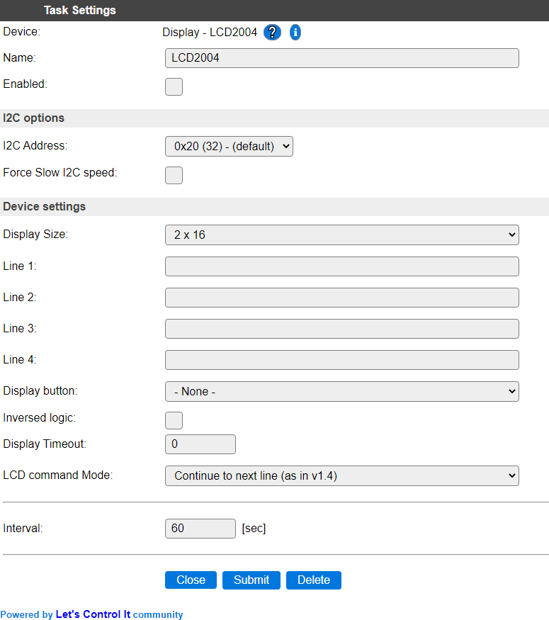
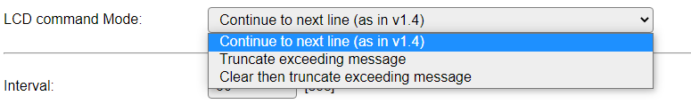
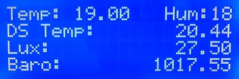

.. include:: ../Plugin/_plugin_substitutions_p01x.repl
.. _P012_page:

|P012_typename|
==================================================

|P012_shortinfo|

Plugin details
--------------

Type: |P012_type|

Name: |P012_name|

Status: |P012_status|

GitHub: |P012_github|_

Maintainer: |P012_maintainer|

Used libraries: |P012_usedlibraries|

Description
-----------

This plugin can be used to control an I2C connected LCD display. These displays often offer 2 lines of 16 characters or 4 lines of 20 characters for displaying all kinds of information.

Configuration
-------------

After adding the plugin to a Task in the Devices list, it should be configured for proper operation.

**Name** A unique name should be entered here.

**Enabled** The device can be disabled or enabled. When not enabled the device should not use any resources.

I2C Options 
^^^^^^^^^^^^

The available settings here depend on the build used. At least the **Force Slow I2C speed** option is available, but selections for the I2C Multiplexer can also be shown. For details see the :ref:`Hardware_page`

**I2C Address**: The address the device is using. Most devices allow a configurable address, usually the information on how to set/change that address is available on the printed circuit board, or on the manufacturers website.

Device Settings
^^^^^^^^^^^^^^^^

**Display Size** Select the size of the display, either 2x16 characters or 4x20 characters can be selected.

**Line 1..4** Up to 4 lines can be pre-configured with text to display. For the 2x16 device size, only Line 1 and 2 will be used. Variables can be used, f.e. to display values provided by a sensor.

**Display button** A button can be configured to enable the display on demand. This function is enabled by selecting a GPIO pin to monitor. Combined with Inversed login and Display Timeout the display will be automatically turned off after the timeout has expired.

**Inversed logic** Normally the Display button GPIO pin must be connected to GND to activate the display. With this option checked the signal should be normally connected to ground, and get a high level (3.3V) to turn the display on. This way, f.e. a PIR sensor or touch button that provides an active-high signal can be used.

**Display Timeout** This defines how long the display will be turned on when the Display button turns it on (or after the start of the display). The timeout unit is seconds.

**LCD Command mode** 

*Continue to next line (as in v1.4)* Compatible with older versions mode, where text sent via rules, http or mqtt, will wrap over to the next line when longer then the display is wide.

*Truncate exceeding message* When text to display is too long to fit, the excess won't be displayed (discarded).

*Clear then truncate exceeding message* This will first clear the line where the text is to be displayed from the column where it is to start, and then the actual text will be displayed, discarding any text beyond the width of the display.

The Interval setting defines the delay in seconds between updates of the display. When the Line 1..4 fields are used, these lines will be updated with the updated data of any variables used there.

Build Info
----------

To support characters used in the Polish language, add this define: ``USES_P012_POLISH_CHARS``

Supported hardware
------------------

|P012_usedby|

Example photo of a 4x20 (LCD2004) display:

.. warning:: When using a 5V powered display with on-board pull-up resistors on the I2C bus, a level-convert should be used to connect to an ESP to avoid damage to the 3.3V I2C bus on the ESP and any other I2C devices connected!

Commands available
^^^^^^^^^^^^^^^^^^

.. include:: P012_commands.repl

Change log
----------

.. versionchanged:: 2021-05-03
  ...

  |added|
  Inversed logic setting to allow high-active Display button.

.. versionchanged:: 2020-09-14
  ...

  |added|
  Support for characters used in Polish language, define  ``USES_P012_POLISH_CHARS`` to include those in a build.

.. versionadded:: 1.0
  ...

  |added|
  Initial release version.
