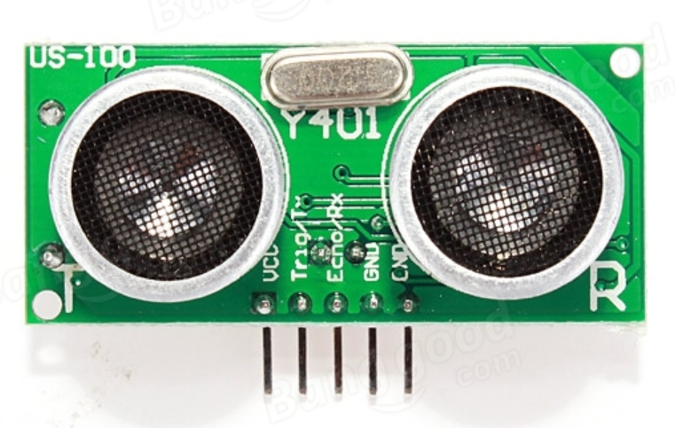
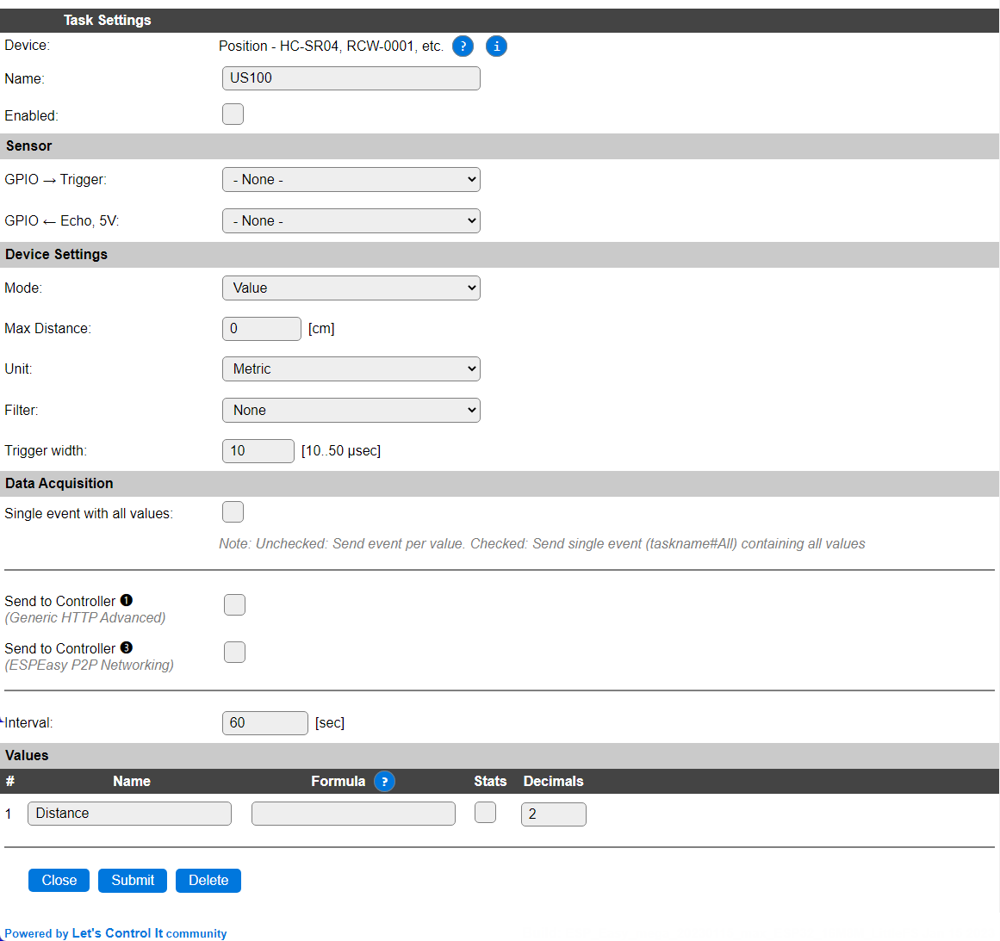

.. include:: ../Plugin/_plugin_substitutions_p01x.repl
.. _P013_US-100_page:

US-100
======

|P013_typename|
|P013_status|

Introduction
------------

The US-100 is a ultrasonic distance sensor. It's able to indicate distances between 2 cm up to about 300 cm
at a resolution of about 0.3 cm.

Specifications:
 * Ultrasonic distance sensor
 * Measure angle: 30°
 * Ranging distance: 2cm - 300cm (some have reporting it work good up to 400 cm)

Wiring
------

The US-100 must be run on 5V. Running it with 3.3V will show very weak results or nothing at all.

.. code-block:: html

  ESP               US-100
  GPIO (X)   <-->   Trigger
  GPIO (X)   <-->   Echo (voltage divider!)

  Power
  5.0V       <-->   VCC
  GND        <-->   GND

.. warning:: Do not connect 5V directly to the ESP! Read more about :ref:`P000_Level_converter_page`.

Setup
-----

Task settings
~~~~~~~~~~~~~

* **Device**: Name of plugin
* **Name**: Name of the task (example name **US100**)
* **Enable**: Should the task be enabled or not

Sensor
^^^^^^

* **GPIO --> Trigger**: Set the GPIO to trigger the signal.
* **GPIO --> Echo, 5V**: Set the GPIO to receive the echo signal, voltage divider is needed.
* **Mode**: ``Value`` is the most used setting, it will output the distance in centimeters.
  If you want the plugin to report a ``1`` or a ``0`` you use the ``State`` setting.
  State will open up a new field called "Threshold" which will allow you to enter
  a value. If the unit detects a value below the given threshold the task will be
  set to ``1``, if the detected value is above the given threshold the task will
  be ``0``. You should set the interval to zero in the case of using the state
  setting, just to make sure the action is triggered as soon as possible.
* **Max distance**: Set the max value the task will show. If the actual value is above the
  max distance the max distance will be displayed. Set to ``0`` will disable the max
  distance setting. Max according to the specifications is ``300`` cm.
* **Unit**: You can show the output value as imperial without the need to do it using the formula function.
* **Filter**: The signal might be a bit shaky for some applications, try to use the ``Median`` filtering
  setting in that case.

Data acquisition
^^^^^^^^^^^^^^^^

* **Send to controller** 1..3: Check which controller (if any) you want to publish to. All or no controller can be used.
* **Interval**: How often should the task publish its value (1..5 seconds is normal for the ``value`` setting, 0 for the ``state`` setting).

Indicators (recommended settings)
^^^^^^^^^^^^^^^^^^^^^^^^^^^^^^^^^

.. csv-table::
   :header: "Indicator", "Value Name", "Interval", "Decimals", "Extra information"
   :widths: 8, 5, 5, 5, 40

   "Distance", "Distance", "1", "1", "Used to get the actual distance that the sensor is measuring."
   "State", "State", "0", "0", "Used to set the value high or low, just like a normal switch input device."

Rules examples
--------------

.. code-block:: html

   on US100#distance do
    if [US100#distance]<50 and [US100#distance]>45
      GPIO,14,1 //light up LED to show that you're at the correct position
    else
      GPIO,14,0
    endif
   endon

.. Commands available
.. ~~~~~~~~~~~~~~~~~~

.. .. include:: P013_commands.repl

Where to buy
------------

.. csv-table::
  :header: "Store", "Link"
  :widths: 5, 40

  "AliExpress","`Link 1 ($) <http://s.click.aliexpress.com/e/cGKb9zcy>`_"
  "eBay","`Link 2 ($) <https://rover.ebay.com/rover/1/711-53200-19255-0/1?icep_id=114&ipn=icep&toolid=20004&campid=5338336929&mpre=https%3A%2F%2Fwww.ebay.com%2Fsch%2Fi.html%3F_from%3DR40%26_trksid%3Dm570.l1313%26_nkw%3DUS-100%26_sacat%3D0%26LH_TitleDesc%3D0%26_osacat%3D0%26_odkw%3DRCW-0001>`_"

|affiliate|

.. More pictures
.. -------------
