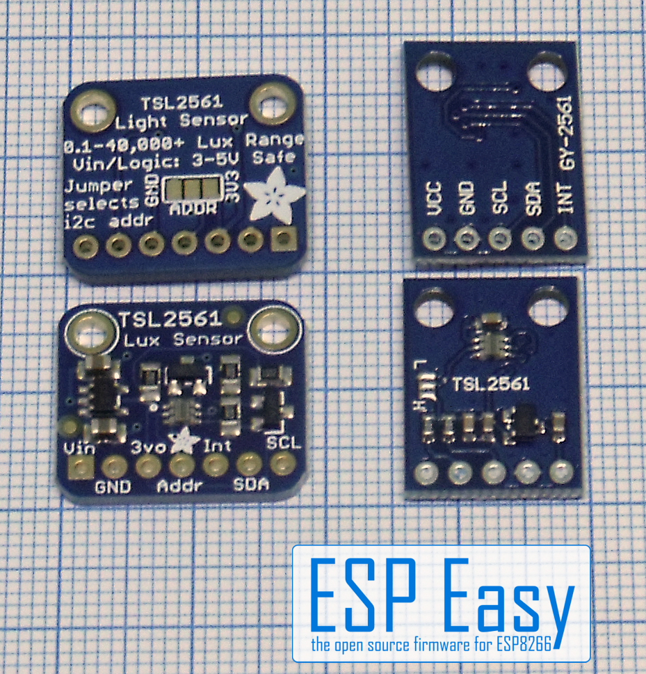
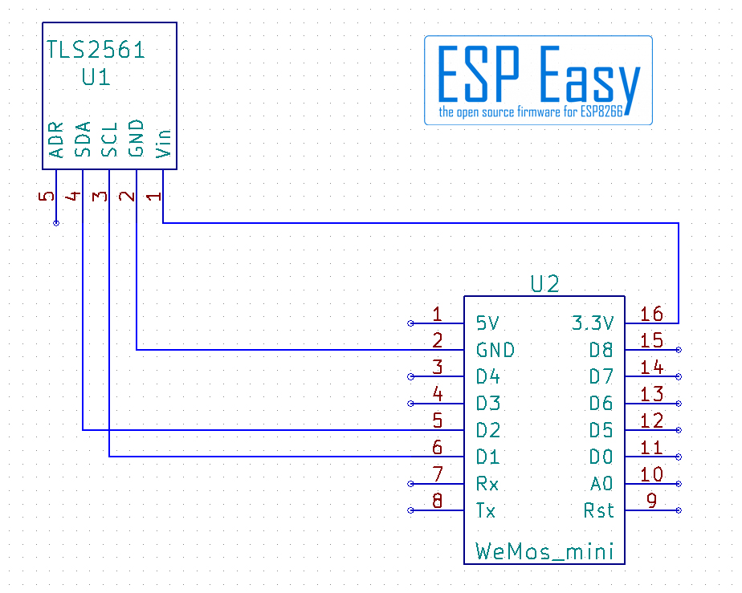
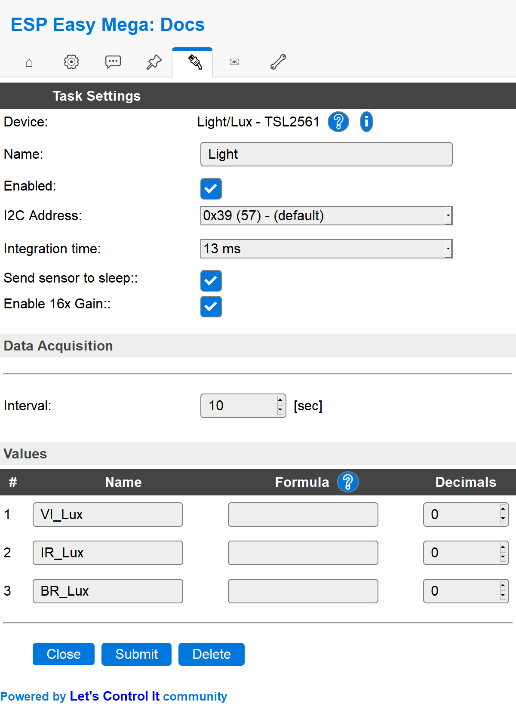

.. include:: ../Plugin/_plugin_substitutions_p01x.repl
.. _P015_TSL2561_page:

TSL2561
=======

|P015_typename|
|P015_status|

Introduction
------------
The TSL2561 are light-to-digital converters that transform light intensity to a digital
signal output. First targeted to accompany LCD and OLED displays in order to dim them
if the ambient light is lower, making the battery life better for the unit its a part of.
The unit can also be found in illuminated keyboards and digital cameras.

The TSL2561 sensor is a luminosity sensor. It's spectral sensitivity approximately meets
the human eye sensitivity. The gain of the sensor can be set to a 16x gain mode with the settings.
It is connected to the ESP via I²C so connecting even with several sensors and a display is easy to do.

Specifications:
 * Output: 0.1 - 40 000+ Lux
 * Temperature (-30 to +70C but best readings between +5 to +50C)
 * Humidity (0 - 60 % rel. humidity)

Wiring
------

.. image:: P015_TSL2561_2.jpg

.. code-block:: none

  ESP               TSL2561
  GPIO (5)   <-->   SCL
  GPIO (4)   <-->   SDA
                    ADDR (not used = 0x39)

  Power
  3.3V       <-->   VCC
  GND        <-->   GND

The ADDR pin can be used if you have an i2c address conflict, to change the address.

Connect it to GND to set the address to 0x29.

Connect it to VCC (3.3V) to set the address to 0x49.

Leave it floating (unconnected) to use address 0x39.

Some boards have soldering pads or jumper selectors for the ADDR.

Setup
-----

Task settings
~~~~~~~~~~~~~

* **Device**: Name of plugin
* **Name**: Name of the task (example name **Light**)
* **Enable**: Should the task be enabled or not

Sensor
^^^^^^

* **I2C Address**: Default 0x39 is used.
* **Integration time**: 13 msec is the default, works in normal lit areas. Increase the integration time for low light areas, it will collect light longer if set to longer time.
* **Send sensor to sleep**: Have it checked in order to save the unit from wear, especially good if you do measurements with long intervals in between.
* **Enable 16x Gain**: Have it checked in order to get higher readings in low light areas.

Data acquisition
^^^^^^^^^^^^^^^^

* **Send to controller** 1..3: Check which controller (if any) you want to publish to. All or no controller can be used.
* **Interval**: How often should the task publish its value (5..15 seconds is normal).

Indicators (recommended settings)
^^^^^^^^^^^^^^^^^^^^^^^^^^^^^^^^^

.. csv-table::
  :header: "Indicator", "Value Name", "Interval", "Decimals", "Extra information"
  :widths: 8, 5, 5, 5, 40

  "Visible light", "VI_Lux", "10", "0", "In normal lit areas you probably don't need a decimal."
  "Infrared light", "IR_Lux", "10", "0", "Light not visible to humans but felt in some cases, used in dry saunas and patio heating etc."
  "Broadband light", "BR_Lux", "10", "0", "Visible or near visible light that is felt, used in skin treatments etc."

Rules examples
--------------

.. code-block:: none

    on Light#VI_Lux do
     if Light#VI_Lux>100
       Publish,%sysname%/light,Is on
     else
       Publish,%sysname%/light,Is off
     endif
    endon

.. Commands available
.. ~~~~~~~~~~~~~~~~~~

.. .. include:: P015_commands.repl

Where to buy
------------

.. csv-table::
 :header: "Store", "Link"
 :widths: 5, 40

 "AliExpress","`Link 1 ($) <http://s.click.aliexpress.com/e/1Cehi80>`_"
 "Banggood","`Link 2 ($) <https://www.banggood.com/custlink/33GDYjRHyC>`_"
 "eBay","`Link 3 ($) <https://rover.ebay.com/rover/1/711-53200-19255-0/1?icep_id=114&ipn=icep&toolid=20004&campid=5338336929&mpre=https%3A%2F%2Fwww.ebay.com%2Fsch%2Fi.html%3F_from%3DR40%26_trksid%3Dm570.l1313%26_nkw%3Dtsl2561%26_sacat%3D0>`_"

|affiliate|

.. More pictures
.. -------------

.. .. image:: P015_TSL2561_X.jpg
