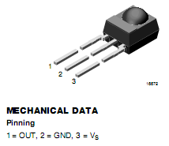
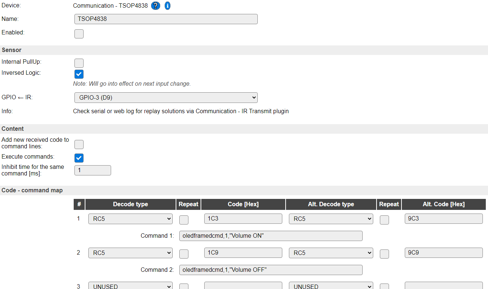

Introduction
------------

The Communication - TSOP4838 module can be used to receive IR remote control signals. 

Connect a TSOP module, preferably a 38Khz one, preferably to GPIO with interrupt functionality.

Wiring
------

Connect the digital output (pin 1) to some chosen GPIO pin on the ESP module.

Load the firmware and follow the firmware specific instructions.

A datasheet for the TSOP4838 receiver can be found here: http://www.vishay.com/docs/82459/tsop48.pdf. 

Setup
-----

Task settings
~~~~~~~~~~~~~

* **Device**: Communication - TSOP4838
* **Name**: Name of the task (example name **IR**).
* **Enable**: Should the task be enabled or not

Sensor
^^^^^^

* **Sensor**: standard definition for an GPIO pin setting

Content
^^^^^^^

* **Add new received code to command lines**: After receiving an valid IR code the code is automatically added to the following table if it not already exists.
.. note:: The code is only added automatically to line **Code nn [Hex]:**!
* **Execute commands**: After receiving an valid IR the command that is assigned to this code (**Code nn [Hex]:** or **Alternative code nn [Hex]:**) is executed.
* **Code nn [Hex]:**: If the received valid IR code matches this setting the **Command nn** is executed.
* **Alternative code nn [Hex]:**: If the received valid IR code matches this setting the **Command nn** is executed.
* **Command nn:**: If the received valid IR code matches the code in **Code nn [Hex]:** or **Alternative code nn [Hex]:** this command is executed.
.. note:: Up to 10 commands can be set !

Data acquisition
^^^^^^^^^^^^^^^^

Values
^^^^^^

