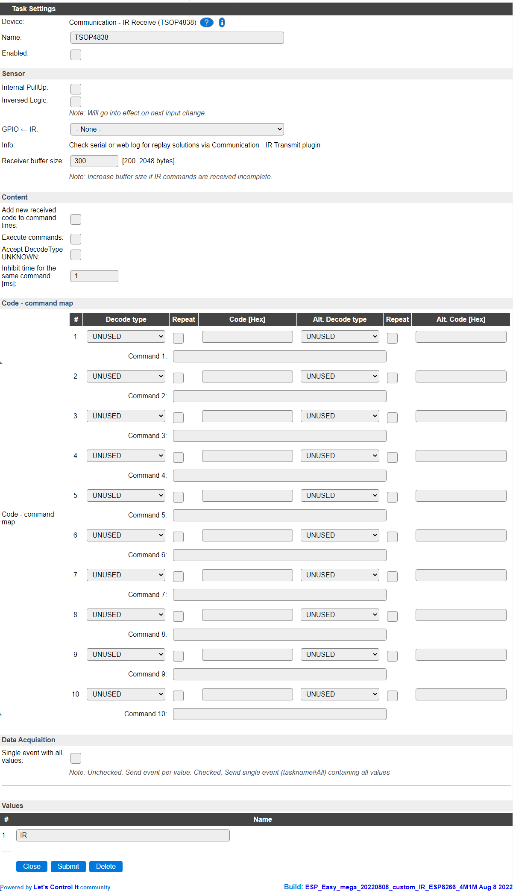

Introduction
------------

The Communication - IR Receive (TSOP4838) module can be used to receive IR remote control signals. 

Connect a TSOP module, preferably a 38Khz one, preferably to GPIO with interrupt functionality.

Wiring
------

Connect the digital output (pin 1) to some chosen GPIO pin on the ESP module.

.. image:: P016_TSOP4838.png

Load the firmware and follow the firmware specific instructions.

A datasheet for the TSOP4838 receiver can be found here: http://www.vishay.com/docs/82459/tsop48.pdf. 

Setup
-----

Task settings
~~~~~~~~~~~~~

* **Device**: Communication - IR Receive (TSOP4838)
* **Name**: Name of the task (example name **IR**).
* **Enable**: Should the task be enabled or not

Sensor
^^^^^^

* **Internal PullUp**: To enable the internal pull-up resistor of the ESP. Usually not needed for the TSOP4838 as it has a built-in pull-up mechanism.

* **Inversed Logic**: Can be used to invert the signal if a different type of receiver is used.

* **GPIO <- IR**: Select the pin that the TSOP is connected to. Avoid selecting a pin that has a warning sign next to it, as that may block the boot process or normal working of the ESP.

* **Receiver buffer size**: For receiving and decoding the data from the sensor, a buffer is needed. For more complex protocols, like often used for Air Conditioner remote controls, a larger buffer may be needed. By default this buffer is dimensioned at 300 bytes (will be rounded up to the next even number when stored), and needs to be enlarged if a message of this intent is shown in the log at INFO level (Either Web or serial log).

Content
^^^^^^^

* **Add new received code to command lines**: After receiving a valid IR code the code is automatically added to the following table if it not already exists.

* **Execute commands**: After receiving a valid IR the command that is assigned to this code (**Code [Hex]** or **Alt. Code [Hex]**) is executed.

* **Inhibit time for the same command [ms]**: The time that a same command will be ignored if receiving it multiple times. When set too high, often repeated commands like volume-up or volume-down will respond slower than expected.

.. note:: The code is *only* added automatically to field **Code [Hex]**!

Code - command map
^^^^^^^^^^^^^^^^^^

* **Decode type**: The type as detected by the receiver, the list contains all supported types.

* **Repeat**: If a repeat code is detected, this is checked.

* **Code [Hex]**: If the received valid IR code matches this setting the **Command nn** is executed.

* **Alt. Decode type**: The type as detected by the receiver, the list contains all supported types.

* **Repeat**: If a repeat code is detected, this is checked.

* **Alt. Code [Hex]**: If the received valid IR code matches this setting the **Command nn** is executed.

* **Command nn**:If the received valid IR code matches the code in **Code [Hex]** or **Alt. Code [Hex]** this command is executed.

.. note:: Up to 10 commands can be set !

.. note:: Using compile-time options, the **Code - command map** and related options can be disabled.

Data acquisition
~~~~~~~~~~~~~~~~

This group of settings, **Single event with all values** settings are standard available configuration items.

Values
~~~~~~

The last received code is available in numeric for in the Value that's selected here. It can be used in rules and other template processing plugins like Display devices.
