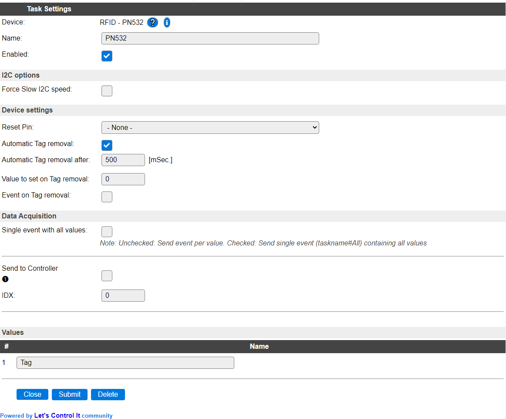

.. include:: ../Plugin/_plugin_substitutions_p01x.repl
.. _P017_page:

|P017_typename|
==================================================

|P017_shortinfo|

Plugin details
--------------

Type: |P017_type|

Name: |P017_name|

Status: |P017_status|

GitHub: |P017_github|_

Maintainer: |P017_maintainer|

Used libraries: |P017_usedlibraries|

Description
-----------

This device reads the tag ID from Mifare tags, cards and stickers using the NXP PN532 NFC chip.

The value is placed in the Tag variable, and can be read from rules and  sent to controllers.

Settings
--------

**Name**: The name for this task, should be unique.

**Enabled**: Allows to enable/disable the device.

Depending on the type of ESPEasy build installed on the unit, the I2C settings may differ, but all builds at least have the below setting. (Complete settings are explained on the documentation for the Hardware page)

**Force Slow I2C speed**: When checked uses the Slow device clock speed, as configured on the Hardware page, for this device. This enables older or slower I2C devices to be used while other devices use the normal (higher) speed.

**Reset Pin**: Optional pin that is pulled low when communication with the device fails a few times.

**Automatic Tag removal** (Enabled by default) after scanning a tag, it can be automatically removed (reset).

**Automatic Tag removal after** (Default 500 mSec) The timeout in milli seconds (range 250 - 60000) after which the last Tag will be automatically removed, if that option is enabled.

**Value to set on Tag removal** (Default 0) Set a value to the Tag when the previous tag is removed. (Range 0 to 2147483647 as larger values are difficult to store in settings.)

**Event on Tag removal** (Disabled by default) When enabled sends the removed Tag value as an event and to all enabled controllers.

Supported hardware
------------------

PN532 based NFC RFID reader connected via I2C on address 0x24.

|P017_usedby|

.. Commands available
.. ^^^^^^^^^^^^^^^^^^

.. .. include:: P017_commands.repl

.. Events
.. ~~~~~~

.. .. include:: P017_events.repl

Change log
----------

.. versionchanged:: 2.0
  ...

  |added|
  Major overhaul for 2.0 release.

  |added|
  2021-01-23: Extra options for tag reset and event on tag reset.

.. versionadded:: 1.0
  ...

  |added|
  Initial release version.

