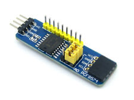
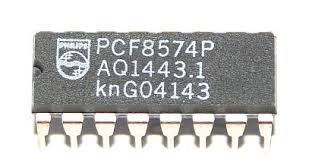
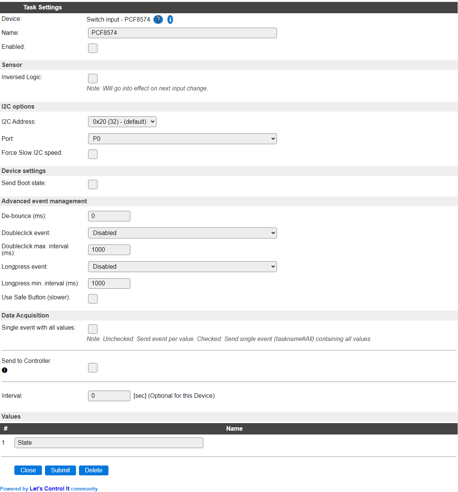
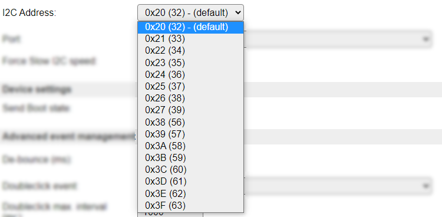
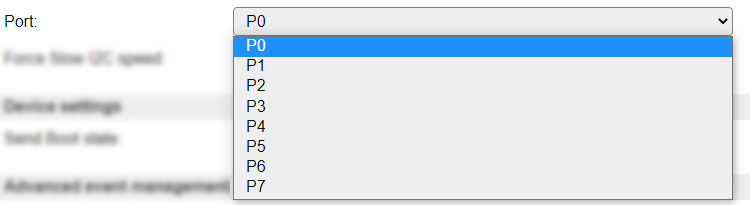

.. include:: ../Plugin/_plugin_substitutions_p01x.repl
.. _P019_page:

|P019_typename|
==================================================

|P019_shortinfo|

Plugin details
--------------

Type: |P019_type|

Name: |P019_name|

Status: |P019_status|

GitHub: |P019_github|_

Maintainer: |P019_maintainer|

Used libraries: |P019_usedlibraries|

Introduction
------------

The number of GPIO pins on the ESP module can be expanded with a IO Expander. This plugin supports the PCF8574 that provides 8 more pins that can be used as input or output. This way it becomes possible to control an 8 channel relay board. Multiple of these boards can be connected, as there are 16 I2C addresses available via jumper pins.

Each individual pin can be used as either input or output. It can also be helpful in improving system stability when using ESPEasy for actuators. The PCF8574 keeps the GPIO states might the ESP reboot (as long as power is not disconnected).

As this plugin shares many attributes with the regular :ref:`P001_Switch_page` plugin, the description has many similarities.

Supported hardware
------------------

The chip can be used on specifically designed hardware, or a generic module can be used. These are available from several sources.

|P019_usedby|

Configuration
-------------

* **Name** A unique name should be entered here.

* **Enabled** The device can be disabled or enabled. When not enabled the device should not use any resources.

Sensor
^^^^^^^

* **Inversed Logic** When enabled, inverts the input signal, so if the pin is logic high (3.3V), the Value will be 0, and if it is logic low (gnd), the Value will be 1.

I2C Options 
^^^^^^^^^^^^

The available settings here depend on the build used. At least the **Force Slow I2C speed** option is available, but selections for the I2C Multiplexer can also be shown. For details see the :ref:`Hardware_page`

* **I2C Address**: The address the device is using. As there are 16 possible I2C addresses, when the jumpers are configured, the selected value should match with that.

There are 2 ranges of addresses used, determined by the chip design, ``0x20..0x27`` and ``0x38..0x3F``.

Available options:

* **Port** As there are multiple Ports available on each board, the desired Port can be selected here.

Available options:

Device Settings
^^^^^^^^^^^^^^^^

* **Send boot state**: If checked the unit will publish the switch state when booting. If not checked you may find yourself
  with a latching switch caught in limbo. This means that the unit is registering a low/high value but the physical state of
  the switch might be the opposite. If you use a mechanical switch that may be physically set to a state you should check this
  option.

Advanced event management
^^^^^^^^^^^^^^^^^^^^^^^^^

* **De-bounce (ms)**: How long should the pulse (the time you press the button) be, if set to high you need to have it published
  for a longer time before the unit will register it as an state change. You could experiment with this setting to find a good
  behavior of the button if you feel that it's not responding according to your preferences.

* **Double click event**: If enabled the unit will detect double clicks which are within the set interval (see below). The double
  click event is identified as :code:`PCF8574#State=3`. There's three options for the double click:
  * Active only on low: the double clicks will be counted by how many low signals that is triggered within the set time.
  * Active only on high: the double clicks will be counted by how many high signals that is triggered within the set time.

  * Active on high & low: the double clicks will be counted by how many high and low signals that is triggered within the set time.
    This means that a double click could be registered as a press and release of a button. So not actually double click.

* **Double click max. interval (ms)**: This is the interval that you need to perform the double click within.

* **Long press event**: If enabled the unit will detect a long press of a button. There's three different behaviors of the long press:

  * Active only on low: this means that the unit will only be triggering the long press event if the signal is low. Two different event
    values are used, :code:`10` if the state goes from 0 to 1 (:code:`PCF8574#State=10`), and  :code:`11` if the state goes
    from 1 to 0 (:code:`PCF8574#State=11`).

  * Active only on high: same as above but only triggered on high signal.
  * Active on high & low: the long press will be triggered both on high and low signals.

* **Long press min interval (ms)**: This is the interval that you need to press the button before the long press event is triggered.

* **Use safe button (slower)**: This effectively adds an extra De-bounce delay and sends event value ``4`` when reached.

Data Acquisition
^^^^^^^^^^^^^^^^

This group of settings, **Single event with all values**, **Send to Controller** and **Interval** settings are standard available configuration items. Send to Controller is only visible when one or more Controllers are configured.

* **Interval** By default, Interval will be set to 60 sec. It is the frequency used to read sensor values and send these to any Controllers configured for this device.

Values
^^^^^^

The name for the value is initially set to a default name, but can be changed if desired.

Commands available
^^^^^^^^^^^^^^^^^^

.. include:: P019_commands.repl

.. Events
.. ~~~~~~

.. .. include:: P019_events.repl

Change log
----------

.. versionchanged:: 2.0
  ...

  |changed|
  2021-08-03 Replaced single Port inputfield with separate I2CAddress and Port selections.

  |added|
  Major overhaul for 2.0 release.

.. versionadded:: 1.0
  ...

  |added|
  Initial release version.

