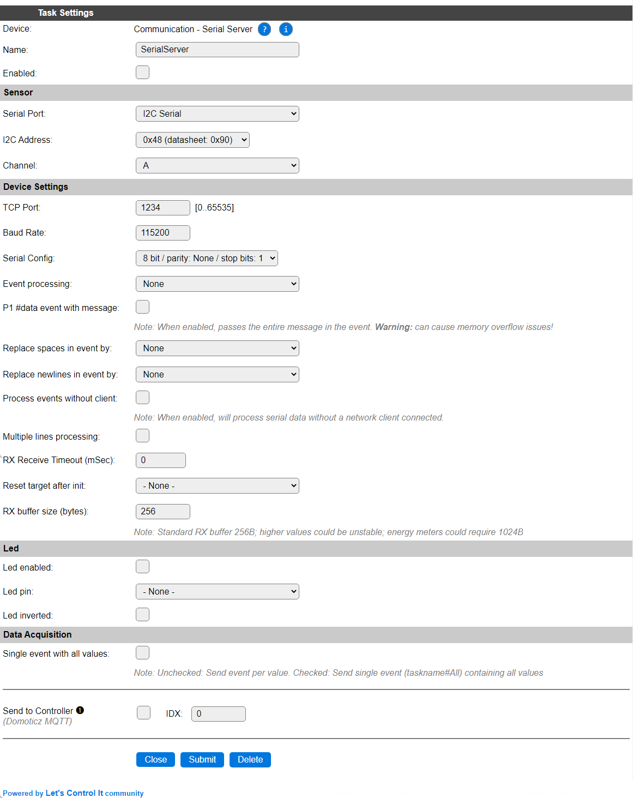
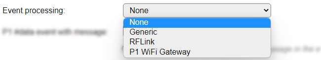

.. include:: ../Plugin/_plugin_substitutions_p02x.repl
.. _P020_page:

|P020_typename|
==================================================

|P020_shortinfo|

Plugin details
--------------

Type: |P020_type|

Name: |P020_name|

Status: |P020_status|

GitHub: |P020_github|_

Maintainer: |P020_maintainer|

Used libraries: |P020_usedlibraries|

Supported hardware
------------------

|P020_usedby|

Configuration
-------------

* **Name** In the Name field a unique name should be entered.

* **Enabled** When unchecked the plugin is not enabled.

Sensor
^^^^^^

See: :ref:`SerialHelper_page`

Device Settings
^^^^^^^^^^^^^^^

* **TCP Port**: The port for an external network client to read the data from, range 1..65535. The used port number must be unique within the device.

* **Baud Rate / Serial config**: See *Serial helper configuration*, above.

* **Event Processing**: Select the type of data that is expected, to enable correct preprocessing. Available options:

* *None*: No special processing, what is received is sent out to the network client, not generating an event.

* *Generic*: No special processing, received data is sent to the network client, and an event ``!Serial#<message>``, containing the message as is, is generated. Spaces and newlines are processed as configured below.

* *RFLink*: Specifically designed for receiving serial data from RFLink devices, it follows this process:

  * Remove the regular RFLink ``20;xx;`` prefix
  * Check for prefix ``ESPEASY;``, if found, remove the prefix and generate event ``RFLink#<message>``. The ``<message>`` will contain commands to be handled by ESPEasy.
  * If previous prefix is not found, generate event ``!RFLink#<message>``, containing the entire received data. Spaces and newlines are processed as configured below.

    *Also see the* **Multiple lines processing** *option, below.*

* *P1 WiFi Gateway*: Process the data, received from a P1 Energy meter, that does a checksum validation, as included in the message. No separate data values are available in ESPEasy, these are usually handled by Home automation systems that support the P1 protocol via TCP network communication. An event ``<TaskName>#Data`` is generated when a valid P1 packet is received.

  Replacing spaces or newlines should be **disabled** for the P1 protocol data to be handled properly as these replacements will disturb the checksum calculation, and also, the **Multiple lines processing** should be disabled if the data is to be handled as P1 protocol data, as that does contain newlines.

.. spacer

* **P1 #data event with message**: When enabled, the *P1 WiFi Gateway* Event Processing option will include the received message. **WARNING** This may easily cause memory overflow exceptions, especially when running on ESP8266 or other low-memory situations!

* **Replace spaces in event by**: Here a single character can be selected to replace all spaces during receiving the data. 
* **Replace newlines in event by**: Here a single character can be selected to replace all newlines during receiving the data. When enabled, all linefeeds are replaced, and all carriage returns (if any) are discarded.

.. image:: P020_ReplaceCharInEventOptions.png

The available set of replacement characters is ``, ; : . ! ^ | / \`` (comma, semicolon, colon, period, exclamation, caret, pipe, slash and backslash). When set to None, no replacement will be done.

* **Process events without client**: By default, if no network client is connected, no serial data will be received and processed either. Enabling this option enables receiving data and generating events without a TCP client connected.

* **Multiple lines processing**: When enabled, all received data will be split at a linefeed and sent out/event generated as separate messages.

* **RX Receive timeout (mSec)**: If parts of serial data packets are somewhat delayed, but should still be handled as a single message, then the delay to wait for the next part can be configured here. 0 disables the delay.

* **Reset target after init**: Select a GPIO pin that should be pulled low once during initialization of the plugin, used to synchronize the external serial data source with the plugin.

* **RX Buffer size (bytes)**: To not overburden the memory use of the plugin, the buffer size is set rather low. Some serial devices, like energy meters may require a larger buffer if the message exceeds this size. Range: 256..1024.

Led
^^^

* **Led enabled**: To enable a *data is being processed* activity led.

* **Led pin**: The GPIO pin the Led is connected to.

* **Led inverted**: Iverts the on/off state for the Led.

Data Acquisition
^^^^^^^^^^^^^^^^

The Data Acquisition and Send to Controller settings are standard available configuration items. Send to Controller only when one or more Controllers are configured. *Single event with all values* option is not applicable for this plugin.

Change log
----------

.. versionchanged:: 2.0
  ...

  |changed| 2022-12-13: Merge of P020 and P044 to reduce code size and combine features, as P044 was initially started as a spin-off from P020, but not evolved with the P020 features.

  |added|
  Major overhaul for 2.0 release.

.. versionadded:: 1.0
  ...

  |added|
  Initial release version.

