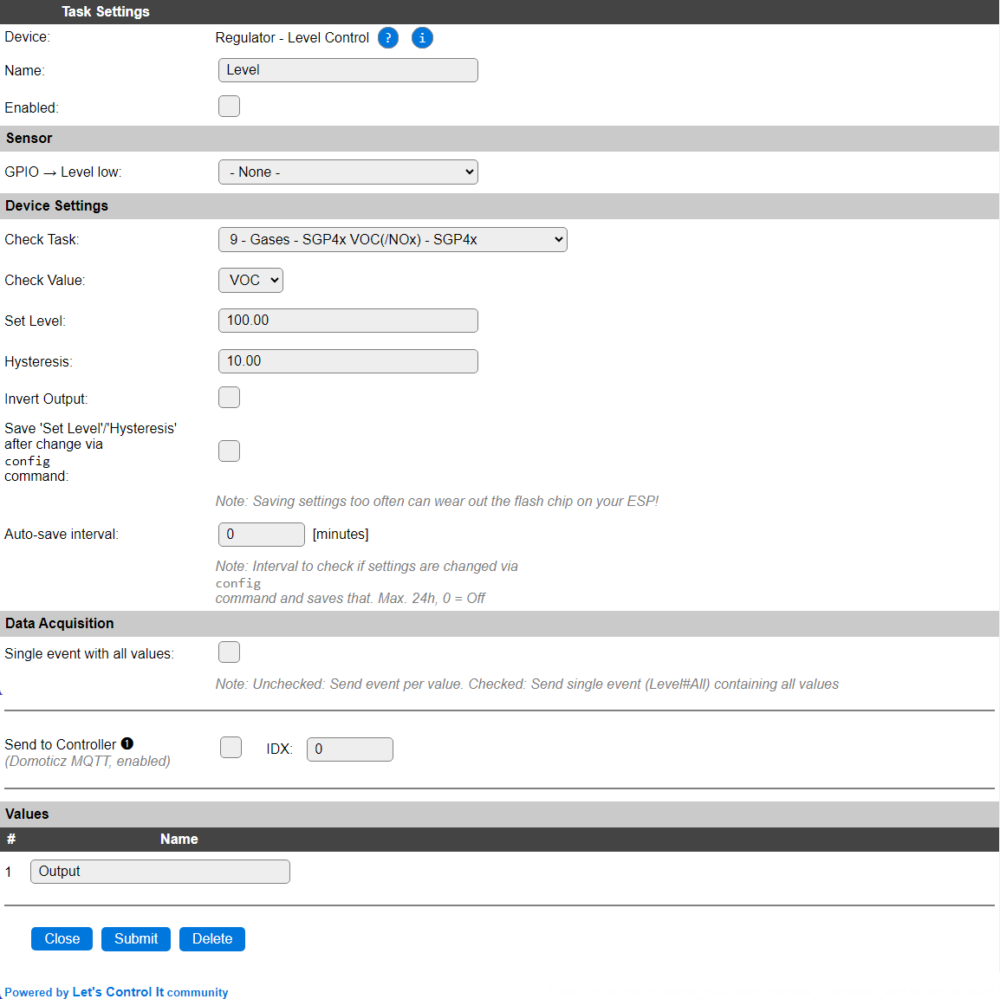

.. include:: ../Plugin/_plugin_substitutions_p02x.repl
.. _P021_page:

|P021_typename|
==================================================

|P021_shortinfo|

Plugin details
--------------

Type: |P021_type|

Name: |P021_name|

Status: |P021_status|

GitHub: |P021_github|_

Maintainer: |P021_maintainer|

Used libraries: |P021_usedlibraries|

.. Supported hardware
.. ------------------

.. .. |P021_usedby|

Introduction
------------

It is always helpful to have some sort of local level control. This is something that would normally be handled by a Home Automation controller, but if you really need to have something like a locally controlled heater, you could use the Level Control plugin.

The ESP module can be used as a level controlling device, think of a simple temperature control unit. Use a DS18B20, BME280 or similar temperature sensor and a mechanical or solid state relay to control a heater. Connect this relay to a GPIO pin.

Configuration
-------------

* **Name** A unique name should be entered here.

* **Enabled** The device can be disabled or enabled. When not enabled the device should not use any resources.

Sensor
^^^^^^

* **GPIO -> Level low** Select a GPIO pin that will be updated when the Level state changes. The state is applied directly on the GPIO pin, so only On (1) and Off (0) will be set.

* **Check Task** Select the Task that should be monitored. Initially the first Task will be selected. Only configured tasks can be selected.

* **Check Value** After selecting the task, the value that should be monitored can be selected. Initially, the first value of the task is selected.

* **Set Level** The value that is to be maintained. Decimals can be used in this value.

* **Hysteresis** To avoid 'flip-flopping' of the output, some hysteresis should be applied to the **Set Value**. The value entered here will be applied 'around' that set value, so half of the hysteresis below Set Value will turn on (1) the output state, and half of the hysteresis above the set value will turn off (0) the output state.

There is 1 exception to the **Hysteresis**: If the Hysteresis is set to 0, the output state will turn on (1) if the measured value goes *below* Set Value, and the output state will turn off (0) if the measured value reaches ``Set Value + 1.0``.

The Data Acquisition and Send to Controller settings are standard available configuration items. Send to Controller only when one or more Controllers are configured.

Values
^^^^^^

The output state value is available in ``Output``. No other options are available for Values.

Commands available
^^^^^^^^^^^^^^^^^^

.. include:: P021_commands.repl

Events
~~~~~~

When the ``Output`` state changes, an event is generated, with the new state as the payload, so this change can also be handled using Rules.

Change log
----------

.. versionchanged:: 2.0
  ...

  |added|
  Major overhaul for 2.0 release.

.. versionadded:: 1.0
  ...

  |added|
  Initial release version.

