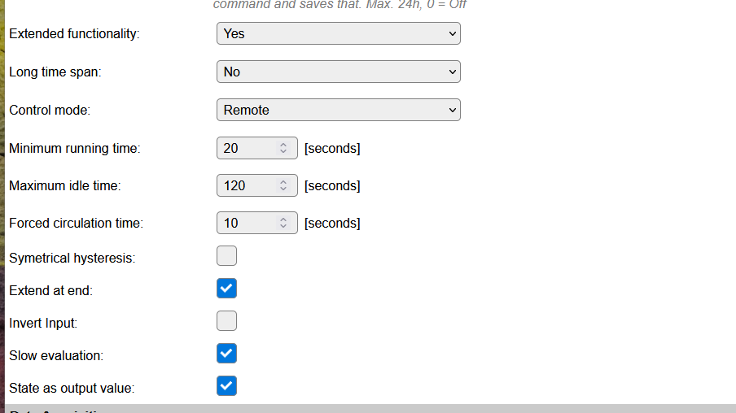

.. include:: ../Plugin/_plugin_substitutions_p02x.repl
.. _P021_page:

|P021_typename|
==================================================

|P021_shortinfo|

Plugin details
--------------

Type: |P021_type|

Name: |P021_name|

Status: |P021_status|

GitHub: |P021_github|_

Maintainer: |P021_maintainer|

Used libraries: |P021_usedlibraries|

.. Supported hardware
.. ------------------

.. .. |P021_usedby|

Introduction
------------

It is always helpful to have some sort of local level control. This is something that would normally be handled by a Home Automation controller, but if you really need to have something like a locally controlled heater, you could use the Level Control plugin.

The ESP module can be used as a level controlling device, think of a simple temperature control unit. Use a DS18B20, BME280 or similar temperature sensor and a mechanical or solid state relay to control a heater. Connect this relay to a GPIO pin.

The control algorithm can be a simple value to setpoint comparator with hysteresis to prevent the relay switching too often in a short period. 
Pumps like used for floor heating have some additional requirements like running once in a while and keeping the pump running for a minimum time. 
The plugin provides a simple "Classic" mode of operation which can be extended with additional features.

Note: Due to size limitations some builds contain limited functionality. State control extension and remote control will not be available on these standard builds for ESPeasy. You can always create a custom build with full functionality.

Basic control algorithm
^^^^^^^^^^^^^^^^^^^^^^^

The output of another plugin is used as measurement input. This input is compared with a given Setpoint. If the Input is above the Setpoint the Output (heater/pump) should be switched on (becomes active); 
If it is below the setpoint the Output should be switched off (becomes inactive). 
If the Input is close to the Setpoint the controller might switch very rapidly between on and off (flip-flopping). This may destroy the relay or pump. A margin between switch on and switch off level is used to prevent this flip-flopping. 
When the Input value stays between these two levels the output will not be changed. This margin is called Hysteresis. 
The Hysteresis can be symetrical around the Setpoint: Switching on above (Setpoint + 0.5*Hysteresis) and switching off below (Setpoint - 0.5*Hystersis).
With an asymetrical Hysteresis the output is switched on above the Setpoint and switched of below (Setpoint - Hysteresis).

In case of symetrical hysteresis there is an exception in hysteresis handling: If the Hysteresis is set to 0, the output state will become active if the measured value goes *below* Setpoint, and the output state will become inactive if the measured value reaches ``Setpoint + 1.0``.
It is strongly advised to use a proper non-zero Hysteresis tuned to the behavior of the control process and not to rely on this exception.

To facilitate various applications the direction of the input comparator can be inverted.
Combining symetrical hystersis and invert output this results in the following overview:

State control extension
^^^^^^^^^^^^^^^^^^^^^^^

To provide additional control features the controller can be in one of several States. Based upon the input value and some timers the controller can change the State. The output of the controller directly depends on the State.
The following states exist:

* **Idle** : The Output is swiched to inactive (off). There is no reason to switch it active (on).
* **Active** : The basic comparator algorithm decides the Output must be switched to active. There is a demand based upon the measured Input value.
* **Extend** : The Output was switched on for a too short period. It will be kept running for a minimum time even while the comparator algorithm has no demand.
* **Force** : The output is forced on for a minimum amount of time to keep the system in condition. The State will be set to Forced when the Output is inactive for a too long time.

Extension of the period the Output is kept active depends on the use case. Extension from the moment of activating the Output is used to prevent a heater or pump is running too short cycles. 
Extension when the demand drops (input below setpoint) is used optimize the control process. For example a heating pump is kept running for some time to spread the remaining heat.

Remote control
^^^^^^^^^^^^^^

It may be useful to manipulate the local controller from a Home Automation controller. The plugin accepts commands to change the following settings:

* **Setpoint** : This command changes the actual Setpoint for the local control algorithm. 
* **Hysteresis** : This command changes the actual Hysteresis for the local control algorithm.
* **Remote** : This command can override the basic control algorithm. It can be used to force the Output to on. Usecase is a floor heating pump that should be switched on as soon as the central heating system is swiched on.

Operation modes
^^^^^^^^^^^^^^^

The controller can be set to one of the following operation modes:

* **CLASSIC** : Basic control algorithm without state control extension. This mode is backwards compatible with earlier versions of this plugin.
* **OFF** : The output is always switched off. 
* **STANDBY** : The output is off with the maintenance check active. The output is switched on after maximum idle time.
* **ON** : The output is always switched on.
* **LOCAL** : Control algorithm with state control extension. Only local control input is used.
* **REMOTE** : Control algorithm with state control extension. Both local control and remote command input is used.

Backwards compatibility
^^^^^^^^^^^^^^^^^^^^^^^

This plugin is extended with new state control features. New settings are added such that existing users should not need to modify their settings when upgrading to a newer ESPeasy version. 
As a result some of the added settings may seem a bit strange as they must default to the original behavior. 
To achieve this behavior CLASSIC control mode with symetrical Hysteresis is selected as default.

Configuration
-------------

Configuration settings in classic mode:

In extended mode additional settings are available:

* **Name** A unique name should be entered here.

* **Enabled** The device can be disabled or enabled. When not enabled the device should not use any resources.

Sensor
^^^^^^

* **GPIO -> Output** Select a GPIO pin that will be updated when the Output state changes. The state is applied directly on the GPIO pin, so only On (1) and Off (0) will be set.

* **Input Task** Select the Task that should be monitored. Initially the first Task will be selected. Only configured tasks can be selected.

* **Input Value** After selecting the task, the value that should be monitored can be selected. Initially, the first value of the task is selected.

* **Setpoint** The value that is to be maintained. Decimals can be used in this value.

* **Hysteresis** To avoid 'flip-flopping' of the output, some hysteresis should be applied to the **Setpoint**. The value entered here will be applied as described above in Basic control algorithm.

* **Invert Output** When checked, the output state will be 0 instead of 1 when the level is activated.

* **Save 'Set Level' after change via config command** Via the config command, the **Set Level** value can be changed. To avoid wearing out the flash memory of the device by too often saving these settings, the default is now off, for existing tasks (after upgrade of ESPEasy), the old behavior of saving after each change is still active. The user should decide if saving the setting is actually required, or if that can be attained by carefully planning a save command or via a manual save.

* **Auto-save interval** Here a time in minutes can be set after which any changed 'Set Level' via the ``config,task,<taskname>,SetLevel,<value>`` command will be saved. This *requires* that the above setting **Save 'Set Level' after change via config command** is **disabled**! When used, a setting of ca. 30 minutes, or even longer when the Set Level is changed often, seems apropriate, unless the unit often reboots, but then that cause should be investigated and solved. The timer, when activated, should survive a warm reboot.

* **Extended functionality**:sup:`1)` Enable new functionality. Changing this will reload the form showing/hiding the new options below.

* **Long time span**:sup:`1)` Timer values are per default entered in [seconds], enabling this option timing settings are tuned to long intervals using [hours] or [seconds]. Changing this will reload the form showing rescaled values and new units.

* **Control mode**:sup:`1)` Selection of the Control mode, see Operation mode above.

* **Minimum running time**:sup:`1)` Once switched on the Output shall be active for at least this time. See State control extension. Time is either in [seconds] or in [minutes].

* **Maximum idle time**:sup:`1)` Output will be forced to active if it has been idle for this time. See State control extension. Time is either in [seconds] or in [hours].

* **Forced circulation time**:sup:`1)` Output will be active for this duration once it is forced active. See State control extension. Time is either in [seconds] or in [minutes].

* **Symetrical hysteress**:sup:`1)` If checked the Hysteresis is symerical around the Setpoint. Otherwise it is asymertical. See basic control algorithm.

* **Extend at end**:sup:`1)` If checked the extension period is started after demand dropt, otherwise the extension period timing is started when the Output is switched to active.

* **Invert Input**:sup:`1)` If checked the input compare direction is inverted. See basic control algorithm above.

* **Slow evaluation**:sup:`1)` By default the control algorithm is evaluated 10 times per second. Many applications don't need this speed. Checking this setting evaluates the control algorithm once per second to reduce the CPU load.

* **State as output value**:sup:`1)` This adds the calculated state as a second value. This can be used in rules to show what the controller is doing.

:sup:`1)` Configuration may not be available due to build size limitations.

Data Acquisition
^^^^^^^^^^^^^^^^

This group of settings, **Single event with all values** and **Send to Controller** settings are standard available configuration items. Send to Controller is only visible when one or more Controllers are configured.

Values
^^^^^^

The output value is available in ``Output``. 
In case **State as output value** is checked also the internal state is available in ``State``.

Commands available
^^^^^^^^^^^^^^^^^^

.. include:: P021_commands.repl

Events
~~~~~~

When the ``State`` value changes, an event with the new output and state as the payload is generated. 
So this change can also be handled using Rules.

example
-------

I am using this plugin to control a water circulation pump for my floor heating at house. The house is heated by a central heating system (boiler and heatpump combination). 
The circulation pump consumes quite some electricity, so I only want to switch it on only when needed. The control box contains an ESP32 with 3 temperature sensors to monitor:

* Water temperature from the heater

* Water temperature floor inlet

* Water termperature floor outlet

It has one output to control the pump.

Control input is the water temperature from the central heating. If the temparture rises above the **Setpoint** (heating switched on by the thermostat in the room) the pump is switched on. 
When the temperature drops below the **Setpoint** minus **Hysteresis** it can be switched off.
However, it shall run for some extension time to assure the remaining heat in the water is spread well over the floor. It also prevents switching the pump too often which might damage it.
These pumps don't like it when idling for half a year. Therefore the pump is switched on for 5 minutes in case is has not been running for a day.
With the introduction of the heat pump the water temperature stays relatively low (40 degrees) and the pump might be switched on very late. Therefore the home automation system sends a "remote on" when the heat pump is running.
Note that setting the setpoint very low will result in switching on the pump in summer due to high environmental temperatures. I have a small margin here or have to switch the **Control mode** to STANDBY in summer.

The control box has a 3 color LED to signal the state. I use a rule to use the state value to enable one of the LED outputs:

* IDLE : green LED

* HEATING : red LED

* EXTEND, FORCE : blue LED

My settings:

* **Setpoint** 25

* **Hysteresis** 4

* **Invert Output** false

* **Save 'Set Level' after change via config command** false.

* **Auto-save interval** 0

* **Extended functionality** YES

* **Long time span** YES

* **Control mode** Remote

* **Minimum running time** 30 min

* **Maximum idle time** 24 hour

* **Forced circulation time** 5 min

* **Symetrical hysteress** false

* **Extend at end** true

* **Invert Input** false

* **Slow evaluation** true

* **State as output value** true

Change log
----------

.. versionchanged:: 2.0
  ...

  |added|
  2024-07-11: overhaul, added state control extensions.

  |added|
  2023-10-28: Set Hysteresis via ``config`` command and get via ``[<Taskname>#GetHysteresis]`` variable.

  |added|
  2022-08-22: Auto-save interval option.

  |added|
  Major overhaul for 2.0 release.

.. versionadded:: 1.0
  ...

  |added|
  Initial release version.

