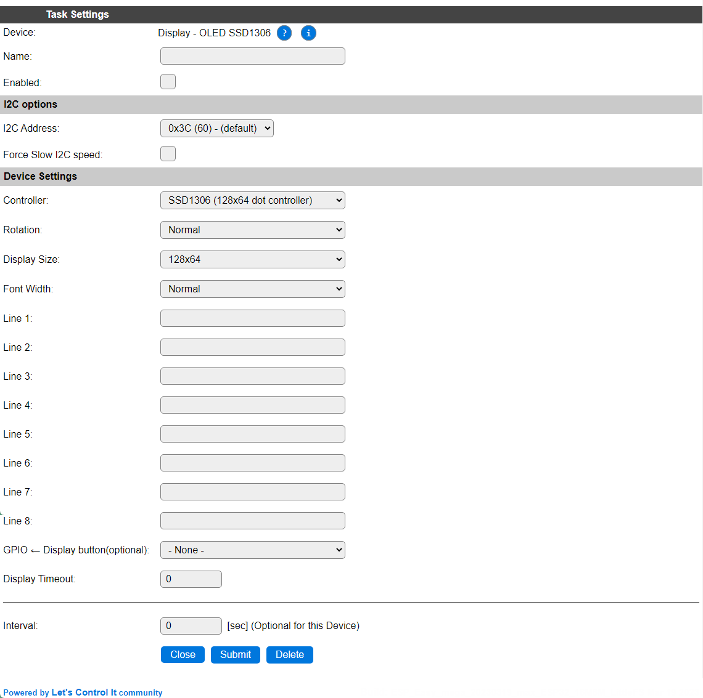

.. include:: ../Plugin/_plugin_substitutions_p02x.repl
.. _P023_page:

|P023_typename|
==================================================

|P023_shortinfo|

Plugin details
--------------

Type: |P023_type|

Name: |P023_name|

Status: |P023_status|

GitHub: |P023_github|_

Maintainer: |P023_maintainer|

Used libraries: |P023_usedlibraries|

Description
-----------

This plugin features a basic display of a text template, including device values, on black and white OLed displays, using the SSD1306 and SH1106 controllers.

Configuration
-------------

* **Name**: A unique name should be entered here.

* **Enabled**: The device can be disabled or enabled. When not enabled the device should not use any resources.

I2C Options 
^^^^^^^^^^^^

The available settings here depend on the build used. At least the **Force Slow I2C speed** option is available, but selections for the I2C Multiplexer can also be shown. For details see the :ref:`Hardware_page`

Device Settings
^^^^^^^^^^^^^^^

* **Controller**: Select the controller chip that is used for the display. There are 2 options available, ``SSD1306`` and ``SH1106``.

* **Rotation**: Select if the display is mounted normally or upside-down (rotated 180 degrees).

.. image:: P023_DisplaySizeOptions.png

* **Display Size**: Select the pixel resolution of the display.

* **Font Width**: The ``Normal`` option uses a mono-spaced font to display the text, where ``Optimized`` is similar to a proportionally spaced font, where each character uses only the pixels it needs.

* **Line 1** .. **Line 8**: All user defined texts may contain references to system variables or task values which will be interpreted when displayed on screen.

For example: ``[bme#Temp#D2.1] {D}C [bme#Hum]%``

* **GPIO <- Display button(optional)**: Setting up a ``Display Button``, allows to configure a Display Timeout and wake the display on demand, either by a button, or by using some presence detection.

* **Display Timeout**: The numbers of seconds after which the display is turned off. When set to 0 no timeout is active.

* **Interval** By default, Interval will be set to 0. If set to a non-zero value, the pre-configured content will be updated automatically using that interval (seconds).

General
-------

Commands available
^^^^^^^^^^^^^^^^^^

.. include:: P023_commands.repl

Change log
----------

.. versionchanged:: 2.0
  ...

  |added|
  Major overhaul for 2.0 release.

.. versionadded:: 1.0
  ...

  |added|
  Initial release version.

