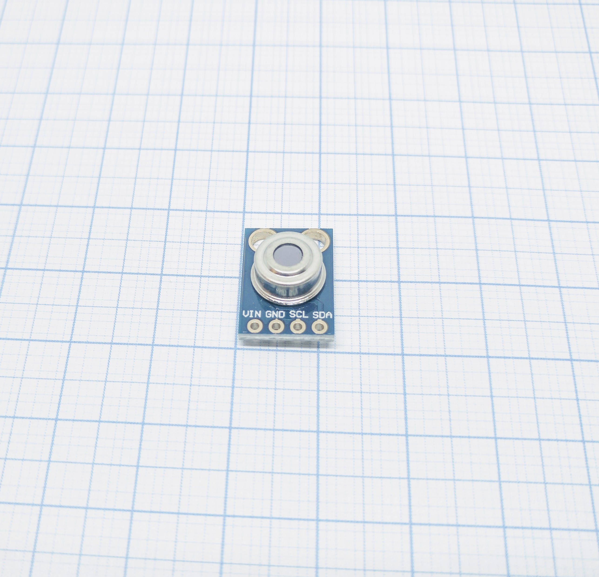
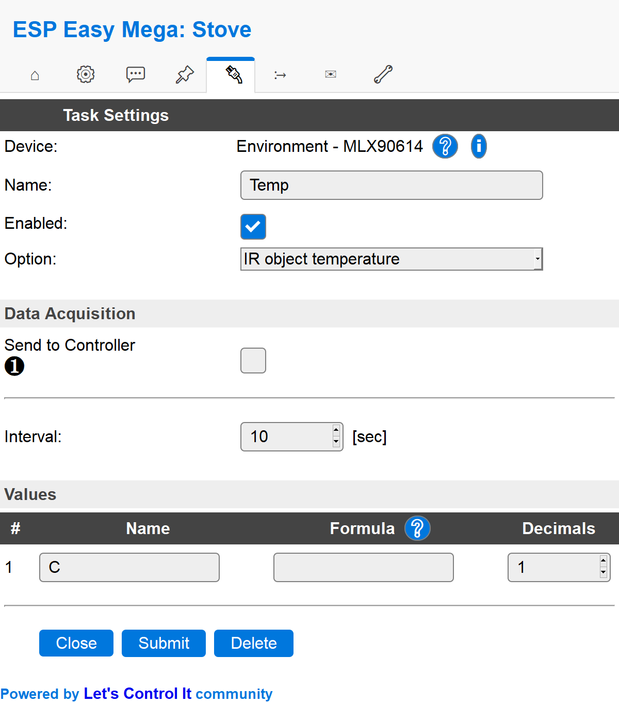

.. include:: ../Plugin/_plugin_substitutions_p02x.repl
.. _P024_MLX90614_page:

MLX90614
========

|P024_typename|
|P024_status|

Introduction
------------

Specifications:
 * Sensor temperature (-40C to +125C)
 * IR temperature (-70C to +380C)
 * Accuracy of 0.5C
 * Measurement resolution of 0.02C

Wiring
------

.. code-block:: html

 ESP               MLX90614
 GPIO (4)   <-->   SDA
 GPIO (5)   <-->   SCL

 Power
 3.3V/5V    <-->   VIN
 GND        <-->   GND

.. note:: If you have change the I2C settings in the hardware setup you need to connect to those instead of GPIO 4 and 5.

Setup
-----

Task settings
~~~~~~~~~~~~~

* **Device**: Name of plugin
* **Name**: Name of the task (example name **Temp**)
* **Enable**: Should the task be enabled or not

Sensor
^^^^^^

* **Option**: You can either use the ``IR object temperature`` or the ``Ambient temperature``. The difference between them
  is that the IR object is the measured temperature of a remote object and the ambient temperature is the temperature of the
  sensor itself.

Data acquisition
^^^^^^^^^^^^^^^^

* **Send to controller** 1..3: Check which controller (if any) you want to publish to. All or no controller can be used.
* **Interval**: How often should the task publish its value (5..15 seconds is normal).

Indicators (recommended settings)
^^^^^^^^^^^^^^^^^^^^^^^^^^^^^^^^^

.. csv-table::
  :header: "Indicator", "Value Name", "Interval", "Decimals", "Extra information"
  :widths: 8, 5, 5, 5, 40

  "IR object temperature", "Celsius", "10", "1", "A maximum of 2 digits is outputted by the plugin"
  "Ambient temperature", "Celsius", "10", "1", ""

Rules examples
--------------

.. code-block:: html

    on Temp#C do
     if [Temp#C]>300
       LogEntry,Fire is burning
     else
       LogEntry,Please check fire
     endif
    endon

.. Commands available
.. ~~~~~~~~~~~~~~~~~~

.. .. include:: P024_commands.repl

Where to buy
------------

.. csv-table::
 :header: "Store", "Link"
 :widths: 5, 40

 "AliExpress","`Link 1 ($) <http://s.click.aliexpress.com/e/Y3CCUSc>`_"
 "Banggood","`Link 2 ($) <https://www.banggood.com/GY-MLX90614-DCI-IIC-Long-Distance-Infrared-Temperature-Sensor-Module-p-1179086.html?p=V3270422659778201806>`_"
 "eBay","`Link 3 ($) <https://rover.ebay.com/rover/1/711-53200-19255-0/1?icep_id=114&ipn=icep&toolid=20004&campid=5338336929&mpre=https%3A%2F%2Fwww.ebay.com%2Fsch%2Fi.html%3F_from%3DR40%26_trksid%3Dm570.l1313%26_nkw%3DMLX90614%26_sacat%3D0%26LH_TitleDesc%3D0%26_osacat%3D0%26_odkw%3DOLED%2BSSD1306%2B128x32>`_"

|affiliate|

.. More pictures
.. -------------

.. .. image:: P024_MLX90614_2.jpg
