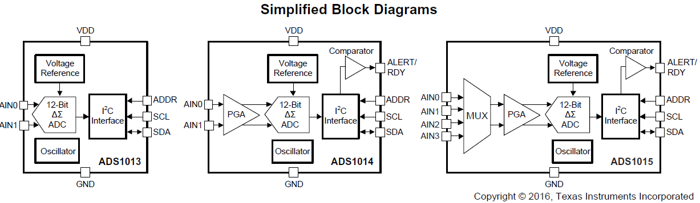
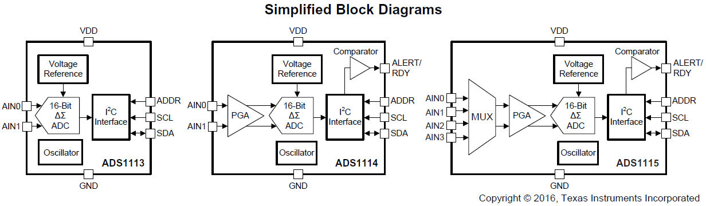
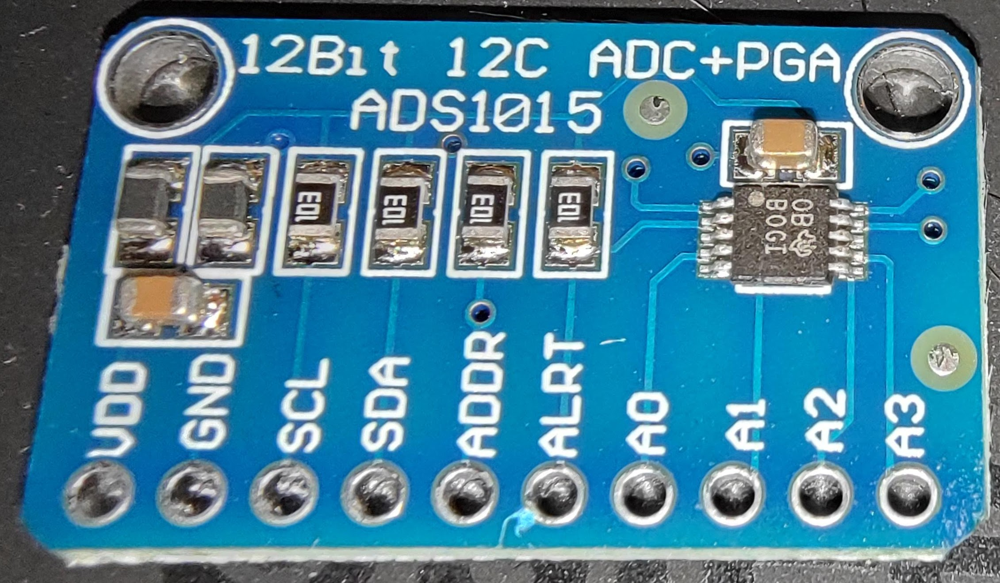
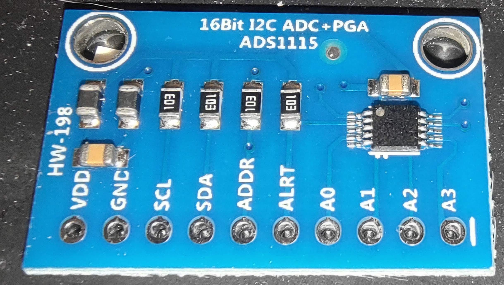
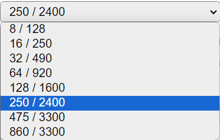
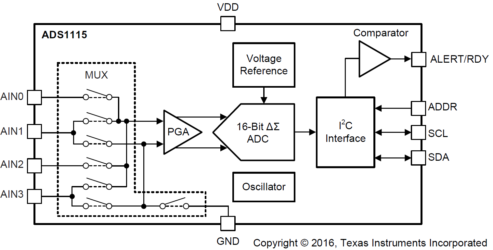
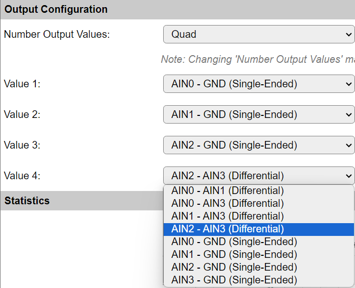

Introduction
------------

Texas Instruments has a number of affordable I2C ADC chips:

* ADS1013, ADS1014 and ADS1015: 12 bit @ 128 - 3300 SPS
* ADS1113, ADS1114 and ADS1115: 16 bit @ 8 - 860 SPS

   ADS101x 12-bit ADC Block Diagram

   ADS111x 16-bit ADC Block Diagram

Number of inputs:

* ADS1x13 and ADS1x14: 1 differential input. (Single ended when one input is connected to GND)
* ADS1x15: 4 single-ended or 2 differential inputs.

ADS1x14 and ADS1x15 support a programmable gain to set a range for the analog voltage to be measured.

.. note::
  
  The analog input should never exceed VDD + 0.3V.

Datasheets: 

* `ADS1015 datasheet <https://www.ti.com/lit/ds/symlink/ads1015.pdf>`_
* `ADS1115 datasheet <https://www.ti.com/lit/ds/symlink/ads1115.pdf>`_

Device Settings
---------------

Detected Sensor Type
^^^^^^^^^^^^^^^^^^^^

(Added: 2023/09/05)

Lots of boards sold online may not have the expected chip model soldered on the PCB.

It is very well possible you may receive a board with "ADS1015" marked on the silk screen, but with an ADS1115 chip mounted.
Or vice verse.

   
   PCB marked as ADS1015, but with ADS1115 chip (see ``BOGI`` marking)

If you're really unlucky, you may receive a board with the markings filed off from the chip.
These are very likely fake clones, which will hardly work.

   
   Complete rip-off: ADS1115 PCB with fake unmarked chip

ESPEasy will reject those and show "None" as this utter garbage really should NOT be used.
The sampled value (if any) is very likely not taken from the expected pin and in the end the chip may even stall other I2C communications.

The sensor type detection is based on how long it takes to take a single sample with the sample rate set to "250 / 2400".
This is used as it only takes a few msec to check and its expected duration differs significantly.

Possible detected output values:

* None - For Fake units, or when no chip has been detected at the configured I2C address.
* ADS1015 - Device Markings: ``BRPI`` or ``N7J``.
* ADS1115 - Device Markings: ``BOGI`` or ``N4J``.

.. note::
  
  Please report fake boards immediately to the seller and request a refund!
  
  The ESPEasy dev team will NOT support fake chips as too much time has been wasted on those already!

Gain
^^^^

The ADS1015 and ADS1115 ADCs have a programmable gain.

This can be used to set the sensitivity and thus the full scale (FS) range of the ADC.

.. code-block:: none

  +------+----------+------------+----------+
  |      |          | LSB Size   | LSB Size |
  | Gain | FS range | ADS1115    | ADS1015  |
  +======+==========+============+==========+
  | 2/3x |  6.144 V | 187.5 μV   | 3 mV     |
  +------+----------+------------+----------+
  | 1x   |  4.096 V | 125 μV     | 2 mV     |
  +------+----------+------------+----------+
  | 2x   |  2.048 V | 62.5 μV    | 1 mV     |
  +------+----------+------------+----------+
  | 4x   |  1.024 V | 31.25 μV   | 0.5 mV   |
  +------+----------+------------+----------+
  | 8x   |  0.512 V | 15.625 μV  | 0.25 mV  |
  +------+----------+------------+----------+
  | 16x  |  0.256 V | 7.8125 μV  | 0.125 mV |
  +------+----------+------------+----------+

.. note::

  Do not apply more than VDD + 0.3 V to the analog inputs of the device.

Sample Rate
^^^^^^^^^^^

(Added: 2023/09/05)

The ADS1015 and ADS1115 differ mainly in their internal sample rate and resolution.

* ADS1015: 12 bit resolution @ 128 - 3300 samples per second.
* ADS1115: 16 bit resolution @ 8 - 860 samples per second.

   
   ADS1115 / ADS1015 Sample Rate Selection

Both the ADS1015 and ADS1115 use the same internal register values for different sample rates.

The first (lower) value refers to the sample rate for the ADS1115, while the second (higher) value refers to the ADS1015 sample rate.

.. note::

  Only use sample rates less than 64 samples/sec when absolutely needed.
  Sample rates less than 128 SPS will hardly improve on noise, but will take longer to acquire and thus interfere with other timing critical tasks on the node.
  When aliasing due to mains frequency noise is observed, add some small capacitor (e.g. 10 nF) over the input pin, close to the ADS1x15.

Convert to Volt
^^^^^^^^^^^^^^^

(Added: 2023/03/31)

When this option is checked, the measured value will be converted to Volt, based on the selected gain.

Two Point Calibration
---------------------

Regardless of the number of output values, the same device settings are used within a single task.
Thus there is only a single set of "Two Point Calibration" points available.

When enabled, the user needs to perform some calibration to correct for some offset and factor.

For example a DC-offset should be applied when measuring a voltage, with a diode in series with the signal.

Another typical use case is when a voltage divider using resistors is put in front of the ADC, one may need to correct for the actually used resistor values.

N.B. It is still possible per output value to use a formula for corrections per input.

Output Configuration
--------------------

Analog Input Multiplexer
^^^^^^^^^^^^^^^^^^^^^^^^

The ADS1015 and ADS1115 have 4 analog input pins which are routed via a multiplexer (MUX).

When measuring "Single-Ended", the voltage is measured against GND.

In "differential" mode, the voltage between given pins is measured.

   
   ADS1115 / ADS1015 MUX Analog Input Block Diagram

Possible Multiplexer Input Combinations:

* AIN0 - AIN1 (Differential)
* AIN0 - AIN3 (Differential)
* AIN1 - AIN3 (Differential)
* AIN2 - AIN3 (Differential)
* AIN0 - GND (Single-Ended)
* AIN1 - GND (Single-Ended)
* AIN2 - GND (Single-Ended)
* AIN3 - GND (Single-Ended)

Number Output Values
^^^^^^^^^^^^^^^^^^^^

(Added: 2023/09/05)

It is possible to set upto 4 output values, each with its own input multiplexer configuration.

   
   Output Configuration Selection

When multiple output values are configured, the samples will be taken in a single burst.
This also means the sample rate should be set to a relatively high value (preferrably > 128 SPS) as it would otherwise block execution of other code in ESPEasy.

In order to keep the interface clean and simple, all output values configured in the same task will use the same gain and sample rate and will all be using the same calibration (if set) and output to the same unit of measure (raw sample value or Volt).

