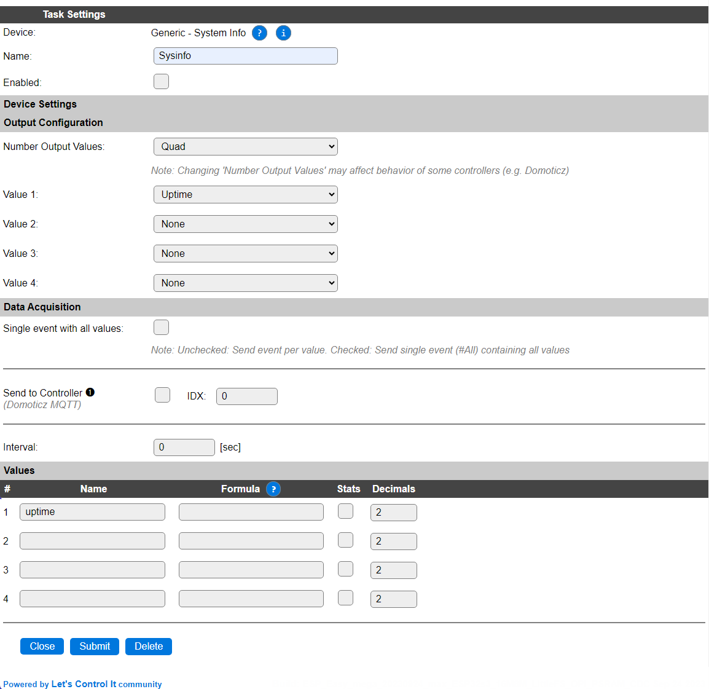
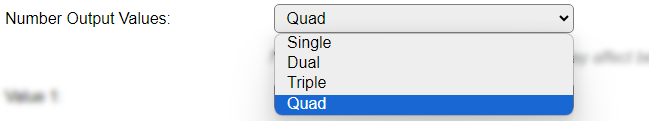
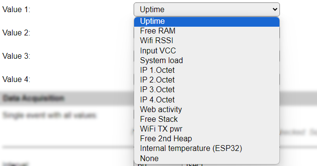

.. include:: ../Plugin/_plugin_substitutions_p02x.repl
.. _P026_page:

|P026_typename|
==================================================

|P026_shortinfo|

Plugin details
--------------

Type: |P026_type|

Name: |P026_name|

Status: |P026_status|

GitHub: |P026_github|_

Maintainer: |P026_maintainer|

Used libraries: |P026_usedlibraries|

.. Supported hardware
.. ------------------

.. .. |P026_usedby|

Introduction
------------

To monitor some internal values of an ESPEasy equiped device, the SysInfo plugin is available. This device can show up to 4 values showing user-selected system data.

Configuration
-------------

* **Name** A unique name should be entered here.

* **Enabled** The device can be disabled or enabled. When not enabled the device should not use any resources.

Output configuration
^^^^^^^^^^^^^^^^^^^^

* **Number Output Values**: Select from 1 to 4 output values, default is 4 (Quad). If more values are to be used, multiple tasks can be configured using this plugin.

* **Value 1..4**: Depending on the **Number Output Values** selection, 1 to 4 selections for output values are available. These can be chosen as desired.

* *Uptime*: The uptime of the unit in minutes.
* *Free RAM*: The amount of free memory in bytes.
* *Wifi RSSI*: The RSSI (Received signal strength indicator) value. This is a negative value.
* *Input VCC*: The voltage applied to the 3.3V VCC input of the ESP. This value is **only** available on ESP8266 builds with VCC enabled (included in the build name), else 0 will be shown.
* *System load*: The load as displayed on the Main and Info pages, a percentage in range 0 .. 100.
* *IP 1.Octet* .. *IP 4.Octet*: The separate parts of the active IP address of the unit, the octets are counted from left to right.
* *Web activity*: The time passed since the last web activity at the unit. Measured in seconds.
* *Free Stack*: The available stack space in bytes.
* *WiFi TX pwr*: The current setting for transmit power via WiFi. This is determined dynamically, depending on the corresponding settings in the Tools/Advanced page, RSSI and other factors.
* *Free 2nd Heap*: The available memory on the 2nd heap, **only** available in some specific ESP8266 builds, else it shows 0.
* *Internal temperature (ESP32)*: The internal temperature of the ESP. **Only** available on ESP32 units. For ESP32-S2/S3/C2/C3/C6 MCUs there is official support for the internal temperature sensor via the Espressif libraries, that has compensation applied so it shows a realistic value. For ESP32 Classic this is determined empirically, based on the deviation of the 150 kHz internal clock generator, that is rather temperature dependent, compared to the (stable) crystal frequency. This should not be seen as an absolute temperature, but *can* be used as a relative measurement f.e. when comparing heavy load vs. light load situations.
* *None*: No value.

.. Commands available
.. ^^^^^^^^^^^^^^^^^^

.. .. include:: P026_commands.repl

.. Events
.. ~~~~~~

.. .. include:: P026_events.repl

Data Acquisition
^^^^^^^^^^^^^^^^

This group of settings, **Single event with all values** and **Send to Controller** settings are standard available configuration items. Send to Controller is only visible when one or more Controllers are configured.

* **Interval** By default, Interval will be set to 60 sec. The data will be collected, and event(s) generated, using this interval.

Get Config values
~~~~~~~~~~~~~~~~~

These values are not available in *Minimal OTA* builds.

.. include:: P026_config_values.repl

Change log
----------

.. versionchanged:: 2.0
  ...

  |added| 2023-09-25 ESP32 Internal temperature sensor option, Get Config values

  |added|
  Major overhaul for 2.0 release.

.. versionadded:: 1.0
  ...

  |added|
  Initial release version.

