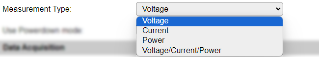

.. include:: ../Plugin/_plugin_substitutions_p02x.repl
.. _P027_page:

|P027_typename|
==================================================

|P027_shortinfo|

Plugin details
--------------

Type: |P027_type|

Name: |P027_name|

Status: |P027_status|

GitHub: |P027_github|_

Maintainer: |P027_maintainer|

Used libraries: |P027_usedlibraries|

|P027_usedby|

Description
-----------

The INA219 sensor can read DC voltage and current and calculate the power from that.

Configuration
-------------

* **Name**: Required by ESPEasy, must be unique among the list of available devices/tasks.

* **Enabled**: The device can be disabled or enabled. When not enabled the device should not use any resources.

I2C options
^^^^^^^^^^^

The available settings here depend on the build used. At least the **Force Slow I2C speed** option is available, but selections for the I2C Multiplexer can also be shown. For details see the :ref:`Hardware_page`

Selectable I2C addresses:

.. csv-table::
    :header: "Address", "A0", "A1", ""
    :widths: 10, 10, 10, 70

    "0x40","GND","GND",""
    "0x41","VS+","GND",""
    "0x42","SDA","GND",""
    "0x43","SCL","GND",""
    "0x44","GND","VS+",""
    "0x45","VS+","VS+",""
    "0x46","SDA","VS+",""
    "0x47","SCL","VS+",""
    "0x48","GND","SDA",""
    "0x49","VS+","SDA",""
    "0x4A","SDA","SDA",""
    "0x4B","SCL","SDA",""
    "0x4C","GND","SCL",""
    "0x4D","VS+","SCL",""
    "0x4E","SDA","SCL",""
    "0x4F","SCL","SCL",""

Device Settings
^^^^^^^^^^^^^^^

* **Measure range**: Select the range of the input voltage that's expected, using the most common shunt resistor of 0.1 Ohm. Available options:

* **Measurement Type**: Select the desired measurement type. Values not selected will not be updated when reading the sensor. Available options:

* **Use Powerdown mode**: When enabled will bring the sensor in Powerdown mode after initialization, wake it from that mode to start measuring when requesting a read (either via TaskRun or by Interval), and after reading the values bring it back in Powerdown mode. This mode is available to reduce the quiescent current used during sleep mode in battery operated setups.

Data Acquisition
^^^^^^^^^^^^^^^^

This group of settings, **Single event with all values**, **Send to Controller** and **Interval** settings are standard available configuration items. Send to Controller is only visible when one or more Controllers are configured.

* **Interval** By default, Interval will be set to 60 sec. The data will be collected and optionally sent to any configured controllers using this interval.

Values
^^^^^^

The plugin provides measurements ``Voltage``, ``Current``, and ``Power``. These names can be adjusted ifi desirec.

Per Value is a **Stats** checkbox available, that when checked, gathers the data and presents recent data in a graph, as described here: :ref:`Task Value Statistics:  <Task Value Statistics>`

.. Commands available
.. ^^^^^^^^^^^^^^^^^^

.. .. include:: P027_commands.repl

.. Events
.. ~~~~~~

.. .. include:: P027_events.repl

Change log
----------

.. versionchanged:: 2.0
  ...

  |added| 2024-07-16: Optional Powerdown mode.

  |added|
  Major overhaul for 2.0 release.

.. versionadded:: 1.0
  ...

  |added|
  Initial release version.

