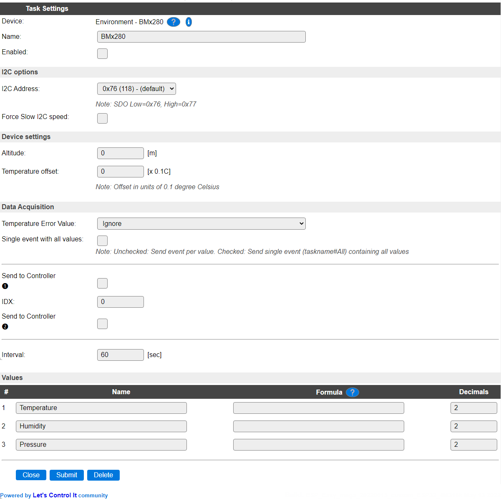
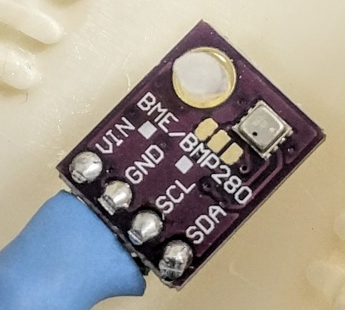

.. include:: ../Plugin/_plugin_substitutions_p02x.repl
.. _P028_page:

|P028_typename|
==================================================

|P028_shortinfo|

Plugin details
--------------

Type: |P028_type|

Name: |P028_name|

Status: |P028_status|

GitHub: |P028_github|_

Maintainer: |P028_maintainer|

Used libraries: |P028_usedlibraries|

Supported hardware
------------------

.. image:: P028_BME280_1.jpg

Introduction
------------

Specifications:
 * Temperature (-40C to +85C)
 * Relative humidity (0-100 %RH)
 * Barometric pressure (300-1100 hPa)

.. warning:: 
  The BME280 is easily mistaken for its sibling the **BMP280**. Sometimes the PCB have both BME *and* BMP280
  written on it, it's probably because the footprint is the same for BME and BMP = the same PCB board is used
  by both. Luckily, this plugin supports both types of sensors.

Wiring
------

.. code-block:: none

 ESP               BMx280
 GPIO (4)   <-->   SDA
 GPIO (5)   <-->   SCL

 Power
 3.3V       <-->   VIN
 GND        <-->   GND

.. note:: If you have changed the I2C settings in the hardware setup you need to connect to those instead of GPIO 4 and 5.

Configuration
-------------

* **Name** A unique name should be entered here.

* **Enabled** The device can be disabled or enabled. When not enabled the device should not use any resources.

I2C Options 
^^^^^^^^^^^^

The available settings here depend on the build used. At least the **Force Slow I2C speed** option is available, but selections for the I2C Multiplexer can also be shown. For details see the :ref:`Hardware_page`

* **I2C Address**: The address the device is using. Depending on the board used, when available a SDO pin, or soldering a 0 ohm resistor on a different location, can be used to select the used address. If that address selection is not available, then an I2C multiplexer (in a matching ESPEasy build) can be used to use multiple sensors on a single ESPEasy unit. Below are instructions for selecting the alternate address.

Device Settings
^^^^^^^^^^^^^^^^

* **Altitude** When not at sea-level, the plugin can apply an altitude compensation on the **Pressure** value.

* **Temperatire offset** Depending on the sensor and the location of the sensor, it may be required to apply some temperature compensation. This can be set per 0.1 degree. When using a BME280 sensor, this also adds a compensation to the **Humidity** reading.

Data Acquisition
^^^^^^^^^^^^^^^^

* **Temperature Error Value** If no sensor is connected, or the sensor suffers from read errors for some reason, the **Temperature** value to report in that situation can be set here. Both **Humidity** and **Pressure** will be set to -1 when read errors occur.

* *Ignore* : Do not return any value (does log the error once per second at INFO level).
* *Min -1 (-41C°)* : Set to the out-of-range value of -41°C.
* *0* : Set to an unknown value of 0.
* *max +1 (+85°C)* : Set to the out-of-range value of 86°C.
* *NaN* : Set to the error value of NaN (Not a number).
* *-1°K (-274°C)* : Set to the impossible temperature value of -1° Kelvin.

The Temperature range of the sensor, according to the datasheet, is -40 to +85 °C, so the out of range values of -41 and +86 can be selected as error state values.

Single event with all values, Send to Controller and Interval settings are standard available configuration items. Send to Controller only when one or more Controllers are configured.

**Interval** By default, Interval will be set to 60 sec. The minimum value allowed is 1 sec.

Values
^^^^^^

The measured values are available in ``Temperature``, ``Humidity`` and ``Pressure``. A formula can be set to recalculate. The number of decimals is by default set to 2, and can be set to 0 for ``Humidity`` and ``Pressure``, as no decimals are provided from the measurement.

.. Commands available
.. ^^^^^^^^^^^^^^^^^^

.. .. include:: P028_commands.repl

.. Events
.. ~~~~~~

.. .. include:: P028_events.repl

Rules examples
--------------

.. code-block:: none

    on BME#pressure do
     if %eventvalue1%>999
       Publish,%sysname%/pressure,Is normal
     endif
    endon

Change I2C address
------------------

You may change the i2c address from the default 0x76 to 0x77 by cutting the line between the two left pads (as seen in the pictures below) and solder a bridge between the two right pads.

Default i2c address 0x76.

.. image:: P028_BME280_3.jpg

Changed i2c address 0x77.

.. image:: P028_BME280_4.jpg

:green:`Cut` :red:`Solder/bridge`

Change log
----------

.. versionchanged:: 2.0
  ...

  |added|
  2022-05-10 Added Error State Value option, documentation overhaul.

  |added|
  Major overhaul for 2.0 release.

.. versionadded:: 1.0
  ...

  |added|
  Initial release version.

