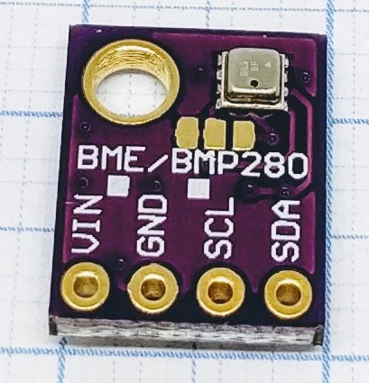
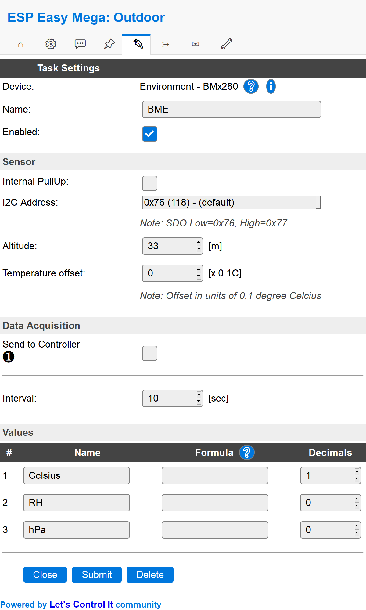
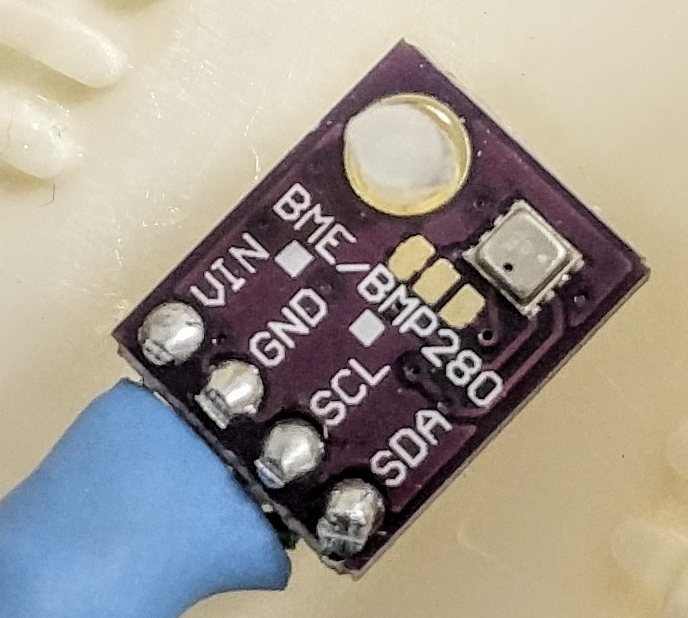
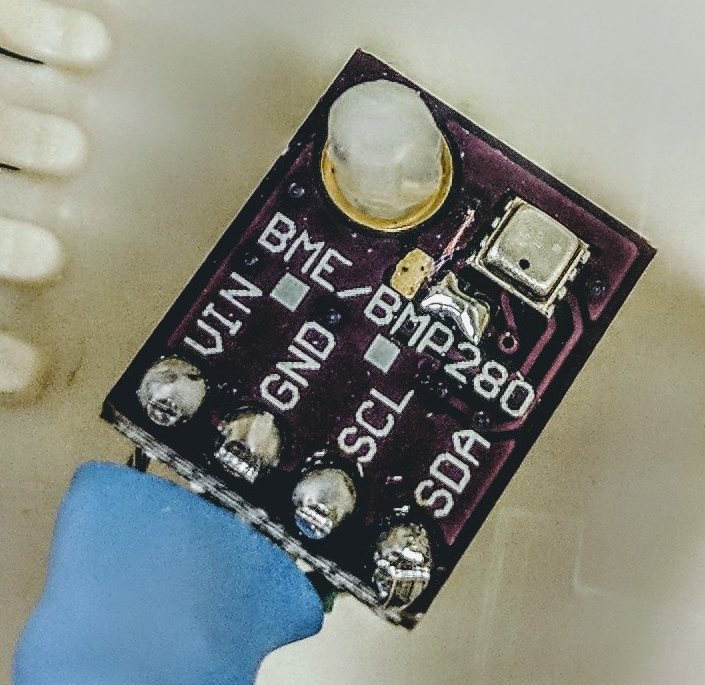
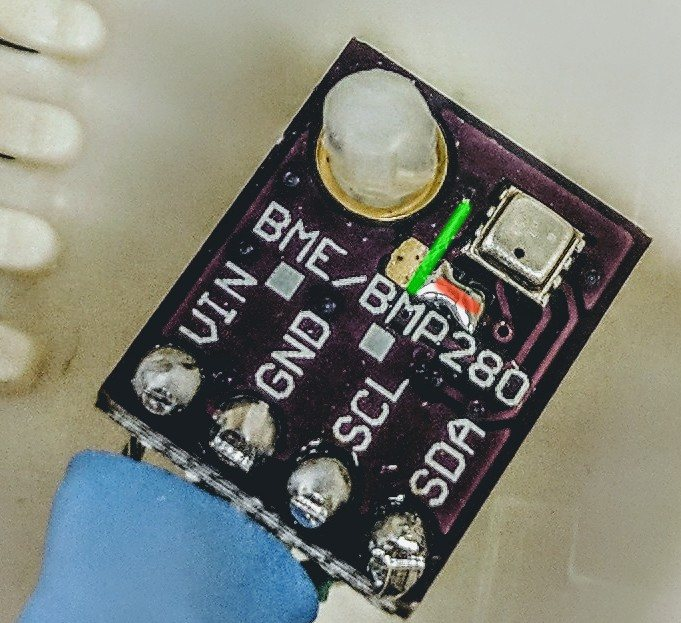

.. include:: ../Plugin/_plugin_substitutions_p02x.repl
.. _P028_BME280_page:

BME280
======

|P028_typename|
|P028_status|

Introduction
------------

Specifications:
 * Temperature (-40C to +85C)
 * Relative humidity (0-100 %RH)
 * Barometric pressure (300-1100 hPa)

.. warning:: The BME280 is easily mistaken for its sibling the BM**P**280. Sometimes the PCB have both BME and BMP280
             written on it, it's probably because the footprint is the same for BME and BMP = the same PCB board is used
             by both.

Wiring
------

.. code-block:: html

 ESP               BME280
 GPIO (4)   <-->   SDA
 GPIO (5)   <-->   SCL

 Power
 3.3V       <-->   VIN
 GND        <-->   GND

.. note:: If you have change the I2C settings in the hardware setup you need to connect to those instead of GPIO 4 and 5.

Setup
-----

Task settings
~~~~~~~~~~~~~

* **Device**: Name of plugin
* **Name**: Name of the task (example name **BME**)
* **Enable**: Should the task be enabled or not

Sensor
^^^^^^

* **i2C address**: You can use two BME280 at the same time, choose address here. If you only use one, stay with the default address.
* **Altitude**: Set the level above sea for your unit. This is done in order to get a correct pressure value.
* **Temperature offset**: Linear software calibration. One tenth of a degree Celsius, used to compensate for deviation of real temperature.

Data acquisition
^^^^^^^^^^^^^^^^

* **Send to controller** 1..3: Check which controller (if any) you want to publish to. All or no controller can be used.
* **Interval**: How often should the task publish its value (5..15 seconds is normal).

Indicators (recommended settings)
^^^^^^^^^^^^^^^^^^^^^^^^^^^^^^^^^

.. csv-table::
  :header: "Indicator", "Value Name", "Interval", "Decimals", "Extra information"
  :widths: 8, 5, 5, 5, 40

  "Temperature", "Celsius", "10", "1", ""
  "Humidity", "RH", "10", "0", ""
  "Pressure", "hPa", "10", "0", ""

Rules examples
--------------

.. code-block:: html

    on BME#hPa do
     if BME#hPa>999
       Publish,%sysname%/pressure,Is normal
     endif
    endon

.. Commands available
.. ~~~~~~~~~~~~~~~~~~

.. .. include:: P028_commands.repl

Change I2C address
------------------

You may change the i2c address from the default 0x76 to 0x77 by cutting the line between the two left pads (as seen in the pictures below) and solder a bridge between the two right pads.

Default i2c address 0x76.

Changed i2c address 0x77.

:green:`Cut` :red:`Solder/bridge`

Where to buy
------------

.. csv-table::
 :header: "Store", "Link"
 :widths: 5, 40

 "AliExpress","`Link 1 ($) <http://s.click.aliexpress.com/e/sZWPuEM>`_"
 "Banggood","`Link 2 ($) <https://www.banggood.com/CJMCU-280E-BME280-High-Precision-Atmospheric-Pressure-Sensor-For-Arduino-p-1103115.html?p=V3270422659778201806>`_ `Link 3 ($) <https://www.banggood.com/CJMCU-BME280-Embedded-High-Precision-Atmospheric-Pressure-Altitude-Sensor-Module-For-Arduino-p-1103112.html?p=V3270422659778201806>`_"
 "eBay","`Link 4 ($) <https://rover.ebay.com/rover/1/711-53200-19255-0/1?icep_id=114&ipn=icep&toolid=20004&campid=5338336929&mpre=https%3A%2F%2Fwww.ebay.com%2Fsch%2Fi.html%3F_from%3DR40%26_trksid%3Dm570.l1313%26_nkw%3DBME280%26_sacat%3D0%26LH_TitleDesc%3D0%26_osacat%3D0%26_odkw%3DINA219>`_"

|affiliate|

.. More pictures
.. -------------

.. .. image:: P028_BME280_5.jpg
